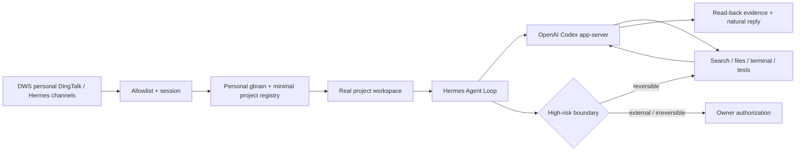

<div align="center">


# Foursday

**A personal-memory-driven work twin for real projects.**

Trusted message → personal context → real workspace → Hermes + Codex → verified work → natural reply.

[简体中文](./docs/指南/中文首页.md) · [Architecture](./docs/设计总览.md) · [Gate 2 evidence](./docs/历史/自主工作分身迁移验收报告.md) · [Security](./SECURITY.md) · [Contributing](./CONTRIBUTING.md)

[](https://github.com/ruiwang20010702/foursday/actions/workflows/check.yml)
[](https://github.com/ruiwang20010702/foursday/actions/workflows/security.yml)
[](./LICENSE)

</div>

## What Foursday is

Foursday is an AI work twin that uses your personal gbrain and a general Hermes Agent Loop to do work—not a chatbot that needs a new capability, JSON pointer, or reply template for every question.

For an allowlisted contact, ordinary reversible work is autonomous:

- understand the conversation and route the project;
- enter the real workspace;
- inspect files, scripts, ledgers, and Git state;
- calculate, analyze, write documents, or change code;
- run tests and continue fixing failures;
- read the result back and reply with evidence.

Push, merge, production deployment, production data writes, irreversible deletion, payment, contracts, HR decisions, secrets, and irreversible commitments remain independent hard boundaries.

## One-command install

Requires macOS and Git. The verified upstream Hermes installer manages its own Python, Node.js, and `uv` runtime.

```bash
git clone https://github.com/ruiwang20010702/foursday.git && cd foursday && npm ci --ignore-scripts && npm run hermes:setup -- --apply
```

Already cloned? Run `npm run hermes:setup` for a zero-write preview, then repeat with `-- --apply`. Foursday downloads the official Hermes installer from the locked upstream commit, verifies its SHA-256, installs the native runtime, and installs an isolated `foursday` Profile distribution containing the plugins, Profile, Skills, and host bridges. It does not vendor or patch the Hermes core.

When installed as an npm/GitHub package, `foursday install` is the same native zero-write preview and `foursday install --apply` uses the same official Profile path. The old overlay/Node initializer is not the default install command.

Installation does **not** copy credentials, start the Gateway, send messages, or enable active mode. Configure the profile with `npm run hermes:configure`, then install the native send-disabled service with `npm run hermes:gateway -- install-shadow --apply`. Active mode remains a separate single-writer cutover.

Updates are refused while the Profile Gateway is running. An existing Profile is exported to a private temporary archive and restored automatically if installation, dependency setup, or plugin doctor fails. Activation requires a private, non-stale shadow acceptance receipt, the same full release SHA, and its derived confirmation value. `npm run hermes:gateway -- remove-profile` is a zero-write uninstall preview; applying the displayed `REMOVE-FOURSDAY-PROFILE` confirmation uses official Hermes commands to remove only the Foursday Gateway, alias, Profile, and bundled plugins while preserving native Hermes, production configuration, and personal gbrain.

## Architecture



Foursday is a native Hermes Profile distribution on an exact compatible upstream release:

- pinned Hermes `v2026.8.18` / `0.20.4`;
- external DWS, project-router, personal-gbrain, and high-risk-boundary plugins;
- a Foursday Profile and general project-work Skill;
- project workspace routing through the official per-turn plugin Hook, with no core patch;
- no Hermes fork, copied virtualenv, custom Agent Loop, or second business-memory repository.

[Read the canonical architecture map](./docs/设计总览.md).

## Memory model

```text
Personal PRIVATE gbrain Git → durable business knowledge authority
Personal gbrain PostgreSQL  → rebuildable search/entity/graph index
Hermes Session DB           → conversation, tool calls, short-term execution
Foursday PostgreSQL         → retained rollback and governance state
```

The gbrain OAuth credential stays in a host-side read-only bridge. Agent terminal commands never receive the credential, production configuration, DWS executable, deployment secrets, or network access.

## Production status

The local V3 candidate has passed all 12 PoC gates:

- real DWS receipt from the original personal DingTalk conversation;
- autonomous 2.2 project audit: `68,786` formal questions vs `81,088` source rows;
- same-session follow-ups for release, failures, worst batch, cost, and cause;
- real project documentation, analysis, and code changes with read-back;
- one real personal self-chat send plus owner takeover interrupt;
- one separately authorized natural correction to the original contact, read back exactly once;
- unknown users, unmentioned groups, ambiguity, secret access, network, push, and deployment rejected;
- full Foursday regression passed; the live count is maintained only in the [status matrix](./docs/完成度矩阵.md);
- Hermes contract checks: 202 passed, 1 upstream conditional skip.

Production is intentionally in a safe review stop: the database pause flag is on, both the previously managed Gateway and the native Profile Gateway are stopped and launchd-disabled, and sending, execution, proactive work, automatic approval, and memory read/write are disabled. Only the local console and read-only health surface remain available. The native `~/.hermes` migration is versioned for review but has not received production authority. See the [status matrix](./docs/完成度矩阵.md) for live boundaries.

[Review the full Gate 2 report](./docs/历史/自主工作分身迁移验收报告.md).

The old `hermes:prepare`, `hermes:patch`, and `hermes:install` commands remain temporarily under the legacy migration path only. New installations use the native installer, Profile configuration, official plugin doctor, and official Gateway service commands. See the [deployment guide](./docs/en/deployment.md).

## Documentation

| Need | Canonical source |
|---|---|
| Product definition and acceptance | [Product requirements](./docs/产品需求文档.md) |
| Architecture and module map | [Design overview](./docs/设计总览.md) |
| Implementation rules | [Technical design](./docs/技术设计文档.md) |
| Current status and removed concepts | [Status matrix](./docs/完成度矩阵.md) |
| Migration evidence | [Gate 2 report](./docs/历史/自主工作分身迁移验收报告.md) |
| Current production operations | [Legacy runtime runbook](./docs/生产运维手册.md) |
| Historical decision | [Hermes migration decision](./docs/历史/自主工作分身架构迁移方案.md) |

## Roadmap

- [x] General Hermes/Codex loop with DWS, gbrain, routing, evidence, and hard boundaries
- [x] Real P0 conversations, follow-ups, project work, send read-back, and takeover
- [x] Reproducible native Profile distribution with a pinned official installer and zero core patches
- [x] Gate 2 candidate committed and published on `main`
- [ ] Controlled production migration from the Foursday-managed Gateway to the native Hermes Profile Gateway
- [ ] Feishu, WeCom, Slack, Teams, Gmail, and Google Workspace profiles

## License

[MIT](./LICENSE)
