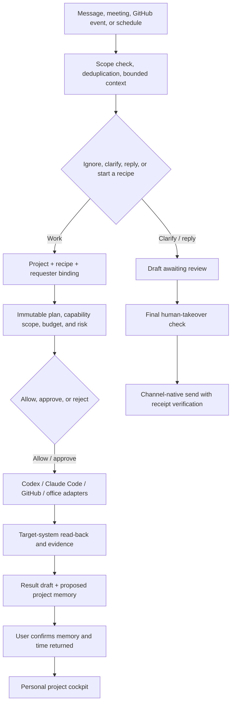
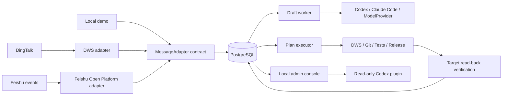

<div align="center">


# Foursday

**Your open-source work twin. One more you, one less workday.**

Foursday learns how you work, turns workplace messages into reviewable replies
and project-scoped plans, executes only authorized tools, and verifies the
result. Its long-term mission is simple: give every user one workday back.

DingTalk uses DWS; Feishu uses its official event and messaging APIs. Real
sending and plan execution are disabled by default, and chat content can never
grant new permissions. Foursday should work like another you without silently
impersonating you.

**English** · [简体中文](./README_ZH.md) · [Quick Start](#quick-start) · [Architecture](#architecture) · [Security](./SECURITY.md) · [Contributing](./CONTRIBUTING.md)

[](https://github.com/ruiwang20010702/foursday/actions/workflows/check.yml)
[](https://github.com/ruiwang20010702/foursday/actions/workflows/security.yml)
[](https://nodejs.org/)
[](https://www.postgresql.org/)
[](./LICENSE)

</div>

## Why Foursday?

Most AI assistants help you write. Foursday is being built to help you hand off
real work and reclaim time. The north-star outcome is **verified hours returned
per user each week**, with eight hours as the milestone for a four-day workweek.

Real work needs stronger guarantees than a chatbot. Foursday treats workplace
automation like production software:

- **Decide before replying** with allowlists, bounded message bundling, deterministic no-reply rules, and model review.
- **Authorize before executing** with project manifests, scoped capabilities, expiry, run budgets, and risk policies.
- **Approve before side effects** by binding approval to the complete plan and authorization snapshot.
- **Verify after execution** by reading the target system again instead of trusting the model or tool response.
- **Keep memory accountable** through source-bound candidates, human confirmation, conflict replacement, expiry, and revocation.
- **Let humans take over** by cancelling drafts, waiting chains, and active plans when manual work is detected.

## How it works



## Highlights

| Area | What is implemented | Default boundary |
|---|---|---|
| Messaging | DingTalk/DWS and Feishu event adapters, allowlists, group mentions, deduplication | No access outside configured conversations |
| Drafting | Codex, Claude Code, provider runtimes, no-reply and clarification | Draft-only by default |
| Human control | Approval, rejection, pause, cancellation, takeover, dead-task handling | No automatic anomaly resolution |
| Project work | Project manifests, plan hashes, leases, persistent run budgets | Global execution disabled by default |
| Tools | Research, docs, code, tests, Git, release, DingTalk office actions | Explicit per-project authorization |
| Memory | Automatic candidates, human confirmation, conflict replacement, expiry, erasure | Never auto-confirms formal memory |
| Reliability | Side-effect ledger, idempotency, read-back verification, alerts, SLOs | Unknown outcomes fail closed |
| Operations | PostgreSQL, encrypted backups, ten service definitions, immutable releases | Sending, execution, and proactive work require separate rollout |

## The personal work loop

Foursday is personal-first. The local cockpit is not a team-management suite;
it is the place where one person teaches a work twin what matters, reviews risk,
and sees whether time was actually returned.

| Capability | What the user gets | Current implementation |
|---|---|---|
| Project onboarding | Project goal, milestones, people, memory scope, recipes, and risk budgets in one safe draft | Implemented; side-effect capabilities start disabled |
| Recipe library | Repeatable workflows instead of planning the same work from every message | Four versioned built-in recipes with validated inputs |
| Project cockpit | Goals, milestones, plans, evidence, deliverables, formal memory, and triggers in one view | Implemented in the local personal console |
| Time-return dashboard | Evidence-backed minutes saved, confirmed by the user | Implemented; estimates never count automatically |
| Proactive mode | Scheduled or event-triggered work with daily limits, cooldowns, and idempotency | Implemented; every trigger is created disabled |
| Meeting to execution | Notes → document → proposed decision memory → task → follow-up calendar | Implemented as an approval-bound recipe |
| GitHub delivery | Change request → patch → branch → tests → push → draft PR → report | Implemented for approved repositories and commands |

The adapter SDK also defines verifiable contracts and safe example manifests
for Slack, Teams, Gmail, and Google Workspace. These are extension boundaries,
not claims that production connectors are already shipped.

## From verified loops to a governed work graph

Foursday already runs evidence-gated loops: understand a request, bind it to a
project, plan, approve, execute, read the target back, and learn only after
human confirmation. The next architecture goal is to make the relationships
between those loops explicit as a **Governed Work Graph**.

Loop Engineering remains the execution unit. Graph Engineering becomes the
control plane that connects three bounded graphs:

| Graph | Nodes and relationships | Question it must answer |
|---|---|---|
| Work graph | Event → recipe → plan → step → evidence → outcome | What is running, what may run next, and why? |
| Knowledge graph | Project ↔ message, document, decision, deliverable, and formal memory | What does this work know, and which source supports it? |
| Governance graph | Person ↔ project, capability, policy, budget, approval, and audit record | Who authorized this transition, within which scope and version? |

Production release `34d04326d1d16ba92994107eb2f44bf89d74c759` implements stable
node identities, versioned edge contracts, encrypted SQLite/PostgreSQL
projections, intended-versus-runtime capture, and four bounded explanations in
the personal project cockpit. This does not add a graph database or grant
production authority to projects, recipes, or proactive work. Domain services
remain authoritative, and graph reachability never grants permission. The [architecture guide](docs/en/architecture.md#governed-work-graph-direction)
defines the contract and safety boundaries; [ADR 001](docs/en/adr-001-governed-work-graph-storage.md)
records why PostgreSQL remains the default until production-shaped evidence
proves that a dedicated graph database is necessary.

## Quick Start

### Run the five-minute local demo

The demo needs only Node.js. It does not require DingTalk, DWS, PostgreSQL,
Codex, Claude Code, or an API key:

```bash
git clone https://github.com/ruiwang20010702/foursday.git
cd foursday
npm ci
npm run demo
```

Enter a message, review the draft, and choose whether to approve the local
simulation. Before approval, the effect ledger and evidence list remain empty.
After approval, the demo records intent, performs only an in-memory action, and
reads the simulated target back. For a non-interactive reproducible run:

```bash
npm run demo -- --message "Prepare a launch checklist" --approve --json
```

### Validate the repository without external access

```bash
git clone https://github.com/ruiwang20010702/foursday.git
cd foursday
npm ci
npm run check
```

This does not read DingTalk messages or connect to your production database or Codex account.

### Check a macOS runtime

The production DingTalk profile currently targets a logged-in macOS session and
requires Node.js 22.5+, PostgreSQL 16/17, authenticated DWS, and either Codex
or Claude Code:

```bash
npm run setup:check
```

### Install an audited immutable revision

```bash
npm init -y
npm install "github:ruiwang20010702/foursday#REPLACE_WITH_APPROVED_FULL_SHA"
npx --no-install foursday check
npx --no-install foursday init
npx --no-install foursday init --apply
npx --no-install foursday secrets
npx --no-install foursday secrets --apply
```

Replace the placeholder with a reviewed 40-character commit SHA. Initialization writes only workspace-specific Keychain references to a `600` configuration file. Mutating commands are preview-only unless `--apply` is explicitly supplied. The former `ai-employee` command remains available as a compatibility alias in the `0.x` line.

### Compatibility during the rename

Foursday is the public product, package, plugin, service, repository, and CLI
name. Existing installations remain readable and upgradeable: the
`ai-employee` CLI alias, `AI_EMPLOYEE_*` environment keys, encrypted database
sentinels, schema identifiers, HTTP compatibility headers, Prometheus metric
aliases, and legacy Keychain references remain supported throughout the `0.x`
line. New installations use `foursday`, `com.foursday.*`, and
`foursday-production`. These stable protocol identifiers are retained on
purpose; they are not the public brand and will not be silently broken by a
cosmetic rename.

## Architecture



The system follows default-deny authorization, separates message ingestion from slow work, and combines at-least-once delivery with effect-level idempotency. See the full [architecture guide](./docs/en/architecture.md).

## Security

- Draft-only production mode by default.
- Model output and message content cannot grant capabilities.
- Human approval is bound to the complete work plan.
- AES-256-GCM field encryption for sensitive business content.
- Minimal child-process environments without database or admin secrets.
- Side-effect intent is persisted before execution; unknown outcomes are never replayed automatically.
- Local-only admin console with separate read and write tokens.
- Immutable release directories, exact Git SHAs, cloud gates, encrypted backups, and forward-only migration controls.

Report vulnerabilities privately through GitHub Security Advisories. Never include real messages, user identifiers, credentials, or internal company data in a public issue. See [SECURITY.md](./SECURITY.md).

## Documentation

| Guide | What it covers |
|---|---|
| [Product requirements](./docs/en/product-requirements.md) | Personal-first outcome, V2.3 scope, and acceptance boundaries |
| [Overview](./docs/en/overview.md) | Product model, principles, lifecycle, and non-goals |
| [Architecture](./docs/en/architecture.md) | Components, states, side effects, security, and readiness |
| [Graph storage ADR](./docs/en/adr-001-governed-work-graph-storage.md) | Why the governed graph stays in SQLite/PostgreSQL and when to reconsider |
| [Integrations](./docs/en/integrations.md) | DingTalk/DWS, Feishu events, Codex, Claude Code, and provider contracts |
| [Capabilities and Memory](./docs/en/capabilities.md) | Project authorization, plans, formal memory, and takeover |
| [Deployment](./docs/en/deployment.md) | Safe setup, exact-SHA releases, verification, and forward-only boundaries |
| [Security Policy](./SECURITY.md) | Private reporting and supported security boundaries |

## Roadmap

- [x] Reliable DingTalk ingestion, draft decisions, and human approval
- [x] Project capability gateway, work plans, execution evidence, and result reporting
- [x] Formal memory, takeover controls, SLOs, and immutable production releases
- [x] Interactive local demo without enterprise accounts or model credentials
- [x] Versioned MessageAdapter, AgentRuntime, and ModelProvider contracts
- [ ] Easier desktop distribution
- [x] Feishu Open Platform adapter without a DWS dependency
- [x] Claude Code and direct model-provider runtime contracts
- [x] Personal project onboarding, recipes, cockpit, and verified time-return ledger
- [x] Proactive triggers, meeting-to-execution, and GitHub draft-PR delivery loops
- [x] Versioned workspace/event adapter contracts and community examples
- [x] Governed Work Graph v1 production implementation: typed nodes, allowlisted edges, recipe content binding, public Schema, and deterministic SQLite/PostgreSQL projections
- [x] Intended-versus-runtime graph capture with replay-safe drift, approval, source, evidence, memory, and time-return observations
- [x] Four bounded graph explanations in the project cockpit without weakening tenant, project, authorization, or privacy boundaries
- [ ] Production Feishu credential wizard and managed long-connection service
- [ ] Production Slack, Teams, Gmail, and Google Workspace connectors
- [ ] Signed community package registry and trust review workflow

## Contributing

Issues, real-world use cases, documentation improvements, and code contributions are welcome. Read [CONTRIBUTING.md](./CONTRIBUTING.md) and [CODE_OF_CONDUCT.md](./CODE_OF_CONDUCT.md) before contributing.

## License

[MIT](./LICENSE)
