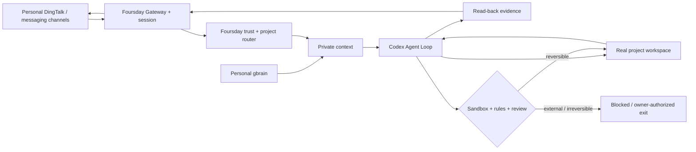

<div align="center">


# Foursday

**A personal-memory-driven work twin for real projects.**

Trusted message → personal context → real workspace → verified work → natural reply.

[简体中文](./docs/指南/中文首页.md) · [Architecture](./docs/en/architecture.md) · [Install](./docs/en/deployment.md) · [Security](./SECURITY.md) · [Contributing](./CONTRIBUTING.md)

[](https://github.com/ruiwang20010702/foursday/actions/workflows/check.yml)
[](https://github.com/ruiwang20010702/foursday/actions/workflows/security.yml)
[](https://github.com/ruiwang20010702/foursday/releases)
[](./LICENSE)

</div>

## What it does

Foursday is an AI work twin for people who want an agent to work inside their real projects—not a chatbot that needs a new workflow for every question.

For an allowlisted contact, Foursday can:

- understand the conversation and route it to the right project;
- read authorized pages from your personal gbrain;
- use Codex inside the real workspace;
- search, calculate, edit files, run tests, and recover from failures;
- reply naturally with read-back evidence;
- stop when the owner takes over.

Push, merge, deployment, production writes, irreversible deletion, payment, contracts, HR decisions, and secret disclosure remain hard boundaries.

## Architecture



Foursday uses a pinned, minimally installed [Hermes](https://github.com/NousResearch/hermes-agent) control plane internally; Codex is the only work-planning and reply-generating loop. Foursday ships:

- an isolated `foursday` Profile;
- DWS personal DingTalk and project-router plugins;
- an isolated Codex home with an App Server policy proxy, workspace sandboxing, forbidden command rules, automatic approval review, and a Foursday MCP;
- a project-work Skill;
- small host-side bridges for credentials and personal-memory promotion.

The installation gate verifies that the pinned runtime bypasses its own foreground tool loop in `codex_app_server` mode. Foursday also disables upstream built-in memory, memory/skill nudges, background review, automatic title generation, and the curator; durable learning goes only through the Foursday MCP and personal-gbrain promotion path.

Profile behavior, routed project details, and personal-memory context are explicitly bridged into Codex rather than assumed to flow through the embedded runtime. A private 15-minute token binds each turn to one workspace and Session; the proxy removes the internal marker before reasoning, labels gbrain text as data rather than instructions, and prevents the token from leaving in a reply.

The previous custom Agent Runtime, capability manifests, approval UI, managed Gateway, compatibility installer, and duplicated documentation were removed. Git history remains the recovery path.

## Install

Requirements: macOS, Git, Node.js 22+, a working DWS installation, and access to a personal gbrain endpoint.

```bash
git clone https://github.com/ruiwang20010702/foursday.git
cd foursday
npm ci --ignore-scripts
npx --no-install foursday install
npx --no-install foursday install --apply
```

`foursday install` verifies the pinned upstream installer, skips browser, Computer Use and bundled skills, then atomically prunes optional Node dependency trees only after the runtime and plugin doctor still pass. On the reference macOS host this reduced the installed runtime from 1.8 GB to 454 MB; the first install is still limited by the upstream dependency-install time. It does not start a Gateway or send a message.

Then create private copies of:

- [`deploy/foursday.example.json`](./deploy/foursday.example.json)
- [`distribution/projects.example.json`](./distribution/projects.example.json)

Configure and start in send-disabled shadow mode:

```bash
FOURSDAY_CONFIG_FILE=/absolute/private/foursday.json npx --no-install foursday configure --apply --registry /absolute/private/projects.json
FOURSDAY_CONFIG_FILE=/absolute/private/foursday.json npx --no-install foursday login --apply
FOURSDAY_CONFIG_FILE=/absolute/private/foursday.json npx --no-install foursday verify --apply
npx --no-install foursday gateway install-shadow --apply
npx --no-install foursday gateway start-shadow --apply
```

Activation is deliberately separate and requires a current shadow-acceptance receipt bound to the exact Foursday commit. See [deployment](./docs/en/deployment.md).

`foursday verify` runs one real Codex turn against an ephemeral fixture. It requires tool evidence, checks an unpredictable fact token, proves the workspace digest is unchanged, and performs no DingTalk send, production write, or deployment.

## Memory ownership

| Store | Responsibility |
|---|---|
| Personal PRIVATE gbrain Git | Durable business knowledge |
| gbrain PostgreSQL | Rebuildable search and graph projection |
| Foursday Session store | Conversation and tool history, provided by the embedded control plane |
| Foursday PostgreSQL | Encrypted memory-promotion queue only |

Foursday does not create a second knowledge repository or copy personal pages into its own Git repository.

## Status

The current public preview is `v0.7.0-rc.1`. It establishes the one-Codex-loop architecture and the install, routing, memory, safety, and shadow-verification contracts. It is a release candidate, not evidence that a production instance has been deployed or activated.

The local production instance is intentionally stopped. Installing this repository does not inherit its authority, credentials, allowlist, send permission, or production state.

Run the verified checks locally:

```bash
npm run check:full
npm run check:python
npm run reuse:verify
npm run check:security
```

## Documentation

- [Architecture](./docs/en/architecture.md)
- [Deployment](./docs/en/deployment.md)
- [生产迁移与回滚](./docs/指南/生产迁移与回滚.md)
- [Integration guide](./docs/en/integrations.md)
- [产品需求文档](./docs/产品需求文档.md)
- [技术设计文档](./docs/技术设计文档.md)
- [中文首页](./docs/指南/中文首页.md)

## License

[MIT](./LICENSE)
