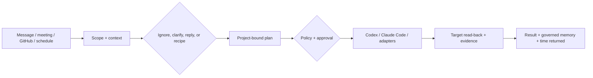

<div align="center">


# Foursday

**Your open-source work twin. One more you, one less workday.**

Foursday turns workplace messages into reviewable replies and project-scoped
work, executes only authorized tools, and verifies the real result. Its north
star is verified hours returned per user each week.

[简体中文](./README_ZH.md) · [Quick Start](#quick-start) · [75-second demo](./assets/foursday-v0.5-demo.mp4) · [Architecture](./docs/en/architecture.md) · [Security](./SECURITY.md) · [Contributing](./CONTRIBUTING.md)

[](https://github.com/ruiwang20010702/foursday/actions/workflows/check.yml)
[](https://github.com/ruiwang20010702/foursday/actions/workflows/security.yml)
[](https://nodejs.org/)
[](https://www.postgresql.org/)
[](./LICENSE)

**Version status:** [`v0.6.0-rc.1`](https://github.com/ruiwang20010702/foursday/releases/tag/v0.6.0-rc.1)
is the latest tagged public preview at
`6b30c22f97b19c6cfd30bf162b3f85000fa2bde9`. `main` may contain post-RC
candidates. `private: true` prevents accidental npm publication; the repository
remains reusable under MIT.

</div>

## Why Foursday?

Chatbots generate text. Real work also needs scope, permission, interruption,
evidence, and memory:

- decide whether to ignore, clarify, reply, or work;
- bind every action to a requester, project, capability, budget, and plan hash;
- require approval before high-risk side effects;
- read the target system back instead of trusting a model or tool receipt;
- stop when the human takes over;
- keep durable memory reviewable in isolated gbrain Markdown sources.

DingTalk uses DWS. Feishu uses its official WebSocket and messaging APIs with
no DWS dependency. `MessageAdapter`, `AgentRuntime`, and `ModelProvider` are
versioned contracts, so channels and model runtimes can evolve independently.

## How it works



| Capability | User outcome | Default boundary |
|---|---|---|
| Project onboarding | Goal, milestones, people, recipes, memory scope, and risk budget | External effects disabled |
| Recipe library | Reuse five versioned workflows | The one cockpit handoff form previews steps, risk, evidence, and the exact plan hash; registration always enters approval and cannot auto-execute |
| Project cockpit | Plans, evidence, deliverables, memory, triggers, and a weekly delegation queue | Read and plan, never silently execute |
| Time-return dashboard | Count only evidence-backed, owner-confirmed minutes | Model estimates do not count |
| Proactive mode | Scheduled or event-triggered follow-up | Triggers start disabled |
| GitHub delivery | Issue → patch → branch → tests → push → Draft PR | Approved repositories and commands only |

Optional unattended sending is deliberately narrow. Ordinary direct replies,
ordinary replies in allowlisted groups that explicitly mention the account, and
single-question direct clarifications can be enabled independently; each still
requires `riskLevel=low`, confidence at least 0.95, and no work request. Group
clarifications, commitments, plans, and medium/high-risk content still require
review. Takeover and receipt checks still run. Prohibited, unscoped, or
unauthorized work gets a deterministic capability-limit reply instead of a
fabricated completion claim.

Historical import is two-stage: preview first, then the exact typed `IMPORT-...`
digest plus the write token creates proposed facts only. Project-memory settings
use a dual-token, zero-write preview bound to `MEMORY-AUTH-...`; it never opens
the global gate. An explicit write-token action invokes the model against an
already authorized, ten-minute server snapshot. Candidates are reviewed in the
same project card; a conflict requires explicit replacement.

## Inspectable memory

Foursday uses four parallel kinds: working, episodic, semantic, and prospective
memory. People, projects, principles, and knowledge are sibling semantic
namespaces—not a ladder.

```text
Foursday PostgreSQL  → work state, permissions, leases, encrypted projections
gbrain Markdown      → reviewable long-term memory authority
gbrain PostgreSQL    → rebuildable search / entity / graph index
```

Personal knowledge stays in its own gbrain database and `default` source.
Automated work memory uses a separate `GBRAIN_HOME`, PostgreSQL database, and
non-federated `foursday` source; every read, write, and sync binds all three.
New installations initialize:

```text
atoms/  conversations/  people/  preferences/
projects/  concepts/  prospective/
```

Low-risk facts become usable only after Markdown write, a path-scoped Git
commit, exact gbrain read-back, and PostgreSQL projection. Each project keeps
at most 12 core authority facts by default, and a matched conversation loads
at most those 12 facts for that project; detailed rules
stay in project knowledge pages and are read only when needed. Revocation,
replacement, deletion, and privacy erasure atomically enqueue cleanup; the
worker commits the managed Markdown deletion, syncs, verifies that the original
slug is unreadable, and removes the temporary file outside the source. Failures
commit a restoration and retry. Conflicts stay quarantined. Credentials,
PII, sensitive person material, and confidential candidates are rejected.

## Quick Start

### 1. Zero-write Web preview

Requires Node.js 22 or 24. This pinned command does not install a production
service or touch an external system at startup:

```bash
npx --yes --ignore-scripts --package "github:ruiwang20010702/foursday#6b30c22f97b19c6cfd30bf162b3f85000fa2bde9" foursday start --pilot-sha 6b30c22f97b19c6cfd30bf162b3f85000fa2bde9
```

Use a reviewed 40-character commit SHA for any newer candidate. The optional
public pilot uses your fork as the push source and the approved upstream as the
Issue / Draft PR target. **Prepare my pilot fork** is separate from the second
approval bound to the complete plan hash. Never merge or deploy a pilot PR.

The UI can copy a **privacy-safe pilot proof** and a **Copy privacy-safe
readiness report**; both are unsigned and require maintainer target read-back.
Foursday never submits it. Reports exclude executable paths, usernames,
credentials, and model output. Server-start-to-confirmed timing uses a monotonic
clock; package download remains a separate measurement.

See [pilot validation](./docs/en/pilot-validation.md), join through
[Issue #49](https://github.com/ruiwang20010702/foursday/issues/49), or
[report a successful install](https://github.com/ruiwang20010702/foursday/issues/50).

### 2. Local demo and checks

```bash
npm run demo
npm run check
```

The 75-second demo uses synthetic [Issue #29](https://github.com/ruiwang20010702/foursday/issues/29)
and verified [Draft PR #39](https://github.com/ruiwang20010702/foursday/pull/39).

### 3. Initialize a real installation

```bash
foursday init                 # zero-write plan
foursday init --apply         # protected config + isolated gbrain source
foursday secrets --apply      # generate Keychain secrets; never save them in config
foursday check
```

`init --apply` creates the seven-directory Markdown skeleton, an independent Git
repository, and an isolated `GBRAIN_HOME`. It registers the non-federated
`foursday` source only after a dedicated gbrain PostgreSQL database is
configured. Memory writes and auto-confirm remain off.

The memory Git repository has no remote by default and is never pushed to the
public Foursday code repository. Off-device backup should use a separate
private repository with secret and PII scanning before every push.

## Governed Work Graph

Loop Engineering remains the execution unit. Graph Engineering connects the
**Work graph**, **Knowledge graph**, and **Governance graph** so the system can
explain what happened, which source supported it, and who authorized it.
Foursday does not add a graph database or grant production authority through
graph reachability.

Implementation detail and the four bounded graph explanations live in the
[architecture guide](./docs/en/architecture.md) and
[ADR 001](./docs/en/adr-001-governed-work-graph-storage.md).

## Documentation

| Need | Read |
|---|---|
| Product scope and what it is not | [Overview](./docs/en/overview.md) |
| Architecture, state machines, memory, graph | [Architecture](./docs/en/architecture.md) |
| Capabilities, approvals, project memory | [Capabilities](./docs/en/capabilities.md) |
| Installation, production, backup, rollback | [Deployment](./docs/en/deployment.md) |
| Integrations | [Integrations](./docs/en/integrations.md) |
| Real demo evidence | [Demo](./docs/en/demo.md) |
| Public launch process | [Public launch playbook](./docs/en/public-launch-playbook.md) |
| Public growth scorecard | [Public growth scorecard](./docs/en/growth-scorecard.md) |
| First contribution tasks | [First contributions](./docs/en/first-contributions.md) |

## Roadmap

- [x] Governed Work Graph v1 production implementation
- [x] Four bounded graph explanations in the project cockpit
- [x] Isolated gbrain Markdown authority and PostgreSQL runtime projection
- [ ] Ten distinct external pilot loops
- [ ] Keep tightening the bounded production rollout with real group,
  clarification, and long-window SLO evidence
- [ ] Slack, Teams, Gmail, and Google Workspace production connectors

## Contributing

Read [CONTRIBUTING.md](./CONTRIBUTING.md), [CODE_OF_CONDUCT.md](./CODE_OF_CONDUCT.md),
and [SECURITY.md](./SECURITY.md). The first five good-first-issue tasks are live
in [first contributions](./docs/en/first-contributions.md).

## License

[MIT](./LICENSE)
