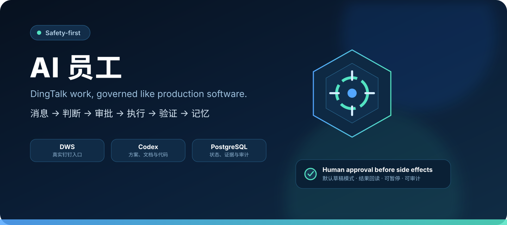
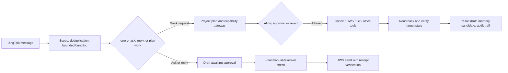
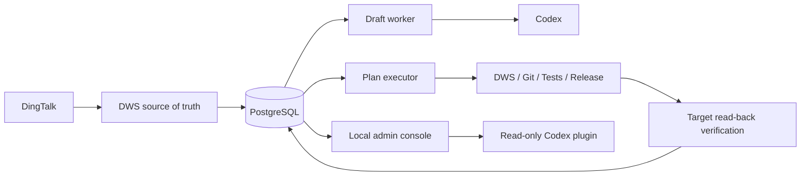

<div align="center">



# AI Employee

**A safety-first DingTalk agent runtime that can plan work, request approval, execute tools, verify outcomes, and retain auditable memory.**

It turns DingTalk messages into drafts and project-scoped work plans. Real sending and plan execution are disabled by default, and chat content can never grant new permissions.

[简体中文](./README.md) · [Quick Start](#quick-start) · [Architecture](#architecture) · [Security](./SECURITY.md) · [Contributing](./CONTRIBUTING.md)

[](https://github.com/ruiwang20010702/ai-employee/actions/workflows/check.yml)
[](https://github.com/ruiwang20010702/ai-employee/actions/workflows/security.yml)
[](https://nodejs.org/)
[](https://www.postgresql.org/)
[](./LICENSE)

</div>

## Why AI Employee?

Chatbots can produce text, but real work requires stronger guarantees. AI Employee treats office automation like production software:

- **Decide before replying** with allowlists, bounded message bundling, deterministic no-reply rules, and model review.
- **Authorize before executing** with project manifests, scoped capabilities, expiry, run budgets, and risk policies.
- **Approve before side effects** by binding approval to the complete plan and authorization snapshot.
- **Verify after execution** by reading the target system again instead of trusting the model or tool response.
- **Keep memory accountable** through source-bound candidates, human confirmation, conflict replacement, expiry, and revocation.
- **Let humans take over** by cancelling drafts, waiting chains, and active plans when manual work is detected.

## How it works



## Highlights

| Area | What is implemented | Default boundary |
|---|---|---|
| Messaging | DWS ingestion, allowlists, group mentions, deduplication, reconciliation | No access outside configured conversations |
| Drafting | No-reply, clarification, reply, capability summaries, controlled concurrency | Draft-only by default |
| Human control | Approval, rejection, pause, cancellation, takeover, dead-task handling | No automatic anomaly resolution |
| Project work | Project manifests, plan hashes, leases, persistent run budgets | Global execution disabled by default |
| Tools | Research, docs, code, tests, Git, release, DingTalk office actions | Explicit per-project authorization |
| Memory | Automatic candidates, human confirmation, conflict replacement, expiry, erasure | Never auto-confirms formal memory |
| Reliability | Side-effect ledger, idempotency, read-back verification, alerts, SLOs | Unknown outcomes fail closed |
| Operations | PostgreSQL, encrypted backups, nine LaunchAgents, immutable releases | Sending and execution require separate rollout |

## Quick Start

### Validate the repository without external access

```bash
git clone https://github.com/ruiwang20010702/ai-employee.git
cd ai-employee
npm ci
npm run check
```

This does not read DingTalk messages or connect to your production database or Codex account.

### Check a macOS runtime

AI Employee currently targets a logged-in macOS session and requires Node.js 22.5+, PostgreSQL 16/17, authenticated DWS, and Codex CLI:

```bash
npm run setup:check
```

### Install an audited immutable revision

```bash
npm init -y
npm install "github:ruiwang20010702/ai-employee#REPLACE_WITH_APPROVED_FULL_SHA"
npx --no-install ai-employee check
npx --no-install ai-employee init
npx --no-install ai-employee init --apply
npx --no-install ai-employee secrets
npx --no-install ai-employee secrets --apply
```

Replace the placeholder with a reviewed 40-character commit SHA. Initialization writes only workspace-specific Keychain references to a `600` configuration file. Mutating commands are preview-only unless `--apply` is explicitly supplied.

## Architecture



The system follows default-deny authorization, separates message ingestion from slow work, and combines at-least-once delivery with effect-level idempotency.

## Security

- Draft-only production mode by default.
- Model output and message content cannot grant capabilities.
- Human approval is bound to the complete work plan.
- AES-256-GCM field encryption for sensitive business content.
- Minimal child-process environments without database or admin secrets.
- Side-effect intent is persisted before execution; unknown outcomes are never replayed automatically.
- Local-only admin console with separate read and write tokens.
- Immutable release directories, exact Git SHAs, cloud gates, encrypted backups, and forward-only migration controls.

Report vulnerabilities privately through GitHub Security Advisories. Never include real messages, user identifiers, credentials, or internal company data in a public issue. See [SECURITY.md](./SECURITY.md).

## Roadmap

- [x] Reliable DingTalk ingestion, draft decisions, and human approval
- [x] Project capability gateway, work plans, execution evidence, and result reporting
- [x] Formal memory, takeover controls, SLOs, and immutable production releases
- [ ] Interactive demo mode without a real DingTalk account
- [ ] Easier desktop distribution
- [ ] Generic message adapter interface and additional collaboration platforms
- [ ] English operator documentation and a community example library

## Contributing

Issues, real-world use cases, documentation improvements, and code contributions are welcome. Read [CONTRIBUTING.md](./CONTRIBUTING.md) and [CODE_OF_CONDUCT.md](./CODE_OF_CONDUCT.md) before contributing.

## License

[MIT](./LICENSE)
