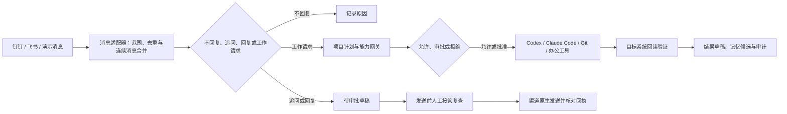
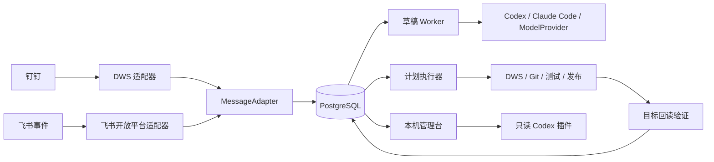

<div align="center">


# Foursday

**你的开源工作分身。多一个你，少上一天班。**

Foursday 学习你的工作方式，把钉钉、飞书等企业消息转化为可审阅回复、项目计划和经过验证的工作结果，长期目标是每周替每位用户拿回一个工作日。

钉钉使用 DWS，飞书直接使用开放平台事件与消息 API。默认不自动发送，也不会从聊天内容中获得新权限。它在能力上成为你的分身，但不会在身份上偷偷冒充你。

[English](./README.md) · **简体中文** · [快速开始](#快速开始) · [设计总览](./docs/设计总览.md) · [产品需求](./docs/产品需求文档.md) · [安全说明](./安全说明.md)

[](https://github.com/ruiwang20010702/foursday/actions/workflows/check.yml)
[](https://github.com/ruiwang20010702/foursday/actions/workflows/security.yml)
[](https://nodejs.org/)
[](https://www.postgresql.org/)
[](./LICENSE)

</div>

## 为什么做 Foursday

普通聊天机器人擅长回答问题，却很难可靠地完成真实工作：它可能不清楚什么时候应该沉默，不知道自己是否有权执行，也无法证明外部动作真的成功。

Foursday 不只追求“做了多少任务”，而是衡量**每位用户每周经过验证拿回的工作时间**；当它稳定返还 8 小时，才真正接近“上四休三”。为此，Foursday 把工作分身必须面对的问题当作生产系统来处理：

- **先判断，再回应**：白名单、群聊 `@我`、连续消息合并和“不回复”规则共同控制入口。
- **先授权，再执行**：能力清单、项目范围、次数预算、风险策略和计划哈希共同决定是否允许执行。
- **先审批，再产生副作用**：高风险动作必须由负责人批准当前完整计划。
- **执行后必须回读**：不相信模型自述，必须从钉钉、Git 或目标系统重新读取结果。
- **记忆必须可追溯**：AI 只生成候选，负责人确认后才成为正式记忆；冲突需要明确替代。
- **人可以随时接管**：人工回复、暂停和取消会阻止草稿发送或后续计划步骤。

## 它如何工作



完整业务分支、状态机、项目执行泳道、记忆生命周期和发布恢复流程见[设计总览](./docs/设计总览.md)。

## 适合什么场景

| 场景 | Foursday 的处理方式 |
|---|---|
| 同事询问项目状态 | 检索已确认事实，生成可审阅回复草稿 |
| 需求或方案请求 | 使用 Codex 完成分析、文档草稿和风险说明 |
| 信息不完整 | 先生成追问草稿，确认发送后等待唯一相关补充消息 |
| 项目执行 | 绑定项目能力清单，形成完整计划并按风险审批 |
| 代码工作 | 在隔离 worktree 中应用补丁和运行固定测试，不直接合并 |
| 钉钉办公动作 | 在固定人员、模板和目标范围内创建待办、日程、日志或文档 |
| 生产发布 | 绑定完整提交、检查、安全扫描、备份、迁移、服务验证和回退边界 |
| 长期项目协作 | 形成带来源和有效期的记忆候选，人工确认后按项目使用 |

## 与普通机器人的区别

| 能力 | 普通聊天机器人 | Foursday |
|---|---:|---:|
| 判断什么时候不回复 | 通常依赖提示词 | 硬规则、模型复核与人工标注门禁 |
| 连续消息理解 | 常按单条处理 | 3～8 秒有界合并窗口 |
| 项目级权限 | 通常没有 | 项目、请求人、能力、范围、期限和预算 |
| 高风险审批 | 简单确认 | 审批绑定完整计划哈希和授权快照 |
| 外部动作可靠性 | 相信工具返回 | 副作用账本、幂等键和目标回读 |
| 人工接管 | 容易与自动流程竞争 | 草稿、等待链和活动计划统一停止 |
| 长期记忆 | 自动写入上下文 | 来源校验、候选确认、冲突替代和过期撤销 |
| 生产发布 | 通常不覆盖 | 精确 SHA、云端门禁、备份、迁移和不可变版本 |

## 当前能力

当前版本已完成从消息监听到计划结果回传的技术闭环，但生产默认只开放 `draft_reply`。能力存在不等于当前环境已授权。

| 模块 | 已实现 | 默认边界 |
|---|---|---|
| 消息入口 | 钉钉 DWS、飞书事件、白名单、群聊 `@我`、去重 | 不读取未授权会话 |
| 草稿决策 | Codex、Claude Code、模型提供方、不回复与追问 | 只生成草稿 |
| 人工控制 | 审批、拒绝、暂停、取消、人工接管、死亡任务处置 | 不自动处理异常任务 |
| 项目执行 | 项目清单、计划、审批哈希、租约、次数预算 | 全局执行默认关闭 |
| 工作适配器 | 研究、文档、代码、测试、Git、发布、钉钉办公动作 | 真实项目逐项授权 |
| 正式记忆 | 自动候选、人工确认、冲突替代、过期、撤销、导出和擦除 | 不自动确认正式记忆 |
| 可观测性 | 健康、告警、对账、人工质量、24 小时与 30 天 SLO | 未知值和样本不足均失败关闭 |
| 生产运行 | PostgreSQL、9 个 LaunchAgent、加密备份、不可变发布 | 自动发送和计划执行单独放量 |

详细能力、当前生产状态和未完成事项分别查看[能力清单与正式记忆](./docs/能力清单与正式记忆.md)与[完成度矩阵](./docs/完成度矩阵.md)。

## 快速开始

### 1. 五分钟本地演示

演示只需要 Node.js，不需要钉钉、DWS、PostgreSQL、Codex、Claude Code 或任何 API Key：

```bash
git clone https://github.com/ruiwang20010702/foursday.git
cd foursday
npm ci
npm run demo
```

输入一条消息、查看草稿，再选择是否批准本地模拟。批准前副作用和证据列表必须为空；批准后也只会执行内存中的模拟动作，并回读模拟目标。需要稳定复现时可运行：

```bash
npm run demo -- --message "帮我准备一份上线检查清单" --approve --json
```

### 2. 本地验证代码

这条路径不会连接你的钉钉、生产数据库或 Codex 账号：

```bash
git clone https://github.com/ruiwang20010702/foursday.git
cd foursday
npm ci
npm run check
```

### 3. 检查运行环境

钉钉生产配置当前面向 macOS 登录会话，需要 Node.js 22.5+、PostgreSQL 16/17、已授权的 DWS，以及 Codex 或 Claude Code：

```bash
npm run setup:check
```

`setup:check` 只检查依赖、配置权限和危险能力开关，不读取钉钉消息，不连接生产数据库，也不修改系统。

### 4. 从固定版本复用

在新的空白工作目录中固定到已经审核的完整提交：

```bash
npm init -y
npm install "github:ruiwang20010702/foursday#REPLACE_WITH_APPROVED_FULL_SHA"
npx --no-install foursday check
npx --no-install foursday init
npx --no-install foursday init --apply
npx --no-install foursday secrets
npx --no-install foursday secrets --apply
```

必须把占位内容替换为经过检查的完整 40 位提交编号。初始化只把当前工作区独有的钥匙串引用写入权限为 `600` 的配置，不保存生成的生产密钥；已有配置绝不覆盖。所有写操作默认只预览，必须显式使用 `--apply`。`0.x` 版本继续保留旧的 `ai-employee` 命令作为兼容别名。

### 改名兼容口径

Foursday 是统一的公开产品名、包名、插件名、服务名、仓库名和主命令名。已有安装仍可安全升级：`0.x` 期间继续兼容 `ai-employee` 命令别名、`AI_EMPLOYEE_*` 环境变量、加密数据库哨兵、协议结构名、旧 HTTP 请求头、Prometheus 指标别名和既有钥匙串引用。新安装统一使用 `foursday`、`com.foursday.*` 和 `foursday-production`。这些旧标识属于稳定兼容协议，不是对外品牌，也不会因为视觉改名而被静默破坏。

## 生产要求

- macOS 登录用户会话和钉钉桌面端。
- Node.js 22.5 或更高版本。
- PostgreSQL 16 或 17。
- DWS、Codex CLI 或 Claude Code、`pg_dump` 和 `pg_restore`；使用知识页时还需要 gbrain。
- 独立生产配置、macOS 钥匙串或受控环境变量，以及经过核实的监听范围。

## 首次部署

完整说明见[生产运维手册](./docs/生产运维手册.md)。安全顺序不能省略：

```bash
export AI_EMPLOYEE_CONFIG_FILE="$PWD/.runtime/production.json"
npm ci
npm run production:preflight
npm run db:backup
npm run db:migrate
npm run production:doctor
npm run production:agent-probe
npm run service:install
npm run production:service-verify
npm run production:verify
npm run shadow:verify
```

- `production:preflight` 与 `production:doctor` 都是只读检查，只有 `db:migrate` 修改数据库结构。
- `production:service-verify` 证明目标版本服务可以承载运行；`production:verify` 判断当前业务状态是否真正就绪。
- `shadow:verify` 还要求人工质量、长期 SLO、副作用可靠性和记忆冲突全部达标。
- 真实发送、计划执行和生产发布始终需要独立授权，技术部署成功不会自动放量。

## 日常操作

```bash
# 查看系统状态
npm run control -- status

# 查看待审批草稿
npm run control -- drafts

# 校验项目能力清单
npm run projects:validate

# 生成只读质量报告
npm run quality:report

# 打开本机管理台
npm run admin:serve
```

也可以安装仓库内的只读 Codex 插件，在 Codex 中查看健康、待审批草稿、工作计划、人工接管和能力状态。插件不能批准、发送、执行、部署或扩大权限。

## 架构



系统采用默认拒绝、消息与慢任务解耦、至少一次接收和效果上恰好一次的设计。技术细节见[生产级技术设计](./docs/技术设计文档.md)。

## 安全模型

- 生产默认只有草稿能力，发送和计划执行分别受全局开关控制。
- 消息内容不能授予能力，模型输出不能直接调用高风险工具。
- 正文、草稿、审批理由、任务载荷和发送回执使用 AES-256-GCM 字段级加密。
- Codex 和工具子进程只获得最小环境，不继承数据库、数据密钥和管理令牌。
- 外部副作用在调用前登记执行意图，结果未知时禁止自动重试。
- 管理台只监听本机，读写令牌分离，不提供扩权入口。
- 生产发布固定仓库身份、完整提交、云端门禁和不可变版本目录。

请通过 GitHub Security Advisory 私下报告漏洞，不要在公开 Issue 中提交凭据、真实联系人或消息正文。详见[安全策略](./SECURITY.md)。

## 路线图

- [x] 可靠钉钉消息入口、草稿决策与人工审批
- [x] 项目能力网关、工作计划、执行证据与结果回传
- [x] 正式记忆、人工接管、SLO 和不可变生产发布
- [x] 无需企业账号或模型凭据的交互式本地演示
- [x] 带版本的 MessageAdapter、AgentRuntime 和 ModelProvider 契约
- [ ] 更易安装的桌面发行包
- [ ] 飞书及更多企业协作平台适配器
- [ ] Claude Code 和直接模型提供方适配器
- [ ] 更多消息适配器和社区案例库

路线图不构成已发布能力承诺；当前状态以[完成度矩阵](./docs/完成度矩阵.md)为准。

## 文档

| 文档 | 适合谁 | 内容 |
|---|---|---|
| [设计总览](./docs/设计总览.md) | 所有人 | 产品定位、能力、原则和当前状态 |
| [产品需求文档](./docs/产品需求文档.md) | 产品与业务 | 场景、规则、边界和验收指标 |
| [技术设计文档](./docs/技术设计文档.md) | 研发与测试 | 架构、状态机、可靠性和安全实现 |
| [生产运维手册](./docs/生产运维手册.md) | 运维与负责人 | 配置、部署、监控、备份和恢复 |
| [人工判断标注手册](./docs/人工判断标注操作手册.md) | 运营与标注人员 | 回应必要性和草稿质量口径 |
| [安全说明](./安全说明.md) | 安全审查人员 | 数据边界、密钥、报告渠道和风险 |

## 参与贡献

欢迎提交问题、使用案例、文档改进和代码贡献。开始之前请阅读[贡献指南](./CONTRIBUTING_ZH.md)和[行为准则](./CODE_OF_CONDUCT_ZH.md)。

- 不要在 Issue、PR、截图或测试夹具中包含真实消息、人员编号、令牌或公司内部资料。
- 新能力必须有明确边界、反向测试、目标回读和失败处理。
- 适合第一次贡献的任务会标记为 `good first issue`。

## 许可证

本项目采用 [MIT License](./LICENSE)。`private: true` 仅用于防止误发布到 npm，不影响 Git 仓库代码复用。
