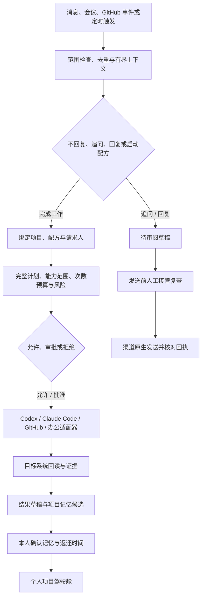
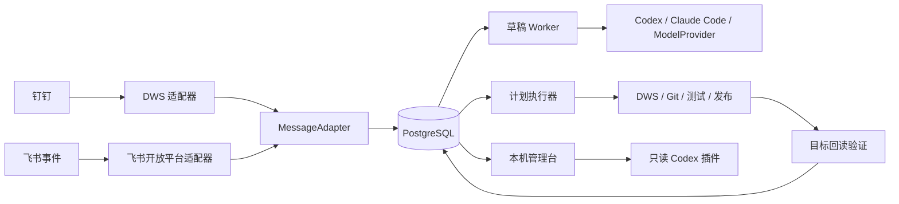

<div align="center">


# Foursday

**你的开源工作分身。多一个你，少上一天班。**

Foursday 学习你的工作方式，把钉钉、飞书等企业消息转化为可审阅回复、项目计划和经过验证的工作结果，长期目标是每周替每位用户拿回一个工作日。

钉钉使用 DWS，飞书直接使用开放平台事件与消息 API。默认不自动发送，也不会从聊天内容中获得新权限。它在能力上成为你的分身，但不会在身份上偷偷冒充你。

[English](./README.md) · **简体中文** · [快速开始](#快速开始) · [设计总览](./docs/设计总览.md) · [产品需求](./docs/产品需求文档.md) · [安全说明](./安全说明.md)

[](https://github.com/ruiwang20010702/foursday/actions/workflows/check.yml)
[](https://github.com/ruiwang20010702/foursday/actions/workflows/security.yml)
[](https://nodejs.org/)
[](https://www.postgresql.org/)
[](./LICENSE)

[10 分钟开始](#快速开始) · [报告一次成功安装](https://github.com/ruiwang20010702/foursday/issues/50) · [观看 75 秒真实演示](./assets/foursday-v0.5-demo.mp4) · [加入 v0.5 外部体验](https://github.com/ruiwang20010702/foursday/issues/49) · [查看 90 天增长记分卡](./docs/公开增长记分卡.md) · [领取首次贡献任务](./docs/首次贡献任务.md) · [了解安全边界](./安全说明.md)

<a href="./assets/foursday-v0.5-demo.mp4">
  
</a>

**[观看 v0.5 候选版真实闭环 →](./assets/foursday-v0.5-demo.mp4)**<br>
75 秒 · 静音字幕 · 合成 [Issue #29](https://github.com/ruiwang20010702/foursday/issues/29) → 已回读验证的 [Draft PR #39](https://github.com/ruiwang20010702/foursday/pull/39) · 未合并 · 未部署

</div>

## 为什么做 Foursday

普通聊天机器人擅长回答问题，却很难可靠地完成真实工作：它可能不清楚什么时候应该沉默，不知道自己是否有权执行，也无法证明外部动作真的成功。

Foursday 不只追求“做了多少任务”，而是衡量**每位用户每周经过验证拿回的工作时间**；当它稳定返还 8 小时，才真正接近“上四休三”。为此，Foursday 把工作分身必须面对的问题当作生产系统来处理：

- **先判断，再回应**：白名单、群聊 `@我`、连续消息合并和“不回复”规则共同控制入口。
- **先授权，再执行**：能力清单、项目范围、次数预算、风险策略和计划哈希共同决定是否允许执行。
- **先审批，再产生副作用**：高风险动作必须由负责人批准当前完整计划。
- **执行后必须回读**：不相信模型自述，必须从钉钉、Git 或目标系统重新读取结果。
- **记忆必须可追溯**：AI 只生成候选，负责人确认后才成为正式记忆；冲突需要明确替代。
- **人可以随时接管**：人工回复、暂停和取消会阻止草稿发送或后续计划步骤。

## 它如何工作



完整业务分支、状态机、项目执行泳道、记忆生命周期和发布恢复流程见[设计总览](./docs/设计总览.md)。

## 适合什么场景

| 场景 | Foursday 的处理方式 |
|---|---|
| 同事询问项目状态 | 检索已确认事实，生成可审阅回复草稿 |
| 需求或方案请求 | 使用 Codex 完成分析、文档草稿和风险说明 |
| 信息不完整 | 先生成追问草稿，确认发送后等待唯一相关补充消息 |
| 项目执行 | 绑定项目能力清单，形成完整计划并按风险审批 |
| 代码工作 | 在隔离 worktree 中应用补丁和运行固定测试，不直接合并 |
| 钉钉办公动作 | 在固定人员、模板和目标范围内创建待办、日程、日志或文档 |
| 生产发布 | 绑定完整提交、检查、安全扫描、备份、迁移、服务验证和回退边界 |
| 长期项目协作 | 形成带来源和有效期的记忆候选，人工确认后按项目使用 |

## 与普通机器人的区别

| 能力 | 普通聊天机器人 | Foursday |
|---|---:|---:|
| 判断什么时候不回复 | 通常依赖提示词 | 硬规则、模型复核与人工标注门禁 |
| 连续消息理解 | 常按单条处理 | 3～8 秒有界合并窗口 |
| 项目级权限 | 通常没有 | 项目、请求人、能力、范围、期限和预算 |
| 高风险审批 | 简单确认 | 审批绑定完整计划哈希和授权快照 |
| 外部动作可靠性 | 相信工具返回 | 副作用账本、幂等键和目标回读 |
| 人工接管 | 容易与自动流程竞争 | 草稿、等待链和活动计划统一停止 |
| 长期记忆 | 自动写入上下文 | 来源校验、候选确认、冲突替代和过期撤销 |
| 生产发布 | 通常不覆盖 | 精确 SHA、云端门禁、备份、迁移和不可变版本 |

## 当前能力

当前版本已完成从消息监听到计划结果回传的技术闭环，但生产默认只开放 `draft_reply`。能力存在不等于当前环境已授权。

| 模块 | 已实现 | 默认边界 |
|---|---|---|
| 消息入口 | 钉钉 DWS、飞书事件、白名单、群聊 `@我`、去重 | 不读取未授权会话 |
| 草稿决策 | Codex、Claude Code、模型提供方、不回复与追问 | 只生成草稿 |
| 人工控制 | 审批、拒绝、暂停、取消、人工接管、死亡任务处置 | 不自动处理异常任务 |
| 项目执行 | 项目清单、计划、审批哈希、租约、次数预算 | 全局执行默认关闭 |
| 工作适配器 | 研究、文档、代码、测试、Git、发布、钉钉办公动作 | 真实项目逐项授权 |
| 正式记忆 | 自动候选、人工确认、冲突替代、过期、撤销、导出和擦除 | 不自动确认正式记忆 |
| 可观测性 | 健康、告警、对账、人工质量、24 小时与 30 天 SLO | 未知值和样本不足均失败关闭 |
| 生产运行 | PostgreSQL、10 个服务定义、加密备份、不可变发布 | 自动发送、计划执行和主动工作单独放量 |

详细能力、当前生产状态和未完成事项分别查看[能力清单与正式记忆](./docs/能力清单与正式记忆.md)与[完成度矩阵](./docs/完成度矩阵.md)。

## 个人工作闭环

Foursday 默认服务一个人，不是为了给管理者监控团队。个人控制台用于教工作分身理解项目、审查风险，并验证它究竟替你拿回了多少时间。

| 功能 | 用户价值 | 当前实现 |
|---|---|---|
| 项目接入向导 | 一次配置目标、里程碑、协作对象、记忆范围、配方和风险预算 | 已实现；外部副作用默认关闭，本地准备动作需审批 |
| 工作配方库 | 重复流程直接复用，不再每次从消息重新规划 | 已实现 4 个带版本的官方配方 |
| 项目驾驶舱 | 汇总目标、计划、证据、交付物、正式记忆和主动触发器 | 已集成本机个人控制台 |
| 时间返还仪表盘 | 只统计有执行证据且经本人确认的返还时间 | 已实现；模型估算不自动计入 |
| 主动工作模式 | 定时或事件触发日报、跟进与风险提醒 | 已实现；触发器创建后默认停用，并受每日次数与冷却限制 |
| 会议到执行 | 会议记录→文档→决策记忆候选→待办→跟进日程 | 已实现为审批绑定配方 |
| GitHub 开发闭环 | 需求→改代码→分支→测试→推送→PR 草稿→结果回报 | 已实现；仅限已授权仓库和固定测试命令 |

仓库同时提供 Slack、Teams、Gmail 和 Google Workspace 的可验证适配器契约与安全示例清单。它们是社区扩展边界，不代表这些生产连接器已经交付。

## 从可验证闭环到受治理工作图

Foursday 已经具备证据驱动的工作闭环：理解请求、绑定项目、形成计划、完成审批、执行、回读目标，并且只在本人确认后沉淀记忆。下一阶段不是抛弃这些闭环，而是把多个闭环之间原本隐含的关系显式建模为 **受治理工作图（Governed Work Graph）**。

Loop Engineering 继续负责“一个任务如何反复做到有证据地完成”；Graph Engineering 负责连接和治理三张有明确边界的图：

| 图 | 节点与关系 | 必须回答的问题 |
|---|---|---|
| 工作图 | 事件→配方→计划→步骤→证据→结果 | 当前在做什么、下一步允许走向哪里、为什么？ |
| 知识图 | 项目↔消息、文档、决策、交付物与正式记忆 | 这项工作知道什么，事实由哪个来源支持？ |
| 治理图 | 人↔项目、能力、策略、预算、审批与审计 | 谁基于哪个授权版本允许了这次状态转换？ |

生产版本 `34d04326d1d16ba92994107eb2f44bf89d74c759` 已在现有事务存储上实现稳定节点身份、带版本的关系契约、SQLite/PostgreSQL 加密投影、“设计上允许怎样运行”和“实际怎样运行”的分层采集，以及个人项目驾驶舱中的四类有界解释。这不代表已经引入图数据库，也不代表项目、配方或主动工作已经获得生产权限；领域服务仍是权威事实，图上可达永远不能产生权限。只有生产形态基准证明 PostgreSQL 已超过合理边界时，才评估专用图数据库。

现状审计、Graph Contract v1、允许关系、安全约束和验收证据统一记录在[设计总览](docs/设计总览.md#受治理工作图graph-engineering-生产已部署业务未放量)中；为什么继续使用 PostgreSQL 记录在[架构决策 001](docs/架构决策受治理工作图存储.md)中。

## 快速开始

### 1. 用一条命令启动 Web 接入与真实体验

安装 Node.js 22 或 24 后，可以直接从经过审核的不可变 GitHub 提交启动 v0.5 Web 体验：

```bash
npx --yes --package "github:ruiwang20010702/foursday#e2322c7759c5b097cec398f7a125299eb3e755e3" foursday start --pilot-sha e2322c7759c5b097cec398f7a125299eb3e755e3
```

打开命令输出的回环地址。启动本身只下载并运行上述精确公开提交，不安装生产服务、不读取钉钉、不连接生产数据库，也不触碰外部系统；只看预览仅需 Node.js。在批准任何写入前，先点击 **Check pilot readiness**：这项只读检查只返回 GitHub CLI 登录和受支持 Agent 运行时是否可用，不会创建 fork、分支、推送或 PR。完成后可以点击 **Copy setup check-in**，复制用于 [Issue #50](https://github.com/ruiwang20010702/foursday/issues/50) 的有界可编辑签到模板；打开 Issue 是独立点击，Foursday 不会自动发布。开始准备 pilot 后，系统会禁用这份“尚未创建 fork”的签到入口。若要加入真实公开体验，再核对页面显示的固定提交，勾选独立确认并点击 **Prepare my pilot fork**。只有这次确认才允许 Foursday 创建或复用你的个人 fork，在 `~/FoursdayPilot/` 私有目录克隆精确提交、绑定无凭据的官方 upstream，并以禁用生命周期脚本的方式安装锁定依赖。它仍不会调用模型、创建交付分支、推送、创建 PR、合并或部署；这些交付副作用还需要选择已获授权的运行时，并再次批准完整计划哈希。

#### 从源码启动

最快理解 Foursday 的方式是本地接入页。它只需要 Node.js，不需要钉钉、DWS、PostgreSQL、Codex、Claude Code、GitHub 登录或任何 API Key：

```bash
git clone https://github.com/ruiwang20010702/foursday.git
cd foursday
npm ci
npm start
```

打开 `http://127.0.0.1:4173`，绑定一个本地 Git 仓库并填写 GitHub Issue。Foursday 会使用真实的五步代码交付配方生成补丁、隔离分支、测试、推送和 Draft PR 计划，并展示计划哈希、风险等级和被锁定能力。生成预览不会触碰任何外部系统。

如果要继续真实执行，请选择 Codex 或 Claude Code。Foursday 会再次检查工作区干净、`origin` 与 Issue 仓库相同，或者当前仓库是通过无凭据 `upstream` 精确绑定 Issue 仓库的 fork；同时核对测试命令已登记、GitHub CLI 已登录，然后要求你对完整计划哈希进行第二次审批。审批页会明确展示推送来源仓库、Issue/PR 目标仓库、交付模式和起始提交。只有这次审批才能生成补丁、创建 `foursday/` 分支、运行登记测试、推送分支并创建 Draft PR；fork 模式只向体验者自己的 fork 推送，再向获批的上游仓库创建 Draft PR。回读必须逐项匹配来源仓库、分支、提交、目标仓库、基础分支、标题、打开状态和草稿状态。它不能合并或部署。

执行状态写入本地加密 SQLite 会话，项目记忆和时间返还仍只是候选，必须由你再次确认。证据包不会记录本机路径、远端 URL 或凭据，但会保留脱敏后的来源与目标仓库身份。

确认项目记忆和时间返还后，可以点击 **Copy privacy-safe pilot proof**。系统只从已验证证据包中提取公开 GitHub 目标身份、受治理哈希、运行时、已确认返还时间和反馈占位符，不复制记忆正文、内部编号、本机路径、令牌或模型输出。旁边的 **Open pilot Issue #49** 只打开自愿提交页面，不会发布剪贴板内容。公开证明属于未签名的本人陈述，不能替代维护者对 Issue 与 Draft PR 的独立回读；除非维护者另行约定私密传输方式，完整 JSON 证据包继续保留在本机。

#### 加入外部体验

外部体验者不需要 Foursday 上游仓库写权限。推荐直接使用上面固定提交的一条命令，并在 Web 中独立批准 **Prepare my pilot fork**。Foursday 会回读 GitHub 账号与 fork 的上游身份，在固定私有目录准备精确候选提交并自动填写仓库路径；若同名仓库并非 `ruiwang20010702/foursday` 的真实 fork，将安全拒绝。

等价的手工备用路径如下：

```bash
gh repo fork ruiwang20010702/foursday --clone
cd foursday
git fetch upstream codex/v0.5-candidate
git merge-base --is-ancestor e2322c7759c5b097cec398f7a125299eb3e755e3 FETCH_HEAD
git switch --create pilot-v0.5-e2322c7 e2322c7759c5b097cec398f7a125299eb3e755e3
npm ci --ignore-scripts
npm start
```

填写[体验 Issue #49](https://github.com/ruiwang20010702/foursday/issues/49)，基础分支使用 `codex/v0.5-candidate`，登记测试填写 `check`，变更任务使用化名名额对应的合成任务。批准前必须确认页面把你的 fork 显示为推送来源，把 `ruiwang20010702/foursday` 显示为 Issue 和 Draft PR 目标。PR 必须保持打开和 Draft，禁止合并或部署。

确认结果后复制隐私安全体验证明，把 `tester-XX` 替换为分配的化名，补充耗时与反馈，再粘贴到 Issue #49。

#### Web 接入排障

创建真实执行会话时如果前置检查失败，先修复对应的本地条件，再重新创建会话；不要绕过检查或扩大权限：

- **工作区不干净：** 用 `git status --short` 识别已跟踪和未跟踪变更。保留并审查现有工作；提交应保留的变更，或改用单独的干净克隆/工作树。不要用会丢失更改的命令强行清理。
- **仓库不一致：** 用 `git remote get-url origin` 和 `git remote get-url upstream` 对照 Issue URL 中的 `owner/repository`。同仓库模式要求 `origin` 一致；fork 模式要求 `upstream` 精确一致。两者都必须是无内嵌凭据的 GitHub 地址。不要为了通过检查伪造 Issue 或远端身份。
- **缺少登记的测试脚本：** 检查 `package.json` 的 `scripts`，把“Registered test command ID”填写为已有脚本名（例如本仓库的 `check`）。如果项目没有所需脚本，应先由仓库维护者在 `package.json` 中登记固定、可审查的脚本；不要填写任意 shell 命令，也不要跳过测试。

闭环完成后可以下载 JSON 证据包；确认记忆和时间返还后再次下载，状态才会变为 `verified_closed_loop`。证据包不包含本机路径、Git 远端、操作令牌、凭据或模型原始输出，只保留 Issue、计划哈希、目标回读、记忆与时间返还状态以及明确的安全边界。

使用 OpenAI-compatible 模型时，在 `npm start` 前同时配置三个值。它们只在运行时读取，API Key 不会写入本地会话：

```bash
export FOURSDAY_OPENAI_BASE_URL="https://your-provider.example/v1/"
export FOURSDAY_OPENAI_API_KEY="..."
export FOURSDAY_OPENAI_MODEL="your-model"
npm start
```

除显式回环地址上的本地模型服务外，接口必须使用 HTTPS；只有完整计划获批后，模型才会收到工件生成提示。

### 2. 运行终端安全演示

终端演示使用确定性的内存目标解释“审批后执行、执行后回读”：

```bash
npm run demo
```

输入一条消息、查看草稿，再选择是否批准本地模拟。批准前副作用和证据列表必须为空；批准后也只会执行内存中的模拟动作，并回读模拟目标。需要稳定复现时可运行：

```bash
npm run demo -- --message "帮我准备一份上线检查清单" --approve --json
```

### 3. 本地验证代码

这条路径不会连接你的钉钉、生产数据库或 Codex 账号：

```bash
git clone https://github.com/ruiwang20010702/foursday.git
cd foursday
npm ci
npm run check
```

### 4. 检查运行环境

钉钉生产配置当前面向 macOS 登录会话，需要 Node.js 22.5+、PostgreSQL 16/17、已授权的 DWS，以及 Codex 或 Claude Code：

```bash
npm run setup:check
```

`setup:check` 只检查依赖、配置权限和危险能力开关，不读取钉钉消息，不连接生产数据库，也不修改系统。

### 5. 从固定版本复用

在新的空白工作目录中固定到已经审核的完整提交：

```bash
npm init -y
npm install "github:ruiwang20010702/foursday#REPLACE_WITH_APPROVED_FULL_SHA"
npx --no-install foursday check
npx --no-install foursday init
npx --no-install foursday init --apply
npx --no-install foursday secrets
npx --no-install foursday secrets --apply
```

必须把占位内容替换为经过检查的完整 40 位提交编号。初始化只把当前工作区独有的钥匙串引用写入权限为 `600` 的配置，不保存生成的生产密钥；已有配置绝不覆盖。所有写操作默认只预览，必须显式使用 `--apply`。`0.x` 版本继续保留旧的 `ai-employee` 命令作为兼容别名。

### 改名兼容口径

Foursday 是统一的公开产品名、包名、插件名、服务名、仓库名和主命令名。已有安装仍可安全升级：`0.x` 期间继续兼容 `ai-employee` 命令别名、`AI_EMPLOYEE_*` 环境变量、加密数据库哨兵、协议结构名、旧 HTTP 请求头、Prometheus 指标别名和既有钥匙串引用。新安装统一使用 `foursday`、`com.foursday.*` 和 `foursday-production`。这些旧标识属于稳定兼容协议，不是对外品牌，也不会因为视觉改名而被静默破坏。

## 生产要求

- macOS 登录用户会话和钉钉桌面端。
- Node.js 22.5 或更高版本。
- PostgreSQL 16 或 17。
- DWS、Codex CLI 或 Claude Code、`pg_dump` 和 `pg_restore`；使用知识页时还需要 gbrain。
- 独立生产配置、macOS 钥匙串或受控环境变量，以及经过核实的监听范围。

## 首次部署

完整说明见[生产运维手册](./docs/生产运维手册.md)。安全顺序不能省略：

```bash
export AI_EMPLOYEE_CONFIG_FILE="$PWD/.runtime/production.json"
npm ci
npm run production:preflight
npm run db:backup
npm run db:migrate
npm run production:doctor
npm run production:agent-probe
npm run service:install
npm run production:service-verify
npm run production:verify
npm run shadow:verify
```

- `production:preflight` 与 `production:doctor` 都是只读检查，只有 `db:migrate` 修改数据库结构。
- `production:service-verify` 证明目标版本服务可以承载运行；`production:verify` 判断当前业务状态是否真正就绪。
- `shadow:verify` 还要求人工质量、长期 SLO、副作用可靠性和记忆冲突全部达标。
- 真实发送、计划执行和生产发布始终需要独立授权，技术部署成功不会自动放量。

## 日常操作

```bash
# 查看系统状态
npm run control -- status

# 查看待审批草稿
npm run control -- drafts

# 校验项目能力清单
npm run projects:validate

# 生成只读质量报告
npm run quality:report

# 打开本机管理台
npm run admin:serve
```

也可以安装仓库内的只读 Codex 插件，在 Codex 中查看健康、待审批草稿、工作计划、人工接管和能力状态。插件不能批准、发送、执行、部署或扩大权限。

## 架构



系统采用默认拒绝、消息与慢任务解耦、至少一次接收和效果上恰好一次的设计。技术细节见[生产级技术设计](./docs/技术设计文档.md)。

## 安全模型

- 生产默认只有草稿能力，发送和计划执行分别受全局开关控制。
- 消息内容不能授予能力，模型输出不能直接调用高风险工具。
- 正文、草稿、审批理由、任务载荷和发送回执使用 AES-256-GCM 字段级加密。
- Codex 和工具子进程只获得最小环境，不继承数据库、数据密钥和管理令牌。
- 外部副作用在调用前登记执行意图，结果未知时禁止自动重试。
- 管理台只监听本机，读写令牌分离，不提供扩权入口。
- 生产发布固定仓库身份、完整提交、云端门禁和不可变版本目录。

请通过 GitHub Security Advisory 私下报告漏洞，不要在公开 Issue 中提交凭据、真实联系人或消息正文。详见[安全策略](./SECURITY.md)。

## 路线图

- [x] 可靠钉钉消息入口、草稿决策与人工审批
- [x] 项目能力网关、工作计划、执行证据与结果回传
- [x] 正式记忆、人工接管、SLO 和不可变生产发布
- [x] 无需企业账号或模型凭据的交互式本地演示
- [x] 一条命令启动 Web 接入页，复用真实 GitHub 受治理配方且零外部写入
- [x] 带版本的 MessageAdapter、AgentRuntime 和 ModelProvider 契约
- [x] 个人项目接入、配方库、项目驾驶舱和时间返还账本
- [x] 主动触发、会议到执行和 GitHub PR 草稿交付闭环
- [x] 工作空间/事件适配器契约与社区示例清单
- [x] 受治理工作图 V1 生产实现：类型化节点、关系白名单、配方内容绑定、公开 Schema 和 SQLite/PostgreSQL 确定性投影
- [x] 分层记录设计图与实际运行图，并可重放解释漂移、审批、来源、证据、记忆和时间返还
- [x] 在不削弱租户、项目、授权和隐私边界的前提下提供四类项目驾驶舱图解释
- [ ] 更易安装的桌面发行包
- [ ] 飞书生产凭据向导与托管长连接服务
- [ ] Slack、Teams、Gmail 与 Google Workspace 生产连接器
- [ ] 带签名与信任审查的社区配方/适配器注册中心

路线图不构成已发布能力承诺；当前状态以[完成度矩阵](./docs/完成度矩阵.md)为准。

## 文档

| 文档 | 适合谁 | 内容 |
|---|---|---|
| [设计总览](./docs/设计总览.md) | 所有人 | 产品定位、能力、原则和当前状态 |
| [受治理工作图存储决策](./docs/架构决策受治理工作图存储.md) | 架构与研发 | 为什么继续使用 SQLite/PostgreSQL，以及何时重新评估图数据库 |
| [产品需求文档](./docs/产品需求文档.md) | 产品与业务 | 场景、规则、边界和验收指标 |
| [技术设计文档](./docs/技术设计文档.md) | 研发与测试 | 架构、状态机、可靠性和安全实现 |
| [生产运维手册](./docs/生产运维手册.md) | 运维与负责人 | 配置、部署、监控、备份和恢复 |
| [人工判断标注手册](./docs/人工判断标注操作手册.md) | 运营与标注人员 | 回应必要性和草稿质量口径 |
| [集成扩展指南](./docs/集成扩展指南.md) | 适配器贡献者 | 消息、事件、办公空间、配方契约和安全证据 |
| [首次贡献任务](./docs/首次贡献任务.md) | 新贡献者 | 5 个已开放、边界清晰的 `good first issue` 入门任务 |
| [真实演示录制说明](./docs/真实演示录制说明.md) | 发布负责人 | 75 秒演示分镜、公开证据和真实性门禁 |
| [体验验证说明](./docs/体验验证说明.md) | 发布负责人和体验者 | 10 次自测、10 名外测和证据汇总门禁 |
| [公开增长记分卡](./docs/公开增长记分卡.md) | 维护者与社区 | 90 天目标、当前证据基线、计数与隐私边界 |
| [安全说明](./安全说明.md) | 安全审查人员 | 数据边界、密钥、报告渠道和风险 |

## 参与贡献

欢迎提交问题、使用案例、文档改进和代码贡献。可以先从 5 个已经开放的 [`good first issue` 首次贡献任务](./docs/首次贡献任务.md)中选择一项，开工前先留言避免重复开发，再阅读[贡献指南](./CONTRIBUTING_ZH.md)和[行为准则](./CODE_OF_CONDUCT_ZH.md)。每个真实 Issue 都对应仓库内可版本化审查的范围和验收契约。

社区配方和适配器清单可以先运行无凭据快速校验：`npm run extensions:validate`。该命令只解析可审查 JSON，不安装、不授权、也不执行扩展。

- 不要在 Issue、PR、截图或测试夹具中包含真实消息、人员编号、令牌或公司内部资料。
- 新能力必须有明确边界、反向测试、目标回读和失败处理。
- 当前 5 个首次贡献任务均已在 GitHub 中标记为 `good first issue`，以 Issue 的打开状态和认领留言为准。

## 许可证

本项目采用 [MIT License](./LICENSE)。`private: true` 仅用于防止误发布到 npm，不影响 Git 仓库代码复用。
