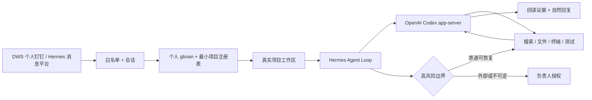

<div align="center">


# Foursday

**由个人记忆驱动、能够在真实项目中工作的 AI 工作分身。**

可信消息 → 个人上下文 → 真实工作区 → Hermes + Codex → 已验证工作 → 自然回复。

[English](./README.md) · [架构地图](./docs/设计总览.md) · [Gate 2 证据](./docs/自主工作分身迁移验收报告.md) · [安全说明](./安全说明.md) · [参与贡献](./CONTRIBUTING_ZH.md)

[](https://github.com/ruiwang20010702/foursday/actions/workflows/check.yml)
[](https://github.com/ruiwang20010702/foursday/actions/workflows/security.yml)
[](./LICENSE)

</div>

## Foursday 是什么

Foursday 使用个人 gbrain 和 Hermes 通用 Agent Loop 完成工作，不再为每一种问题新增 capability、JSON Pointer、请求人配置或固定回复模板。

对白名单可信联系人，普通可恢复工作默认自主执行：

- 理解会话并自动识别项目；
- 进入真实项目目录；
- 阅读文件、脚本、台账和 Git 状态；
- 计算、分析、整理文档或修改代码；
- 运行测试并根据失败继续修复；
- 回读真实结果，带证据自然回复。

Git 推送、PR 合并、生产部署、生产改数、不可恢复删除、付款、合同、人事决定、秘密外发和不可撤销承诺继续由独立硬边界阻断。

## 一条命令安装

需要 macOS、Node.js 22.5+、Git 和 [`uv`](https://docs.astral.sh/uv/)。Python 3.13 由隔离运行时自动管理。

```bash
git clone https://github.com/ruiwang20010702/foursday.git && cd foursday && npm ci --ignore-scripts && npm run hermes:setup -- --apply
```

已经克隆仓库时，先运行 `npm run hermes:setup` 查看零写预览，再加 `-- --apply`。安装器会在 `.runtime/hermes-poc` 内把锁定上游、隔离环境、补丁、插件、Profile 和 Skill 串成一次幂等、失败可恢复的完整安装。

安装过程**不会**复制凭据、启动 Gateway、发送消息或切换 active。安装后再登录 Codex，连接自己的消息与记忆来源，并从关闭发送的 shadow 开始。

## 架构



Foursday 是建立在精确 Hermes 上游之上的薄发行层：

- 固定 Hermes `v2026.8.18` / `0.20.4`；
- DWS、项目路由和高风险边界三个外部插件；
- Foursday Profile 与通用项目工作 Skill；
- 一个用于 Session workspace 持久化的三文件锁定补丁；
- 不维护重度 Fork，不创建第二套业务知识库。

[查看权威架构地图](./docs/设计总览.md)。

## 记忆模型

```text
个人 PRIVATE gbrain Git → 长期业务知识唯一权威
个人 gbrain PostgreSQL  → 可重建的搜索、实体和图索引
Hermes Session DB       → 会话、工具调用和短期执行上下文
Foursday PostgreSQL     → 当前旧 Runtime 的兼容运行状态
```

gbrain OAuth 凭据只存在于宿主只读桥接进程。Agent 终端拿不到凭据、生产配置、DWS 可执行文件、部署密钥或网络。

## 已验证候选

本机 V3 候选已通过全部 12 项 PoC 门槛：

- 从个人钉钉原会话真实接收 DWS 消息；
- 自主核对 2.2 项目：正式成品 `68,786`，释义级源记录 `81,088`；
- 同一 Session 连续回答放行量、未通过量、问题批次、成本和原因；
- 在真实项目完成文档、分析和代码修改并回读；
- 本人自聊真实发送与人工接管 interrupt；
- 经单独授权向原联系人发送自然更正，独立回读精确正文只有一条；
- 陌生人、未 @ 群聊、项目歧义、秘密、网络、推送和部署均失败关闭；
- Foursday 全量回归通过；实时数量只在[完成度矩阵](./docs/完成度矩阵.md)维护；
- Hermes 上游契约：202 通过、1 条条件跳过。

这些是**候选证据，不是 active Runtime 切换**。旧 Node.js Runtime 仍是唯一发送者；发送关闭、项目只读的 Hermes shadow Gateway 已从独立 Application Support 版本常驻运行，并通过 DWS 检查点和 launchd 重启回读。实时边界见[完成度矩阵](./docs/完成度矩阵.md)。

[查看完整 Gate 2 报告](./docs/自主工作分身迁移验收报告.md)。

需要手工恢复时，仍可分别重跑 `hermes:prepare`、`hermes:patch` 和 `hermes:install` 三个阶段。详见[英文部署指南](./docs/en/deployment.md)。

## 文档导航

| 想了解 | 权威来源 |
|---|---|
| 产品定义与验收 | [产品需求文档](./docs/产品需求文档.md) |
| 架构和模块地图 | [设计总览](./docs/设计总览.md) |
| 具体实现规则 | [技术设计文档](./docs/技术设计文档.md) |
| 当前状态和已撤销概念 | [完成度矩阵](./docs/完成度矩阵.md) |
| 迁移验证证据 | [Gate 2 报告](./docs/自主工作分身迁移验收报告.md) |
| 当前生产运维 | [旧 Runtime 运维手册](./docs/生产运维手册.md) |
| 历史架构决策 | [Hermes 迁移决策](./docs/自主工作分身架构迁移方案.md) |

## 路线图

- [x] Hermes/Codex 通用 Loop、DWS、gbrain、项目路由、证据与硬边界
- [x] 真实 P0 会话、追问、项目工作、发送回读和人工接管
- [x] 固定上游、失败可恢复的薄发行层
- [x] Gate 2 候选已提交并推送到 `main`
- [ ] 从旧 Runtime 受控迁移生产
- [ ] 飞书、企业微信、Slack、Teams、Gmail 和 Google Workspace 发行配置

## 许可证

[MIT](./LICENSE)
