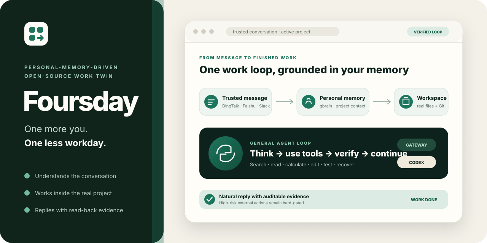
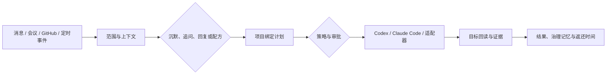

<div align="center">



# Foursday

**你的开源工作分身。多一个你，少上一天班。**

Foursday 把工作消息转化为可审阅回复和项目工作，只执行明确授权的工具，并用目标系统回读证明结果。北极星指标是每位用户每周经过验证拿回的工作时间。

[English](./README.md) · [快速开始](#快速开始) · [75 秒真实演示](./assets/foursday-v0.5-demo.mp4) · [设计总览](./docs/设计总览.md) · [安全说明](./SECURITY.md) · [参与贡献](./CONTRIBUTING_ZH.md)

[](https://github.com/ruiwang20010702/foursday/actions/workflows/check.yml)
[](https://github.com/ruiwang20010702/foursday/actions/workflows/security.yml)
[](https://nodejs.org/)
[](https://www.postgresql.org/)
[](./LICENSE)

**版本状态：**[`v0.6.0-rc.1`](https://github.com/ruiwang20010702/foursday/releases/tag/v0.6.0-rc.1)
是最新带标签的公开预览版，对应
`6b30c22f97b19c6cfd30bf162b3f85000fa2bde9`；`main` 可能继续包含 RC 后候选改动。

</div>

## 为什么做 Foursday

聊天机器人能生成文字，真实工作还需要范围、权限、接管、证据和记忆：

- 判断应该沉默、追问、回复还是开始工作；
- 每个动作绑定请求人、项目、能力、预算和完整计划哈希；
- 高风险副作用先审批；
- 执行后回读目标系统，不相信模型自述；
- 人工接管时停止自动流程；
- 长期记忆保存在可阅读、相互隔离的 gbrain Markdown source。

钉钉使用 DWS；飞书直接使用官方 WebSocket 与消息 API，不依赖 DWS。
`MessageAdapter`、`AgentRuntime` 和 `ModelProvider` 是独立的版本化契约。

## 它如何工作



| 功能 | 用户价值 | 默认边界 |
|---|---|---|
| 项目接入向导 | 一次配置目标、里程碑、协作对象、配方、记忆范围和风险预算 | 外部动作关闭 |
| 工作配方库 | 复用 5 个版本化流程 | 同一张工作委托单先预览步骤、风险、证据和精确计划哈希；工作台登记一律进入待审批，不能自动执行 |
| 项目驾驶舱 | 查看计划、证据、交付物、记忆、触发器和本周工作返还队列 | 只读与规划 |
| 时间返还仪表盘 | 只统计有证据且经本人确认的分钟 | 模型估算不计入 |
| 主动工作模式 | 定时或事件触发跟进 | 触发器默认关闭 |
| GitHub 交付 | Issue → 补丁 → 分支 → 测试 → 推送 → Draft PR | 只限授权仓库与命令 |

无人值守发送保持窄边界：普通私聊、白名单群中明确 `@` 当前账号的普通回复，以及私聊中只问一个必要问题的最小追问，只有在 `riskLevel=low`、置信度不低于 0.95 且不包含工作请求时才可分别授权自动批准。群聊追问、承诺、计划和中高风险内容仍需审阅；人工接管检查和发送回执核对不会关闭。禁止区、未授权项目和未开放能力会返回确定性的“暂时无法执行”说明，不会假装已经处理。

历史导入分两步：先预览，再用写入令牌加手工输入的当前 `IMPORT-...`
摘要创建待审候选。项目记忆设置使用双令牌零写的 `MEMORY-AUTH-...`
预览，不会开启全局能力；显式使用写入令牌才调用模型，并且不能超出既有授权和服务端十分钟快照。候选在同一项目卡片确认或拒绝，冲突必须明确替代旧事实。

## 可阅读的统一记忆

Foursday 使用工作、情景、语义和前瞻四类并列记忆。人物、项目、原则和知识是语义记忆的并列子域，不是上下级。

```text
Foursday PostgreSQL  → 工作状态、权限、租约、加密投影
gbrain Markdown      → 可审阅的长期记忆正文
gbrain PostgreSQL    → 可重建的搜索、实体与图谱索引
```

个人知识继续使用 gbrain `default`；自动工作记忆强制使用独立、非联邦的
`foursday` source，每次读写和同步都显式绑定 source。新安装会初始化：

```text
atoms/  conversations/  people/  preferences/
projects/  concepts/  prospective/
```

低风险事实只有完成 Markdown 写入、单文件 Git 提交、gbrain 精确回读和 PostgreSQL 投影后才可使用。撤销、替代、永久删除或隐私擦除会先在 PostgreSQL 事务内登记回收作业，再提交受管理 Markdown 的删除、同步并验证原 slug 已不可读，最后删除 source 外临时文件；失败会提交恢复并重试。冲突保持隔离；凭据、PII、敏感人物材料和机密候选直接拒绝。

## 与普通机器人的区别

| 普通机器人 | Foursday |
|---|---|
| 看到消息就回答 | 判断沉默、追问、回复或工作 |
| 提示词决定权限 | 项目清单、预算、风险和审批决定权限 |
| 相信工具返回 | 副作用账本、幂等键和目标回读 |
| 自动堆积上下文 | Markdown 权威、来源、冲突替代、过期和撤销 |
| 人工与自动流程竞争 | 人工回复、暂停和取消统一接管 |

## 快速开始

### 1. 零写 Web 预览

需要 Node.js 22 或 24。下面的固定提交启动时不安装生产服务、不触碰外部系统：

```bash
npx --yes --ignore-scripts --package "github:ruiwang20010702/foursday#6b30c22f97b19c6cfd30bf162b3f85000fa2bde9" foursday start --pilot-sha 6b30c22f97b19c6cfd30bf162b3f85000fa2bde9
```

更新候选必须换成经过审核的完整 40 位提交编号。公开体验使用个人 fork 作为推送来源，以获批 upstream 作为 Issue 和 Draft PR 目标。**Prepare my pilot fork** 与再次批准完整计划哈希是两个动作；禁止合并或部署体验 PR。

页面可复制**隐私安全体验证明**和 **Copy privacy-safe readiness report**；两者均未签名，需要维护者独立回读，且 Foursday 不会自动提交。报告不含可执行文件路径、用户名、凭据或模型输出。服务启动到确认使用单调时钟；包下载时间单独记录，不能拿局部时间冒充完整安装耗时。

查看[体验验证说明](./docs/体验验证说明.md)，通过
[Issue #49](https://github.com/ruiwang20010702/foursday/issues/49) 加入，或在
[Issue #50](https://github.com/ruiwang20010702/foursday/issues/50) 报告一次成功安装。

### 2. 本地演示与检查

```bash
npm run demo
npm run check
```

75 秒真实演示使用合成 [Issue #29](https://github.com/ruiwang20010702/foursday/issues/29)
和已回读验证的 [Draft PR #39](https://github.com/ruiwang20010702/foursday/pull/39)，未合并、未部署。

### 3. 初始化真实安装

```bash
foursday init                 # 零写预览
foursday init --apply         # 受保护配置 + 隔离 gbrain source
foursday secrets --apply      # 在钥匙串生成密钥，不把生成的生产密钥写入配置
foursday check
```

`init --apply` 自动创建 7 类 Markdown 目录、独立 Git 仓库和非联邦
`foursday` source；记忆写入和自动确认仍关闭。

## 首次部署

完整操作解释和回滚要求以[生产运维手册](./docs/生产运维手册.md)为准。安全顺序固定为：

```bash
npm run production:preflight
npm run db:backup
npm run db:migrate
npm run production:doctor
npm run production:agent-probe
npm run service:install
npm run production:service-verify
npm run production:verify
npm run shadow:verify
```

部署不会自动打开发送、计划执行、主动工作、记忆写入或自动确认。

## 日常操作

日常管理使用本机回环管理台；项目配方可先运行默认零写的
`npm run projects:shadow`，只有显式 `--run` 才调用模型服务，阅读结果后再用
`--review` 记录真实审阅时间。

## 受治理工作图

Loop Engineering 是执行单元，Graph Engineering 连接**工作图、知识图和治理图**，解释发生了什么、事实来自哪里、谁允许执行。受治理工作图不代表已经引入图数据库，也不代表项目、配方或主动工作已经获得生产权限。

实现和四类项目驾驶舱图解释见[技术设计](./docs/技术设计文档.md)与
[架构决策 001](./docs/架构决策受治理工作图存储.md)。

## 文档导航

| 想了解 | 阅读 |
|---|---|
| 产品边界和当前状态 | [设计总览](./docs/设计总览.md) · [完成度矩阵](./docs/完成度矩阵.md) |
| 产品需求 | [产品需求文档](./docs/产品需求文档.md) |
| 架构、状态机、记忆和图 | [技术设计文档](./docs/技术设计文档.md) |
| 能力、审批和正式记忆 | [能力清单与正式记忆](./docs/能力清单与正式记忆.md) |
| 安装、备份、发布和回退 | [生产运维手册](./docs/生产运维手册.md) |
| 真实演示证据 | [演示说明](./docs/真实演示录制说明.md) |
| 公开发布 | [公开发布手册](./docs/公开发布手册.md) |
| 增长证据 | [公开增长记分卡](./docs/公开增长记分卡.md) |
| 首次贡献任务 | [首次贡献任务](./docs/首次贡献任务.md) |

## 路线图

- [x] 受治理工作图 V1 生产实现
- [x] 四类项目驾驶舱图解释
- [x] 隔离 gbrain Markdown 权威层与 PostgreSQL 运行投影
- [ ] 10 位不同外部体验者完成真实闭环
- [ ] 用真实群聊、追问和长期 SLO 样本持续收紧已开放的有界生产自动化
- [ ] Slack、Teams、Gmail、Google Workspace 生产连接器

## 参与贡献

请阅读 [CONTRIBUTING_ZH.md](./CONTRIBUTING_ZH.md)、
[CODE_OF_CONDUCT_ZH.md](./CODE_OF_CONDUCT_ZH.md) 和
[SECURITY.md](./SECURITY.md)。5 个任务都已经开放，见[首次贡献任务](./docs/首次贡献任务.md)。

## 许可证

[MIT](./LICENSE)
