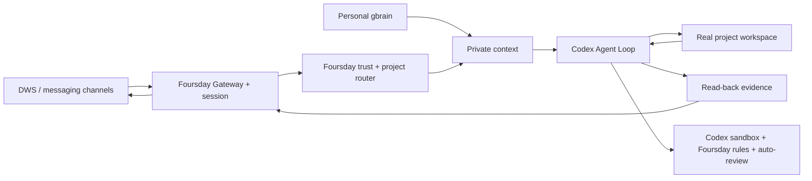

# Architecture

Foursday is a work-twin product with one Codex Agent Loop. A pinned, minimally installed Hermes runtime supplies the internal Gateway, session lifecycle, scheduling, and future channel adapters; it does not plan work or write the final reply.

## Ownership

| Layer | Owner |
|---|---|
| Work planning, project tools, and final reply | Codex app-server |
| Gateway, session lifecycle, scheduling, future standard channels | embedded upstream Hermes runtime |
| Personal DingTalk | `dws_personal` plugin and host sidecar |
| Workspace selection | `project_router` plugin |
| Personal-memory context | DWS platform context provider and read-only bridge |
| Memory promotion | Foursday MCP with short-lived message-bound tokens |
| Risk enforcement | isolated Codex home, App Server policy proxy, OS sandbox, forbidden rules, and automatic approval review |
| Work behavior | Foursday Profile and project-work Skill |
| Durable business knowledge | personal PRIVATE gbrain Git |
| Memory promotion queue | minimal Foursday PostgreSQL schema |

Foursday has no Hermes fork, core patch, second Agent Loop, capability-manifest workflow, or second business-memory repository.

Installation verifies the locked upstream source still bypasses its foreground tool loop in `codex_app_server` mode. The Foursday Profile disables upstream built-in memory, memory/skill nudges, background-review forks, automatic title generation, and the curator so no post-turn auxiliary model or Agent Loop reappears behind Codex.

The upstream adapter does not automatically forward Profile, Skill, or ephemeral channel context into Codex. Foursday closes that boundary explicitly: the router binds the upstream public Session-CWD context to the real project; trusted Profile instructions are injected on `thread/start`; each DWS turn carries only a random marker whose private, 15-minute host record binds the routed workspace, project context, personal-gbrain data, requester handle, and Session. The proxy validates and removes the marker before it injects context into `turn/start`; personal-memory text is marked data-only and the outbound DLP rejects the token.

## Trust boundaries

Unknown users and unmentioned groups are rejected before a Session is created. Project terminal commands are confined to the routed workspace and have no network. Host credentials remain in narrow sidecars. External or irreversible actions are blocked and must use a separate owner-authorized exit.

The embedded control plane's own approval layer is disabled deliberately: a headless Gateway otherwise declines ordinary Codex commands before Foursday can apply its policy. The Foursday App Server proxy is the single decision point—Codex auto-reviews reversible work under the forced profile, while the proxy declines escalation and high-risk operations before the control plane can approve them.

See the [technical design](../技术设计文档.md) for exact invariants.
