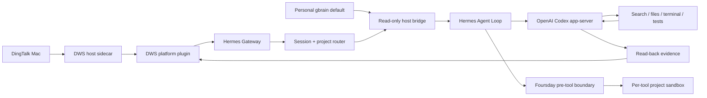

# Foursday V3 Architecture

Status: Gate 2 complete. The production service still uses the legacy Node.js governed runtime; the Hermes production migration is not active.

## Decision

Foursday is a thin distribution on exact Hermes upstream `v2026.8.18` / `0.20.4`, not a new full Agent Runtime.

```text
Pinned Hermes upstream
+ one locked three-file Session workspace patch
+ external Foursday plugins
+ Foursday Profile and Skills
+ product UI and independent high-risk exits
```

## Runtime topology



The host owns DWS, gbrain OAuth, and future high-risk credentials. Agent tool subprocesses own none of them.

## Upstream and patch

`hermes/upstream.lock.json` binds the official credential-free HTTPS repository, full commit, release, Python range, MIT license, and license digest.

The single patch changes only:

- `gateway/session.py` — persist `workspace_path`;
- `gateway/platforms/base.py` — create sources with a workspace;
- `gateway/run.py` — bind the workspace as Session cwd.

Patch digest and file list are locked. Upstream Session/Platform/env/merge/interrupt tests pass 202 with one conditional upstream skip.

## DWS personal DingTalk

The Node sidecar reuses the existing DWS implementation and communicates with the Python platform plugin over JSON Lines. It receives only a narrow environment—never database, data-key, admin, or deployment secrets.

Key guarantees:

- stable staff/OpenDingTalk identity binding with explicit identity kind;
- allowlisted direct chats and allowlisted groups with explicit mention;
- 3-second quiet-window bundling, maximum 8 seconds from first message;
- 5,000-message persistent dedupe and recipient/session recovery;
- human-owner reply → `human_takeover` → Hermes interrupt;
- withdrawal audit with no message body;
- explicit server message id or bounded exact-content read-back;
- unknown delivery is non-retryable.

## Project routing

The registry contains only id, name, aliases, canonical local root, credential-free Git URL, gbrain slugs, optional run instructions, and isolation mode. Requesters, capabilities, business metrics, JSON pointers, approvals, and secrets are rejected.

The router keeps a private conversation binding, matches the longest safe alias, prevents file-path names from hijacking a Session, allows explicit natural-language project switches, and clarifies ambiguity instead of guessing.

## Personal gbrain

Personal PRIVATE gbrain Git is the only durable business-knowledge authority; its PostgreSQL database is a rebuildable index. The host bridge resolves only the dedicated memory secret and requires `default + read-only OAuth`. It retrieves exact routed pages, filters size/credentials/sensitive material, and injects them as untrusted private background.

Hermes Session DB stores conversation and tool history. Hermes `MEMORY.md` may store Agent-operational knowledge only. Foursday does not maintain a second project knowledge repository.

## Tool isolation and high-risk boundary

The model process retains model authentication. Every terminal tool call is rewritten through a macOS project sandbox:

- read system tools and the registered project only;
- write the project only when isolation is `workspace-write`;
- deny `.runtime`, `.env`, other projects, Keychain, and system control;
- deny terminal network;
- fail closed when registry/profile creation fails.

Direct file tools apply the same canonical-path checks. Web tools reject credential-like outbound queries.

The pre-tool boundary blocks push, merge, release, package publish, production deploy/SQL, irreversible deletion, launchctl/sudo/osascript, payment, contracts, HR actions, secret access, and irreversible commitments. DWS performs a final outbound secret/commitment check before delivery.

## Evidence and failure behavior

Evidence includes the routed workspace, source message IDs, tool calls and cwd, file hashes, tests, send receipt/server ID, and final reply. Gate 2 relies on Session DB, filesystem read-back, DWS read-back, and tests—not the model's completion claim.

| Failure | Behavior |
|---|---|
| Unknown identity | Drop before Session |
| Ambiguous project | Ask one clarification |
| gbrain unavailable | Work with current project but disclose missing long-term context |
| Tool boundary failure | Block |
| Unknown send | Do not retry; reconcile/read back |
| Human takeover | Interrupt and suppress stale output |
| Gateway restart | Restore dedupe, recipient, project, and workspace |

## Storage responsibilities

| Store | Responsibility |
|---|---|
| Personal gbrain Git | Durable business knowledge |
| gbrain PostgreSQL | Rebuildable retrieval/entity/graph index |
| Hermes Session DB | Conversation, tools, short-term execution |
| Foursday PostgreSQL | Compatibility state for the legacy production runtime |

## Install and migration

```bash
npm run hermes:setup
npm run hermes:setup -- --apply
```

The one-command installer validates prerequisites and runs the pinned upstream, isolated environment, patch layer, and Foursday distribution as three idempotent stages confined to `.runtime/hermes-poc`. Each stage remains independently available for recovery. The installer is rollback-safe, denies built-in tool override permission, and never starts the Gateway or copies credentials.

The persistent shadow Gateway now uses an Application Support release, a Node launchd supervisor, a venv-bound Hermes child, a private DWS checkpoint, and a read-only registry. Active migration still requires task drain, DWS single-writer ownership, cursor continuity, a cutover receipt, and verified rollback. New and legacy runtimes must never auto-send to the same conversation concurrently.

## Module map

| Concern | Source |
|---|---|
| Upstream lock | `src/hermes-upstream.mjs`, `hermes/upstream.lock.json` |
| Candidate/patch/install | `src/hermes-candidate.mjs`, `src/hermes-patches.mjs`, `scripts/*Hermes*.mjs` |
| DWS sidecar/plugin | `src/hermes-dws-sidecar.mjs`, `hermes/plugins/dws_personal/` |
| Project router | `hermes/plugins/project_router/` |
| gbrain bridge | `src/hermes-personal-memory-context.mjs` |
| Hard boundary | `hermes/plugins/foursday_boundary/` |
| Persistent shadow service | `src/hermes-production-service.mjs`, `src/hermes-gateway-launcher.mjs`, `scripts/管理Hermes常驻服务.mjs` |
| Shadow acceptance / cutover | `src/hermes-shadow-acceptance.mjs`, `scripts/生成Hermes影子验收.mjs`, `src/hermes-cutover.mjs`, `scripts/切换Hermes生产运行时.mjs` |
| Profile/Skill | `hermes/profile/`, `hermes/skills/` |
| Shadow/evidence tests | `hermes/shadow_runner.py`, `hermes/tests/`, `test/hermes-*.test.mjs` |

## Legacy runtime

The existing capability/plan/approval/budget/recipe/state-machine runtime remains the current production and an optional Enterprise / Governed Mode. It no longer defines the V3 personal architecture. See the Chinese [production runbook](../生产运维手册.md) and [status matrix](../完成度矩阵.md).
