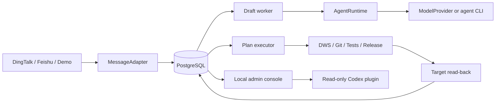
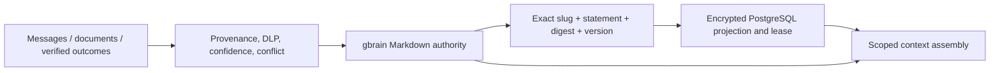
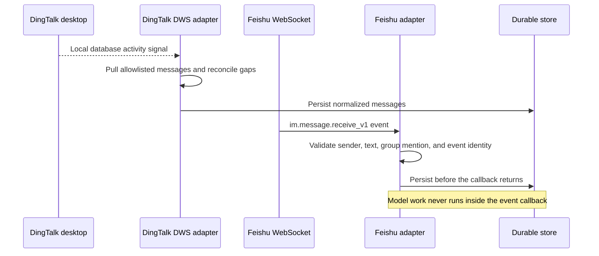
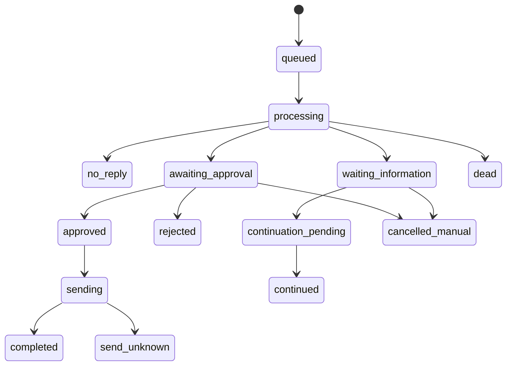
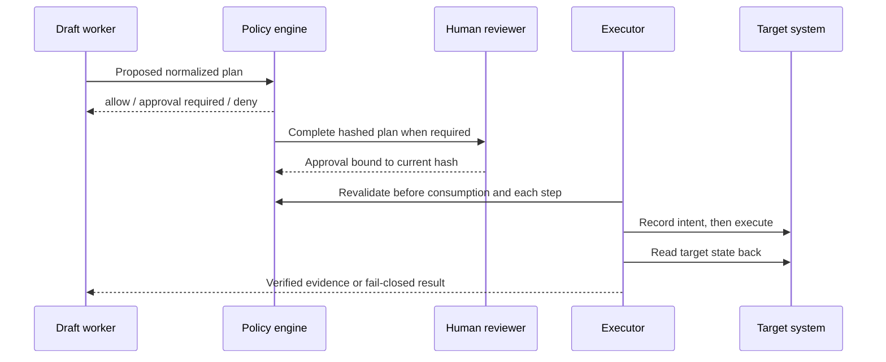
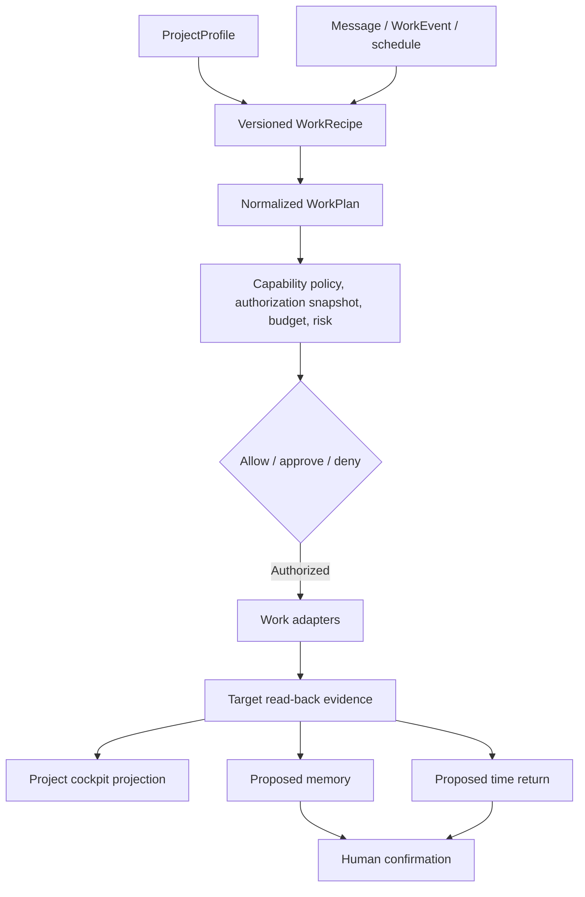
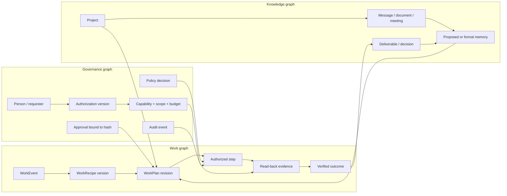

# Architecture

[Overview](./overview.md) · [简体中文技术设计](../技术设计文档.md)

## System shape

Foursday separates fast message ingestion, slow model work, external side effects, and human control. PostgreSQL is the production state and evidence store; SQLite is retained only for isolated public-pilot sessions, local development, and parity testing.

## Main components

| Component | Responsibility |
|---|---|
| Listener | Receive normalized adapter messages, deduplicate them, reconcile gaps, and build bounded bundles |
| Draft worker | Decide ignore/clarify/reply/work, generate drafts, propose memory, and detect human takeover |
| Policy engine | Evaluate requester, project, capability, risk, target scope, expiry, and persistent run budget |
| Plan executor | Acquire leases, revalidate policy, run one step at a time, and persist evidence |
| Work adapters | Provide narrow interfaces for research, documents, code, Git, DingTalk work, and releases |
| Stores | Encrypt business content and enforce transactional state transitions in SQLite and PostgreSQL |
| Health and alerts | Track heartbeats, dead tasks, unknown sends, leases, message coverage, and SLO samples |
| Admin console | Expose local review and control with separate read/write tokens |
| Codex plugin | Present read-only status, drafts, plans, capabilities, and takeover information |

## Unified memory architecture

The memory model has three orthogonal dimensions instead of a misleading L0-L7 ladder:

- **Four parallel kinds:** working, episodic, semantic, and prospective memory.
- **One lifecycle:** capture, extract, govern, write Markdown, exact read-back, project into PostgreSQL, consolidate, retrieve, supersede, and expire.
- **Three storage responsibilities:** Git-backed Markdown is the long-term authority; gbrain is the write-through/entity/graph/retrieval adapter; Foursday PostgreSQL owns transactional state, authorization, leases, encrypted projections, and audit.

Person, project, principle, and knowledge records are sibling namespaces within semantic memory. Dreaming/consolidation and retrieval operate across the four kinds; they are not additional memory tiers.

Managed low-risk semantic facts use deterministic `atoms/foursday/` pages. The source and subject identities are fingerprinted in Markdown while the original provenance stays encrypted in PostgreSQL. A write is not usable memory until exact gbrain read-back and PostgreSQL projection both succeed. Conflicts remain proposed; credentials, PII, sensitive person material, and confidential candidates are rejected.

Revocation is also cross-system: PostgreSQL commits a cleanup outbox entry in
the same transaction as revocation, replacement, deletion, or privacy erasure.
The memory service temporarily moves the digest-matched Markdown file outside
the source, syncs, verifies that the original slug is absent, and removes the
temporary file. Failure restores the file and keeps the job retryable.

Production defaults to `AI_EMPLOYEE_MEMORY_AUTHORITY_MODE=gbrain`. Foursday
also requires its own `GBRAIN_HOME` and authenticated PostgreSQL database;
source IDs alone are not treated as physical isolation. Writes and safe
auto-confirm are separate default-off gates. Enabling either does not enable
message sending, plan execution, or proactive work. Production formal memory
never loads the SQLite adapter.

The personal brain keeps the `default` gbrain source. Automated work memory
uses a separate non-federated `foursday` source, and every authority read,
Markdown write, and sync explicitly binds that source ID. Production refuses
authority writes through `default`.

## Versioned integration contracts

The runtime exposes three independent `1.0` contracts:

| Contract | Owns | Does not own |
|---|---|---|
| `MessageAdapter` | Message identity, scoped ingestion, conversation context, manual-reply detection, sending, and receipt read-back | Reply policy, project authorization, or model selection |
| `AgentRuntime` | Producing a schema-validated draft through an agent such as Codex or Claude Code | Message credentials or permission to execute work |
| `ModelProvider` | Structured model generation for provider-backed runtimes | Tool authorization, side effects, or approval state |

DWS is contained inside the DingTalk adapter. The Feishu adapter uses Feishu's
official event subscription and messaging APIs and has no DWS dependency. Adapters
share normalized identities and lifecycle semantics, not platform credentials
or platform-specific fields.

### Channel-specific receive paths

Feishu delivery is at least once, so the adapter deduplicates by message ID.
Only direct messages and allowlisted group messages that explicitly mention the
work twin are eligible. Sending uses Feishu's native UUID field; completion
still requires an exact message ID, conversation, and text read-back.

### Agent runtime selection

Set `AI_EMPLOYEE_AGENT_RUNTIME=codex` (default) or
`AI_EMPLOYEE_AGENT_RUNTIME=claude-code`. Pin `CODEX_PATH` or
`CLAUDE_CODE_PATH` in managed environments. Both CLIs receive the draft prompt
through stdin, run without tools, and must return the same JSON Schema. Direct
model integrations implement `ModelProvider` and inherit the same draft
validation.

## Message lifecycle

Messages are received at least once and deduplicated by platform identity. Nearby messages from one conversation are bundled within a bounded quiet window, with a hard maximum from the first message. Explicit urgent input may close the bundle early.

Clarification chains reserve exactly one relevant continuation. Late-ingested messages that occurred before the question, ambiguous candidates, unrelated messages, expired waits, and human replies are handled without guessing.

## Work-plan lifecycle

A model may propose work, but the runtime builds and validates the executable plan. Approval binds the complete normalized plan, project authorization version, capability policy, and budget identity.

## Side-effect reliability

- Every external effect uses an idempotency key and a persisted intent record.
- A completed effect requires a corresponding ledger entry.
- Adapter success must be followed by target-system verification.
- Cancellation checks preserve evidence from an effect that may already have happened.
- Unknown outcomes enter an explicit reconciliation state and are never automatically replayed.

This provides at-least-once message handling with effect-level exactly-once behavior where the target and adapter support it.

## Security boundaries

- Sensitive business fields use AES-256-GCM encryption at rest.
- Production secrets come from Keychain or controlled environment references, never repository files.
- Codex, DWS, candidate code, and release checks receive minimal child-process environments.
- Paths, commands, remotes, document targets, people, templates, and time ranges are allowlisted.
- The local console binds to loopback and separates read and write credentials.
- Release artifacts are tied to an exact Git SHA and rechecked before activation.

## Observability and readiness

Liveness, service availability, strict business readiness, and rollout acceptance are different results:

| Result | Meaning |
|---|---|
| Liveness | The process is running |
| Service available | Required components and the target release can serve safely |
| Business ready | No dead tasks, failed plans, unknown sends, expired leases, or other strict blockers |
| Rollout accepted | Quality samples, long-window SLOs, side-effect evidence, and memory conflict gates pass |

For the complete entity model, SQL schema, concurrency rules, tests, and architecture decisions, see the [Chinese production design](../技术设计文档.md).

## Personal project runtime

`WorkTrigger` does not execute adapters. It reserves an idempotent run, applies
daily and cooldown limits, instantiates a recipe, and registers the resulting
plan through the same policy path. SQLite and PostgreSQL implement the same
project, trigger, memory-source, privacy, and time-return invariants. Migrations
019 and 020 add the persistent project/time and trigger/run records.

Extension boundaries are split into `MessageAdapter`, `WorkEventAdapter`,
`WorkspaceAdapter`, `AgentRuntime`, `ModelProvider`, and `WorkRecipe`. A
manifest describes permissions and runtime secret names; it never carries
secret values or grants a capability.

## Governed Work Graph direction

The current runtime contains graph-shaped domain relationships, but it does not
expose one generic graph API or require a graph database. Projects,
recipes, plans, steps, capabilities, approvals, memories, evidence, and outcomes
remain separate bounded contexts with transactional invariants. The roadmap is
to make their allowed relationships explicit without moving domain rules into
a graph framework.

The graph layer must preserve the existing dependency direction:

- Domain entities and state transitions remain independent of PostgreSQL,
  visualization libraries, and any future graph engine.
- Versioned edge types describe only allowed relationships; they never grant a
  capability or bypass the policy engine.
- The **intended graph** records allowed topology, owners, approvals, and stop
  edges. The **runtime graph** records what actually happened, including model
  and tool choices, retries, evidence, latency, and exceptions.
- Project and tenant isolation apply to every traversal. Provenance, sensitivity,
  expiry, and authorization version travel with an edge rather than being
  reconstructed from a chat transcript.
- The first storage implementation should reuse SQLite/PostgreSQL and their
  existing transactions. A specialized graph database requires benchmarked
  relationship queries and an explicit migration decision.

Stages 1–4 are deployed in production commit `34d04326d1d16ba92994107eb2f44bf89d74c759`: Graph Contract v1 and
its public Schema, encrypted append-only SQLite/PostgreSQL projections from
migration 021, intended/runtime capture, deterministic terminal replay, and
four bounded cockpit explanations. This is a bounded explanatory projection,
not a generic graph API or authorization source. [ADR 001](adr-001-governed-work-graph-storage.md) records why
the deployed implementation keeps the transactional stores instead of adding a graph database.

### Current-state audit

The graph starts as a projection of existing domain truth. It does not replace
the sources in this table.

| Bounded context | Current source of truth | Stable identity or version | Graph readiness |
|---|---|---|---|
| Project and authorization | Project manifests validated by `capability-policy.mjs` | `projectId`; assessed plans bind an `authorizationHash` | Project, authorization, and capability nodes are projected; domain policy remains authoritative |
| Message and reply task | `messages`, `tasks`, approvals, and side-effect ledgers | Platform message ID, task ID, approval version, idempotency key | Existing persisted nodes and transitions |
| Event and trigger | `WorkEvent`, `work_triggers`, and `work_trigger_runs` | Event ID, trigger ID, deterministic run key | Matching event, trigger, and plan are projected; the run ledger remains authoritative |
| Recipe | Validated `WorkRecipe` files | Recipe ID, contract `version`, and canonical content hash | Immutable recipe content revision is bound into the assessed plan |
| Plan, step, and approval | `work_plans`, `work_plan_steps`, `work_plan_approvals` | Plan ID, `planHash`, revision, step ID, approval version | Intended and runtime relationships are projected; domain state remains authoritative |
| Capability and budget | Project manifest plus persistent capability-budget ledger | Capability name + `authorizationHash` | Authorization is explainable; remaining budget is read from the domain ledger, never granted by the graph |
| Evidence and outcome | Encrypted step evidence, plan/task terminal state, result drafts | Plan ID + step ID + evidence payload | Complete read-back creates evidence/outcome nodes; missing evidence fails closed |
| Memory and source | `memory_items` plus source-access verification | Memory ID, source type/ID/version, fact key | Exact source, memory used in planning, and plan-proposed candidates are captured |
| Time return | `time_return_entries` | Work-plan ID; confirmation state | Proposal and confirmation revisions are projected; only confirmation counts as returned time |
| Audit | PostgreSQL audit events, domain ledgers, and graph observations | Tenant-scoped audit identity and event time | Graph contract is store-parity tested; PostgreSQL audit events remain production audit truth |

This audit deliberately labels projected or missing relationships as partial.
For example, a cockpit deliverable is currently derived from completed-step
evidence; it is not a separately governed `Deliverable` entity.

### Graph Contract v1

Graph Contract v1 is a framework-independent projection contract. A node is
identified by `(tenantId, nodeType, domainId)` and carries an immutable
`revision`: canonical content hash for recipes and evidence, existing plan or
authorization hash where available, and exact source version for memories.
Project-scoped nodes must include `projectId`. A node records its provenance,
sensitivity, expiry, and observation time; it contains neither decrypted secret
material nor authority inferred from reachability. An edge has this minimum
envelope:

| Field | Meaning |
|---|---|
| `edgeId` | Deterministic hash of tenant, type, endpoints, revisions, phase, and governing authorization |
| `edgeType` | One allowlisted relationship from the table below |
| `from`, `to` | Stable node identities and the revisions observed |
| `phase` | `intended` for allowed topology or `runtime` for observed execution |
| `provenance` | Domain record or source version from which the edge was derived |
| `authorizationHash` | Authorization snapshot that governed the transition, when applicable |
| `sensitivity`, `expiresAt` | Traversal and retention constraints inherited from the strictest endpoint/source |
| `validFrom`, `invalidatedAt` | Lifecycle without rewriting an earlier observation |
| `observedAt` | When the projection observed the domain fact; not a replacement for domain timestamps |

The first allowlist is intentionally small:

| Edge type | Phase | Authoritative domain fact |
|---|---|---|
| `project.has_authorization` | intended | Validated project manifest and its canonical authorization hash |
| `project.selects_recipe` | intended | Validated project profile and recipe version |
| `event.matches_trigger` | runtime | Validated event filter and claimed trigger run |
| `trigger.instantiates_plan` | runtime | Trigger run bound to work-plan ID and deterministic run key |
| `task.requests_plan` | runtime | Work plan bound to an existing source task |
| `plan.contains_step` | intended + runtime | Validated plan revision and persisted step |
| `recipe.instantiates_plan` | intended + runtime | Recipe content hash bound into the assessed and persisted plan |
| `authorization.grants_capability` | intended | Project capability rule under the current authorization hash |
| `authorization.permits_step` | intended | Capability policy decision, scope, budget, and authorization hash |
| `step.uses_capability` | intended + runtime | Assessed step capability and its persisted execution identity |
| `approval.authorizes_plan` | runtime | Unexpired approval bound to plan hash and approval version |
| `step.produces_evidence` | runtime | Completed step with verified read-back evidence |
| `plan.produces_outcome` | runtime | Terminal plan whose required steps and evidence satisfy the outcome rule |
| `source.supports_memory` | runtime | Memory source ID/version, access state, sensitivity, and expiry |
| `memory.informs_plan` | runtime | A specific usable memory revision actually included in planning context |
| `plan.proposes_memory` | runtime | Project memory candidate produced by a work plan and still awaiting explicit confirmation |
| `plan.proposes_time_return` | runtime | Verified plan outcome and its proposed or confirmed time-return entry |
| `plan.supersedes_plan` | runtime | Persisted revision chain with unchanged project, requester, and source task |

### Invariants and forbidden shortcuts

1. The graph is a read/explanation projection. Only existing domain use cases
   may create approvals, consume budgets, execute capabilities, confirm memory,
   or change task/plan state.
2. A missing, stale, cross-tenant, or cross-project edge fails closed. Graph
   reachability is never authorization.
3. The runtime graph is append-only for observations. Corrections add a new
   revision or revocation edge; they do not rewrite evidence history.
4. Edge sensitivity, expiry, and source access use the strictest participating
   constraint. A traversal cannot make hidden project or person data visible.
5. Intended and runtime graphs remain separate so drift, retries, skipped
   approvals, changed tools, and missing evidence can be detected rather than
   normalized away.
6. Graph building is idempotent and deterministically replayed from stable
   domain revisions. Intended capture must persist before an external effect;
   terminal capture failures are replayed by the executor. Model output and
   chat text cannot create an edge directly.

### Required bounded queries

The first graph-backed cockpit must answer four questions, always scoped to one
tenant and project and with explicit depth/result limits:

1. **Why may this step run?** Trace step → plan revision → approval/policy →
   authorization version → project capability and remaining budget.
2. **Which source supports this fact?** Trace usable memory revision → exact
   source version → access state, sensitivity, and expiry.
3. **Did execution drift from the plan?** Compare intended steps and stop edges
   with runtime attempts, tools, retries, evidence, and terminal outcome.
4. **What changed in the project?** Trace verified outcomes to deliverable
   projections, memory candidates, decisions, risks, and confirmed time return.

### Delivery stages and exit criteria

| Stage | Deliverable | Exit criterion |
|---|---|---|
| 0 — design baseline | Audit, vocabulary, edge allowlist, invariants, and public roadmap | Complete: English/Chinese contracts distinguish technical deployment and business rollout state |
| 1 — projection contract | Pure validators, JSON Schema, recipe binding, and deterministic fixtures | Complete: identical SQLite/PostgreSQL record shapes from one domain fixture |
| 2 — intended/runtime capture | Migration 021, encrypted append, pre-effect gate, and deterministic terminal replay | Deployed: retry, concurrency, scope, stale authorization, missing evidence, and erasure tests pass |
| 3 — cockpit explanations | Four bounded queries with evidence links | Deployed: tenant/project/depth/result limits apply and answers are non-authoritative |
| 4 — storage decision | Benchmark and ADR | Accepted and deployed: local P95 22.114 ms; keep SQLite/PostgreSQL. This is not a production SLO |
