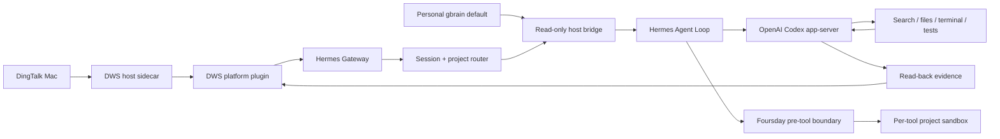

# Foursday V3 Architecture

Status: Gate 2 complete. Production is intentionally paused with both managed and native Gateways stopped and disabled; the native Hermes migration is not active.

## Decision

Foursday is a thin distribution on exact Hermes upstream `v2026.8.18` / `0.20.4`, not a new full Agent Runtime.

```text
Pinned Hermes upstream
+ zero Hermes core patches
+ one Foursday composition plugin with four profile-scoped components
+ Foursday Profile and Skills
+ product UI and independent high-risk exits
```

## Runtime topology



The host owns DWS, gbrain OAuth, and future high-risk credentials. Agent tool subprocesses own none of them.

## Upstream and extension boundary

`hermes/upstream.lock.json` binds the official credential-free HTTPS repository, full commit, release, Python range, MIT license, and license digest.

The native path does not modify `gateway/session.py`,
`gateway/platforms/base.py`, `gateway/run.py`, or any other Hermes core file.
The DWS adapter routes each turn and opens a Python `ContextVar` scope around
the official `handle_message` call. The Foursday `pre_tool_call` Hook reads that
scope, canonicalizes terminal and file paths into the registered project, and
blocks escape. The scope is reset after the turn, so concurrent sessions do not
share workspaces. The old locked three-file patch remains only in the stopped
managed-runtime recovery tree and is not packaged by the native Profile.

## DWS personal DingTalk

The Node sidecar reuses the existing DWS implementation and communicates with the Python platform plugin over JSON Lines. It receives only a narrow environment—never database, data-key, admin, or deployment secrets.

Key guarantees:

- stable staff/OpenDingTalk identity binding with explicit identity kind;
- allowlisted direct chats and allowlisted groups with explicit mention;
- 3-second quiet-window bundling, maximum 8 seconds from first message;
- 5,000-message persistent dedupe and recipient/session recovery;
- human-owner reply → `human_takeover` → Hermes interrupt;
- withdrawal audit with no message body;
- explicit server message id or bounded exact-content read-back;
- unknown delivery is non-retryable.

## Project routing

The registry contains only id, name, aliases, canonical local root, credential-free Git URL, gbrain slugs, optional run instructions, and isolation mode. Requesters, capabilities, business metrics, JSON pointers, approvals, and secrets are rejected.

The router keeps a private conversation binding, matches the longest safe alias, prevents file-path names from hijacking a Session, allows explicit natural-language project switches, and clarifies ambiguity instead of guessing.

## Personal gbrain

Personal PRIVATE gbrain Git is the only durable business-knowledge authority; its PostgreSQL database is a rebuildable index. The host bridge resolves only the dedicated memory secret and requires `default + read-only OAuth`. It retrieves exact routed pages, filters size/credentials/sensitive material, and injects them as untrusted private background.

Hermes Session DB stores conversation and tool history. Hermes `MEMORY.md` may store Agent-operational knowledge only. Foursday does not maintain a second project knowledge repository.

## Tool isolation and high-risk boundary

The model process retains model authentication. Every terminal tool call is rewritten through a macOS project sandbox:

- read system tools and the registered project only;
- write the project only when isolation is `workspace-write`;
- deny `.runtime`, `.env`, other projects, Keychain, and system control;
- deny terminal network;
- fail closed when registry/profile creation fails.

Direct file tools apply the same canonical-path checks. Web tools reject credential-like outbound queries.

The pre-tool boundary blocks push, merge, release, package publish, production deploy/SQL, irreversible deletion, launchctl/sudo/osascript, payment, contracts, HR actions, secret access, and irreversible commitments. DWS performs a final outbound secret/commitment check before delivery.

## Evidence and failure behavior

Evidence includes the routed workspace, source message IDs, tool calls and cwd, file hashes, tests, send receipt/server ID, and final reply. Gate 2 relies on Session DB, filesystem read-back, DWS read-back, and tests—not the model's completion claim.

| Failure | Behavior |
|---|---|
| Unknown identity | Drop before Session |
| Ambiguous project | Ask one clarification |
| gbrain unavailable | Work with current project but disclose missing long-term context |
| Tool boundary failure | Block |
| Unknown send | Do not retry; reconcile/read back |
| Human takeover | Interrupt and suppress stale output |
| Gateway restart | Restore dedupe, recipient, project, and workspace |

## Storage responsibilities

| Store | Responsibility |
|---|---|
| Personal gbrain Git | Durable business knowledge |
| gbrain PostgreSQL | Rebuildable retrieval/entity/graph index |
| Hermes Session DB | Conversation, tools, short-term execution |
| Foursday PostgreSQL | Compatibility state for the legacy production runtime |

## Install and migration

```bash
npm run hermes:setup
npm run hermes:setup -- --apply
```

The one-command installer verifies the official installer from the pinned full upstream commit, installs native Hermes, and installs a `foursday` Profile distribution. The Profile contains the DWS, project-router, personal-gbrain and hard-boundary plugins, Profile-owned host bridges and Skills. Project cwd is applied per turn through ContextVar plus the official `pre_tool_call` Hook, so the new path has zero Hermes core patches.

The currently deployed managed Gateway still uses the prior Application Support release and custom supervisor. The target uses the native profile-scoped `ai.hermes.gateway-foursday` service. Active migration still requires a send-disabled native shadow, DWS single-writer ownership, cursor continuity, evidence, and verified rollback. New and current Gateways must never auto-send to the same conversation concurrently.

## Module map

| Concern | Source |
|---|---|
| Upstream lock | `src/hermes-upstream.mjs`, `hermes/upstream.lock.json` |
| Native install/profile | `src/foursday-hermes-native-install.mjs`, `src/foursday-native-profile-config.mjs` |
| DWS sidecar/plugin | `src/hermes-dws-sidecar.mjs`, `hermes/plugins/dws_personal/` |
| Project router | `hermes/plugins/project_router/` |
| gbrain bridge/write lifecycle | `src/hermes-personal-memory-context.mjs`, `hermes/plugins/gbrain_memory/`, `src/personal-gbrain-*.mjs` |
| Hard boundary | `hermes/plugins/foursday_boundary/` |
| Native Gateway | `src/foursday-native-gateway.mjs`, `scripts/管理Foursday原生Gateway.mjs` |
| Shadow acceptance / native cutover | `src/hermes-shadow-acceptance.mjs`, `scripts/生成Hermes影子验收.mjs`, `src/foursday-native-cutover.mjs`, `scripts/管理Foursday原生Gateway.mjs` |
| Profile/Skill | `hermes/profile/`, `hermes/skills/` |
| Shadow/evidence tests | `hermes/shadow_runner.py`, `hermes/tests/`, `test/hermes-*.test.mjs` |

## Legacy runtime

The existing capability/plan/approval/budget/recipe/state-machine runtime remains the current production and an optional Enterprise / Governed Mode. It no longer defines the V3 personal architecture. See the Chinese [production runbook](../生产运维手册.md) and [status matrix](../完成度矩阵.md).
