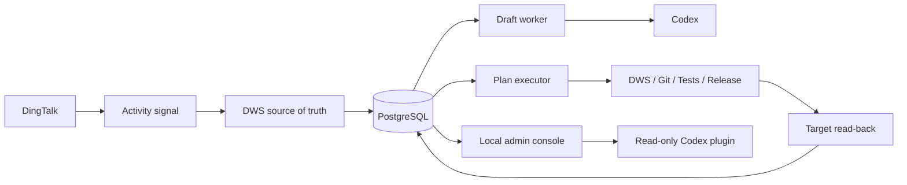
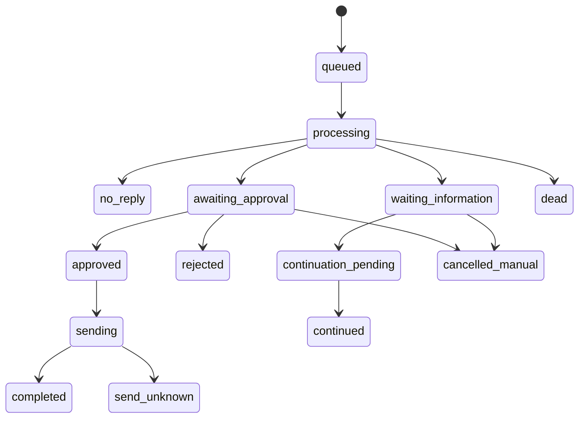
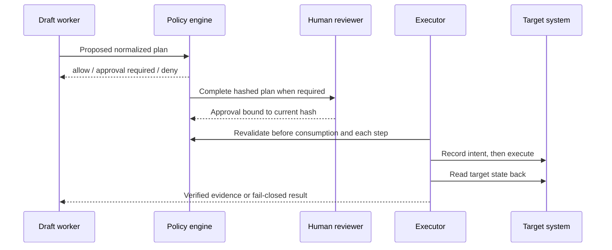

# Architecture

[Overview](./overview.md) · [简体中文技术设计](../技术设计文档.md)

## System shape

AI Employee separates fast message ingestion, slow model work, external side effects, and human control. PostgreSQL is the production state and evidence store; SQLite is retained for local development and parity testing.

## Main components

| Component | Responsibility |
|---|---|
| Listener | Fetch scoped messages through DWS, deduplicate them, reconcile gaps, and build bounded bundles |
| Draft worker | Decide ignore/clarify/reply/work, generate drafts, propose memory, and detect human takeover |
| Policy engine | Evaluate requester, project, capability, risk, target scope, expiry, and persistent run budget |
| Plan executor | Acquire leases, revalidate policy, run one step at a time, and persist evidence |
| Work adapters | Provide narrow interfaces for research, documents, code, Git, DingTalk work, and releases |
| Stores | Encrypt business content and enforce transactional state transitions in SQLite and PostgreSQL |
| Health and alerts | Track heartbeats, dead tasks, unknown sends, leases, message coverage, and SLO samples |
| Admin console | Expose local review and control with separate read/write tokens |
| Codex plugin | Present read-only status, drafts, plans, capabilities, and takeover information |

## Message lifecycle

Messages are received at least once and deduplicated by platform identity. Nearby messages from one conversation are bundled within a bounded quiet window, with a hard maximum from the first message. Explicit urgent input may close the bundle early.

Clarification chains reserve exactly one relevant continuation. Late-ingested messages that occurred before the question, ambiguous candidates, unrelated messages, expired waits, and human replies are handled without guessing.

## Work-plan lifecycle

A model may propose work, but the runtime builds and validates the executable plan. Approval binds the complete normalized plan, project authorization version, capability policy, and budget identity.

## Side-effect reliability

- Every external effect uses an idempotency key and a persisted intent record.
- A completed effect requires a corresponding ledger entry.
- Adapter success must be followed by target-system verification.
- Cancellation checks preserve evidence from an effect that may already have happened.
- Unknown outcomes enter an explicit reconciliation state and are never automatically replayed.

This provides at-least-once message handling with effect-level exactly-once behavior where the target and adapter support it.

## Security boundaries

- Sensitive business fields use AES-256-GCM encryption at rest.
- Production secrets come from Keychain or controlled environment references, never repository files.
- Codex, DWS, candidate code, and release checks receive minimal child-process environments.
- Paths, commands, remotes, document targets, people, templates, and time ranges are allowlisted.
- The local console binds to loopback and separates read and write credentials.
- Release artifacts are tied to an exact Git SHA and rechecked before activation.

## Observability and readiness

Liveness, service availability, strict business readiness, and rollout acceptance are different results:

| Result | Meaning |
|---|---|
| Liveness | The process is running |
| Service available | Required components and the target release can serve safely |
| Business ready | No dead tasks, failed plans, unknown sends, expired leases, or other strict blockers |
| Rollout accepted | Quality samples, long-window SLOs, side-effect evidence, and memory conflict gates pass |

For the complete entity model, SQL schema, concurrency rules, tests, and architecture decisions, see the [Chinese production design](../技术设计文档.md).
