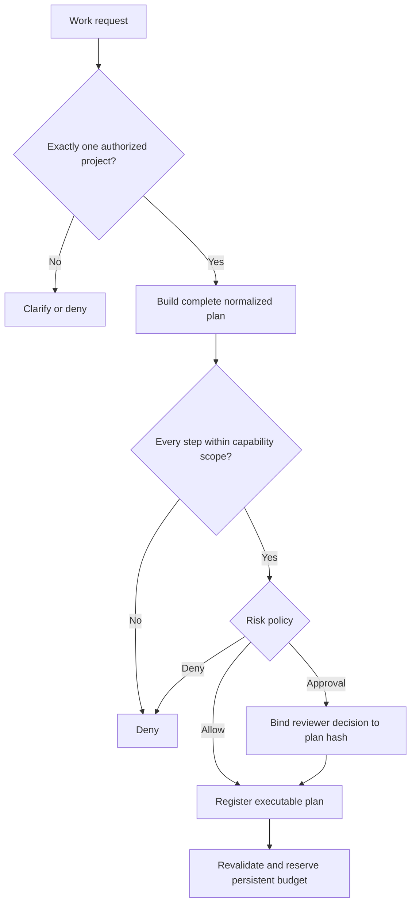
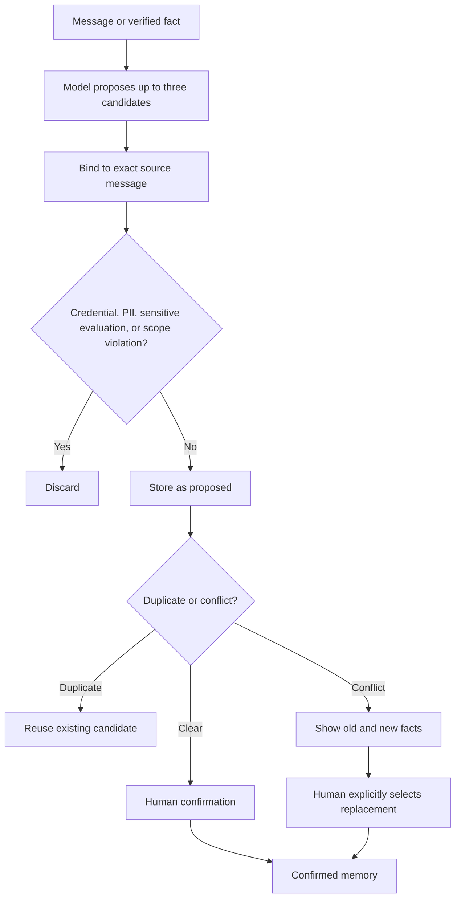

# Capabilities and Memory

[Overview](./overview.md) · [简体中文能力与记忆](../能力清单与正式记忆.md)

## Capability is not permission

AI Employee separates three concepts:

1. **Implemented capability** — an adapter and verifier exist in the codebase.
2. **Configured capability** — a project manifest defines who, what, where, when, and how often it may be used.
3. **Enabled runtime capability** — global switches and current production policy allow execution.

The model cannot move an action between these layers. A chat message never grants permission.

## Capability classes

| Class | Examples | Typical control |
|---|---|---|
| Read-only reasoning | Research, knowledge-page reading, status summaries | Project scope and source allowlist |
| Reversible local work | Document drafts, isolated patches, fixed test commands | Workspace and command allowlists |
| External collaboration | Shared documents, tasks, calendars, rooms, reports | Fixed people, targets, templates, and approval |
| Git changes | Pushes and release preparation | Fixed repository, branch, remote, and exact evidence |
| Production changes | Backups, migrations, service activation | Exact SHA, cloud gates, operator approval, rollback boundary |
| Prohibited automation | Expanding permissions or making approval decisions for people | Always denied |

## Project manifest

A project manifest binds authorization to a specific project rather than to the model session. It includes:

- project identity and allowed requesters;
- capability names and risk levels;
- allowed paths, commands, remotes, people, documents, templates, and time ranges;
- authorization validity and persistent run budgets;
- approval policy and required verification evidence.

Changes to relevant manifest data invalidate prior plan approval hashes.

## Plan controls

An executor checks global pause, capability pause, project authorization, human takeover, cancellation, lease ownership, and budget availability before work and again before each external effect.

## Formal memory

Memory is governed data, not an automatically growing prompt transcript.

### Candidate lifecycle

Candidates are limited to person, project, and operating-principle facts. They carry source identity, sensitivity, expiry, creator, tenant, and project scope. Source validity is checked again at confirmation and retrieval time.

### Memory retrieval

Only confirmed, unexpired, non-revoked memory with a valid source and matching project/tenant scope may enter a draft context. Credentials, private keys, tokens, phone numbers, email addresses, identity numbers, financial identifiers, health data, and sensitive person evaluations are rejected from automatic candidates.

### Correction and erasure

- Conflicting facts require an explicit replacement action; ordinary confirmation cannot silently overwrite memory.
- Revocation removes a fact from retrieval immediately.
- Privacy erasure previews and binds the exact current data snapshot before deletion.
- Security counters such as capability-budget usage are not reset by time-based privacy erasure.

## Human takeover

The runtime checks for manual replies before generation, after generation, during planning, before registration, before sending, and while active plans exist. A takeover cancels pending work or requests a safe stop for executing work. Business pause does not disable this safety reconciliation.

For the exhaustive capability fields, CLI examples, memory conflict rules, and current production boundaries, see the [Chinese capability and memory guide](../能力清单与正式记忆.md).
