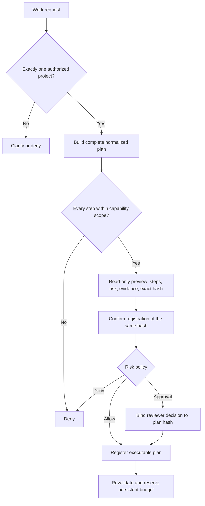
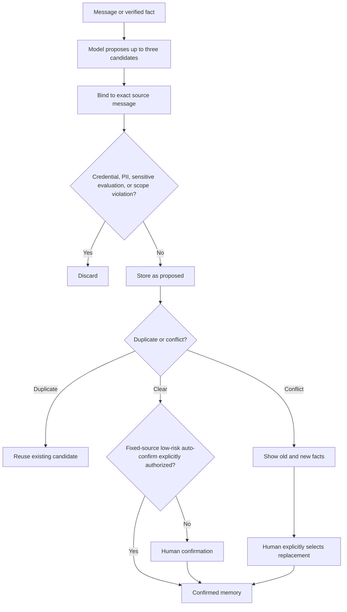

# Capabilities and Memory

[Overview](./overview.md) · [简体中文能力与记忆](../能力清单与正式记忆.md)

## Capability is not permission

Foursday separates three concepts:

1. **Implemented capability** — an adapter and verifier exist in the codebase.
2. **Configured capability** — a project manifest defines who, what, where, when, and how often it may be used.
3. **Enabled runtime capability** — global switches and current production policy allow execution.

The model cannot move an action between these layers. A chat message never grants permission.

## Capability classes

| Class | Examples | Typical control |
|---|---|---|
| Read-only reasoning | Research, knowledge-page reading, status summaries | Project scope and source allowlist |
| Reversible local work | Document drafts, isolated patches, fixed test commands | Workspace and command allowlists |
| External collaboration | Shared documents, tasks, calendars, rooms, reports | Fixed people, targets, templates, and approval |
| Git changes | Pushes and release preparation | Fixed repository, branch, remote, and exact evidence |
| Production changes | Backups, migrations, service activation | Exact SHA, cloud gates, operator approval, rollback boundary |
| Prohibited automation | Expanding permissions or making approval decisions for people | Always denied |

## Project manifest

A project manifest binds authorization to a specific project rather than to the model session. It includes:

- project identity and allowed requesters;
- capability names and risk levels;
- allowed paths, commands, remotes, people, documents, templates, and time ranges;
- authorization validity and persistent run budgets;
- approval policy and required verification evidence.

Changes to relevant manifest data invalidate prior plan approval hashes.

The personal cockpit separates inspection from mutation. Its recipe-preview
endpoint needs only the read token and cannot register a plan. Registration
requires the write token plus the exact previewed 64-character plan hash; any
recipe, input, requester, or authorization change produces a mismatch and must
be reviewed again. A successful cockpit registration always enters approval,
so it cannot auto-execute even when global plan execution is enabled.

## Plan controls



An executor checks global pause, capability pause, project authorization, human takeover, cancellation, lease ownership, and budget availability before work and again before each external effect.

Step order does not imply data flow. A `research`, `document_draft`, or
`code_patch` step must declare `inputs.knowledgeStepIds` for earlier exact-slug
knowledge reads and `inputs.evidenceStepIds` for earlier repository activity,
same-project governed work history, research, or document artifacts. The
executor accepts only completed, type-matching evidence
within bounded count and content limits. Missing, later, duplicate, forged, or
oversized references fail closed. A project-recipe shadow also passes only the
historical-import source paths that were already verified as its evidence scope.

## Formal memory

Memory is governed data, not an automatically growing prompt transcript.

The personal cockpit exposes historical-project import as the same two-phase
contract as the CLI. A local JSON bundle is parsed in the browser, while the
loopback service re-reads only its declared project-relative source files. The
read-token preview shows candidates, skips, duplicates, conflicts, and the
current digest without creating a project or memory. Apply requires the write
token and the exact typed `IMPORT-...` value, rechecks source and database state,
and creates proposed memory only. It never confirms memory or touches an
external system.

### Candidate lifecycle



Candidates are limited to person, project, and operating-principle facts. They carry source identity, sensitivity, expiry, creator, tenant, and project scope. Source validity is checked again at confirmation and retrieval time.

### Memory retrieval

Only confirmed, unexpired, non-revoked memory with a valid source and matching project/tenant scope may enter a draft context. Credentials, private keys, tokens, phone numbers, email addresses, identity numbers, financial identifiers, health data, and sensitive person evaluations are rejected from automatic candidates.

### Correction and erasure

- Conflicting facts require an explicit replacement action; ordinary confirmation cannot silently overwrite memory.
- Revocation removes a fact from retrieval immediately.
- Privacy erasure previews and binds the exact current data snapshot before deletion.
- Security counters such as capability-budget usage are not reset by time-based privacy erasure.

### Historical project import

Foursday can onboard an existing Git repository and import selected historical
facts without copying its whole archive into the prompt. Start from
[`examples/historical-project-import.json`](../../examples/historical-project-import.json).
Each candidate must reference a regular text file inside the canonical project
root and include a short quote that is actually present in that file. The
preview binds the project manifest, source hashes, quote hashes, accepted
candidates, duplicates, conflicts, and skipped reasons into one confirmation
digest.

```bash
# Read-only preview. No manifest or memory is written.
AI_EMPLOYEE_CONFIG_FILE=.runtime/production.json \
  npm run projects:import -- --bundle /absolute/path/history-import.json

# Re-run against current files and database state, then create only proposed memories.
AI_EMPLOYEE_CONFIG_FILE=.runtime/production.json \
  npm run projects:import -- --bundle /absolute/path/history-import.json \
  --apply --confirmation IMPORT-XXXXXXXXXXXX
```

Import rejects path traversal, symlinks, missing quotes, credential-shaped
material, and sensitive person data. It is idempotent across retries. A
conflict remains `proposed` until the owner explicitly chooses which confirmed
fact it replaces. Long documents may remain in gbrain and be referenced through
the existing exact-slug project authorization instead of being copied into
formal memory.

### Project recipe shadow validation

After previewing an historical import, a user can rehearse one of the project's
selected recipes without opening production execution. The default command
validates the source snapshot, clean Git commit, recipe inputs, capability
policy, and plan hash. It does not invoke a model or create files:

```bash
npm run projects:shadow -- \
  --bundle /absolute/path/history-import.json \
  --recipe project-follow-up \
  --values /absolute/path/recipe-values.json
```

An explicit `--run` invokes the chosen Codex or Claude Code read-only runtime
and requires a new canonical output directory:

```bash
npm run projects:shadow -- \
  --bundle /absolute/path/history-import.json \
  --recipe project-follow-up \
  --values /absolute/path/recipe-values.json \
  --output /absolute/path/new-shadow-evidence \
  --runtime codex --run
```

The shadow boundary permits only deterministic `repository_activity_read`,
`project_work_history_read`, `research`, and `document_draft`. The daily-report
graph binds one date window to exact Git activity and same-project terminal
plan/read-back metadata before both explicit evidence edges reach research.
Shadow work history is read only from its isolated ledger. Code, memory,
messaging, office, Git writes, and deployment
capabilities fail closed. It rechecks
the exact clean Git commit and historical-source digest after execution. The
mode-`600` isolated ledger, full evidence JSON, failure record, and review note
never connect to the production database or write to a business system. The
agent runtime may still access its configured model service; zero business
side effects does not mean offline execution. No memory or time-return row is
created. The baseline remains `awaiting_user_review_time` until the user reports
their actual post-AI review, verification, correction, and editing time.

The run prints the evidence SHA-256 and a derived `REVIEW-...` confirmation
code. After reading the delivery, the user can record their actual active
minutes in the isolated ledger:

```bash
npm run projects:shadow -- \
  --review /absolute/path/new-shadow-evidence \
  --evidence-sha256 64_HEX \
  --human-minutes 10 \
  --confirm REVIEW-FIRST12
```

This verifies the immutable evidence JSON against the encrypted local ledger,
reuses the same time-return calculation as production, and writes a mode-`600`
local confirmation record. It remains idempotent and never connects to or
updates the production time-return ledger.

The post-RC candidate adds a separate admission boundary. Its default remains
zero-write and rechecks the evidence JSON, isolated SQLite plan and steps,
owner confirmation, authorized project, selected recipe, and unchanged recipe
baseline:

```bash
npm run projects:shadow:admit -- \
  --evidence-directory /absolute/path/new-shadow-evidence \
  --evidence-sha256 64_HEX
```

Only after migration 022 is deployed can an operator explicitly add
`--apply --confirmation ADMIT-FIRST12`. The evidence SHA makes retries
idempotent. Admission creates one confirmed shadow-evidence time-return row;
it does not copy the isolated plan into production, create memory, send a
message, or invoke any office, Git, or deployment adapter. The cockpit combines
confirmed production-plan and shadow-evidence minutes while reporting their
source counts separately. This admission path is currently a local post-RC
candidate, not part of `v0.6.0-rc.1` or production.

### Automatic project-memory sync

Manual import is the bootstrap path, not the steady-state workflow. A project
can grant `project_memory_proposal` once and pin the exact source files, allowed
fact-key prefixes, maximum retention, and whether low-risk facts may be
confirmed automatically:

```json
{
  "mode": "automatic",
  "expiresAt": "2026-11-11T00:00:00.000Z",
  "allowedFactKeyPrefixes": ["decision.", "principle.", "milestone."],
  "maxRetentionDays": 90,
  "sourcePaths": ["README.md", "docs/decisions.md"],
  "autoConfirm": true
}
```

Writes require two independent gates: the global
`AI_EMPLOYEE_ALLOWED_CAPABILITIES` list must include
`project_memory_proposal`, and the individual project manifest must carry the
bounded rule above. The default global configuration does not include it.

```bash
# Invoke the selected agent read-only and show a source-bound preview.
AI_EMPLOYEE_CONFIG_FILE=.runtime/production.json \
  npm run projects:memory:sync -- --project my-project --runtime codex

# Apply the already-authorized policy. This does not send messages or run plans.
AI_EMPLOYEE_CONFIG_FILE=.runtime/production.json \
  npm run projects:memory:sync -- --project my-project --runtime codex --apply
```

Only copies of the fixed project-relative files are staged in the agent's
temporary working directory. Every output still passes exact-quote,
file-digest, credential, PII, scope, prefix, retention,
duplicate, and conflict checks. `autoConfirm` applies only to confidence-1,
non-confidential, conflict-free facts. Conflicts, sensitive output, source
changes, and policy violations fail closed or stay in the review queue. With
`approval_required`, applying a sync still requires the current `SYNC-...`
preview confirmation. Scheduling this command is optional and never enables
message sending, work-plan execution, or proactive work by itself.

The personal cockpit uses the same policy with an additional anti-tampering
boundary. Before invoking a model, the owner can configure this policy without
editing JSON. The dual-token, zero-write settings preview binds the current manifest,
regular non-symlink source files and their hashes, fact prefixes, retention,
an authorization expiry no more than 365 days away, and auto-confirm policy to
an exact `MEMORY-AUTH-...` confirmation. Apply requires the write token,
recomputes the preview, and atomically replaces only the `0600` project
manifest. It never adds `project_memory_proposal` to the global capability
gate, so project configuration alone cannot start the worker.

Generating a memory preview is a separate explicit write-token action because it
invokes the configured model service, although it writes no database state.
The generated bundle stays only in server memory for ten minutes; the browser
receives a bounded summary and an opaque preview ID. Apply is single-use,
rechecks the current project, sources, memories, and global gate, and then
follows the already-authorized automatic-confirm or review-required policy.
The resulting proposed memories are reviewed in the same project card. The
dashboard returns at most 20 candidates from that project, never candidates
from another project. Ordinary confirmation and rejection require the write
token. A conflicting candidate shows the current formal statement and can be
confirmed only through an explicit replacement action bound to that memory ID;
an existing duplicate is shown as non-confirmable.

For a continuous local loop, run the dedicated worker. It hashes authorized
sources before invoking a model, skips unchanged projects, and advances its
checkpoint only after a successful database update:

```bash
AI_EMPLOYEE_CONFIG_FILE=.runtime/production.json \
  npm run projects:memory:watch -- --interval-minutes 60
```

The worker does not load project manifests or invoke a model while the global
capability is disabled, and ignores projects whose project-level memory mode is
not `automatic`. An expired project authorization is skipped before source
inspection or model invocation; the manual preview path enforces the same
expiry boundary.

## Human takeover

The runtime checks for manual replies before generation, after generation, during planning, before registration, before sending, and while active plans exist. A takeover cancels pending work or requests a safe stop for executing work. Business pause does not disable this safety reconciliation.

## Recipes, proactive work, and project memory

Recipes are versioned plan templates, not permissions. The built-in library
contains daily reporting, project follow-up, meeting follow-up, and code
delivery. Inputs are schema-validated, secret-shaped values are rejected, and
the recipe identity is bound into the plan hash.

The personal cockpit renders every typed recipe input in one work-handoff form
instead of collecting fields through sequential prompts. Manual work proceeds
from a zero-write full-plan preview to a separate exact-hash registration.
Scheduled work uses the same preview and also reviews its first run, interval,
daily limit, and cooldown before saving; creation rejects a stale reviewed plan
hash.

Proactive triggers are always created disabled. Enabling requires the global
capability, while every run still revalidates requester, project, recipe,
budget, cooldown, risk, and approval. A meeting decision becomes only a
source-bound `proposed` project memory item; it cannot be retrieved until a
person confirms it. Time returned is counted only for a completed recipe plan
with complete evidence and a separate human confirmation.

The GitHub delivery recipe ends at a Draft PR. Merge, production deployment,
and repository expansion remain separate capabilities and approvals.

For the exhaustive capability fields, CLI examples, memory conflict rules, and current production boundaries, see the [Chinese capability and memory guide](../能力清单与正式记忆.md).
