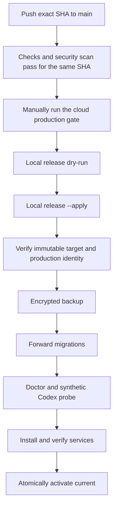

# Deployment

> Scope: an intentionally paused installation plus a send-disabled native Hermes candidate. Neither Gateway is an active sender. Review the Chinese status matrix and Gate 2 report before any single-writer migration.

> Rename compatibility: new installations use the Foursday CLI, plugin,
> service labels, release root, and Keychain namespace. Existing `0.x`
> installations may keep `AI_EMPLOYEE_*` configuration keys and legacy secret
> references; the release tooling validates and migrates them without exposing
> values.

[Overview](./overview.md) · [简体中文生产运维手册](../生产运维手册.md)

> This guide explains the public deployment model. The Chinese operations manual remains the authoritative runbook for the current production installation.

## Safe local validation

Repository validation does not require DingTalk, production PostgreSQL, or Codex credentials:

```bash
git clone https://github.com/ruiwang20010702/foursday.git
cd foursday
npm ci
npm run check
```

Run the full isolated PostgreSQL suite when changing migrations, concurrency, storage parity, or production release behavior:

```bash
npm run check:full
```

## Runtime requirements

- a logged-in macOS user session with DingTalk Desktop;
- Node.js 22.5 or later;
- PostgreSQL 16 or 17;
- authenticated DWS and Codex CLI;
- `pg_dump` and `pg_restore` pinned by absolute path in production configuration;
- gbrain only when project knowledge-page access is enabled.

## One-command local installation

The public source installation is a single copy-paste command:

```bash
git clone https://github.com/ruiwang20010702/foursday.git && cd foursday && npm ci --ignore-scripts && npm run hermes:setup -- --apply
```

For an existing checkout, `npm run hermes:setup` is a zero-write preview and
`npm run hermes:setup -- --apply` verifies and runs the official Hermes
installer from the locked full upstream commit. It then installs the isolated
`foursday` Profile distribution through `hermes profile install` and validates
all four plugins through the native doctor surface. Foursday no longer vendors
or patches the Hermes core.

Credentials are deliberately outside the installer. Codex login, message
adapter authentication, and personal-memory authorization belong to the user
and cannot be safely copied or invented. The installer never starts the
Gateway, sends a message, changes production, or enables active mode.

Configure and install the native send-disabled service as separate stages:

```bash
npm run hermes:configure -- --apply --registry /absolute/private/projects.json --cron
npm run hermes:gateway -- install-shadow --apply
npm run hermes:gateway -- start-shadow --apply
```

Profile updates fail closed while the Gateway is running. Before replacing an
existing Profile, the installer creates a private official export and restores
it with `hermes profile import` if any install, dependency, or doctor step
fails. Use `npm run hermes:gateway -- remove-profile` for a zero-write uninstall
preview and append `--apply` to remove only the Foursday service, alias, Profile,
and bundled plugins. Native Hermes, production configuration, and personal
gbrain are preserved. Activation additionally requires a private, non-stale
shadow acceptance receipt, the same full release SHA, and the derived
`ACTIVATE-HERMES:...` confirmation. Profile removal apply requires the separate
`REMOVE-FOURSDAY-PROFILE` confirmation.

The former `hermes:prepare`, `hermes:patch`, and `hermes:install` commands are
temporary rollback compatibility for the currently deployed managed Gateway,
not the new installation path.

## Legacy governed-runtime compatibility

The old package initializer, independent Markdown overlay, non-federated
`foursday-*` gbrain source, Node listener/worker/executor, and versioned local
release controller are retained only for recovery of existing `0.x`
installations. They are not part of a new native Profile install and must not be
used to create a second long-term knowledge base. New installations read the
owner's `default` personal gbrain through the host bridge; durable automatic
facts enter an encrypted candidate queue and are promoted through a dedicated
checkout of the same PRIVATE personal gbrain Git repository.

## Legacy governed-runtime production sequence

The manual sequence below documents the gates. Prefer the versioned local release controller for an actual production upgrade.

```bash
export AI_EMPLOYEE_CONFIG_FILE="$PWD/.runtime/production.json"
npm ci
npm run production:preflight
npm run db:backup
npm run db:migrate
npm run production:doctor
npm run production:agent-probe
npm run service:install
npm run production:service-verify
npm run production:verify
npm run shadow:verify
```

Only `db:migrate` changes database structure. Preflight and doctor are read-only; the Codex probe uses synthetic input; service verification and strict business readiness are intentionally separate.

## Exact-SHA release flow



Example local controller invocation:

```bash
npm run release:local -- \
  --sha REPLACE_WITH_APPROVED_FULL_SHA \
  --root /absolute/path/foursday-production \
  --config /absolute/path/production.json

npm run release:local -- \
  --sha REPLACE_WITH_APPROVED_FULL_SHA \
  --root /absolute/path/foursday-production \
  --config /absolute/path/production.json \
  --apply
```

The controller verifies the official repository, clean checkout, exact SHA, cloud results, immutable artifact, production identity, previous release, configuration permissions, backup, migration state, services, and final activation. It records a protected pending journal so interrupted releases are reconciled before another release begins.

## Forward-only migration boundary

If the target contains migration 018 and the previous service does not support it, ordinary `--apply` stops before production configuration, backup, migration, or service changes. Migration 018 prevents older services from creating executable plans without persistent capability budgets.

Crossing that boundary requires a separately authorized maintenance-forward workflow. It pauses production, proves there is no in-flight work, stops old services, verifies an encrypted restore, migrates, installs only the target, and remains paused after activation. Failure never restores the incompatible old service; recovery must continue forward.

Do not use the maintenance-forward mode unless you have read and accepted the complete [Chinese production runbook](../生产运维手册.md).

## Secrets

- Never commit production secrets or resolved Keychain values.
- Use Keychain or controlled environment references for database, encryption, backup, admin, health, and webhook credentials.
- Keep configuration files at mode `600` and deployment directories private to the login user.
- Child processes receive minimal environments; release checks do not inherit GitHub, database, or admin tokens.

## Local browser login

The loopback console keeps independent read/write tokens for CLI and API compatibility, but a browser owner can use one username or email plus a password across both `/` and `/projects`. When no owner exists, `/` shows a one-time registration page with a login identifier, optional email alias, password confirmation, and one ownership check using the existing read/write tokens. Success atomically stores only a salted scrypt verifier in the mode-`600` production configuration, signs the owner in immediately, and permanently closes registration. The password and bootstrap tokens are not persisted by the page.

For headless setup or recovery, run `npm run config:set-admin-login -- --identifier owner --identifier owner@example.com`, review the zero-write result, then repeat with `--apply`. Password input is hidden; this CLI path requires a service restart, while browser registration does not.

Password login creates an in-memory session for up to eight hours using an `HttpOnly`, `SameSite=Strict` cookie. Session writes also require a CSRF token, five failed logins trigger a 15-minute limit, and restart/logout/expiry revokes the session. Exact plan hashes, import digests, and other content-bound confirmations remain mandatory.

## Verification levels

| Command or result | What it proves |
|---|---|
| `production:preflight` | Configuration, tools, authorization, and migration plan are readable |
| `production:doctor` | Strict runtime dependencies and applied schema are compatible |
| `production:service-verify` | The target release and required services are safely available |
| `production:verify` | Strict business blockers are absent |
| `shadow:verify` | Quality, long-window SLO, effect evidence, and memory gates allow rollout |

A deployed release may be service-available while business readiness is false.
Deployment never turns on real sending or plan execution automatically. An
operator who opts into unattended replies must configure the low-risk master
gate plus separate group and clarification gates. Group auto-approval still
requires an allowlisted explicit mention, and group clarifications remain
approval-bound.

Production reads the operator's existing personal gbrain through a dedicated
OAuth client. Configure `AI_EMPLOYEE_PERSONAL_MEMORY_ENABLED=true`, credential-
free HTTPS MCP and issuer URLs, a client ID, and an externally injected client
secret. The server identity must read back as OAuth, source `default`, and
scope `read` without `write` or `admin`. Do not configure the legacy Foursday
`GBRAIN_HOME`, gbrain database URL, authority root, or overlay writes at the
same time.

## V2.3 deployed-code rollout boundary

The personal cockpit, recipes, proactive worker, meeting loop, GitHub Draft PR
adapter, migrations 019/020/021, governed graph projection, and community contracts were deployed in
production commit `6b30c22f97b19c6cfd30bf162b3f85000fa2bde9` after both cloud gates and
running-service read-back passed. Deployment never
enables `proactive_work`, sending, or work-plan execution. Triggers remain
disabled unless a separate business rollout explicitly enables them.

Slack, Teams, Gmail, and Google Workspace examples have no production service
to deploy. Operators must not add their runtime secret names to production
configuration until a reviewed implementation and credential procedure exist.
