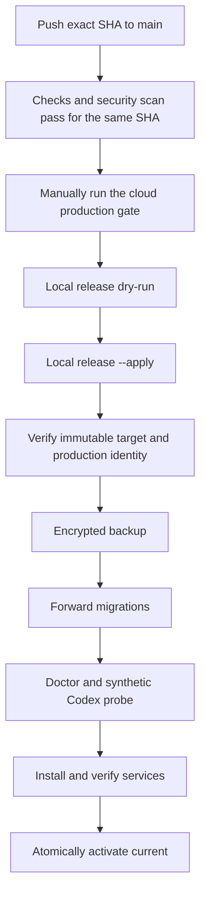

# Deployment

[Overview](./overview.md) · [简体中文生产运维手册](../生产运维手册.md)

> This guide explains the public deployment model. The Chinese operations manual remains the authoritative runbook for the current production installation.

## Safe local validation

Repository validation does not require DingTalk, production PostgreSQL, or Codex credentials:

```bash
git clone https://github.com/ruiwang20010702/ai-employee.git
cd ai-employee
npm ci
npm run check
```

Run the full isolated PostgreSQL suite when changing migrations, concurrency, storage parity, or production release behavior:

```bash
npm run check:full
```

## Runtime requirements

- a logged-in macOS user session with DingTalk Desktop;
- Node.js 22.5 or later;
- PostgreSQL 16 or 17;
- authenticated DWS and Codex CLI;
- `pg_dump` and `pg_restore` pinned by absolute path in production configuration;
- gbrain only when project knowledge-page access is enabled.

## Install an immutable revision

Never deploy from a mutable branch name. Install a reviewed full commit SHA in a clean workspace:

```bash
npm init -y
npm install "github:ruiwang20010702/ai-employee#REPLACE_WITH_APPROVED_FULL_SHA"
npx --no-install ai-employee check
npx --no-install ai-employee init
npx --no-install ai-employee init --apply
npx --no-install ai-employee secrets
npx --no-install ai-employee secrets --apply
```

Mutating setup commands are preview-only without `--apply`. Initialization refuses to overwrite an existing configuration and stores only workspace-specific Keychain references in a mode-`600` file.

## Production safety sequence

The manual sequence below documents the gates. Prefer the versioned local release controller for an actual production upgrade.

```bash
export AI_EMPLOYEE_CONFIG_FILE="$PWD/.runtime/production.json"
npm ci
npm run production:preflight
npm run db:backup
npm run db:migrate
npm run production:doctor
npm run production:codex-probe
npm run service:install
npm run production:service-verify
npm run production:verify
npm run shadow:verify
```

Only `db:migrate` changes database structure. Preflight and doctor are read-only; the Codex probe uses synthetic input; service verification and strict business readiness are intentionally separate.

## Exact-SHA release flow



Example local controller invocation:

```bash
npm run release:local -- \
  --sha REPLACE_WITH_APPROVED_FULL_SHA \
  --root /absolute/path/ai-employee-production \
  --config /absolute/path/production.json

npm run release:local -- \
  --sha REPLACE_WITH_APPROVED_FULL_SHA \
  --root /absolute/path/ai-employee-production \
  --config /absolute/path/production.json \
  --apply
```

The controller verifies the official repository, clean checkout, exact SHA, cloud results, immutable artifact, production identity, previous release, configuration permissions, backup, migration state, services, and final activation. It records a protected pending journal so interrupted releases are reconciled before another release begins.

## Forward-only migration boundary

If the target contains migration 018 and the previous service does not support it, ordinary `--apply` stops before production configuration, backup, migration, or service changes. Migration 018 prevents older services from creating executable plans without persistent capability budgets.

Crossing that boundary requires a separately authorized maintenance-forward workflow. It pauses production, proves there is no in-flight work, stops old services, verifies an encrypted restore, migrates, installs only the target, and remains paused after activation. Failure never restores the incompatible old service; recovery must continue forward.

Do not use the maintenance-forward mode unless you have read and accepted the complete [Chinese production runbook](../生产运维手册.md).

## Secrets

- Never commit production secrets or resolved Keychain values.
- Use Keychain or controlled environment references for database, encryption, backup, admin, health, and webhook credentials.
- Keep configuration files at mode `600` and deployment directories private to the login user.
- Child processes receive minimal environments; release checks do not inherit GitHub, database, or admin tokens.

## Verification levels

| Command or result | What it proves |
|---|---|
| `production:preflight` | Configuration, tools, authorization, and migration plan are readable |
| `production:doctor` | Strict runtime dependencies and applied schema are compatible |
| `production:service-verify` | The target release and required services are safely available |
| `production:verify` | Strict business blockers are absent |
| `shadow:verify` | Quality, long-window SLO, effect evidence, and memory gates allow rollout |

A deployed release may be service-available while business readiness is false. Deployment never turns on real sending or plan execution automatically.
