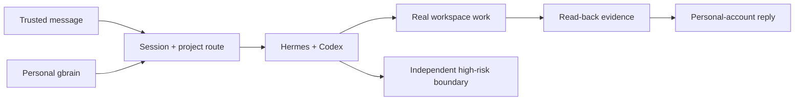

# Foursday Documentation Map

Foursday is a personal-memory-driven Hermes work twin. This page maps canonical documentation; it does not duplicate live status.

## Canonical owners

| Question | Canonical source |
|---|---|
| What is the product and how is it accepted? | [Product requirements](./product-requirements.md) |
| What exists and how does it work? | [Architecture](./architecture.md) |
| What is currently complete or intentionally removed? | [Chinese status matrix](../完成度矩阵.md) |
| What passed Gate 2? | [Gate 2 report](../自主工作分身迁移验收报告.md) |
| Why did the runtime change? | [Migration decision](../自主工作分身架构迁移方案.md) |
| How does current production run? | [Legacy production runbook](../生产运维手册.md) |
| What rules must contributors obey? | [Security](../../SECURITY.md), [Contributing](../../CONTRIBUTING.md) |

## Architecture at a glance

## Code map

| Need | Source |
|---|---|
| Hermes upstream/patch | `src/hermes-upstream.mjs`, `src/hermes-patches.mjs`, `hermes/patches/` |
| DWS personal DingTalk | `src/hermes-dws-sidecar.mjs`, `hermes/plugins/dws_personal/` |
| Project routing | `hermes/plugins/project_router/` |
| Personal gbrain | `src/hermes-personal-memory-context.mjs` |
| Tool isolation/high risk | `hermes/plugins/foursday_boundary/` |
| Profile and Skills | `hermes/profile/`, `hermes/skills/` |
| Candidate install | `scripts/准备Hermes候选.mjs`, `scripts/准备Hermes补丁层.mjs`, `scripts/安装Hermes发行层.mjs` |
| Legacy production | `src/listener.mjs`, `src/worker.mjs`, `src/plan-executor.mjs` |

## State boundary

- Tagged public preview and production still use the legacy Node.js runtime.
- The local Hermes V3 candidate has complete P0/Gate 2 evidence.
- Hermes Gateway is stopped and the candidate is not deployed.
- Production `/ready` has a pre-existing 503 and must be handled independently.
