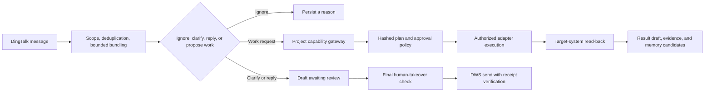

# AI Employee Overview

[Project home](../../README.md) · [简体中文设计总览](../设计总览.md)

## One sentence

AI Employee is a safety-first DingTalk agent runtime that decides when to respond, proposes project-scoped work, requests approval, executes authorized tools, reads the target system back, and retains only auditable memory.

## Why it exists

Text generation is only one part of workplace automation. A production agent must also answer harder questions:

- Should this message receive a reply at all?
- Is the requester allowed to ask for this action?
- Does the current project authorize the capability, target, time window, and run count?
- Which actions require a human approval bound to the exact plan?
- Did the external system actually change as intended?
- What should happen when a person takes over or the outcome is unknown?
- Which facts may become long-term memory, and who confirms them?

AI Employee makes these questions explicit in code, storage, tests, and operational gates.

## End-to-end flow

## Core principles

1. **Default deny.** Message content and model output never create permission.
2. **Humans remain in control.** Approval, rejection, pause, cancellation, and takeover are first-class states.
3. **External facts beat model claims.** A tool response is not enough; the target must be read back.
4. **Unknown outcomes fail closed.** Side effects with uncertain results are not replayed automatically.
5. **Memory is governed data.** The model may propose candidates, but only a human can confirm formal memory.

## What it can do

| Area | Examples | Boundary |
|---|---|---|
| Messaging | Ignore, clarify, draft replies, summarize current capabilities | Draft-only by default |
| Project work | Research, documents, code patches, tests, Git, release planning | Project manifest required |
| DingTalk work | Documents, tasks, calendars, rooms, reports | Fixed targets and read-back |
| Memory | Person, project, and principle candidates | Source-bound and human-confirmed |
| Operations | Health, alerts, backups, migration checks, immutable releases | Separate deployment approval |

Implemented capability does not mean enabled capability. Production environments start with `draft_reply`; sending and work-plan execution have separate global switches and project-level authorization.

## What it is not

- It is not a general-purpose chatbot that responds to every message.
- It does not silently impersonate the user; AI-originated DingTalk messages retain a transparent marker.
- It does not allow a prompt to expand contacts, projects, files, commands, or production access.
- It does not treat deployment success as business readiness or automatic rollout approval.
- It does not auto-confirm memory or auto-resolve dead tasks.

## Read next

- [Architecture](./architecture.md)
- [Capabilities and memory](./capabilities.md)
- [Deployment](./deployment.md)
- [Security policy](../../SECURITY.md)
- [Contributing](../../CONTRIBUTING.md)

The Chinese documents remain the most detailed source for product rules, state transitions, and production operations.
