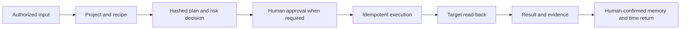

# Product Requirements

[Project home](../../README.md) · [Detailed Chinese PRD](../产品需求文档.md)

## Outcome

Foursday is a personal work twin whose north-star metric is verified time
returned to its user. The product does not optimize for message volume, task
count, team surveillance, or silent impersonation.

## Current scope

| Priority | Capability | Acceptance boundary |
|---|---|---|
| P0 | Project onboarding | Safe project draft in ten minutes; side effects disabled |
| P0 | Recipe library | Five versioned, schema-validated recipes |
| P0 | Project recipe shadow | Preview is zero-write; explicit local run permits only research/document drafts on one clean Git snapshot; post-delivery review can record actual minutes only in the SHA-bound isolated ledger and creates no production memory or time record |
| P0 | Project cockpit | Goals, milestones, plans, evidence, deliverables, memory, triggers |
| P0 | Weekly delegation queue | Close the remaining eight-hour goal with project-selected recipes ranked only by user-confirmed outcomes; the local cockpit and read-only Codex tool never bypass execution policy |
| P0 | Time returned | Show bounded delivery content first; record the user's actual post-AI review/edit time, then require separate confirmation |
| P1 | Proactive mode | Disabled by default, idempotent, daily/cooldown limits |
| P1 | Meeting to execution | Notes to document, proposed memory, task, and calendar |
| P1 | GitHub delivery | Patch, branch, tests, push, Draft PR; never auto-merge |
| P2 | Community boundaries | Slack, Teams, Gmail, Workspace contracts and examples only |

The weekly delegation queue and its Codex tool are deployed in `0.6.0`. The
project-recipe shadow CLI remains an unreleased candidate until its own release
gates pass.

## End-to-end acceptance

Implemented capability does not mean enabled capability. Version `0.6.0` is
deployed at exact production SHA `ca43e02d8e6790404cdccfb9d007c02f890e29b7`;
one source-bound Foursday project exists, while plan execution, proactive work,
message sending, memory auto-sync, and memory confirmation remain separate
decisions.
