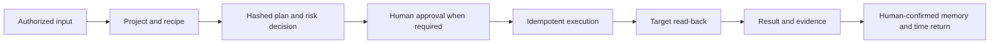

# Product Requirements

[Project home](../../README.md) · [Detailed Chinese PRD](../产品需求文档.md)

## Outcome

Foursday is a personal work twin whose north-star metric is verified time
returned to its user. The product does not optimize for message volume, task
count, team surveillance, or silent impersonation.

## Current scope

| Priority | Capability | Acceptance boundary |
|---|---|---|
| P0 | Project onboarding | Safe project draft in ten minutes; side effects disabled |
| P0 | Local owner login | One-time loopback registration collects a login identifier, optional email alias, and matching password confirmation; existing read/write tokens prove ownership once, then registration closes permanently. A salted scrypt verifier creates one shared, short-lived session across operations and project cockpit pages with HttpOnly SameSite cookie, same-origin CSRF, five-attempt rate limit, and legacy token compatibility; login never replaces content-bound approval |
| P0 | Historical project import | Local JSON bundle → read-only evidence/candidate preview → exact typed digest and browser write session or write token → project manifest plus proposed memories only; no automatic confirmation or external effects |
| P0 | Project memory sync | Browser owner session or dual-token, zero-write settings preview binds manifest + regular fixed sources + fact prefixes + retention + ≤365-day expiry + auto-confirm to exact `MEMORY-AUTH-...` confirmation; apply changes only the project manifest and never opens the global gate. A separate explicit write-authorized model invocation uses isolated sources → ten-minute server-held preview → one-time apply under unchanged policy; expired authorization stops before model invocation |
| P0 | Recipe library | Five versioned, schema-validated recipes; one cockpit work-handoff form renders every typed input together for project, meeting, daily-report, memory, and GitHub work; registration requires a read-only full-plan preview and the exact reviewed hash, then always enters approval instead of auto-execution; daily report binds exact Git activity and same-project governed plan/read-back metadata for one date window |
| P0 | Project recipe shadow | Preview is zero-write; explicit local run permits only research/document drafts on one clean Git snapshot; post-delivery review can record actual minutes only in the SHA-bound isolated ledger and creates no production memory or time record |
| P0 | Project cockpit | Goals, milestones, plans, evidence, deliverables, memory, triggers; at most 20 project-scoped proposed memories are reviewable in place, with browser write-session or write-token confirmation/revocation, explicit conflict replacement, duplicate blocking, and no cross-project candidates |
| P0 | Weekly delegation queue | Close the remaining eight-hour goal with project-selected recipes ranked only by user-confirmed outcomes; the local cockpit and read-only Codex tool never bypass execution policy |
| P0 | Time returned | Show bounded delivery content first; record the user's actual post-AI review/edit time, then require separate confirmation |
| P1 | Proactive mode | Schedule form reviews recipe inputs, first run, interval, daily limit, cooldown, and policy before save; trigger remains disabled and schedule creation rejects a changed reviewed plan hash |
| P1 | Meeting to execution | Notes to document, proposed memory, task, and calendar |
| P1 | GitHub delivery | Patch, branch, tests, push, Draft PR; never auto-merge |
| P2 | Community boundaries | Slack, Teams, Gmail, Workspace contracts and examples only |

The weekly delegation queue and its Codex tool are deployed in `0.6.0`. The
project-recipe shadow CLI remains an unreleased candidate until its own release
gates pass.

## End-to-end acceptance

Implemented capability does not mean enabled capability. Version `0.6.0` is
deployed at exact production SHA `6b30c22f97b19c6cfd30bf162b3f85000fa2bde9`;
one source-bound Foursday project exists, while plan execution, proactive work,
message sending, memory auto-sync, and memory confirmation remain separate
decisions.
