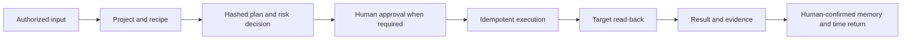

# Product Requirements

[Project home](../../README.md) · [Detailed Chinese PRD](../产品需求文档.md)

## Outcome

Foursday is a personal work twin whose north-star metric is verified time
returned to its user. The product does not optimize for message volume, task
count, team surveillance, or silent impersonation.

## V2.3 scope

| Priority | Capability | Acceptance boundary |
|---|---|---|
| P0 | Project onboarding | Safe project draft in ten minutes; side effects disabled |
| P0 | Recipe library | Four versioned, schema-validated recipes |
| P0 | Project cockpit | Goals, milestones, plans, evidence, deliverables, memory, triggers |
| P0 | Time returned | Complete evidence plus separate user confirmation |
| P1 | Proactive mode | Disabled by default, idempotent, daily/cooldown limits |
| P1 | Meeting to execution | Notes to document, proposed memory, task, and calendar |
| P1 | GitHub delivery | Patch, branch, tests, push, Draft PR; never auto-merge |
| P2 | Community boundaries | Slack, Teams, Gmail, Workspace contracts and examples only |

## End-to-end acceptance

Implemented capability does not mean enabled capability. The V2.3 code is
deployed at exact production SHA `34d04326d1d16ba92994107eb2f44bf89d74c759`;
project authorization and production enablement remain separate decisions.
