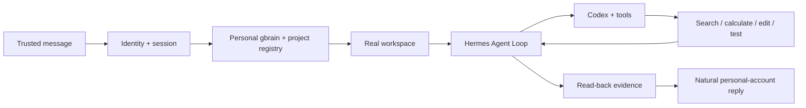

# Foursday Product Requirements

Status: V3 Hermes candidate; Gate 2 complete. Production still uses the legacy Node.js runtime and has not activated the Hermes migration.

## Product definition

Foursday is a personal-memory-driven AI work twin that receives trusted workplace messages, routes a real project, and uses Hermes plus OpenAI Codex to complete work before replying with read-back evidence.

It is not a capability-catalog chatbot. A new question must not require a new business metric, JSON pointer, requester entry, adapter, or deterministic answer template.

## Core loop

The personal default is a general Agent Loop: the program supplies identity, workspace, memory, isolation, and evidence boundaries while the model chooses the next tool and natural response.

## Default personal mode

Allowlisted contacts can request ordinary reversible work without per-project requester configuration or step-by-step approval. Foursday autonomously reads the project, creates documents, analyzes data, changes code, runs tests, fixes failures, and reports after completion.

Optional Enterprise / Governed Mode may add manifests, capability budgets, approvals, recipes, and governed adapters. It is not the personal default.

## Trust boundary

- Unknown users never create an Agent Session.
- Groups require an allowlisted conversation and an explicit mention.
- Ambiguous projects ask one concise clarification.
- A human reply in the same conversation interrupts active work.
- Git push, PR merge, release, production deployment/data writes, irreversible deletion, payment, contracts, HR decisions, secrets, and irreversible commitments require an independent owner gate.

## Project routing

The minimal registry contains only project id, name, aliases, local root, credential-free Git URL, gbrain pages, optional run instructions, and isolation mode.

Routing uses the existing session, explicit project identity, gbrain identity, local/Git registration, then clarification. A project name inside a file path must not hijack the bound session.

## Memory

Personal PRIVATE gbrain Git is the only durable business-knowledge authority. Its PostgreSQL database is a rebuildable index. Hermes Session DB stores conversation and tool history. Foursday PostgreSQL remains compatibility runtime state during migration.

The gbrain client is bound to `default + read-only`; its secret stays in the host bridge and never enters Agent tools.

## Required scenarios

### Project fact

For “How many 2.2 questions have been produced?”, the Agent must enter the real project, distinguish `81,088` source rows from `68,786` formal questions, cite evidence, and reply through personal DingTalk—without a predefined metric or template.

### Follow-ups

The same session must answer released count, failures, worst batch, cost, and low-pass-rate causes without new code or configuration.

### Project work

Document, analysis, and code requests must modify only the routed workspace, run validation, continue fixing failures, read back results, and report outcome, evidence, remaining risk, and rollback.

## Quality requirements

| Area | Requirement |
|---|---|
| Message discovery | P95 under 5 seconds, event first with bounded fallback |
| Short-message bundling | 3-second quiet window, at most 8 seconds from first message |
| Delivery | Exactly one processing path; unknown sends are never retried automatically |
| Continuity | Same conversation keeps project and Hermes Session across processes |
| Isolation | Tool subprocesses cannot read unregistered projects, runtime secrets, Keychain, or network |
| Evidence | Every modification, command, test, send, and reply has target read-back |
| Takeover | Human takeover interrupts the active turn and suppresses stale output |
| High risk | Zero unauthorized external or irreversible actions |
| North star | Evidence-confirmed hours returned per user per week; long-term target 8 hours |

## Acceptance

All 12 P0 gates are complete. See the [Gate 2 report](../自主工作分身迁移验收报告.md). Passing P0 does not authorize commit, push, release, deployment, production migration, or enabling the persistent Hermes Gateway.

## Rollout

P1: Gate 2 commit/public candidate, publishable DWS plugin, cockpit/time-return integration, and a reversible legacy-runtime migration plan.
P2: Feishu, WeCom, Slack, Teams, Gmail, Google Workspace, multi-user installs, Docker/SSH/dedicated hosts, and optional enterprise governance.
