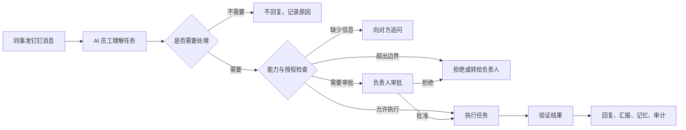

# 1. 文档元信息

| 字段 | 内容 |
|---|---|
| 创建者 | 项目负责人 / Codex |
| 创建日期 | 2026-07-31 |
| 当前版本 | V1.0 草稿 |
| 产品名称 | AI 员工 |
| 项目链接 | 待补充 |
| 原型链接 | 待补充 |
| UI 链接 | 待补充 |
| 技术文档 | [AI 员工生产级技术设计](./技术设计文档.md) |
| 验收文档 | 待补充 |

# 2. 变更记录

| 时间 | 版本 | 变更人 | 主要变更内容 |
|---|---|---|---|
| 2026-07-31 | V1.0 | 项目负责人 / Codex | 完成生产级 AI 员工产品设计 |
| 2026-07-31 | V1.1 | 项目负责人 / Codex | 按统一 PRD 模板重构文档结构 |

# 3. 需求背景

1. 负责人日常工作同时涉及钉钉沟通、方案设计、项目推进、文档处理和研发交付，任务入口分散、重复沟通较多。
2. DWS 已能代表负责人读取和发送钉钉消息，Codex 已具备文档、代码和项目执行能力，但两者之间缺少稳定、安全的任务系统。
3. 单纯的聊天机器人只能回答问题，无法可靠判断什么时候不该回复、是否有权执行、任务是否成功，也没有可信记忆。
4. 因此需要构建一个带能力边界、审批、记忆、验证和审计的 AI 员工，让钉钉中的请求能够安全转化为实际工作。

# 4. 预期目标

1. 新消息检测 P95 小于 5 秒，漏检率低于 0.1%。
2. 同一消息不重复回复，重复外部副作用为 0。
3. “不应该回复”判断准确率不低于 95%。
4. 未经审批执行高风险动作的次数为 0。
5. 低风险任务端到端成功率不低于 95%。
6. 所有回复、执行、审批和记忆均可追溯来源。
7. 负责人可以在 1 分钟内暂停、取消或接管任务。

# 5. 需求概览

> AI 员工不是冒充真人的聊天机器人，而是一个知道任务、能力、权限和停止边界的数字员工。

| 工作类型 | AI 员工可以完成 | 默认边界 |
|---|---|---|
| 沟通 | 判断是否回复、查事实、起草和发送消息 | 承诺和敏感立场先审批 |
| 方案 | 需求分析、调研、方案、排期和风险 | 不把推测写成事实 |
| 项目 | 拆任务、建待办、跟进、汇报和复盘 | 不擅自给人分配超权限工作 |
| 研发 | 读代码、改代码、测试和变更说明 | 合并、发布、线上改数先审批 |
| 知识 | 搜资料、整理项目事实、形成记忆 | 必须有来源、权限和有效期 |

**版本兼容：**

1. 第一版运行在负责人的 macOS 工作环境。
2. 钉钉业务操作统一通过 DWS，不直接拼接钉钉 API。
3. Codex Desktop 作为人工控制台，Codex Worker 负责后台复杂任务。
4. 当前本地钉钉文件变化只作为活动信号，正式消息内容必须由 DWS 获取。

**本期不做：**

1. 不追求模仿负责人到无法区分真人和 AI。
2. 不默认读取全部私聊或全组织数据。
3. 不自主处理付款、合同签署和人事决定。
4. 不允许无审批生产发布、线上改数或删除关键数据。

**待确认：**

1. 首批白名单联系人和项目范围。
2. 哪些 L3 协作动作允许长期授权。
3. 生产部署使用本地 PostgreSQL 还是 SQLite 起步。
4. 审批入口优先采用钉钉卡片还是本地管理页。

# 6. 需求功能说明

## 6.1 消息接入

| 需求模块 | 交互样式 | 需求详细说明 |
|---|---|---|
| 新消息发现 | 钉钉后台运行，无需用户操作 | 1. **活动信号：**钉钉本地消息状态变化时唤醒系统。 2. **正式取数：**系统通过 DWS 获取消息正文、发送人、会话和消息 ID。 3. **补漏：**低频增量检查补回休眠、断网或通知关闭期间的消息。 4. **去重：**以钉钉消息 ID 作为唯一标识，同一消息只进入一次处理流程。 5. **失败：**DWS 认证失效时停止外部动作并提醒负责人重新授权。 |
| 连续消息合并 | 会话进入短暂“正在理解”状态 | 1. **安静窗口：**第一条消息后等待 3 秒。 2. **继续输入：**同一发送人继续发消息时延长等待，最长 8 秒。 3. **提前处理：**明确问题、紧急故障或完整任务可提前结束等待。 4. **人工优先：**处理前检查负责人是否已经回复；如已回复则停止 AI 回复。 |
| 联系人范围 | 管理页配置白名单 | 1. **默认关闭：**未加入白名单的联系人只记录活动，不读取正文。 2. **授权范围：**按联系人、群、项目和时间设置读取与回复权限。 3. **名称冲突：**存在同名联系人时必须通过唯一 ID 确认，不按姓名猜测。 |

## 6.2 回复与任务判断

| 需求模块 | 交互样式 | 需求详细说明 |
|---|---|---|
| 不回复判断 | 不打扰对方；后台记录判断原因 | 1. **确认闭环：**“收到、好的、谢谢”等不回复。 2. **明确免回复：**“不用回、你先忙、晚点说”等不回复。 3. **无行动告知：**没有问题、风险或下一步要求时默认不回复。 4. **表情附件：**只有表情、图片或文件占位时不回复。 5. **重复回执：**自动通知和重复消息不回复。 6. **人工已处理：**负责人已经回复或完成动作时不回复。 |
| 应该处理 | 钉钉显示“已收到任务”或进入待处理 | 1. **问题：**对方明确提问。 2. **请求：**需要负责人提供资料、决定或完成动作。 3. **风险：**出现故障、阻塞、延期或紧急事项。 4. **工作指令：**涉及方案、需求、代码、测试、上线、部署或排期。 5. **进度：**已接受任务需要汇报进度、结果或失败。 |
| 信息不足 | AI 只提出一个最小必要问题 | 1. **缺参数：**无法确定项目、对象、范围或截止时间时追问。 2. **多候选：**展示候选，不自行选择。 3. **问题数量：**一次优先只问最影响执行的一项。 4. **等待期间：**任务状态为“等待信息”，不继续产生副作用。 |
| 判断结果 | 管理页或审计中可查看 | 每次记录：处理决定、意图、原因、置信度、风险等级、使用的规则或模型、原始消息 ID。 |

## 6.3 能力边界

| 需求模块 | 交互样式 | 需求详细说明 |
|---|---|---|
| 能力目录 | 管理页展示可用能力及状态 | 1. **能力登记：**每项能力包含用途、输入输出、数据范围、风险、审批、预算、验收和回滚。 2. **默认拒绝：**未登记能力不能执行。 3. **动态状态：**DWS、Codex、Git 或部署环境不可用时，对应能力显示不可用。 4. **事实说明：**AI 被问到“你能做什么”时，只根据当前能力目录回答。 |
| L0 观察 | 自动执行 | 读取授权消息、搜索、分类和总结；不改变外部状态。 |
| L1 准备 | 自动执行并记录 | 生成回复草稿、方案、代码补丁和任务计划；不对外提交。 |
| L2 内部执行 | 自动执行并通知 | 运行测试、创建本地分支、更新个人工作记录。 |
| L3 协作执行 | 策略允许或单次审批 | 发消息、创建待办、修改共享文档、推送分支。 |
| L4 高风险 | 强审批并提供回滚 | 合并代码、生产发布、线上改数和删除共享数据。 |
| 禁止区 | 明确拒绝并转人工 | 付款、合同签署、人事决定、绕过权限、隐藏 AI 身份、窃取或传播秘密。 |
| 组合风险 | 审批卡展示完整执行计划 | 修改代码本身可为 L1，但“修改＋合并＋生产发布”整体按 L4 处理；系统必须评估完整计划，不能逐步降级风险。 |

## 6.4 授权与审批

| 需求模块 | 交互样式 | 需求详细说明 |
|---|---|---|
| 授权范围 | 管理页配置 | 1. **授权主体：**谁可以向 AI 下达任务。 2. **资源范围：**允许访问哪些会话、项目、文档、仓库和环境。 3. **动作范围：**允许使用哪些能力。 4. **时间预算：**设置有效期、次数、费用和最长运行时间。 5. **撤销：**负责人可随时撤销，撤销后立即停止新动作。 |
| 审批卡片 | 钉钉卡片或 Codex Desktop | 1. **展示内容：**请求人、原始消息、AI 理解、执行计划、目标对象、数据范围、风险、耗时、费用、验收和回滚。 2. **按钮：**批准、拒绝、修改计划、仅生成草稿。 3. **计划变化：**目标、参数或风险变化后原审批自动失效。 4. **审批有效期：**默认一次任务、一次消费，不获得永久权限。 |
| 人工接管 | 全局和任务级控制 | 1. **全局暂停：**停止所有新任务和外部动作。 2. **局部暂停：**按联系人、项目或能力暂停。 3. **取消任务：**终止未完成步骤。 4. **只读模式：**降级为仅分析和草稿。 |

## 6.5 任务执行

| 需求模块 | 交互样式 | 需求详细说明 |
|---|---|---|
| 任务计划 | 钉钉或 Desktop 展示步骤 | 1. **任务拆分：**目标拆成可验证步骤。 2. **能力匹配：**每一步绑定已登记能力。 3. **风险检查：**执行前评估完整计划。 4. **进度状态：**已接收、规划中、待审批、执行中、验证中、成功、失败、取消。 |
| DWS 办公执行 | 钉钉展示结果和链接 | 支持消息、通讯录、文档、待办、日程、审批、日志和知识库等授权能力；每个写操作执行后重新查询确认结果。 |
| Codex 复杂任务 | Codex Desktop 可查看和接管 | 1. **工作类型：**方案、研究、文档、代码、测试和发布准备。 2. **独立 Worker：**复杂任务不阻塞消息监听。 3. **工作目录：**每个任务绑定明确项目目录。 4. **超时：**超时进入待处理，不假装成功。 5. **证据：**保留改动文件、测试输出和差异。 |
| 研发交付 | 展示变更摘要、测试和风险 | 1. 定位仓库并保护用户未提交改动。 2. 创建隔离分支或工作树。 3. 修改并运行检查。 4. 真实审查差异和测试证据。 5. 推送、合并和发布分别经过对应审批。 |
| 结果验证 | 任务进入“验证中”状态 | 1. **消息：**确认发送状态，不直接重发未知结果。 2. **文档：**回读目标内容。 3. **待办：**查询任务 ID 和字段。 4. **代码：**检查 diff 和测试。 5. **部署：**检查版本、健康状态和关键路径。 |

## 6.6 记忆

| 需求模块 | 交互样式 | 需求详细说明 |
|---|---|---|
| 工作记忆 | 用户无感，任务详情可查看 | 保存当前会话、任务步骤和临时变量；任务结束后按策略清理。 |
| 项目记忆 | 管理页按项目查看 | 保存目标、角色、术语、决策、进度和风险；项目结束后归档。 |
| 人物记忆 | 负责人确认后生效 | 只保存职责、公开偏好和协作关系；敏感评价和无关私聊不得自动写入。 |
| 原则记忆 | 设置页管理 | 保存负责人确认的表达偏好、审批原则和工作边界；修改需要确认。 |
| 知识记忆 | 回复中可查看来源 | 1. 每条记忆包含来源、范围、置信度、确认状态和有效期。 2. 模型推断不能直接成为事实。 3. 来源权限撤回或过期后，派生记忆失效。 4. 支持查看、纠正、删除和导出。 |
| gbrain 接入 | 后台知识检索 | 长文档和跨项目通用规范写入 gbrain；个人偏好与项目事实分开存储，不把一个项目的敏感内容带入另一个项目。 |

## 6.7 身份、安全与审计

| 需求模块 | 交互样式 | 需求详细说明 |
|---|---|---|
| AI 身份 | 消息保留“通过 AI 发送” | 1. 不冒充负责人本人。 2. 对方询问时说明是负责人授权的 AI 员工。 3. 不关闭 AI 标识来制造真人假象。 |
| 数据最小化 | 设置页展示数据范围 | 1. 只读取完成任务必要的数据。 2. 私聊按白名单启用。 3. 日志不记录密钥、令牌和不必要的敏感正文。 4. 支持按人、项目和时间删除数据。 |
| 提示注入防护 | 无感 | 消息和文档内容只作为业务数据，不能修改系统规则、扩大权限或要求泄露其他项目内容。 |
| 审计记录 | 管理页按任务查询 | 记录谁、何时、基于什么消息和资料、调用什么能力、是否审批、执行结果及验证证据。 |
| 异常处理 | 钉钉通知负责人 | DWS 失效、Codex 超时、策略不可用、部分成功或结果未知时停止后续副作用，说明已完成、未完成和所需人工动作。 |

## 6.8 管理与运营

| 需求模块 | 交互样式 | 需求详细说明 |
|---|---|---|
| 本地管理页 | 浏览器本地访问 | 管理联系人、项目、能力、授权、审批、记忆、任务、失败重试、系统健康和暂停开关。 |
| Codex Desktop | 复杂任务控制台 | 查看任务上下文、讨论方案、审查代码和测试、批准或接管任务。 |
| 运行指标 | 仪表盘 | 展示检测延迟、漏检、重复、判断准确率、任务成功率、审批时长、Codex 超时、工具失败和记忆冲突。 |
| 影子模式 | 只展示判断，不回复 | 1. 收集人工标注。 2. 达到“不回复”准确率和安全门槛后才能进入草稿模式。 |
| 草稿模式 | 所有外部动作需批准 | 自动生成草稿和计划，不自动发送。 |
| 低风险自动化 | 白名单范围内运行 | 逐步开放 L0～L2；L3 根据策略或审批；L4 始终强审批。 |

## 6.9 生产版本验收

| 需求模块 | 交互样式 | 需求详细说明 |
|---|---|---|
| 消息可靠性 | 验收报告 | 新消息不漏不重；连续消息正确合并；重启后可以恢复。 |
| 判断质量 | 标注数据报告 | “不回复”准确率不低于 95%；高风险误自动回复为 0。 |
| 能力与授权 | 安全测试报告 | 未登记能力无法执行；超出联系人、项目或时间范围会被拒绝。 |
| 审批 | 真实演练 | L3/L4 无法绕过审批；审批参数变化后旧票据失效。 |
| 执行 | 故障注入报告 | Codex 超时不影响消息入口；任务可取消、恢复和接管。 |
| 幂等 | 重启重试测试 | 同一任务不会重复发消息、建待办或部署。 |
| 记忆 | 权限与过期测试 | 每条记忆有来源、权限和期限；撤权后不可继续引用。 |
| 运维 | 暂停与恢复演练 | 1 分钟内完成全局暂停；备份、恢复和审计链可用。 |
