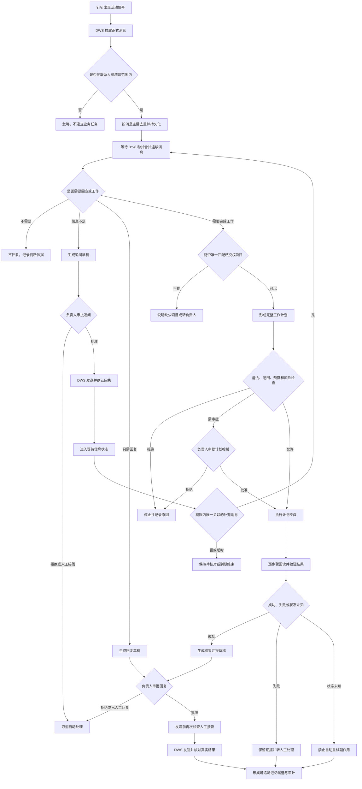
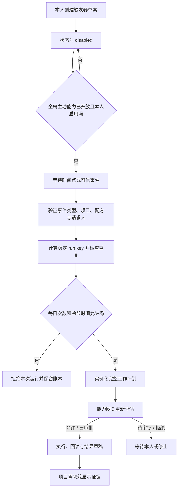

# 1. 文档元信息

| 字段 | 内容 |
|---|---|
| 创建者 | 项目负责人 / Codex |
| 创建日期 | 2026-07-31 |
| 当前版本 | V2.5 |
| 产品名称 | Foursday |
| 项目链接 | [公开代码仓库](https://github.com/ruiwang20010702/foursday) |
| 原型链接 | 不单独维护；以本机管理台和本文交互说明为准 |
| UI 链接 | 本机管理台 `http://127.0.0.1:9465`；仓库内提供 Codex 插件市场，当前主机已安装并启用 |
| 技术文档 | [Foursday 生产级技术设计](./技术设计文档.md) |
| 验收文档 | [验收报告](./验收报告.md) |
| 审查文档 | [统一审查报告](./统一审查报告.md) |

# 2. 变更记录

| 时间 | 版本 | 变更人 | 主要变更内容 |
|---|---|---|---|
| 2026-07-31 | V1.0 | 项目负责人 / Codex | 完成生产级工作分身产品设计 |
| 2026-08-04 | V1.5 | 项目负责人 / Codex | 形成钉钉办公能力、项目计划、审批和回读验收闭环 |
| 2026-08-05 | V1.15 | 项目负责人 / Codex | 形成可靠性、人工质量、正式记忆、隐私和密钥管理基线 |
| 2026-08-06 | V1.35 | 项目负责人 / Codex | 形成 Codex 插件、可复用发布、迁移兼容和双维度人工标注基线 |
| 2026-08-10 | V1.44 | 项目负责人 / Codex | 完成生产版本化发布、服务与业务就绪拆分以及目标版本精确验证 |
| 2026-08-10 | V2.0 | 项目负责人 / Codex | 完成 PRD—代码—测试统一审查，补齐独立新环境检查、无内联密钥初始化、工作目录隔离和真实安装包复用验收 |
| 2026-08-10 | V2.1 | 项目负责人 / Codex | 补齐信息不足时的追问、等待、唯一后续消息关联、超时和人工接管闭环 |
| 2026-08-11 | V2.2 | 项目负责人 / Codex | 完成第 017、018 号迁移的维护前滚、自动记忆候选、跨计划次数预算、人工接管纵深门禁和可复用原子发布闭环 |
| 2026-08-11 | V2.2 | 项目负责人 / Codex | 产品品牌升级为 Foursday，明确“工作分身”和每周返还一个工作日的长期使命；稳定运行标识继续兼容 |
| 2026-08-12 | V2.3 | 项目负责人 / Codex | 完成个人项目接入、工作配方、项目驾驶舱、时间返还、主动工作、会议执行、GitHub 交付、受治理工作图与社区扩展契约；技术版本已部署，未自动放量生产能力 |
| 2026-08-13 | V2.4 | 项目负责人 / Codex | 完成历史项目导入、固定来源项目记忆自动同步、证据绑定记忆配方、驾驶舱例外队列，以及基于本人确认配方基线的返还时间与自动化率 |
| 2026-08-13 | V2.4 | 项目负责人 / Codex | 补充“本周工作返还队列”本地候选设计：以八小时周目标为缺口，连接项目授权、配方、活动计划和本人确认的返还证据；当前未部署、未放量 |
| 2026-08-17 | V2.5 | 项目负责人 / Codex | 将长期记忆统一为四类并列记忆、统一生命周期和三种存储职责：Markdown/gbrain 保存正文，PostgreSQL 保存运行投影、授权与审计；低风险事实支持自动写入并精确回读，冲突隔离，敏感内容拒绝 |

细项修订由代码提交和[统一审查报告](./统一审查报告.md)追溯；PRD 只记录产品里程碑，不再为每个缺陷单独升级版本。

# 3. 需求背景

1. 负责人日常工作同时涉及钉钉沟通、方案设计、项目推进、文档处理和研发交付，任务入口分散、重复沟通较多。
2. DWS 已能代表负责人读取和发送钉钉消息，Codex 已具备文档、代码和项目执行能力，但两者之间缺少稳定、安全的任务系统。
3. 单纯的聊天机器人只能回答问题，无法可靠判断什么时候不该回复、是否有权执行、任务是否成功，也没有可信记忆。
4. 因此需要构建一个带能力边界、审批、记忆、验证和审计的工作分身，让企业消息能够安全转化为实际工作，并逐步替负责人拿回时间。

# 4. 预期目标

1. 新消息检测 P95 小于 5 秒，漏检率低于 0.1%。
2. 同一消息不重复回复，重复外部副作用为 0。
3. “不应该回复”判断准确率不低于 95%。
4. 未经审批执行高风险动作的次数为 0。
5. 低风险任务端到端成功率不低于 95%。
6. 所有回复、执行、审批和记忆均可追溯来源。
7. 负责人可以在 1 分钟内暂停、取消或接管任务。
8. 长期北极星指标为“每位用户每周经过验证拿回的工作时间”，里程碑为稳定返还 8 小时，支持上四休三。

# 5. 需求概览

> Foursday 不是冒充真人的聊天机器人，而是一个学习你的工作方式、知道任务、能力、权限和停止边界的工作分身：能力上像另一个你，身份和责任边界仍然透明。

| 工作类型 | Foursday 可以完成 | 默认边界 |
|---|---|---|
| 沟通 | 判断是否回复、查事实、起草和发送消息 | 承诺和敏感立场先审批 |
| 方案 | 需求分析、调研、方案、排期和风险 | 不把推测写成事实 |
| 项目 | 拆任务、建待办、跟进、汇报和复盘 | 不擅自给人分配超权限工作 |
| 研发 | 读代码、改代码、测试和变更说明 | 合并、发布、线上改数先审批 |
| 知识 | 搜资料、整理项目事实、形成记忆 | 必须有来源、权限和有效期 |

这张表描述产品能力目标，不代表当前生产已经开放相应权限。当前代码、部署、项目授权和业务放量状态统一以[完成度矩阵](./完成度矩阵.md)为准。

**版本兼容：**

1. 第一版运行在负责人的 macOS 工作环境。
2. 钉钉业务操作统一通过 DWS，不直接拼接钉钉 API。
3. Codex Desktop 作为人工控制台，Codex Worker 负责后台复杂任务。
4. 当前本地钉钉文件变化只作为活动信号，正式消息内容必须由 DWS 获取。

**本期不做：**

1. 不追求模仿负责人到无法区分真人和 AI。
2. 不默认读取全部私聊或全组织数据。
3. 不自主处理付款、合同签署和人事决定。
4. 不允许无审批生产发布、线上改数或删除关键数据。

**当前决策：**

1. 白名单联系人、群聊和项目均由每个接入环境独立配置，不写入公共仓库或复用包。
2. L3 协作动作不授予无范围永久权限；按项目清单固定人员和目标，并由策略有效期或单次审批控制。
3. 数据层统一使用 PostgreSQL；可部署在本机或受控远程环境，但每个环境必须独立配置、迁移和备份。
4. 消息草稿支持本机管理页与钉钉本人自聊短码审批；移动指令仍绑定当前审批版本、完整草稿哈希、有效期和一次性消费。工作计划、部署、扩权、隐私删除等高风险审批继续进入完整控制台；未来互动卡片也不能绕过同一票据和安全门禁。

# 6. 需求功能说明

> `v0.6.0-rc.1` 已随精确提交 `6b30c22f97b19c6cfd30bf162b3f85000fa2bde9` 部署，并创建一个仅开放研究/文档草稿、其余副作用默认拒绝的 Foursday 项目；这不代表计划执行、主动工作、消息发送或记忆自动同步已经放量。生产状态仍以验收报告中的精确提交、迁移和能力开关回读为准。

## 6.1 消息接入

| 需求模块 | 交互样式 | 需求详细说明 |
|---|---|---|
| 新消息发现 | 钉钉后台运行，无需用户操作 | 1. **活动信号：**钉钉本地消息状态变化时唤醒系统。 2. **正式取数：**系统通过 DWS 获取消息正文、发送人、会话和消息 ID。 3. **补漏：**低频增量检查补回休眠、断网或通知关闭期间的消息。 4. **去重：**以钉钉消息 ID 作为唯一标识，同一消息只进入一次处理流程。 5. **失败：**DWS 认证失效时停止外部动作并提醒负责人重新授权。 |
| 连续消息合并 | 会话进入短暂“正在理解”状态 | 1. **安静窗口：**第一条消息后等待 3 秒。 2. **继续输入：**同一发送人继续发消息时延长等待，但从首条起总等待不超过 8 秒。 3. **会话片段：**8 秒后才到达的同一私聊消息仍在 2 分钟片段内关联；新任务读取源消息之前 24 小时、最多 50 条私聊历史，并明确区分当前账号、对方和未知角色。 4. **项目关联：**只根据已确认项目身份别名匹配项目记忆；同一会话后续省略项目名时沿用最近明确项目，多个项目可以同时匹配，未匹配时不猜。 5. **旧草稿失效：**后续任务形成新草稿时，片段内尚未发送的旧草稿自动过期，旧审批哈希不可再使用；两个草稿倒序完成时也只能保留最新任务。 6. **失败关闭：**DWS 私聊历史读取失败或历史中找不到当前源消息时，不退化成单条猜测，任务进入安全重试。 7. **提前处理：**以 `[紧急]`、`P0/P1` 开头，或以“发完、需求描述完毕、可以开始了”等显式信号结尾时可提前；普通问号不提前。 8. **人工优先：**处理前检查负责人是否已经回复；如已回复则停止 AI 回复。 |
| 联系人范围 | 管理页查看、受控命令配置 | 1. **默认关闭：**未加入白名单的联系人只记录活动，不读取正文。 2. **授权范围：**按联系人、群、项目和时间设置读取与回复权限。 3. **名称冲突：**存在同名联系人时必须通过唯一 ID 确认，不按姓名猜测。 4. **隐私展示：**管理页只显示数量、稳定 HMAC 指纹、触发规则、回复能力和暂停状态，不返回真实钉钉编号。 5. **禁止扩权：**页面只能暂停或恢复已经配置的联系人和群；新增、删除或替换白名单必须使用受控命令并重载服务。 6. **群聊触发：**只接收白名单群中结构化确认 `@我` 的消息；被 `@` 不等于必须回复，仍继续执行“不回复”判断。 |

## 6.2 回复与任务判断

| 需求模块 | 交互样式 | 需求详细说明 |
|---|---|---|
| 不回复判断 | 不打扰对方；后台记录判断原因 | 1. **确认闭环：**“收到、好的、谢谢”等不回复。 2. **明确免回复：**“不用回、你先忙、晚点说”等不回复。 3. **无行动告知：**没有问题、风险或下一步要求时默认不回复。 4. **表情附件：**只有表情、图片或文件占位时不回复。 5. **重复回执：**自动通知和重复消息不回复。 6. **人工已处理：**负责人已经回复或完成动作时不回复。 |
| 应该处理 | 钉钉显示“已收到任务”或进入待处理 | 1. **问题：**对方明确提问。 2. **请求：**需要负责人提供资料、决定或完成动作。 3. **风险：**出现故障、阻塞、延期或紧急事项。 4. **工作指令：**涉及方案、需求、代码、测试、上线、部署或排期。 5. **进度：**已接受任务需要汇报进度、结果或失败。 |
| 信息不足 | AI 只提出一个最小必要问题 | 1. **缺参数：**无法确定项目、对象、范围或截止时间时追问。 2. **多候选：**展示候选，不自行选择。 3. **问题数量：**一次优先只问最影响执行的一项。 4. **审批与送达：**追问草稿仍需审批；只有平台明确返回成功或负责人核对为已发送，才进入“等待补充信息”。发送未知时不得假装已送达。 5. **等待期间：**不创建执行计划或继续产生副作用，默认等待 24 小时，接入环境可在 1 分钟至 30 天内配置。 6. **后续关联：**只把期限内、同一发送人、同一会话且唯一可匹配的等待任务作为候选；模型仍需确认新消息确实在回答原追问。多个候选时不猜。 7. **恢复与结束：**无关消息恢复原等待；相关补充接续原任务；处理失败恢复等待；超时转为过期；负责人人工回复后关闭等待。 8. **群聊边界：**群聊后续消息仍须在白名单群中结构化 `@我` 才进入判断。 |
| 判断结果 | 管理页或审计中可查看 | 每次记录：处理决定、意图、原因、置信度、风险等级、使用的规则或模型、原始消息 ID。 |

## 6.3 能力边界

| 需求模块 | 交互样式 | 需求详细说明 |
|---|---|---|
| 能力目录 | 管理页展示可用能力及状态 | 1. **能力登记：**每项能力包含用途、输入输出、数据范围、风险、审批、预算、验收和回滚。 2. **默认拒绝：**未登记能力不能执行。 3. **动态状态：**DWS、Codex、Git 或部署环境不可用时，对应能力显示不可用。 4. **确定性自述：**AI 被问到“你能做什么”时不调用模型，只根据当前全局开关、请求人匹配的项目清单、能力有效期和禁止区回答；项目清单不可读时明确降级，不猜测。 5. **最小披露：**私聊只列请求人自己的项目名称和能力；群聊只列授权项目数量；均不返回项目路径、命令、人员编号或他人项目。 6. **状态边界：**自述说明“已配置和已授权”，实际执行前仍重新检查工具、授权、审批和目标回读。 |
| Codex 控制入口 | 对话工具与可选状态卡片 | 1. **只读优先：**首版只提供健康、待审批草稿、工作计划、接管状态、能力和管理台入口，不提供批准、发送、执行或扩权工具。 2. **本机边界：**只访问 HTTP 回环地址，管理只读令牌默认从 macOS 钥匙串读取；不读取写入令牌。 3. **最小接口：**底层仅允许固定的 5 个 GET 端点，工具返回字段再次投影并限制条数。 4. **可选 UI：**状态卡片遵循 MCP Apps 标准；宿主不支持组件时仍返回结构化文本结果。 5. **完整控制：**审批、修改、暂停和深度核对继续进入本机管理台，Codex 插件不改变原审批票据和安全门禁。 |
| L0 观察 | 自动执行 | 读取授权消息、搜索、分类和总结；不改变外部状态。 |
| L1 准备 | 自动执行并记录 | 生成回复草稿、方案、代码补丁和任务计划；不对外提交。 |
| L2 内部执行 | 自动执行并通知 | 运行测试、创建本地分支、更新个人工作记录。 |
| L3 协作执行 | 单次审批 | 发消息、创建待办、创建普通日程、修改共享文档、推送分支；人员和目标范围必须由项目清单固定。 |
| L4 高风险 | 强审批并提供回滚 | 生产发布、线上改数和删除共享数据。代码合并当前为人工专属动作，AI 只能准备分支、测试证据和合并建议，不能自行合并。 |
| 禁止区 | 明确拒绝并转人工 | 付款、合同签署、人事决定、OA 审批同意/拒绝/转交、绕过权限、隐藏 AI 身份、窃取或传播秘密。 |
| 组合风险 | 审批卡展示完整执行计划 | 修改代码本身可为 L1，但“修改＋合并＋生产发布”整体按 L4 处理；系统必须评估完整计划，不能逐步降级风险。 |

## 6.4 授权与审批

| 需求模块 | 交互样式 | 需求详细说明 |
|---|---|---|
| 本机所有者登录 | 首次网页注册；随后使用用户名或邮箱加密码 | 1. **一次注册：**未配置账户时只允许在本机页填写登录名、可选邮箱和两次相同密码；现有读写令牌只用于这一次所有权验证。成功后原子保存配置、立即登录并永久关闭注册入口，不允许覆盖既有账户。 2. **一次登录：**运维管理与项目驾驶舱共享最长 8 小时的短期会话，不要求在页面间重复输入令牌。 3. **密码保护：**只保存加盐 `scrypt` 校验值，不保存明文密码；连续 5 次失败后限制 15 分钟。 4. **会话保护：**Cookie 使用 `HttpOnly` 和 `SameSite=Strict`，写请求同时校验同源与 CSRF；退出、重启或到期后失效。 5. **兼容边界：**读写令牌继续服务首次所有权验证、CLI、Codex 挑战和兼容 API；登录不得替代计划哈希、导入摘要或高风险二次确认。 |
| 授权范围 | 管理页配置 | 1. **授权主体：**谁可以向 AI 下达任务。 2. **资源范围：**允许访问哪些会话、项目、文档、仓库和环境。 3. **动作范围：**允许使用哪些能力。 4. **时间预算：**设置有效期、次数、费用和最长运行时间。 5. **撤销：**负责人可随时撤销，撤销后立即停止新动作。 |
| 审批卡片 | 钉钉卡片或 Codex Desktop | 1. **展示内容：**请求人、原始消息、AI 理解、执行计划、目标对象、数据范围、风险、耗时、费用、验收和回滚。 2. **按钮：**批准、拒绝、修改计划、仅生成草稿。 3. **计划修订：**只允许修改待审批或已拒绝计划；旧计划保留并标记“已替代”，新计划使用新编号和新哈希，项目、请求人和来源任务不可变。 4. **重新审批：**无论新计划的基础风险是否允许自动执行，修订后都必须重新审批，旧票据不能复用。 5. **审批有效期：**默认一次任务、一次消费，不获得永久权限。 |
| 人工接管 | 全局和任务级控制 | 1. **全局暂停：**停止所有新任务和外部动作。 2. **局部暂停：**按联系人、群聊、项目或能力暂停。联系人或群聊暂停同时阻止新草稿和已批准发送，不消耗重试次数。 3. **取消任务：**只读 Codex 和本地命令终止整个进程组并记录确认凭据；外部副作用步骤完成回读或回滚后停止。 4. **接管视图：**展示当前步骤、是否有副作用、能否确认中断、已保存证据、租约和下一项人工动作。 5. **状态真实性：**只有存在中断确认凭据才显示“已确认中断”；不可强停的外部动作显示“正在安全收尾”，不得假装已经停止。 6. **只读模式：**降级为仅分析和草稿。 |

## 6.5 任务执行

| 需求模块 | 交互样式 | 需求详细说明 |
|---|---|---|
| 任务计划 | 钉钉或 Desktop 展示步骤 | 1. **任务拆分：**目标拆成可验证步骤。 2. **能力匹配：**每一步绑定已登记能力。 3. **风险检查：**执行前评估完整计划。 4. **进度状态：**已接收、规划中、待审批、执行中、验证中、成功、失败、取消、已替代。 |
| DWS 办公执行 | 钉钉展示结果和链接 | 1. **当前可执行：**消息、固定目标文档、固定人员待办、受控日程和固定模板日志；每个写操作执行后重新查询确认结果。 2. **日程约束：**会议室只能选择项目白名单名称，执行时按同一时段实时搜索，必须唯一命中服务端返回的 `roomId`；循环只允许有次数上限的按日/按周规则，不能与按次数预订会议室组合。 3. **日志约束：**项目清单同时绑定模板编号、名称和完整字段结构；提交前重新读取模板，字段漂移即停止。 4. **只读与准备：**通讯录、审批和知识库可用于查询、整理或生成草稿。 5. **明确边界：**OA 审批同意、拒绝和转交不自动执行。 |
| Codex 复杂任务 | Codex Desktop 可查看和接管 | 1. **工作类型：**方案、研究、文档、代码、测试和发布准备。 2. **独立 Worker：**复杂任务不阻塞消息监听。 3. **工作目录：**每个任务绑定明确项目目录。 4. **超时：**超时进入待处理，不假装成功。 5. **证据：**保留改动文件、测试输出和差异。 |
| 研发交付 | 展示变更摘要、测试和风险 | 1. 定位仓库并保护用户未提交改动。 2. 创建独立分支和工作树，并在应用补丁前校准文件与索引、确认工作树干净。 3. 先执行 `git apply --check --index`，再应用补丁；任一步失败都移除本次创建的工作树、分支和空运行目录。 4. 修改并运行项目清单登记的精确检查。 5. 真实审查差异和测试证据。 6. 推送、合并和发布分别经过对应审批。 |
| 结果验证 | 任务进入“验证中”状态 | 1. **消息：**确认发送状态，不直接重发未知结果。 2. **文档：**回读目标内容。 3. **待办：**查询任务 ID 和字段。 4. **代码：**检查 diff 和测试。 5. **部署：**除健康状态和关键路径外，逐一核对全部常驻服务加载的脚本、工作目录和生产配置均精确属于目标不可变版本；旧版本进程仍在运行时不得宣称新版成功。 |

## 6.6 记忆

| 需求模块 | 交互样式 | 需求详细说明 |
|---|---|---|
| 四类并列记忆 | 用户无感；管理台按来源和范围查看 | 1. **工作记忆：**最近对话、当前任务、等待状态和临时变量，保存在 PostgreSQL，自动产生并按策略过期。 2. **情景记忆：**会议、沟通、交付和决策过程，先形成来源绑定原子记录，再整理为 gbrain Markdown。 3. **语义记忆：**人物、项目、原则和知识是同一层内的并列命名空间，不是上下级；项目记忆包含目标、阶段、决策、里程碑、风险和交付物。 4. **前瞻记忆：**承诺、提醒、待跟进事项和未来目标；Markdown 保存可读意图，PostgreSQL 保存调度与完成状态。 |
| 统一生命周期 | 后台自动运行 | 捕获 → 提取 → 来源/隐私/冲突治理 → 写入 gbrain Markdown → 精确回读 → PostgreSQL 加密投影 → 整理、过期或替代 → 按人物、项目和当前意图检索。整理和检索是跨记忆类型的服务，不是新的记忆层。 |
| 自动更新边界 | 异常进入例外队列 | 1. 来源明确、低风险、无冲突且不含机密的事实，可以自动写入 `atoms/foursday/`，只有精确回读正文、slug 和版本成功后才成为 PostgreSQL 可用投影。 2. 冲突、低置信度或来源无法回读时进入隔离候选，不参与回复或计划。 3. 凭据、个人敏感信息、医疗/薪酬/身份信息和主观人物评价直接拒绝持久化。 4. 自动确认必须由生产配置单独开放；开放写入不等于开放消息发送、计划执行或主动工作。 |
| 纠正、导出与删除 | 管理台和受控命令 | 1. 新事实通过 `supersedes` 显式替代旧事实，旧版本退出检索但保留最小审计。 2. 默认只导出元数据；含正文导出必须使用固定确认值和不可覆盖的 `600` 文件。 3. 永久删除擦除 PostgreSQL 业务字段并在 Markdown 权威层形成对应撤销/删除动作；任何一侧失败都不得宣称完成。 |
| gbrain 与 PostgreSQL | 后台知识与运行基础设施 | 1. Git 管理的 Markdown 是长期记忆正文权威；gbrain 提供写入、精确读取、实体、图谱和检索。 2. gbrain 自身 PostgreSQL 是可重建的知识索引；Foursday PostgreSQL 是消息、任务、同步状态、加密投影、访问租约、权限和审计的运行权威。 3. 钉钉生产入口只允许 PostgreSQL；SQLite 仅用于隔离公开体验与测试，不能接触或替代正式记忆。 4. 项目知识继续要求白名单内精确 slug；不开放无法在检索前限定项目范围的无界语义搜索。 |

## 6.7 身份、安全与审计

| 需求模块 | 交互样式 | 需求详细说明 |
|---|---|---|
| AI 身份 | 消息保留“通过 AI 发送” | 1. 不冒充负责人本人。 2. 对方询问时说明是负责人授权的 Foursday 工作分身。 3. 不关闭 AI 标识来制造真人假象。 |
| 数据最小化 | 设置页展示数据范围 | 1. 只读取完成任务必要的数据。 2. 私聊按白名单启用。 3. 日志不记录密钥、令牌和不必要的敏感正文。 4. 生产密钥使用环境变量或 macOS 钥匙串引用，引用失败时整份配置不生效；新环境初始化只写当前工作区独有的钥匙串引用，只有单独显式批准才在钥匙串中生成四项密钥，配置文件和输出均不得出现密钥值。 5. **范围删除：**通过标准输入提交且每次只能选择一个人、一个项目或一个截止时间；本机管理台可用双令牌生成只读预览，只返回范围类型、脱敏指纹、分类数量、阻塞数量和快照确认值，不保存或回显范围值。 6. **防误删：**管理服务不提供范围删除路由；真正执行只能通过命令行重新提交同一范围。活动任务、未决发送、活动计划、待归档消息或仍生效的暂停规则会阻止整批操作；确认值绑定选择器、记录编号、状态和更新时间，数据变化后必须重新预览。 7. **擦除结果：**消息删除，只保留不可逆 HMAC 去重指纹防止 DWS 回看后复活；任务、计划和记忆清空业务正文、身份、项目、审批理由、执行证据与人工标注后只留最小墓碑；相关审计清空详情但保留事件存在性，并新增不含选择值和正文的擦除审计。 8. 项目范围只处理数据库内项目数据及计划绑定的来源任务，不删除项目授权清单、代码目录或外部系统数据。 |
| 提示注入防护 | 无感 | 消息和文档内容只作为业务数据，不能修改系统规则、扩大权限或要求泄露其他项目内容。 |
| 审计记录 | 管理页按任务查询 | 记录谁、何时、基于什么消息和资料、调用什么能力、是否审批、执行结果及验证证据。公开仓库的每次提交和拉取请求必须执行依赖审计、代码分析和密钥扫描；第三方 CI 动作固定完整提交，扫描结果必须绑定当前提交。 |
| 异常处理 | 钉钉通知负责人 | DWS 失效、Codex 超时、策略不可用、部分成功或结果未知时停止后续副作用，说明已完成、未完成和所需人工动作。 |

## 6.8 管理与运营

| 需求模块 | 交互样式 | 需求详细说明 |
|---|---|---|
| 本地管理页 | 浏览器本地访问 | 查看脱敏监听范围及私聊/群聊触发规则，管理已配置对象的暂停、项目、能力、授权、审批、记忆、任务、失败重试、人工接管和系统健康；不提供新增监听对象、计划执行或直接发送入口。 |
| Codex Desktop | 复杂任务控制台 | 查看任务上下文、讨论方案、审查代码和测试、批准或接管任务。 |
| 运行指标 | 仪表盘 | 1. 展示入口月度可用性、最近 24 小时消息发现 P95、DWS 消息源真实漏检率、低风险任务成功率、任务耗时、审批等待、副作用可靠性和正式记忆冲突。 2. 独立对账任务使用与监听相同的联系人、群聊和 @我 范围，排除最近 2 分钟后比对消息主键；发现漏项时回补本地数据库，不向钉钉发送消息。 3. 对账只保存时间窗、数量和比例，不保存联系人、会话、消息 ID 或正文；窗口不完整、无样本或报告过期时不得声称漏检率达标。 4. 草稿产出耗时使用“任务创建 → 草稿就绪”，不包含人工等待；任务全流程耗时单独作为观察项。 5. 成功率、草稿产出、全流程和审批分别展示各自样本数，不共用分母。 6. 无样本显示“样本不足”，不能视为达标。 7. 数据超过统计上限时显示不完整并禁止形成 SLO 结论。 8. 只有显式标记为同一“事实字段”的记忆才自动比较冲突；新旧值不一致时必须明确替代旧记忆，完全重复或存在多个双活冲突时禁止确认。 |
| 影子模式 | 只展示判断，不回复 | 1. 收集真实人工标注，AI 不得代替人标注。 2. 标注分为两个独立维度：先判断对方是否需要回应；只有需要回应且 AI 已生成非空草稿时，再评价草稿为“可直接使用/需要修改/不安全”。 3. 风险优先与覆盖抽样交替，覆盖回应类别、私聊/群聊和各判断来源，不能用单一类型样本凑满数量。 4. 回应标签绑定完整判断哈希；草稿评价另行绑定实际草稿哈希。判断变化后旧回应标签失效，草稿变化只让草稿评价失效；两者都重新进入相应复核步骤。历史自由文本分歧和未绑定草稿哈希的旧草稿评价不得计入对应门槛。 5. 每次标注及修正写入不可变历史；回应分歧和草稿问题使用各自的统一原因类别，可补充加密说明。 6. 质量页展示完整待判断消息、剩余数量、分层覆盖、回应误判、草稿可用率及问题类别；命令行使用数据库强制只读会话，只输出不含身份和正文的聚合计数。 7. 统一只读验收同时要求回应样本、草稿样本、分层覆盖、双向准确率、草稿可直接使用率、高风险门槛、30 天可用性、消息发现与覆盖、低风险成功率、草稿耗时、副作用可靠性和记忆冲突全部通过；未知或窗口不完整必须失败关闭。 |
| 草稿模式 | 所有外部动作需批准 | 自动生成草稿和计划，不自动发送。 |
| 低风险自动化 | 白名单范围内运行 | 1. 可选无人值守模式只自动批准私聊、低风险、置信度达到配置门槛、无需追问且不包含工作请求的普通回复。 2. 群聊、承诺、计划、中高风险和上下文不可核对内容继续审批或停止。 3. 自动批准不绕过联系人白名单、人工接管复查、幂等副作用账本或发送回执。 4. 逐步开放 L0～L2；L3 根据策略或审批；L4 始终强审批。 |

## 6.9 生产版本验收

| 需求模块 | 交互样式 | 需求详细说明 |
|---|---|---|
| 消息可靠性 | 验收报告 | 新消息不漏不重；连续消息正确合并；重启后可以恢复。 |
| 判断质量 | 标注数据报告 | 至少 100 条含义明确的真实回应判断；“建议回复”和“建议不回复”的准确率均不低于 95%；高风险错误回复建议为 0；至少 30 条草稿评价且可直接使用率不低于 90%，不安全草稿必须为 0；分层数据只用于定位问题，不单独替代全局放量门槛。 |
| 长期 SLO | 统一只读验收 | 完整 30 天可用性、消息发现 P95、消息源覆盖、低风险成功率、草稿产出 P95、副作用可靠性和记忆冲突均达到目标；缺少样本、统计截断或窗口不完整不得判定通过。 |
| 能力与授权 | 安全测试报告 | 未登记能力无法执行；超出联系人、项目或时间范围会被拒绝。 |
| 审批 | 真实演练 | L3/L4 无法绕过审批；审批参数变化后旧票据失效。 |
| 执行 | 故障注入报告 | Codex 超时不影响消息入口；任务可取消、恢复和接管。 |
| 幂等 | 重启重试测试 | 同一任务不会重复发消息、建待办或部署。 |
| 记忆 | 权限与过期测试 | 每条记忆有来源、权限和期限；撤权后不可继续引用。 |
| 运维 | 暂停与恢复演练 | 1 分钟内完成全局暂停；备份、恢复和审计链可用。 |
| 可复用部署 | 隔离安装验收 | 1. CI 必须真实生成 tarball 并安装到空目录，不能用 `npm pack --dry-run` 代替。 2. 安装后逐个解析发布源码，生成权限为 `600` 且不可覆盖的生产配置，再创建并校验默认关闭外部权限的项目清单。 3. 发布包不得包含 `.runtime`、测试目录、环境文件、运行数据库或生产配置。 4. 安装包必须提供独立新环境命令，默认使用接入方工作目录；本地检查不连接外部服务、不回显配置值，初始化不覆盖已有文件，不把生成的生产密钥写入配置；钥匙串写入必须单独预览并显式应用。 5. 普通代码检查必须兼容源码仓库和不含测试目录的安装包；完整 PostgreSQL 回归缺少源码测试时必须在启动数据库前停止。 6. 诊断与迁移分离；上线前分别验证 DWS 授权、Codex 运行状态和严格草稿契约。 7. 生产长期记忆固定使用 gbrain Markdown 权威，因此预检始终验证 gbrain 可执行文件和版本；公开零账号预览不加载生产配置、正式记忆或 gbrain。 8. 预检必须只读核对迁移版本和校验和并可列出待迁移项；诊断、影子验收和运行时遇到缺失迁移或校验和漂移时必须在业务查询前停止。 9. 从迁移 015 起，每个正式迁移必须登记服务回退证据；声明仅回退服务版本时，前向迁移不得删除、重命名或改变既有结构，也不得增加无默认值的必填列。 10. 本机完整测试必须自动创建仅监听回环地址的随机 PostgreSQL 临时实例，剥离生产连接和业务密钥，并在成功、失败或中断后安全回收。 11. 服务切换后必须逐一读取全部 LaunchAgent 的实际加载状态，脚本、共享启动器组件参数、工作目录和生产配置路径均精确指向目标不可变版本才可固定成功版本；仅健康接口可用不构成版本切换证据。 |

## 6.10 个人项目接入与驾驶舱（V2.3）

| 功能 | 产品规则 | 验收口径 |
|---|---|---|
| 项目接入向导 | 一次填写目标、成功标准、里程碑、协作对象、记忆范围和首批配方；生成项目草案，不直接扩权 | 10 分钟内完成；外部副作用能力全部默认关闭；目录、请求人和记忆范围校验失败时不落配置 |
| 历史项目导入 | 个人工作台选择本机 JSON 导入包，用只读令牌核对项目内来源文件、候选、跳过项、重复与冲突；应用时要求写入令牌和手工输入当前摘要 | 预览不创建项目目录或记忆；错误或过期摘要保持零写；成功应用最多创建项目清单与 `proposed` 候选，正式记忆仍为 0，不运行配方、不发送消息、不触碰外部系统 |
| 项目记忆同步 | 个人工作台先用双令牌零写核对当前清单、非符号链接普通来源文件、事实前缀、项目范围内保留期、最长 365 天授权期限和自动确认边界，并用精确 `MEMORY-AUTH-...` 确认后只原子更新项目清单；这一步不开放全局能力。之后显式使用写入令牌，Agent 才读取固定来源的隔离副本并生成候选预览；生成包只在服务端保存十分钟 | 设置预览不返回文件正文、不写数据库或清单；来源、清单或确认摘要变化后要求重新审阅。浏览器不接收可篡改的生成包；模型预览不写数据库但必须明确提示会调用模型服务；每份预览只能应用一次，应用时重新核对全局能力、项目授权、期限、来源和记忆状态；授权过期时在调用模型前停止，自动确认不能超出既有授权 |
| 工作配方库 | 配方带固定编号、版本、输入 Schema、基线耗时和计划模板；实例化后仍进入能力网关 | 官方提供日报、项目跟进、项目记忆更新、会议跟进、代码交付 5 个配方；个人工作台用统一工作委托单一次展示全部类型化输入，不再逐项弹窗，再用只读令牌展示完整步骤、风险、验收证据和精确计划哈希；写入登记必须提交同一哈希，计划变化时重新审阅；工作台登记一律进入待审批，不能自动执行。日报必须同时消费指定日期的精确 Git 活动与同项目受治理计划回读摘要；秘密值、未知字段和缺失输入全部拒绝 |
| 项目配方影子验证 | 历史项目导入后先对已选择的研究/文档配方做本地演练；默认只预览，显式运行才调用只读模型；本人审阅后可记录真实分钟 | 运行前后绑定同一干净 Git 提交与来源摘要；只生成受保护的隔离账本、审阅包和 SHA 绑定的本地确认，不连接生产库，不创建记忆或生产时间返还，不允许代码、办公、Git 或发布步骤 |
| 项目驾驶舱 | 面向本人汇总目标、里程碑、计划、步骤证据、交付物、正式记忆、待审记忆、触发器和时间返还；每个项目最多展示 20 条本项目候选，可在原位置确认、拒绝或明确替代冲突事实 | 不提供团队绩效排名；不展示秘密、完整业务正文或未授权项目；候选不得跨项目，确认和拒绝需要写入令牌，冲突必须展示旧正式事实并显式选择替代目标，已有重复不能再次确认 |
| 时间返还 | 基线来自用户确认的配方；只有计划完成、步骤证据齐全且本人确认后计入 | 本人投入指 AI 交付后用于阅读、核对、补充和修改的真实时间，不是假设从头亲自完成所需时间；个人驾驶舱必须先展示有界的研究/文档交付正文、验证方式和摘要，再允许填写本人投入并形成待确认提案。北极星按本机时区、周一开始的当前周计算 480 分钟目标与已验证自动化率；历史累计单独保留审计，模型估算、未登记工作、失败计划、缺证据计划和未确认提案一律不计入 |
| 本周工作返还队列 | 用“本周还差多少分钟”反推下一批可委托工作；个人工作台和 Codex 只读工具只读取已授权项目所选配方，排除能力被禁用或已有活动计划的项目配方组合 | 仅本人确认的同项目、同配方历史结果可以形成保守返还预计；未验证配方只标记为验证候选，不计入覆盖量；Codex 只访问专用有界接口，不得读取或返回项目目标、记忆正文、图数据、计划载荷或被禁能力明细；生成计划仍需用户动作，执行、审批、预算和回读规则不变 |

## 6.11 主动工作模式（V2.3）

主动工作不是绕过审批的定时机器人。定时工作先在统一工作委托单中共同审阅配方输入、首次运行时间、间隔、每日次数、冷却期和配方计划策略；保存时必须提交同一份已审计划哈希，哈希变化则重新审阅。所有定时和事件触发器创建后默认停用，启用必须先开放全局 `proactive_work`，每次运行仍重新绑定项目、配方、请求人、能力快照和风险策略并生成新的运行键与计划哈希。

- 计划任务以计划时间构成幂等身份；事件任务以来源、类型、事件编号构成幂等身份。
- 每个触发器有每日次数上限和冷却期；执行实例必须持有租约，只有租约所有者能完成或失败运行。
- 事件正文和变量总大小受限；令牌、密码、连接串和不可序列化值不得进入触发器。
- 人工暂停和项目撤权立即阻止新的主动工作；隐私删除前必须先停用触发器。

## 6.12 会议到执行（V2.3）

会议配方的固定顺序为：会议记录核对 → 文档草稿 → 项目决策记忆候选 → 钉钉待办 → 跟进日程。决策只形成候选，必须由本人确认才能成为正式项目记忆；待办和日程仍使用项目白名单、审批、幂等键和创建后回读。

## 6.13 GitHub 开发闭环（V2.3）

代码交付配方的固定顺序为：生成补丁 → 隔离分支 → 固定测试 → 推送受控分支 → 创建 Draft PR → 回报链接和证据。仓库、基础分支、推送前缀、测试命令和 `gh` 可执行文件都必须在配置或项目清单中固定；Foursday 不自动合并 PR。

## 6.14 社区扩展边界（V2.3）

| 扩展类型 | 已提供 | 当前边界 |
|---|---|---|
| 消息渠道 | `MessageAdapter` 与飞书实现 | 钉钉、飞书属于代码实现；Slack、Teams 仅有安全示例清单 |
| 工作事件 | `WorkEventAdapter` | 会议结束和 GitHub Issue 可规范化为事件；部署方负责可信签名入口 |
| 办公空间 | `WorkspaceAdapter` | Gmail、Google Workspace 仅提供端口与权限示例，不声称生产可用 |
| 工作配方 | 带版本 JSON 配方 | 社区配方不能携带秘密、不能声明运行时权限，也不能绕过项目能力清单 |

每个扩展必须证明范围控制、稳定身份、至少一次去重、审批绑定、人工接管、幂等副作用、精确回读和秘密隔离。市场化只开放示例目录；签名、来源信誉和自动安装尚未交付。

## 6.15 V2.3 完成标准

1. SQLite 与隔离 PostgreSQL 的项目、配方、时间返还、触发器和项目记忆测试全部通过。
2. 项目驾驶舱只能读取本人已授权项目，触发器默认停用，时间返还必须本人确认。
3. 会议和 GitHub 配方必须生成完整受控计划，不得直接调用外部工具。
4. Slack、Teams、Gmail、Google Workspace 只能标注为扩展契约或示例，不能写成生产连接器。
5. README、PRD、架构、能力记忆、集成和部署文档必须区分“工作区候选、技术部署、业务放量”三种状态。
