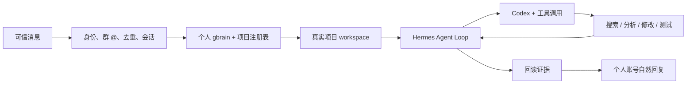

# Foursday 产品需求文档

## 1. 文档信息

| 字段 | 内容 |
|---|---|
| 产品 | Foursday |
| 当前产品版本 | V3.1 原生 Hermes Profile 候选 |
| 产品定位 | 个人记忆驱动的 AI 工作分身 |
| 当前状态 | 通用 Agent Gate 2 已通过；原生 Hermes Profile 迁移已版本化供审阅，尚未部署 |
| 当前生产 | 主动安全停机审阅态；数据库全局暂停，两套 Gateway 停止并持久禁用，所有自动能力关闭 |
| 技术权威 | [技术设计文档](./技术设计文档.md) |
| 当前状态 | [完成度矩阵](./完成度矩阵.md) |
| 验收证据 | [自主工作分身迁移验收报告](./历史/自主工作分身迁移验收报告.md) |

## 2. 产品决策

2026-08-20，Foursday 在停止扩建自研 Agent Runtime 的基础上，进一步停止维护 Hermes Fork，目标改为：

> 原生 Hermes 官方安装与 Gateway + Foursday Profile 发行层、插件、Skills 和产品界面。

Foursday 对用户仍是一套完整工作分身产品，但 Hermes Runtime 由上游原生安装和升级。Foursday 不复制上游源码/虚拟环境，不修改 Agent Loop；项目 workspace 通过官方逐轮 Hook 路由。仅当上游没有扩展接口且替代方案经过 ADR 论证时，才允许临时兼容补丁，并必须设定上游化或删除期限。

同时撤销个人默认工作流中的业务专用指标、固定 JSON Pointer、固定回复模板和逐联系人项目 requester。旧 capability、预算、审批和适配器继续服务当前生产，并降级为可选 Enterprise / Governed Mode。

## 3. 要解决的问题

旧架构安全但过度配置：每出现一种新问题，就需要新增 capability、adapter、项目授权或指标字段。结果是 AI 看得到消息，却不能像 Codex 一样自主进入项目工作。

用户真正需要的是另一个能替自己工作的“我”：

- 了解人物、项目、偏好、原则和历史决策；
- 能从消息自动判断对应项目；
- 能读文件、搜索、计算、运行脚本、改文档和代码；
- 能根据失败继续修复，而不是返回“没有能力”；
- 做完后给出真实证据和撤销方法；
- 只有不可逆或对外承诺才停下来等负责人。

## 4. 产品定义

Foursday 是由个人 gbrain 驱动、通过可信消息入口自主使用 Hermes 与 Codex 完成工作的 AI 工作分身。



### 4.1 默认个人模式

可信联系人提出普通可恢复工作后，Foursday 默认自主执行并在完成后汇报，不要求负责人先建立计划或逐步骤审批。

### 4.2 可选企业模式

企业环境可叠加 project manifest、逐能力授权、次数/费用预算、审批票据、配方和逐步骤适配器，但这些机制不能成为个人安装的前置条件。

### 4.3 不是什么

Foursday 不是：

- 收到消息就回答的聊天机器人；
- 依赖固定业务指标的问答面板；
- 维护第二套个人知识库的同步系统；
- 用提示词代替权限控制的“全权限脚本”；
- 冒充真人、隐藏 AI 身份或责任边界的账号代理。

## 5. 用户和入口

### 5.1 负责人

拥有项目、个人 gbrain、高风险授权和人工接管权。可随时暂停、接管或撤销未完成工作。

### 5.2 可信联系人

当前监听 allowlist 中的人可以使用普通 work 能力，不要求逐项目添加 requester。

### 5.3 群聊

只有白名单群中明确 `@` 当前个人账号的消息进入 Agent Loop。被 `@` 仍不等于必须回复；闭环告知、感谢、表情和无需行动的消息可以保持沉默。

### 5.4 陌生或身份不可核对的消息

不建立 Hermes Session，不调用模型，不读取项目或记忆，不产生回复或副作用。

## 6. 核心用户旅程

### 6.1 新项目事实问题

娜娜老师问：“2.2 目前生产了多少试题？”

Foursday 应当：

1. 通过 DWS 获取正式消息和稳定身份；
2. 自动路由“单词 2.2”项目；
3. 注入个人 gbrain 的项目背景；
4. 进入真实项目目录；
5. 自主搜索 README、脚本、台账和最终汇总；
6. 区分 81,088 条源记录与 68,786 道正式成品；
7. 自然生成带来源的回答；
8. 通过个人钉钉账号发送并回读唯一服务器消息。

不得为这个问题新增 `produced_questions`、固定 JSON Pointer 或确定性回复模板。

### 6.2 连续追问

对方继续问放行量、未通过量、问题最多批次、成本或低通过率原因时，系统复用同一会话、项目和 Agent Loop。对方即使不重复项目名，也不能丢失上下文。

短时间连续发送在 3 秒安静窗口内合并，首条起总等待不超过 8 秒；半分钟或一分钟后的消息成为同一 Session 的新 turn，而不是与上一句强行拼接。

### 6.3 文档、分析和代码工作

可信联系人要求整理文档、运行分析或修改项目代码时，系统应当：

- 自动进入目标项目；
- 修改范围只限当前 workspace；
- 运行相关检查和测试；
- 根据失败继续修复；
- 回读文件、命令和测试结果；
- 汇报完成内容、证据、剩余风险和撤销方法；
- 不因普通可恢复工作请求人工审批。

### 6.4 人工接管

负责人在同一会话手工回复时，DWS 侧车核验身份并触发 Hermes interrupt。进行中的旧结果不得继续发送；接管事件必须进入审计。

## 7. 功能需求

### 7.1 DWS 个人钉钉

- 使用个人账号而不是机器人身份；
- DWS 正文是当前钉钉事实来源，本地文件只作活动信号；
- 私聊以会话 + 联系人形成 Session key；
- 群聊要求白名单群和结构化 `@`；
- 消息 ID 跨重启去重；
- 发送必须取得服务器消息 ID 或独立精确回读；
- 结果未知时禁止自动重试；
- 撤回只记录不含正文的审计事件。

### 7.2 项目发现与路由

项目注册只允许：编号、名称、别名、本地目录、无凭据 Git URL、gbrain 页面、运行说明和隔离模式。

路由优先级：

```text
当前会话绑定
→ 明确项目名称或别名
→ gbrain 项目身份
→ 本地项目注册表 / Git
→ 一次最小澄清
```

路径中的项目名不能误触发切换；多项目歧义不能静默猜测。

### 7.3 通用 Agent Loop

每个 turn 均遵循：上下文 → 推理 → 工具 → 新证据 → 继续推理 → 回读 → 回复。

程序负责身份、路由、隔离、证据和边界；模型负责理解、搜索策略、计算、解释和自然表达。程序不得用固定模板替代普通 AI 回复。

### 7.4 个人记忆

- 个人 PRIVATE gbrain Git 是人物、项目、偏好、原则和长期决策的唯一权威；
- gbrain PostgreSQL 是可重建索引；
- Hermes Session DB 只保存会话、工具调用和短期上下文；
- Foursday 不复制个人项目正文；
- gbrain OAuth 固定 `default + read-only`，密钥不进入 Agent 工具环境；
- 当前数量、成本和状态必须回到项目文件重新核对。

### 7.5 默认自主与高风险边界

默认允许：读项目、搜索计算、运行分析、写文档、改代码、建本地分支/隔离工作树、构建测试、继续修复、制作交付物和回读。

必须独立授权：Git push、PR merge、Release、生产部署、生产数据库写入、不可恢复删除、付款、合同、人事决定、秘密外发和不可撤销承诺。

这些边界必须由宿主 Hook、工具沙箱或独立凭据出口执行，不能只写在提示词里。

### 7.6 产品界面

继续保留 Foursday 中英文品牌、项目驾驶舱、时间返还、会话/任务/交付结果、异常告警和人工接管。

个人模式界面应围绕“正在替我做什么、证据是什么、拿回多少时间、是否需要我接管”，而不是展示大段 capability 配置。

## 8. 质量与安全要求

| 指标 | 要求 |
|---|---|
| 新消息发现 | P95 < 5 秒；事件触发为主、低频补漏 |
| 短消息合并 | 安静窗口 3 秒；首条起总等待 ≤ 8 秒 |
| 重复消息/发送 | 同一消息只处理一次；结果未知不自动重发 |
| 项目路由 | 明确别名正确；歧义必须澄清；路径名不能劫持会话 |
| 工具证据 | 所有修改、命令、测试和回复可回读 |
| 执行隔离 | Agent 工具无法读取未注册项目、`.runtime`、钥匙串和生产秘密 |
| 网络 | 终端默认无网络；外部搜索经过独立工具和出站过滤 |
| 人工接管 | 接管后中断活动 turn，不补发旧结果 |
| 高风险动作 | 未经独立授权执行次数为 0 |
| 北极星 | 每位用户每周经过证据确认拿回的时间，长期目标 8 小时 |

## 9. P0 验收门槛

必须同时证明：

1. 事实问答、连续追问、文档/分析/代码三类场景通过；
2. 使用个人钉钉链路，不以机器人替代；
3. 同一 Session 和项目上下文连续；
4. Agent 真实调用工具；
5. gbrain 正确召回且无第二业务知识库；
6. 无业务专用指标和固定回复；
7. 陌生人拒绝；
8. 项目歧义澄清；
9. Agent 拿不到生产、DWS 和部署秘密；
10. 修改、测试、发送和回复都有回读证据；
11. Hermes 上游契约测试通过；
12. 当前生产未被修改、重启或替换。

当前 12 项均已通过，详见[迁移验收报告](./历史/自主工作分身迁移验收报告.md)。通过 P0 不等于已经获得提交、推送或部署权限。

### 9.1 原生发行层新增门槛

原生迁移还必须证明：

1. 官方安装器绑定完整 Hermes 提交和安装器 SHA-256；
2. `hermes profile install` 可安装隔离的 `foursday` 发行层，并保留用户 Session、记忆、凭据与本地配置；
3. DWS、项目路由、gbrain、风险边界四个插件在未打补丁上游通过官方 `plugins doctor --ci`；
4. 项目目录通过 ContextVar + `pre_tool_call` Hook 逐轮绑定，连续追问和重启后不串项目；
5. Gateway 只通过官方 `gateway install/start/stop/restart/uninstall` 管理；
6. shadow 永远 `send=false`；active 前必须证明旧写入者已停止；active 失败必须先停新 Gateway 并恢复 shadow；
7. 个人 gbrain 自动候选经过一对多请求人来源绑定、文件摘要、隐私、去重、冲突、独立 Git 工作树、快进推送、投影和精确回读；人员/项目/时间删除必须继续回收已晋升 Markdown；
8. 来源删除或摘要漂移会把 Foursday 管理页标记为 superseded，保留 Git 历史且不覆盖其他 Agent 的工作树；
9. 管理台、告警和状态工具读取原生 Gateway，而不是旧 listener/worker 心跳；
10. 真实 shadow、active、接管和回退演练全部绑定同一候选提交。

这 10 项当前只完成代码级与隔离 Profile 验证，尚未完成真实原生生产切换，因此不得把 V3.1 标记为生产完成。

## 10. 发布路线

### P1：原生发行与受控候选

- 官方安装器、Profile distribution、四插件与 Gateway 生命周期闭环；
- Gate 2 审阅、提交和公开候选；
- 对接项目驾驶舱、时间返还和更多中国办公 Skills；
- 完成自管 Gateway → 原生 Profile Gateway 的消息游标迁移、维护窗口和回退；
- 原生稳定窗口后删除补丁层、复制虚拟环境、自定义 supervisor 和旧 Node Runtime。

### P2：产品化

- 飞书、企业微信、Slack、Teams、Gmail 和 Google Workspace 发行配置；
- 多用户安装、Docker/SSH/专用工作机；
- 插件与 Skills 市场；
- 可选 Enterprise / Governed Mode。

## 11. 当前边界

V3 通用 Agent 已完成既有 Gate 2；当前生产为主动安全停机审阅态，没有消息写入者。V3.1 原生 Profile 迁移已版本化供审阅，官方 Profile/Gateway 尚未接管生产。提交、发布和生产迁移状态以 GitHub `main`、[完成度矩阵](./完成度矩阵.md)及生产回读为准，隔离测试不能冒充生产业务就绪。
