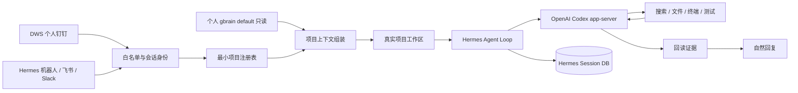

# Foursday 基于 Hermes 的 Agent 架构迁移方案

状态：历史迁移决策基线；实时提交和生产状态见[完成度矩阵](../完成度矩阵.md)
上游基线：Hermes Agent `v2026.8.18` / `0.20.4` / `e624e9fde561e1add9388384012b295fde669ade`

## 一句话决策

Foursday 改为“个人记忆驱动的自主工作分身”：复用精确锁定的 Hermes Agent Loop，Foursday 只维护 DWS 个人钉钉、gbrain、项目路由、工作产品层和少量高风险边界，不再为每一种业务问题扩建 capability、adapter、指标或固定回复模板。

## 目标架构



有效上下文为：

```text
个人 gbrain 中当前项目的长期背景
+ 当前项目工作区中的最新事实
+ 当前 Hermes Session 的会话与工具历史
```

个人 gbrain 仍是唯一长期业务知识权威。Hermes Session DB 只保存会话和工具轨迹；迁移期间 Foursday PostgreSQL 继续承载旧运行状态和兼容回退，不形成第二套个人知识库。

## 最小项目注册表

每个项目只保存：

- `id`、名称和别名；
- 真实绝对工作目录；
- 无凭据的 Git HTTPS 地址；
- 精确 gbrain 页面；
- 简短运行说明；
- 工作区隔离级别。

注册表拒绝请求人名单、逐能力清单、业务指标、JSON Pointer 和固定回答。白名单控制谁能使用 Agent；项目别名和会话绑定控制进入哪个工作区。项目歧义时只追问一次，不猜测、不枚举无关私人项目。

## 权限模型

| 层级 | 默认行为 |
|---|---|
| 未知联系人 | 丢弃，不建立 Agent Session |
| 白名单联系人普通工作 | 自动检索、分析、创建文档、修改代码、运行测试、回读并汇报 |
| 群聊 | 仅白名单群且明确 `@` 个人账号时进入 Agent |
| 高风险动作 | 推送、合并、发布、生产数据库写入、不可恢复删除、付款、合同、人事和秘密读取硬阻断 |
| 企业治理模式 | 可选叠加 manifest、预算和审批，不作为个人模式前置条件 |

提示词不是权限边界。高风险命令由 Hermes `pre_tool_call` 插件阻断；所有终端调用都会再被改写到按项目生成的 macOS 沙箱，默认无网络、只能读取注册项目和系统工具，写权限只给 `workspace-write` 项目。模型认证留在宿主 Hermes，数据库、DWS、部署和 GitHub 凭据不进入 Agent 环境。DWS 真实发送另有独立开关；只读影子运行再叠加整进程只读沙箱。

## gbrain 边界

Foursday 宿主进程使用 `default + read-only OAuth` 读取注册表中的精确页面。OAuth 密钥只在宿主侧桥接进程中从外部密钥引用解析，不进入 Hermes 或 Codex 的终端环境。页面正文经过既有大小、凭据、敏感人物和 confidential 过滤后作为私有背景注入；变化中的数量、成本、通过率和批次状态必须重新以当前工作区文件为准。

## 当前验证结果

### P0-A 新问题自主查证

输入只有“2.2 目前生产了多少试题？”，没有预置数字、业务指标、JSON 指针或固定模板。Agent 自动进入真实项目并通过 21 次终端调用完成检索与计算，最终区分：

- 正式生产工厂口径：68,786；
- 上游释义级源记录：81,088；
- 含 17 条旧自主产物的统一交付口径：68,803。

首次运行暴露了“已包含的烟测被二次扣减”问题；修复的是通用汇总包含关系规则，而不是写入目标数字。

### P0-B 连续追问

同一 Session、后续消息不再出现项目名，仍能回答：

- 已放行 65,194、待人工 3,592；
- 最终问题最多的是批次 0040；
- 正式 API 估算成本约 ¥3,000.01；
- 0040 低通过率来自源释义质量、返工恢复率和 Schema 技术噪声。

后续 38 次工具调用全部位于正确项目目录，Codex memory 读取为 0，写入命令为 0。

### P0-C 代码工作

隔离代码项目中，Agent 自主定位 `add` 回归、修改源码、运行 `npm test` 并回读，结果从 1 项失败变为 1 项通过。开启工具级沙箱后再次运行仍通过。真实单词 2.2 项目中，Agent 只新增 `outputs/agent-poc-20260818/` 下两份文件：正式生产口径说明和批次问题分析；文档内复现命令实际运行成功，除这两份文件外没有其他项目文件在执行窗口内变化。没有发布或部署。

### P0-D 真实 DWS 接收

使用当前本机 DWS 只读抓取娜娜老师最近 24 小时消息，事件侧车确认以“本地文件事件 + 低频兜底”运行；DWS → Python 平台插件 → 白名单 → 单词 2.2 项目路由的真实链路通过。验证只输出消息哈希和数量，不回显正文；真实发送开关保持关闭。

### 可靠性与上游兼容

- 3～8 秒内的连续消息会合并成一个 Agent turn；更晚消息复用持久会话和项目绑定。
- 本人手工回复转换为 `human_takeover` 控制事件并触发 Hermes interrupt；撤回转换为不带正文的审计事件。
- 发送只有取得明确服务器消息 ID 才算成功；缺 ID 进入结果未知且不可自动重试。
- Hermes 官方 Session、Platform、环境、连续消息和 interrupt 契约测试为 202 通过、1 条上游条件跳过。

## 保留、降级与停止扩建

| 处理 | 模块 |
|---|---|
| 保留 | DWS 身份校验、消息去重、人工接管、发送回执、个人 gbrain OAuth、生产备份与诊断 |
| 迁移为插件 | DWS 平台、项目路由、gbrain 上下文、高风险边界、时间返还与驾驶舱 |
| 降级为企业模式 | project manifest、逐能力预算、复杂计划审批、行业专用适配器 |
| 停止扩建 | `project_evidence_read`、业务指标 JSON Pointer、确定性数量回复、逐联系人项目授权 |
| 迁移完成后删除 | 自研通用 Agent Loop、重复记忆运行时和不再被生产读取的兼容状态机 |

## P0 / P1 / P2

### P0：替换验证

- 本人自聊的真实 DWS 发送回执和接管已通过；经单独授权，娜娜老师原会话的 68,786 自然更正已发送并独立回读唯一服务器消息 ID；
- 验证个人回复前人工接管、去重和发送回执；
- 对上游补丁、DWS、路由、gbrain 和边界做完整契约测试；
- 安全审查后进入 Gate 2，由负责人决定是否提交。

### P1：受控切换

- 使用独立 macOS 账号、容器或专用工作机运行 Hermes；
- 先只读答疑，再开放可恢复代码与文档工作，最后单独开放真实发送；
- 旧运行时保持可回退，未通过真实验证前不迁移生产消息游标。

### P2：产品化

- 飞书、Slack、Teams 和 Gmail 发行配置；
- 项目驾驶舱、时间返还和技能市场作为 Foursday 产品层；
- 将仅 3 个文件的 Session workspace 补丁提交上游，尽量消除长期 Fork。

## 剩余发布门禁

当前候选不能部署生产，直到同时满足：

1. 真实 DWS 收到白名单消息并进入正确工作区；
2. 陌生联系人和未 `@` 群消息不建立 Session；
3. 同会话追问、人工接管、重复消息和重启恢复通过；
4. 高风险命令在真实 Hermes 插件加载链中阻断；
5. gbrain 身份精确回读为 `default + read-only`，密钥不进入 Agent 环境；
6. 上游契约、Foursday 全量测试和安全审查通过；
7. 负责人完成 Gate 2 审阅并另行授权提交、推送和部署。

## 可复现安装

候选版分三层安装，每层默认零写：`hermes:prepare` 固定官方提交并安装隔离依赖，`hermes:patch` 只应用已锁定的三文件 workspace 补丁，`hermes:install` 原子安装三类 Foursday 插件、Profile 和 Skill。发行层失败会恢复旧组件；插件通过 `--no-allow-tool-override` 启用，明确禁止覆盖 Hermes 内置工具。任何一步都不会启动 Gateway、写生产配置或发送消息。
