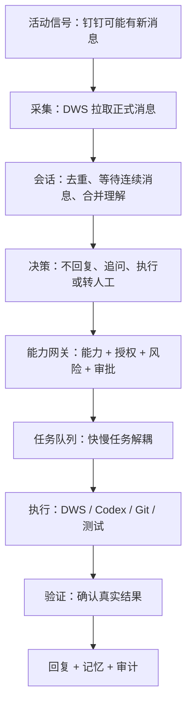
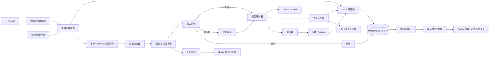
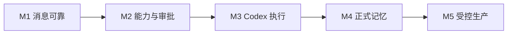

# AI 员工生产级技术设计

状态：受控生产版 v1.2
关联产品文档：[产品需求文档](./产品需求文档.md)

> 建议先阅读 [设计总览](./设计总览.md)。本文只解释“如何保证产品规则真正生效”，术语与总览保持一致。

## 0. 五分钟读懂技术方案



| 设计问题 | 解决办法 |
|---|---|
| 如何实时知道有消息？ | 本地活动信号唤醒，DWS 拉取事实，低频检查补漏 |
| 如何避免连续消息被拆开？ | 3～8 秒安静窗口，按会话合并 |
| 如何避免乱回复？ | 硬规则优先，模型只建议 |
| 如何避免越权？ | 所有工具调用先过能力网关 |
| 如何避免模型拖慢监听？ | 消息入口只入队，Codex 独立消费 |
| 如何避免重复发送？ | 消息唯一键、任务幂等键、副作用账本 |
| 如何记住又不泄露？ | 记忆带来源、权限、有效期和确认状态 |
| 如何出问题后恢复？ | 持久化状态机、租约、验证和补偿 |

## 1. 当前状态与目标状态

### 1.1 当前实现

当前代码已经实现：

- macOS 钉钉本地文件变化作为活动信号，定时检查作为稳定兜底。
- DWS 按游标分页取数，按联系人保存成功检查点，并使用重叠时间窗补漏。
- PostgreSQL 消息唯一键、`SKIP LOCKED` 任务租约、失败重试、死信和副作用账本。
- 多联系人白名单、3 秒安静窗口和同会话连续消息合并。
- 明确闭环硬规则，以及独立 Codex Worker 的上下文复核。
- `draft_reply` 和 `send_message` 能力开关、逐任务人工审批、人工回复复查和 DWS 幂等 UUID。
- 暂停、恢复、拒绝、死信重试和发送未知结果人工处置命令。

当前限制：

- 仓库已提供 LaunchAgent 生成、安装和卸载脚本；当前主机已经完成 8 个服务的安装与重启验收，但仍直接指向可变工作区，尚未建立版本化 `current/previous` 发布链。首次迁移必须先发布 14 个迁移的不可变兼容基线，再发布当前版本；复用到新主机时仍需重新执行现场演练。
- 本地文件事件是钉钉私有实现细节，可能随客户端升级失效；失效时会退化到定时检查。
- PostgreSQL 敏感内容使用 AES-256-GCM 字段级加密；生产强制注入固定数据密钥。
- 沟通链路开放草稿和受控单聊发送；项目链路已开放研究、文档草稿、固定目标共享文档创建、固定人员待办、限时普通日程、固定模板日志、代码补丁、隔离提交、精确测试、受控推送和强审批部署。OA 审批决策与生产数据修改没有通用适配器。
- 工作计划由独立执行器领取；全局开关、项目清单与计划审批同时满足才可执行。执行器通过租约保持所有权，过期后只标记中断，不自动重放外部副作用。
- 来源于钉钉工作请求的计划会绑定原任务。计划完成、失败或取消后，以计划编号生成确定性的结果任务，在原会话形成待审批草稿；重复恢复不会重复建草稿，也不会绕过发送审批。
- 已提供正式记忆、本机管理页、脱敏外部告警、深度健康、Prometheus 指标、每日加密备份和隔离恢复演练脚本。仓库现定义监听、Worker、执行器、健康、管理台、告警、消息对账、记忆来源复核和备份 9 个 LaunchAgent；当前生产主机仍是已验证的前 8 个服务，记忆来源复核服务需随下一次受控发布安装。执行器进程常驻不等于获得执行权限，全局计划执行能力仍保持关闭。

### 1.2 目标

构建单机优先、可演进到服务端的生产系统：

- DWS 是唯一钉钉业务适配器。
- Codex 是复杂知识工作和研发执行器。
- 业务核心不依赖 DWS、Codex、macOS 或具体数据库。
- 所有外部副作用必须经过能力网关。
- 消息接收和慢任务执行完全解耦。
- 任何操作可追溯、可停止、可恢复、可验证。

## 2. 架构原则

1. **六边形架构**：领域核心只依赖端口；DWS、Codex、数据库和系统事件是适配器。
2. **默认拒绝**：未登记能力、未匹配授权或策略不可用时，不产生副作用。
3. **事件与任务分离**：消息入口不得等待模型或长任务。
4. **至少一次接收、效果上恰好一次**：依靠幂等键和副作用账本实现。
5. **事实可追溯**：回复和记忆必须关联来源。
6. **风险按组合动作计算**：计划在执行前整体评估。
7. **内容与控制分离**：提示词不能授予权限，模型输出不能直接调用高风险工具。
8. **可降级**：Codex、记忆或通知失败时，消息接收与审计仍可运行。

## 3. 有界上下文

| 上下文 | 职责 |
|---|---|
| Ingestion | 接收活动信号、DWS 增量抓取、归一化和去重 |
| Conversation | 安静窗口、消息合并、会话状态和回复必要性 |
| Capability | 能力注册、授权、风险、预算和策略决策 |
| Task | 计划、状态机、队列、执行、验证和补偿 |
| Memory | 候选提取、确认、权限、检索、过期和遗忘 |
| Approval | 审批请求、授权票据、撤销和消费 |
| Audit | 不可篡改事件链、证据、指标和合规导出 |

各上下文通过领域事件协作，不共享可变业务对象。

用通俗的话说：

| 模块 | 只负责什么 | 不负责什么 |
|---|---|---|
| 消息采集 | 找到并保存新消息 | 不判断、不回复 |
| 会话决策 | 判断需不需要处理 | 不直接调用外部工具 |
| 能力网关 | 判断允不允许做 | 不替代模型写方案 |
| 任务编排 | 安排步骤和状态 | 不绕过能力网关 |
| 执行器 | 调用 DWS、Codex 等工具 | 不给自己授权 |
| 记忆 | 保存和检索可复用事实 | 不保存无来源推测 |
| 审计 | 保存证据链 | 不参与业务决策 |

## 4. 目标架构



## 5. 领域模型

### 5.1 核心实体

- `Actor`：用户、AI、管理员或系统执行器。
- `Conversation`：会话聚合根，维护参与者和处理游标。
- `Message`：不可变消息实体，以平台消息 ID 标识。
- `MessageBundle`：安静窗口内的连续消息集合。
- `Intent`：问题、请求、告知、确认、风险、敏感事项。
- `Capability`：机器可读的可执行能力。
- `Grant`：主体在范围和期限内对能力的授权。
- `PolicyDecision`：允许、需审批、追问或拒绝。
- `Task`：从请求到验证的工作单元。
- `Action`：任务中的原子步骤。
- `Approval`：对计划和风险快照的一次授权。
- `SideEffect`：已经或可能改变外部状态的操作。
- `MemoryItem`：带来源、范围、置信度和期限的记忆。
- `AuditEvent`：不可变审计记录。

### 5.2 任务状态机

```text
RECEIVED
→ BUNDLING
→ CLASSIFIED
→ PLANNED
→ POLICY_CHECKED
→ WAITING_APPROVAL | READY
→ RUNNING
→ VERIFYING
→ SUCCEEDED | FAILED | PARTIAL | CANCELLED
→ REPORTED
→ ARCHIVED
```

允许恢复的状态必须持久化。`RUNNING` 进程丢失后转为 `RECOVERING`，检查副作用账本后再决定继续、补偿或人工处理。

计划修订不在原记录上改写：`WAITING_APPROVAL | REJECTED → SUPERSEDED`，同时创建一个新的 `WAITING_APPROVAL` 计划。新计划通过 `supersedes_work_plan_id` 指向旧计划，旧审批仍留作审计但无法被执行器消费。

## 6. 消息采集

### 6.1 信号源

优先级：

1. 钉钉未来开放的个人消息官方事件。
2. 当前 macOS 本地文件变化信号。
3. 5～15 分钟低频 DWS 增量校验。

本地信号只表示“可能有变化”，不能作为消息事实源。所有正式内容和 ID 必须由 DWS 获取。

### 6.2 增量抓取

- 每个授权会话保存独立游标和最后成功时间。
- 收到信号后查询自上次成功时间减去安全重叠窗口的数据。
- 以 `(tenant_id, platform_message_id)` 唯一约束去重。
- DWS 调用必须使用 JSON 输出并记录非敏感调用元数据。
- 认证失效时熔断，不反复重试。

### 6.3 安静窗口

- 新消息先进入 3 秒窗口。
- 同一发送人在窗口内继续输入则延长，最大 8 秒。
- 问号、明确任务或紧急风险可提前结束窗口。
- 处理前再次检查负责人是否已经人工回复。
- 一个 `MessageBundle` 只产生一次决策。

## 7. 回复必要性决策

采用“确定性规则优先，模型补充”的两阶段策略。

### 7.1 硬规则

- 重复、回执、明确免回复、单纯表情：`NO_REPLY`。
- 询问 AI 员工自身能力：不调用模型，按全局开关和请求人有效项目授权生成 `capability_summary`；群聊只返回项目数量。
- 明确问题、请求、故障、风险：`NEEDS_ACTION`。
- 敏感主题：`REQUIRES_HUMAN`。
- 无法判断：`MODEL_REVIEW`，但模型只能建议，不能授权。

### 7.2 模型输出

结构化字段：

```json
{
  "decision": "NO_REPLY | REPLY | ACT | ASK | ESCALATE",
  "intent": "string",
  "confidence": 0.0,
  "reason": "string",
  "missingInformation": [],
  "candidateCapabilities": [],
  "sensitivity": []
}
```

置信度阈值按风险调整，而不是统一阈值。

## 8. 能力注册与策略

### 8.1 能力清单示例

```yaml
id: dingtalk.chat.send_as_user
version: 1
description: 以当前授权用户身份发送钉钉消息
inputSchema:
  type: object
  required: [recipientUserId, text]
risk: L3
sideEffect: true
identity: delegated_user
scopes:
  recipients: allowlist
approval:
  default: required
  reusable: false
idempotency:
  key: taskId/actionId
verification:
  type: query_send_status
rollback:
  supported: false
audit:
  redact: [text]
```

### 8.2 策略输入

- 请求者与授权用户。
- 联系人、会话、组织和项目。
- 能力及参数。
- 完整计划和组合风险。
- 数据敏感度。
- 时间、预算、次数和环境。
- 当前审批票据。

### 8.3 策略输出

```text
ALLOW
REQUIRE_APPROVAL
ASK_FOR_INFORMATION
DENY
```

输出必须包含规则 ID、原因、有效期和审计信息。

### 8.4 审批票据

票据绑定：

- 实际回复草稿哈希或完整计划哈希；审批接口再次读取当前内容并做常量时间比较。
- 能力及参数范围。
- 审批人。
- 过期时间。
- 最大消费次数。

计划、目标、风险或回复草稿发生变化后，旧页面不能批准，必须刷新并重新审核。管理台展示实际草稿以及计划的全部步骤、输入、验收和回滚；L3/L4 增加计划哈希尾码确认。

## 9. 任务编排与 Codex

### 9.1 解耦

消息采集只写任务，不直接启动 Codex。独立 Worker 消费：

- `reply_draft`
- `research`
- `document`
- `code_change`
- `test`
- `release`

### 9.2 Codex 执行模式

- Codex Desktop 是人工控制台和复杂任务接管入口。
- 后台 Worker 使用受限 Codex CLI 或稳定后使用 app-server。
- 每个任务绑定明确工作目录、只读/可写范围和审批策略。
- 默认禁止网络、外部发布、生产凭证和跨项目目录。
- 任务输出采用 JSON Schema，并附带证据文件。
- 超时后进程终止，任务进入 `FAILED_RETRYABLE`，不阻塞消息入口。

### 9.3 代码任务门禁

```text
定位仓库
→ 检查工作区和用户未提交变更
→ 创建隔离分支或工作树
→ 修改
→ 静态检查和测试
→ 差异审查
→ 安全和迁移检查
→ 人工审批
→ 推送/PR
→ 发布审批
→ 部署验证
```

不得覆盖用户改动；不得因为模型声称“测试通过”而跳过真实命令证据。

## 10. DWS 适配器

定义端口：

```ts
interface MessagingPort {
  listMessages(query: MessageQuery): Promise<PlatformMessage[]>;
  sendMessage(command: SendCommand): Promise<SendReceipt>;
  getSendStatus(receiptId: string): Promise<SendStatus>;
}
```

DWS 实现要求：

- 命令调用使用参数数组，禁止拼接 shell 字符串。
- 所有命令使用 `--format json`。
- ID 必须来自 DWS 返回或显式配置，不能猜测。
- 外部写操作先经过能力网关。
- 发送使用稳定幂等 UUID。
- 状态未知时查询，不直接重发。
- 令牌和敏感输出不得进入普通日志。

## 11. 记忆设计

### 11.1 分层

- 工作记忆：数据库中的任务上下文，任务结束后清理。
- 结构化项目/人物/原则记忆：本地数据库。
- 长文档：通过 gbrain 精确知识页读取适配器接入。项目清单必须配置 slug 前缀白名单、页数和内容上限；当前不开放无法在检索前限定项目范围的语义搜索。
- 原始资料仍归原系统所有，不复制无关私聊。

### 11.2 MemoryItem

```text
id
type
statement
subject/project
source_type/source_id/source_version
scope
confidence
confirmation_status
sensitivity
valid_from/expires_at
created_by
supersedes
deleted_at
```

### 11.3 写入流程

```text
任务完成
→ 提取候选
→ 敏感与范围检查
→ 自动接受 / 待确认 / 丢弃
→ 建立来源引用
→ 设置期限
→ 写入
```

### 11.4 防止记忆污染

- 模型输出不能直接成为确认事实。
- 新记忆与现有事实冲突时不覆盖，创建冲突记录。
- 来源权限变化时使派生记忆失效。
- 对外回复前进行来源和时效检查。

## 12. 数据模型

生产只使用 PostgreSQL 16 或 17。SQLite 仅作为快速单元测试适配器，不会被生产入口加载，也不会进入发布包。

关键表：

```text
actors
conversations
messages
message_bundles
intents
capabilities
grants
policy_decisions
tasks
task_actions
approvals
approval_tokens
side_effects
send_receipts
memory_items
memory_sources
audit_events
outbox_events
system_leases
```

关键约束：

- `messages(tenant_id, platform_message_id)` 唯一。
- `task_actions(task_id, sequence)` 唯一。
- `side_effects(idempotency_key)` 唯一。
- `approval_tokens(plan_hash, status)` 可验证。
- `work_plans(tenant_id, plan_hash)` 唯一；`supersedes_work_plan_id` 每个旧计划最多对应一个直接修订版本。
- 业务状态更新与 `outbox_events` 在同一事务提交。

## 13. 队列与并发

- 当前使用 PostgreSQL `FOR UPDATE SKIP LOCKED` 任务队列。
- 每个会话使用串行分区，防止乱序回复。
- 不同会话和只读任务可并发。
- 同一仓库写任务需要仓库级租约。
- 生产发布需要环境级互斥锁。
- Worker 使用租约和心跳；超时任务可恢复。

## 14. 幂等、验证与补偿

### 14.1 幂等

幂等键格式：

```text
tenant/task/action/capability/version
```

执行前写 `side_effects=PENDING`，完成后写回收据。发现相同键时返回已有结果。

### 14.2 验证

- 发消息：查询发送状态或取得平台明确收据。
- 写文档：重新读取目标块并比较。
- 建待办：查询任务 ID 和字段。
- 改代码：检查 diff、测试和工作区。
- 部署：版本、健康检查和关键路径探测。

### 14.3 补偿

每项能力标记：

- 可撤销。
- 可补偿。
- 不可逆。

不可逆动作必须在执行前升级风险，不能用“之后补偿”代替审批。

## 15. 安全设计

### 15.1 威胁

- 钉钉消息中的提示注入。
- 文档内容诱导扩大权限或泄露数据。
- 联系人名称碰撞导致发错人。
- 模型编造 ID、命令或完成状态。
- 草稿结构化输出 Schema 与 Codex 严格模式不兼容，导致任务持续重试后死亡。
- 重试导致重复发送或重复部署。
- 日志泄露消息、手机号、令牌和代码秘密。
- 记忆把一个项目的信息泄露给另一个项目。
- 本地钉钉升级使事件触发失效。

### 15.2 控制

- 外部内容始终作为数据，不作为系统指令。
- 工具调用只来自能力注册表。
- ID 由适配器解析并进行唯一性验证。
- 策略引擎位于模型之外。
- 草稿 Schema 使用严格对象约束；可选工作请求通过 `null` 表达，并由自动测试校验所有属性均在 `required` 中。
- 秘密仅通过系统密钥链或运行时注入。
- Codex 子进程使用独立环境白名单，不继承数据库连接、钉钉标识、数据密钥或管理令牌。
- 内容日志加密并限制保留期。
- 每个项目独立作用域和工作目录。
- 钉钉客户端版本变化触发兼容性告警和增量校验。

## 16. 可观测性

### 16.1 指标

- 已实现 `ai_employee_message_detection_p95_seconds` 与样本数。
- 已实现独立 DWS 消息源对账：每小时读取固定 24 小时窗口、使用相同白名单和群聊 @我 规则比对数据库主键，统计正常监听漏项、自动回补和修复后剩余缺失。报告只保留脱敏汇总。
- 已实现真实漏检率及其完整性、样本数、回补数与剩余缺失 Prometheus 指标；报告缺失、过期、不完整或修复后仍缺失时可阻断 `/ready`。
- 已实现 `ai_employee_low_risk_task_success_ratio` 及其独立样本数。
- 已实现草稿产出耗时 P95，使用 `created_at → draft_ready_at`，排除人工审批等待；另以任务全流程 P95 观察 `created_at → updated_at`，两者分别记录样本数。
- 已实现 `ai_employee_approval_wait_p95_seconds`，使用 `draft_ready_at → decision_at`，不以任务创建时间冒充审批等待。
- 已实现重复/未知副作用、Codex 超时和副作用回执覆盖率。
- 已实现统计窗口完整性指标；超过 10,000 条时拒绝形成 SLO 结论。
- 已实现入口可用性分钟采样：同一分钟多次检查从严合并，任一次异常则该分钟不可用；监控未留下采样的已结束分钟同样按不可用计算。
- 月度可用性只有积满完整 30 天窗口后才判断是否达到 99.5%；此前同时展示观察值、窗口覆盖率、已采样分钟和缺测分钟，`targetMet` 保持未知。
- `/ready` 只做轻量就绪检查；较重的 24 小时聚合只在 `/metrics` 或管理台“运营指标”按需执行。
- 已实现正式记忆冲突与重复检测：`scope.factKey` 显式标记可比较的事实字段，再与项目、类型、主题共同形成事实键；不同陈述必须通过 `supersedes_id` 原子撤销旧事实，重复候选和多个双活事实均禁止直接确认。未标记事实字段的相关备注不会被粗暴互相替代。
- 已输出记忆候选冲突率、重复候选数和已确认双活冲突组数；指标只包含数量和比例，不暴露记忆正文。

### 16.2 日志与追踪

- 统一 `correlation_id = conversation/message/task`。
- 结构化日志默认不含完整消息正文。
- 审计日志记录谁、何时、基于什么、做了什么和结果证据。
- 高风险任务保留计划、审批、工具调用和验证的完整链路。

## 17. SLO 与降级

| 服务 | 目标 |
|---|---|
| 消息检测 | P95 < 5 秒 |
| 入口可用性 | 完整滚动 30 天窗口 ≥ 99.5%；一分钟一个桶，异常或缺测均计为不可用 |
| 去重 | 重复副作用为 0 |
| 低风险草稿产出 | `created_at → draft_ready_at` P95 < 2 分钟；人工等待与任务全流程另行观察 |
| 审计 | 已执行副作用覆盖率 100% |

降级：

- 活动信号失效 → 低频增量抓取并告警。
- Codex 不可用 → 只分类、排队、人工接管。
- 记忆不可用 → 使用当前会话，不声称记得历史。
- 策略不可用 → 只允许 L0，拒绝所有副作用。
- 数据库只读 → 停止消费任务，保留监控。

## 18. 部署

### 18.1 单机生产版本

- macOS `LaunchAgent`：
  - `com.ai-employee.listener`
  - `com.ai-employee.worker`
  - `com.ai-employee.health`
  - `com.ai-employee.backup`
- 本机或受控远程 PostgreSQL 16 / 17；远程连接强制 TLS。
- `600` 权限配置文件保存运行引用和密钥，Git 不跟踪。
- 日志写入受限目录。
- 深度健康接口提供存活、就绪和 Prometheus 指标；CLI 提供暂停开关。

### 18.2 服务端演进

个人钉钉消息仍在授权 Mac 获取，经过端到端加密通道提交规范化事件；任务、审计和管理服务可以迁移到受控服务器。不得未经授权上传完整私聊历史。

## 19. 测试策略

### 19.1 单元测试

- 回复必要性规则。
- 风险组合和能力策略。
- 安静窗口和消息合并。
- 任务状态机。
- 记忆范围、过期和冲突。
- 幂等键和审批票据。

### 19.2 合约测试

- DWS JSON 输出解析。
- Codex 结构化输出。
- 数据库端口。
- gbrain 记忆适配器。

### 19.3 集成测试

- 本地信号 → DWS → 消息入库。
- 消息 → 策略 → 队列 → 草稿。
- 审批 → DWS 发送 → 状态确认。
- 重启后任务恢复。

### 19.4 故障注入

- DWS 超时和认证失效。
- Codex 超时、崩溃和无效 JSON。
- 数据库短暂不可用。
- 发送结果未知。
- 重复事件、乱序事件和连续消息。
- 钉钉升级导致监听路径变化。

### 19.5 安全测试

- 消息和文档提示注入。
- 跨项目数据访问。
- 未授权能力调用。
- 审批票据重放和参数替换。
- 日志与错误输出秘密扫描。

## 20. 实施路线



### M1：可靠消息底座

- PostgreSQL、消息表、检查点、事务任务队列和迁移校验。已完成。
- 多联系人配置。已完成。
- 安静窗口、按时间与数量分段、去重和恢复。已完成。
- LaunchAgent、进程心跳、外部读取成功检查点和指标。已在当前主机验证。

### M2：能力和审批

- 草稿和发送能力开关。已完成基础版。
- 单次人工审批票据和待审批草稿过期。已完成基础版。
- DWS 发送适配器、幂等与未知结果处置。已完成基础版。
- 项目级能力清单、组合风险策略和计划哈希。已完成底座。
- 影子模式评估。

### M3：Codex Worker

- 独立任务队列和草稿 Worker。已完成。
- 方案、文档、代码、测试、推送和发布适配器。已完成。
- 常驻计划执行、工作目录、超时、验证证据和执行租约。已完成代码，生产默认关闭。
- 任务级取消与人工接管视图已完成：未执行计划立即取消；只读 Codex 和本地测试可终止整个进程组并记录中断确认；外部副作用步骤完成回读或回滚后停止后续步骤。独立领域模块根据步骤、能力元数据、租约和证据生成接管状态，管理接口不自行推断安全结果。
- 局部暂停已完成：联系人和群聊暂停延后草稿与已批准发送且不消耗重试次数；项目和能力暂停阻止计划提案或领取；运行中计划在步骤边界等待恢复。暂停对象和原因加密保存，PostgreSQL 记录操作审计。
- 确定性能力自述已完成：识别明确的“能做什么/能力清单”问题后绕过 Codex，只汇总当前全局开关和请求人有效授权；私聊最多展示请求人自己的项目名称，群聊仅展示数量，项目清单不可读时安全降级。
- Codex 只读控制入口已完成代码和当前主机安装验收：仓库内插件通过 stdio MCP 连接本机管理服务，暴露健康、待审批草稿、工作计划、人工接管、能力和管理台入口；底层只允许 5 个固定 GET 端点，从钥匙串读取只读令牌，不读取写令牌。状态卡片使用 MCP Apps 资源，组件不可用时保留结构化结果。当前主机已安装并启用 `0.2.0`，安装缓存与仓库一致，从缓存启动后 7 个工具全部只读且真实状态回读通过；新环境不继承该安装状态。

### M4：记忆

- 结构化记忆、来源、确认、过期和撤销。已完成数据库与管理命令。
- 记忆可携带来源展示；纠正通过 `supersedes_id` 原子替代；导出默认不含正文，完整导出需固定确认词并写入不可覆盖的 `600` 文件；永久删除需绑定记忆编号的确认值，并在同一事务中擦除业务字段、写入无正文审计。已完成。
- gbrain 精确知识页读取适配器。已完成：默认关闭、项目前缀白名单、精确 slug、内容上限、只读命令和显式证据引用。
- gbrain 来源权限传播和自动停用。已完成代码闭环：gbrain 记忆只允许项目/知识类型并绑定项目；确认前实时复核，后台每 5 分钟重新校验项目能力、授权期限、精确 slug、页面可读性和来源版本，签发最长 15 分钟的访问租约。检索同时检查租约，因此即使复核任务延迟也不会继续使用过期来源；权限恢复可重新验证，版本变化必须新建候选替代旧事实。生产服务需随下一次受控发布安装。
- 数据范围擦除。已完成代码闭环：按人、项目或绝对截止时间选择；预览确认值绑定完整记录快照；活动或未决数据、仍生效的暂停规则会阻止整批执行。PostgreSQL 在串行事务中锁定全部相关业务表，消息物理删除并写入不可逆 HMAC 去重账本以阻止 DWS 重叠回看复活，任务、计划和记忆擦除内容后保留带时间的最小墓碑，审批、证据、标注和相关审计同步去正文。迁移 016 增加墓碑时间和去重账本；生产尚未应用。
- 隐私擦除管理台只读预览。已完成：`POST /api/privacy/preview` 受双令牌保护、请求体限制为 4 KiB 并复用单范围校验；响应再次按固定字段和固定计数类别投影，只接受合法的范围类型、脱敏指纹、快照摘要和确认值格式。浏览器不保存或回显原范围值，服务端没有对应删除路由，实际擦除继续只允许命令行入口。
- 数据库结构兼容性门禁。已完成：统一读取发布包内迁移文件并计算 SHA-256，只用 `SELECT` 对照 `schema_migrations`。生产预检允许待迁移项并把它们交给后续备份与独立迁移步骤；只读诊断、影子验收和所有 PostgreSQL 运行时必须结构同步，缺少迁移或校验和漂移时在任何业务查询和哨兵写入前停止。影子验收使用 `default_transaction_read_only=on` 的数据库会话，只校验已有加密哨兵；即使后续代码误调用写接口，也由 PostgreSQL 拒绝。
- 服务回退兼容性门禁。已完成：迁移 015 起必须在中文策略清单中声明 `service_only` 回退、兼容结论和证据；预检与实际迁移共用验证器。声明旧服务可继续运行的前向迁移禁止 `DROP`、`TRUNCATE`、结构重命名、改变既有列和业务数据删除，也禁止增加无默认值的必填列。015、016 只增加带默认值或可空字段、新表、约束和索引；发布失败继续回退服务版本，不执行破坏性的数据库反向迁移。

### M5：受控生产

- 深度健康、指标、加密备份和恢复脚本。已完成代码。
- 管理页、外部告警和隔离恢复演练。已完成代码。
- 安全审计、故障注入和影子模式验收。已完成自动化检查。
- 人工判断标注与质量门槛。已完成；默认至少 100 条样本、“不回复准确率”不低于 95%、高风险错误回复建议为 0，并要求判断类别、会话类型和判断来源的分层覆盖全部达标。质量页采用单条聚焦的连续复核：一致标签直接提交并仅刷新质量数据，分歧标签强制填写原因，提交期间锁定两个选择以避免重复写入；服务端仍以当前判断哈希拒绝过期页面。
- 外部密钥适配。已完成环境变量和 macOS 钥匙串引用；只允许密钥白名单字段，解析全部成功后才原子注入进程环境。
- 逐能力开放 L0～L3；L4 保持强审批。

## 21. 架构决策

- **DWS 而不是直接钉钉 API**：满足统一工具面和用户授权偏好；通过适配器隔离变化。
- **本地文件事件只是信号**：避免读取私有数据库，同时承认其不稳定性。
- **消息入口不运行 Codex**：避免模型超时阻塞实时采集。
- **规则优先、模型补充**：降低成本和错误自动回复。
- **Codex Desktop 是控制台，Worker 是执行入口**：兼顾人工协作和后台自动化。
- **能力网关独立于提示词**：模型无法自行授予权限。
- **结构化数据库替代 JSONL**：支持事务、恢复、并发和审计。
- **记忆带来源和权限**：避免幻觉沉淀与跨项目泄露。
- **监听范围可见但不可扩权**：管理台用数据密钥 HMAC 生成稳定指纹，只允许暂停或恢复已配置对象；新增、删除和替换仍由受控命令及服务重载完成。
- **能力自述不交给模型自由生成**：能力边界属于授权事实，必须由配置和项目清单确定；对话模型不能把“会生成文字”表述成“有权执行”。
- **Codex 是控制面，不是旁路执行器**：插件首版只读并复用本机管理服务的鉴权与字段投影，不直接连接数据库，也不提供写工具；安装插件不会扩大后台能力。
- **隔离工作树是一次性事务资源**：创建后对齐已审批的源提交、刷新索引并验证干净状态，再执行 `git apply --check --index` 和正式应用；失败时仅回收本次操作拥有的工作树、分支和空父目录。测试文件并发固定为 4，降低共享机器资源争抢造成的非业务超时。
- **Codex 插件通过仓库市场分发**：`.agents/plugins/marketplace.json` 只声明插件可安装，不直接写个人配置；预检在源码和真实 tarball 中同时验证市场路径、身份、MCP 配置、只读边界和路径逃逸。安装、重装与卸载继续交给 Codex 官方 CLI 和桌面端。

## 22. 已完成迁移与下一步

已完成：

1. DWS 读取和本地活动信号已拆分为适配器。
2. 联系人改为环境变量白名单，支持多个单聊联系人。
3. PostgreSQL 消息表、租户约束和唯一键已经替换 `state.json`。
4. 事务任务表已经替换 JSONL 队列。
5. Codex Worker 已成为独立进程，不阻塞监听器。
6. 草稿和发送能力开关、逐任务审批、幂等 UUID 与副作用账本已落地。
7. 工作请求可形成计划，常驻执行器通过项目清单、审批、租约和验证证据完成受控执行。
8. 新环境可安全初始化配置，生产诊断与迁移已拆分，发布包通过隔离安装验收。
9. Codex 子进程环境已最小化，严格草稿 Schema 已通过不含业务数据的真实运行探针。
10. 计划修订使用不可变版本链；旧计划标记为已替代，新计划强制重新审批并记录操作人和哈希审计。
11. 影子质量页已按会话类型、联系人或群、判断来源拆分误判；复核队列交替执行风险优先与覆盖抽样。人工标签绑定判断哈希并保留不可变修订历史，旧判断标签不会污染新版本评估。
12. 人工接管页已展示当前步骤、副作用、中断确认、安全收尾、租约异常和下一项人工动作。
13. 生产配置已支持环境变量和 macOS 钥匙串外部密钥引用，并保持旧明文配置兼容。
14. 运营指标已使用真实消息、任务、审批和副作用记录形成 24 小时 SLO 视图，并补齐滚动 30 天入口可用性与正式记忆冲突指标。
15. 当前 macOS 生产主机的数据库连接、数据密钥、备份密钥和两项管理令牌已迁入登录钥匙串；迁移命令逐项写入、回读比对，全部成功后才原子替换配置，并保留受保护的回滚快照。
16. GitHub 人工生产发布使用 Runner 上的专用稳定根目录和不可变版本目录，不依赖 Actions 临时工作区；服务验证通过后原子切换 `current`，切换阶段失败时重装上一版本服务。远端发布配置强制 5 项生产密钥使用 macOS 钥匙串引用。
17. 版本目录准备与激活由独立脚本执行，工作流和本地测试共用同一实现；解析前后都限制专用根目录，拒绝路径逃逸、非符号链接或损坏的 `current`、越界回退版本和权限过宽的生产配置。
18. LaunchAgent 安装失败时恢复精确先前状态：原来存在的 plist 恢复并重新加载，原来不存在的 plist 删除；随后复查各服务注册状态，任何复查失败都报告回退不完整，不能把“执行过回退”冒充“已经恢复”。
19. gbrain 通过 `call get_page` 按精确 slug 只读接入；项目清单绑定允许前缀、页数和正文上限，返回身份不一致或页面已删除即失败。后续 Codex 步骤只有显式引用知识步骤时才接收内容。由于当前 gbrain 查询接口不能在检索前按项目范围过滤，语义搜索保持关闭。
20. 复用验收不再只检查包清单：CI 从真实 tarball 安装到空目录，逐个解析安装后的源码，验证发布文件门禁、配置 `600` 权限、不可覆盖、独立密钥以及默认关闭外部能力的项目清单。生产预检按实际能力依赖检查运行时；计划执行或记忆来源复核启用且项目开放知识读取时强制验证 gbrain 版本。
21. 正式记忆补齐可携带闭环：管理台展示来源，纠正必须显式替代旧事实；导出分元数据和含正文两级，使用新建 `600` JSON 且记录脱敏审计；永久删除使用绑定具体记忆编号的确认值，在事务中用空密文和无关联字段覆盖主体、陈述、来源、范围、项目与创建人，再设置删除时间并保留最小墓碑。
22. gbrain 派生记忆使用独立来源访问租约：迁移 015 把既有 gbrain 记忆置为未验证；确认、检索和冲突判断均要求有效租约。定时复核只记录稳定状态码、过期时间和无正文审计，项目授权撤回标为不可用，临时读取失败暂停使用而不做永久删除。
23. 隐私擦除使用预览和快照绑定确认：选择器只允许 `personId`、`projectId`、`before` 三选一且由标准输入传递。执行时重新计算全部候选，任何状态变化都会让旧确认失效；PostgreSQL 使用串行事务和表级写冲突锁消除预览后的幻读。活动任务、活动计划、未归档消息和仍生效暂停范围全部阻止操作。项目删除覆盖项目计划、项目记忆和计划明确绑定的来源任务，不推断未标记消息，也不触碰项目清单、工作目录和外部系统。
24. 管理台只承担隐私擦除预览，不承担执行：使用 `POST` 是为了沿用全局双令牌门禁，并不代表数据库写入；API 对数据库预览结果做字段白名单和格式白名单投影，避免未来存储层字段扩展意外泄露选择值。删除路由不注册，网页确认值只能作为后续命令行人工核对材料。
25. 监听范围管理使用不可逆 HMAC 指纹代替原始钉钉编号；服务端只在当前配置白名单内反查指纹，双令牌接口仅能暂停或恢复命中的联系人或群聊。群聊暂停在草稿领取和已批准发送两个边界生效，恢复不会自动重放副作用；范围增删仍不进入管理台。
26. 能力问题走确定性目录而非 Codex：识别范围限制为明确询问 AI 员工自身能力的短消息，避免把普通项目能力讨论误判为系统自述。回复只使用请求人匹配项目的有效能力；禁用、过期和他人项目被排除，群聊不显示项目名称，失败时不回退到模型猜测。
27. Codex 集成采用仓库内私有插件和 stdio MCP，而不是把生产控制台迁到云端站点。插件只持有管理只读权限，精确白名单限制到 5 个 GET 端点；敏感正文只在用户明确调用待审批工具时按数量和字段上限返回。可选状态卡片与结构化结果解耦，保证无 UI 宿主仍可工作。安装、启用和任何未来写工具都必须单独审查。
28. 隔离代码提交在新工作树创建后显式重置到计划绑定的源提交、刷新索引并检查无已跟踪改动；补丁先通过索引级预检再正式应用。失败路径移除工作树和临时分支，并用目录语义删除空运行目录，避免测试残留。全量测试限制为 4 个文件并发；该限制只稳定验收资源使用，不改变生产任务并发模型。
29. 插件分发使用仓库级 `ai-employee-local` 市场，策略为 `AVAILABLE` 和 `ON_INSTALL`，因此克隆或安装发布包不会自动启用插件。原生 Node.js 预检同时用于源码检查与 tarball 隔离安装，不依赖机器预装 Python 包；插件来源解析后必须仍位于包根目录内。个人 Codex 市场配置、插件安装和新任务加载均保留为显式用户动作。

下一步：

1. 在真实业务样本上持续完成人工标注，并补足覆盖性抽样；优先复核队列不能替代人工随机或分层抽样。
2. 生产数据修改必须针对具体系统实现独立能力清单、幂等、回读验收与回滚；不能复用消息、文档或发布权限。
3. 计划执行全局能力继续保持关闭；只有完成影子质量门槛、真实项目授权并取得单独放量批准后才能开启。生产密钥迁移不构成发送或执行授权。

## 23. 产品需求与技术证据

| 产品要求 | 技术实现 | 验证证据 |
|---|---|---|
| 消息不漏不重 | 增量游标、唯一键、低频补偿 | 重复、乱序、断网集成测试 |
| 正确判断是否回复 | 安静窗口、硬规则、模型复核 | 影子模式标注集 |
| 不越权 | 能力网关、授权和审批票据；监听对象只显示 HMAC 指纹且页面不能扩大范围 | 未授权调用、票据重放、监听范围脱敏和非白名单拒绝测试 |
| 不夸大能力 | 能力问题绕过模型，按全局开关、请求人项目和有效期确定性生成 | 识别边界、过期/禁用排除、跨请求人隔离、群聊最小披露和 Worker 不调用 Codex 测试 |
| Codex 接入不旁路审批 | 只读 MCP、回环地址、钥匙串只读令牌、固定 GET 白名单和字段投影 | 工具清单、路径拒绝、密钥不回显、stdio 协议、MCP Apps 降级和真实状态读取测试 |
| Codex 不阻塞消息 | 独立队列和 Worker | Codex 超时故障注入 |
| 不重复产生副作用 | 幂等键和副作用账本 | 重启、重试、结果未知测试 |
| 记忆可信 | 来源、范围、期限和确认状态 | 冲突、过期、撤权测试 |
| 数据可以受控删除 | 管理台脱敏只读预览、命令行单范围执行、快照确认、事务擦除和最小墓碑 | 双令牌、字段白名单、无删除路由、按人/项目/时间、竞态、阻塞和 PostgreSQL 集成测试 |
| 可以人工接管 | 暂停开关、取消和租约 | 真实暂停与恢复演练 |
| 可以生产运维 | 指标、日志、审计、备份 | SLO、恢复和安全演练 |
