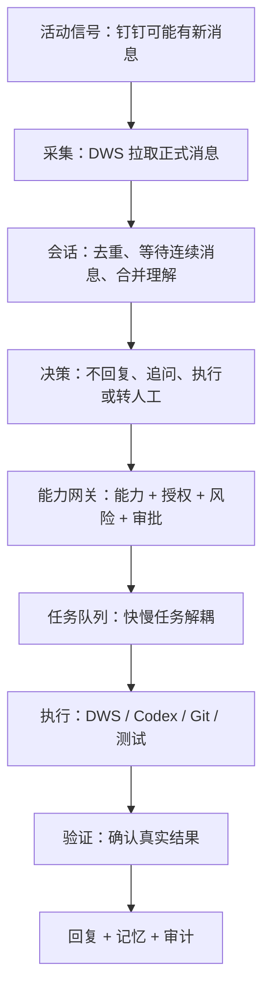
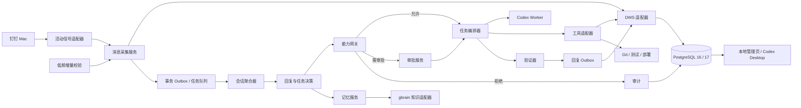
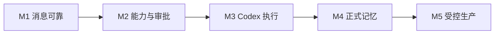

# AI 员工生产级技术设计

状态：受控生产版 v1.2
关联产品文档：[产品需求文档](./产品需求文档.md)

> 建议先阅读 [设计总览](./设计总览.md)。本文只解释“如何保证产品规则真正生效”，术语与总览保持一致。

## 0. 五分钟读懂技术方案



| 设计问题 | 解决办法 |
|---|---|
| 如何实时知道有消息？ | 本地活动信号唤醒，DWS 拉取事实，低频检查补漏 |
| 如何避免连续消息被拆开？ | 3～8 秒安静窗口，按会话合并 |
| 如何避免乱回复？ | 硬规则优先，模型只建议 |
| 如何避免越权？ | 所有工具调用先过能力网关 |
| 如何避免模型拖慢监听？ | 消息入口只入队，Codex 独立消费 |
| 如何避免重复发送？ | 消息唯一键、任务幂等键、副作用账本 |
| 如何记住又不泄露？ | 记忆带来源、权限、有效期和确认状态 |
| 如何出问题后恢复？ | 持久化状态机、租约、验证和补偿 |

## 1. 当前状态与目标状态

### 1.1 当前实现

当前代码已经实现：

- macOS 钉钉本地文件变化作为活动信号，定时检查作为稳定兜底。
- DWS 按游标分页取数，按联系人保存成功检查点，并使用重叠时间窗补漏。
- PostgreSQL 消息唯一键、`SKIP LOCKED` 任务租约、失败重试、死信和副作用账本。
- 多联系人白名单、3 秒安静窗口和同会话连续消息合并。
- 明确闭环硬规则，以及独立 Codex Worker 的上下文复核。
- `draft_reply` 和 `send_message` 能力开关、逐任务人工审批、人工回复复查和 DWS 幂等 UUID。
- 暂停、恢复、拒绝、死信重试和发送未知结果人工处置命令。

当前限制：

- 仓库已提供 LaunchAgent 生成、安装和卸载脚本；目标主机仍需执行现场安装与重启演练。
- 本地文件事件是钉钉私有实现细节，可能随客户端升级失效；失效时会退化到定时检查。
- PostgreSQL 敏感内容使用 AES-256-GCM 字段级加密；生产强制注入固定数据密钥。
- 当前能力网关只开放草稿和单聊发送，没有开放方案、代码、共享文档或部署执行。
- 已提供深度健康、Prometheus 指标、每日加密备份和恢复脚本；正式记忆、管理页面、外部告警和目标主机恢复演练仍未完成。

### 1.2 目标

构建单机优先、可演进到服务端的生产系统：

- DWS 是唯一钉钉业务适配器。
- Codex 是复杂知识工作和研发执行器。
- 业务核心不依赖 DWS、Codex、macOS 或具体数据库。
- 所有外部副作用必须经过能力网关。
- 消息接收和慢任务执行完全解耦。
- 任何操作可追溯、可停止、可恢复、可验证。

## 2. 架构原则

1. **六边形架构**：领域核心只依赖端口；DWS、Codex、数据库和系统事件是适配器。
2. **默认拒绝**：未登记能力、未匹配授权或策略不可用时，不产生副作用。
3. **事件与任务分离**：消息入口不得等待模型或长任务。
4. **至少一次接收、效果上恰好一次**：依靠幂等键和副作用账本实现。
5. **事实可追溯**：回复和记忆必须关联来源。
6. **风险按组合动作计算**：计划在执行前整体评估。
7. **内容与控制分离**：提示词不能授予权限，模型输出不能直接调用高风险工具。
8. **可降级**：Codex、记忆或通知失败时，消息接收与审计仍可运行。

## 3. 有界上下文

| 上下文 | 职责 |
|---|---|
| Ingestion | 接收活动信号、DWS 增量抓取、归一化和去重 |
| Conversation | 安静窗口、消息合并、会话状态和回复必要性 |
| Capability | 能力注册、授权、风险、预算和策略决策 |
| Task | 计划、状态机、队列、执行、验证和补偿 |
| Memory | 候选提取、确认、权限、检索、过期和遗忘 |
| Approval | 审批请求、授权票据、撤销和消费 |
| Audit | 不可篡改事件链、证据、指标和合规导出 |

各上下文通过领域事件协作，不共享可变业务对象。

用通俗的话说：

| 模块 | 只负责什么 | 不负责什么 |
|---|---|---|
| 消息采集 | 找到并保存新消息 | 不判断、不回复 |
| 会话决策 | 判断需不需要处理 | 不直接调用外部工具 |
| 能力网关 | 判断允不允许做 | 不替代模型写方案 |
| 任务编排 | 安排步骤和状态 | 不绕过能力网关 |
| 执行器 | 调用 DWS、Codex 等工具 | 不给自己授权 |
| 记忆 | 保存和检索可复用事实 | 不保存无来源推测 |
| 审计 | 保存证据链 | 不参与业务决策 |

## 4. 目标架构



## 5. 领域模型

### 5.1 核心实体

- `Actor`：用户、AI、管理员或系统执行器。
- `Conversation`：会话聚合根，维护参与者和处理游标。
- `Message`：不可变消息实体，以平台消息 ID 标识。
- `MessageBundle`：安静窗口内的连续消息集合。
- `Intent`：问题、请求、告知、确认、风险、敏感事项。
- `Capability`：机器可读的可执行能力。
- `Grant`：主体在范围和期限内对能力的授权。
- `PolicyDecision`：允许、需审批、追问或拒绝。
- `Task`：从请求到验证的工作单元。
- `Action`：任务中的原子步骤。
- `Approval`：对计划和风险快照的一次授权。
- `SideEffect`：已经或可能改变外部状态的操作。
- `MemoryItem`：带来源、范围、置信度和期限的记忆。
- `AuditEvent`：不可变审计记录。

### 5.2 任务状态机

```text
RECEIVED
→ BUNDLING
→ CLASSIFIED
→ PLANNED
→ POLICY_CHECKED
→ WAITING_APPROVAL | READY
→ RUNNING
→ VERIFYING
→ SUCCEEDED | FAILED | PARTIAL | CANCELLED
→ REPORTED
→ ARCHIVED
```

允许恢复的状态必须持久化。`RUNNING` 进程丢失后转为 `RECOVERING`，检查副作用账本后再决定继续、补偿或人工处理。

## 6. 消息采集

### 6.1 信号源

优先级：

1. 钉钉未来开放的个人消息官方事件。
2. 当前 macOS 本地文件变化信号。
3. 5～15 分钟低频 DWS 增量校验。

本地信号只表示“可能有变化”，不能作为消息事实源。所有正式内容和 ID 必须由 DWS 获取。

### 6.2 增量抓取

- 每个授权会话保存独立游标和最后成功时间。
- 收到信号后查询自上次成功时间减去安全重叠窗口的数据。
- 以 `(tenant_id, platform_message_id)` 唯一约束去重。
- DWS 调用必须使用 JSON 输出并记录非敏感调用元数据。
- 认证失效时熔断，不反复重试。

### 6.3 安静窗口

- 新消息先进入 3 秒窗口。
- 同一发送人在窗口内继续输入则延长，最大 8 秒。
- 问号、明确任务或紧急风险可提前结束窗口。
- 处理前再次检查负责人是否已经人工回复。
- 一个 `MessageBundle` 只产生一次决策。

## 7. 回复必要性决策

采用“确定性规则优先，模型补充”的两阶段策略。

### 7.1 硬规则

- 重复、回执、明确免回复、单纯表情：`NO_REPLY`。
- 明确问题、请求、故障、风险：`NEEDS_ACTION`。
- 敏感主题：`REQUIRES_HUMAN`。
- 无法判断：`MODEL_REVIEW`，但模型只能建议，不能授权。

### 7.2 模型输出

结构化字段：

```json
{
  "decision": "NO_REPLY | REPLY | ACT | ASK | ESCALATE",
  "intent": "string",
  "confidence": 0.0,
  "reason": "string",
  "missingInformation": [],
  "candidateCapabilities": [],
  "sensitivity": []
}
```

置信度阈值按风险调整，而不是统一阈值。

## 8. 能力注册与策略

### 8.1 能力清单示例

```yaml
id: dingtalk.chat.send_as_user
version: 1
description: 以当前授权用户身份发送钉钉消息
inputSchema:
  type: object
  required: [recipientUserId, text]
risk: L3
sideEffect: true
identity: delegated_user
scopes:
  recipients: allowlist
approval:
  default: required
  reusable: false
idempotency:
  key: taskId/actionId
verification:
  type: query_send_status
rollback:
  supported: false
audit:
  redact: [text]
```

### 8.2 策略输入

- 请求者与授权用户。
- 联系人、会话、组织和项目。
- 能力及参数。
- 完整计划和组合风险。
- 数据敏感度。
- 时间、预算、次数和环境。
- 当前审批票据。

### 8.3 策略输出

```text
ALLOW
REQUIRE_APPROVAL
ASK_FOR_INFORMATION
DENY
```

输出必须包含规则 ID、原因、有效期和审计信息。

### 8.4 审批票据

票据绑定：

- 任务和计划哈希。
- 能力及参数范围。
- 审批人。
- 过期时间。
- 最大消费次数。

计划、目标或风险发生变化后，旧票据自动失效。

## 9. 任务编排与 Codex

### 9.1 解耦

消息采集只写任务，不直接启动 Codex。独立 Worker 消费：

- `reply_draft`
- `research`
- `document`
- `code_change`
- `test`
- `release`

### 9.2 Codex 执行模式

- Codex Desktop 是人工控制台和复杂任务接管入口。
- 后台 Worker 使用受限 Codex CLI 或稳定后使用 app-server。
- 每个任务绑定明确工作目录、只读/可写范围和审批策略。
- 默认禁止网络、外部发布、生产凭证和跨项目目录。
- 任务输出采用 JSON Schema，并附带证据文件。
- 超时后进程终止，任务进入 `FAILED_RETRYABLE`，不阻塞消息入口。

### 9.3 代码任务门禁

```text
定位仓库
→ 检查工作区和用户未提交变更
→ 创建隔离分支或工作树
→ 修改
→ 静态检查和测试
→ 差异审查
→ 安全和迁移检查
→ 人工审批
→ 推送/PR
→ 发布审批
→ 部署验证
```

不得覆盖用户改动；不得因为模型声称“测试通过”而跳过真实命令证据。

## 10. DWS 适配器

定义端口：

```ts
interface MessagingPort {
  listMessages(query: MessageQuery): Promise<PlatformMessage[]>;
  sendMessage(command: SendCommand): Promise<SendReceipt>;
  getSendStatus(receiptId: string): Promise<SendStatus>;
}
```

DWS 实现要求：

- 命令调用使用参数数组，禁止拼接 shell 字符串。
- 所有命令使用 `--format json`。
- ID 必须来自 DWS 返回或显式配置，不能猜测。
- 外部写操作先经过能力网关。
- 发送使用稳定幂等 UUID。
- 状态未知时查询，不直接重发。
- 令牌和敏感输出不得进入普通日志。

## 11. 记忆设计

### 11.1 分层

- 工作记忆：数据库中的任务上下文，任务结束后清理。
- 结构化项目/人物/原则记忆：本地数据库。
- 长文档和知识检索：通过 gbrain 适配器。
- 原始资料仍归原系统所有，不复制无关私聊。

### 11.2 MemoryItem

```text
id
type
statement
subject/project
source_type/source_id/source_version
scope
confidence
confirmation_status
sensitivity
valid_from/expires_at
created_by
supersedes
deleted_at
```

### 11.3 写入流程

```text
任务完成
→ 提取候选
→ 敏感与范围检查
→ 自动接受 / 待确认 / 丢弃
→ 建立来源引用
→ 设置期限
→ 写入
```

### 11.4 防止记忆污染

- 模型输出不能直接成为确认事实。
- 新记忆与现有事实冲突时不覆盖，创建冲突记录。
- 来源权限变化时使派生记忆失效。
- 对外回复前进行来源和时效检查。

## 12. 数据模型

生产只使用 PostgreSQL 16 或 17。SQLite 仅作为快速单元测试适配器，不会被生产入口加载，也不会进入发布包。

关键表：

```text
actors
conversations
messages
message_bundles
intents
capabilities
grants
policy_decisions
tasks
task_actions
approvals
approval_tokens
side_effects
send_receipts
memory_items
memory_sources
audit_events
outbox_events
system_leases
```

关键约束：

- `messages(tenant_id, platform_message_id)` 唯一。
- `task_actions(task_id, sequence)` 唯一。
- `side_effects(idempotency_key)` 唯一。
- `approval_tokens(plan_hash, status)` 可验证。
- 业务状态更新与 `outbox_events` 在同一事务提交。

## 13. 队列与并发

- 当前使用 PostgreSQL `FOR UPDATE SKIP LOCKED` 任务队列。
- 每个会话使用串行分区，防止乱序回复。
- 不同会话和只读任务可并发。
- 同一仓库写任务需要仓库级租约。
- 生产发布需要环境级互斥锁。
- Worker 使用租约和心跳；超时任务可恢复。

## 14. 幂等、验证与补偿

### 14.1 幂等

幂等键格式：

```text
tenant/task/action/capability/version
```

执行前写 `side_effects=PENDING`，完成后写回收据。发现相同键时返回已有结果。

### 14.2 验证

- 发消息：查询发送状态或取得平台明确收据。
- 写文档：重新读取目标块并比较。
- 建待办：查询任务 ID 和字段。
- 改代码：检查 diff、测试和工作区。
- 部署：版本、健康检查和关键路径探测。

### 14.3 补偿

每项能力标记：

- 可撤销。
- 可补偿。
- 不可逆。

不可逆动作必须在执行前升级风险，不能用“之后补偿”代替审批。

## 15. 安全设计

### 15.1 威胁

- 钉钉消息中的提示注入。
- 文档内容诱导扩大权限或泄露数据。
- 联系人名称碰撞导致发错人。
- 模型编造 ID、命令或完成状态。
- 重试导致重复发送或重复部署。
- 日志泄露消息、手机号、令牌和代码秘密。
- 记忆把一个项目的信息泄露给另一个项目。
- 本地钉钉升级使事件触发失效。

### 15.2 控制

- 外部内容始终作为数据，不作为系统指令。
- 工具调用只来自能力注册表。
- ID 由适配器解析并进行唯一性验证。
- 策略引擎位于模型之外。
- 秘密仅通过系统密钥链或运行时注入。
- 内容日志加密并限制保留期。
- 每个项目独立作用域和工作目录。
- 钉钉客户端版本变化触发兼容性告警和增量校验。

## 16. 可观测性

### 16.1 指标

- `message_signal_to_fetch_seconds`
- `message_fetch_lag_seconds`
- `message_duplicate_total`
- `bundle_wait_seconds`
- `decision_total{type,rule}`
- `policy_total{decision,capability}`
- `task_duration_seconds{type,status}`
- `codex_timeout_total`
- `approval_wait_seconds`
- `side_effect_total{capability,status}`
- `memory_conflict_total`

### 16.2 日志与追踪

- 统一 `correlation_id = conversation/message/task`。
- 结构化日志默认不含完整消息正文。
- 审计日志记录谁、何时、基于什么、做了什么和结果证据。
- 高风险任务保留计划、审批、工具调用和验证的完整链路。

## 17. SLO 与降级

| 服务 | 目标 |
|---|---|
| 消息检测 | P95 < 5 秒 |
| 入口可用性 | 月度 99.5% |
| 去重 | 重复副作用为 0 |
| 低风险任务 | P95 < 2 分钟或持续汇报进度 |
| 审计 | 已执行副作用覆盖率 100% |

降级：

- 活动信号失效 → 低频增量抓取并告警。
- Codex 不可用 → 只分类、排队、人工接管。
- 记忆不可用 → 使用当前会话，不声称记得历史。
- 策略不可用 → 只允许 L0，拒绝所有副作用。
- 数据库只读 → 停止消费任务，保留监控。

## 18. 部署

### 18.1 单机生产版本

- macOS `LaunchAgent`：
  - `com.ai-employee.listener`
  - `com.ai-employee.worker`
  - `com.ai-employee.health`
  - `com.ai-employee.backup`
- 本机或受控远程 PostgreSQL 16 / 17；远程连接强制 TLS。
- `600` 权限配置文件保存运行引用和密钥，Git 不跟踪。
- 日志写入受限目录。
- 深度健康接口提供存活、就绪和 Prometheus 指标；CLI 提供暂停开关。

### 18.2 服务端演进

个人钉钉消息仍在授权 Mac 获取，经过端到端加密通道提交规范化事件；任务、审计和管理服务可以迁移到受控服务器。不得未经授权上传完整私聊历史。

## 19. 测试策略

### 19.1 单元测试

- 回复必要性规则。
- 风险组合和能力策略。
- 安静窗口和消息合并。
- 任务状态机。
- 记忆范围、过期和冲突。
- 幂等键和审批票据。

### 19.2 合约测试

- DWS JSON 输出解析。
- Codex 结构化输出。
- 数据库端口。
- gbrain 记忆适配器。

### 19.3 集成测试

- 本地信号 → DWS → 消息入库。
- 消息 → 策略 → 队列 → 草稿。
- 审批 → DWS 发送 → 状态确认。
- 重启后任务恢复。

### 19.4 故障注入

- DWS 超时和认证失效。
- Codex 超时、崩溃和无效 JSON。
- 数据库短暂不可用。
- 发送结果未知。
- 重复事件、乱序事件和连续消息。
- 钉钉升级导致监听路径变化。

### 19.5 安全测试

- 消息和文档提示注入。
- 跨项目数据访问。
- 未授权能力调用。
- 审批票据重放和参数替换。
- 日志与错误输出秘密扫描。

## 20. 实施路线



### M1：可靠消息底座

- PostgreSQL、消息表、检查点、事务任务队列和迁移校验。已完成。
- 多联系人配置。已完成。
- 安静窗口、合并、去重和恢复。已完成。
- LaunchAgent、深度健康和指标。已完成代码，待目标主机演练。

### M2：能力和审批

- 草稿和发送能力开关。已完成基础版。
- 单次人工审批票据。已完成基础版。
- DWS 发送适配器、幂等与未知结果处置。已完成基础版。
- 项目级能力 manifest 和组合风险策略。
- 影子模式评估。

### M3：Codex Worker

- 独立任务队列和草稿 Worker。已完成。
- 方案和代码任务。
- 工作目录、超时、证据和人工接管。

### M4：记忆

- 结构化记忆与来源。
- gbrain 检索适配器。
- 确认、过期、遗忘和权限传播。

### M5：受控生产

- 深度健康、指标、加密备份和恢复脚本。已完成代码。
- 管理页、外部告警和目标主机恢复演练。
- 安全审计、故障注入和影子模式验收。
- 逐能力开放 L0～L3；L4 保持强审批。

## 21. 架构决策

- **DWS 而不是直接钉钉 API**：满足统一工具面和用户授权偏好；通过适配器隔离变化。
- **本地文件事件只是信号**：避免读取私有数据库，同时承认其不稳定性。
- **消息入口不运行 Codex**：避免模型超时阻塞实时采集。
- **规则优先、模型补充**：降低成本和错误自动回复。
- **Codex Desktop 是控制台，Worker 是执行入口**：兼顾人工协作和后台自动化。
- **能力网关独立于提示词**：模型无法自行授予权限。
- **结构化数据库替代 JSONL**：支持事务、恢复、并发和审计。
- **记忆带来源和权限**：避免幻觉沉淀与跨项目泄露。

## 22. 已完成迁移与下一步

已完成：

1. DWS 读取和本地活动信号已拆分为适配器。
2. 联系人改为环境变量白名单，支持多个单聊联系人。
3. PostgreSQL 消息表、租户约束和唯一键已经替换 `state.json`。
4. 事务任务表已经替换 JSONL 队列。
5. Codex Worker 已成为独立进程，不阻塞监听器。
6. 草稿和发送能力开关、逐任务审批、幂等 UUID 与副作用账本已落地。

下一步：

1. 将联系人和项目授权从环境变量升级为可审计配置。
2. 完成影子模式标注、误判统计和告警。
3. 为代码、共享文档和部署分别实现能力 manifest、项目绑定、验收与回滚。
4. 接入系统密钥管理、管理页面、外部告警并完成目标主机恢复演练。

## 23. 产品需求与技术证据

| 产品要求 | 技术实现 | 验证证据 |
|---|---|---|
| 消息不漏不重 | 增量游标、唯一键、低频补偿 | 重复、乱序、断网集成测试 |
| 正确判断是否回复 | 安静窗口、硬规则、模型复核 | 影子模式标注集 |
| 不越权 | 能力网关、授权和审批票据 | 未授权调用与票据重放测试 |
| Codex 不阻塞消息 | 独立队列和 Worker | Codex 超时故障注入 |
| 不重复产生副作用 | 幂等键和副作用账本 | 重启、重试、结果未知测试 |
| 记忆可信 | 来源、范围、期限和确认状态 | 冲突、过期、撤权测试 |
| 可以人工接管 | 暂停开关、取消和租约 | 真实暂停与恢复演练 |
| 可以生产运维 | 指标、日志、审计、备份 | SLO、恢复和安全演练 |
