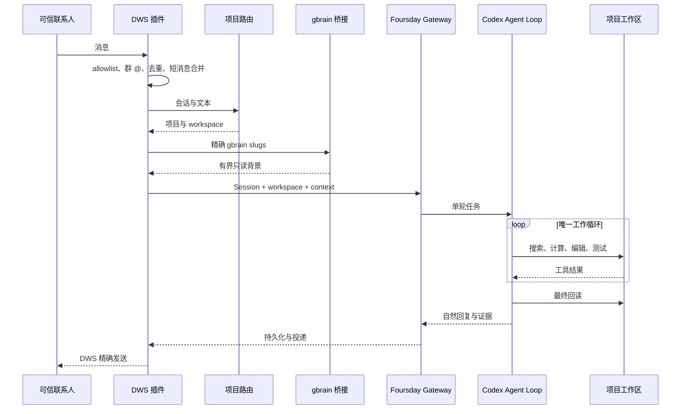

# Foursday 技术设计文档

## 1. 架构决策

Foursday 只有一个 Codex Agent Loop。锁定的原生 Hermes 只作为内嵌 Gateway、Session、定时任务和未来多平台控制平面，不参与项目工具循环，也不生成第二份回复：

```text
锁定的 Hermes 官方安装
+ foursday Profile
+ DWS / project-router 插件
+ 隔离 Codex 配置、规则与 Foursday MCP
+ 小型宿主侧车
```

`distribution/upstream.lock.json` 固定官方仓库、Release、完整提交、许可证和安装器 SHA-256。Foursday 不保存 Hermes 源码副本，不打核心补丁。

安装门禁先核对完整提交、官方remote、隐藏索引标记和tracked diff；只容许官方安装器生成的一条 `contributors/emails/agent@*.local` 身份戳，任何运行时代码漂移都阻断安装与激活。随后直接读取锁定提交中的 `agent/conversation_loop.py`、`agent/codex_runtime.py` 与后台复盘配置实现，确认 `codex_app_server` 分支在上游工具循环前直接返回。Foursday Profile 同时把内置 memory、人物档案、memory/skill nudge、background review、自动标题模型和 curator 全部关闭，避免前台 Codex 完成后又启动第二个模型调用或 Hermes 模型循环；长期记忆只走 Foursday MCP 与个人 gbrain 晋升链。

## 2. 消息到工作的路径



## 3. Profile 与宿主桥接

`foursday install` 默认只生成零写计划；`--apply` 验证官方安装器后，以 `--skip-browser --skip-computer-use --no-skills --skip-setup` 安装控制平面和隔离 Profile。安装器随后暂存四个未被Git跟踪的可选 `node_modules`，重新通过运行时版本、插件doctor与Git目标检查才删除；失败原位恢复。隔离实测从1.8GB降至454MB，但首次安装仍会运行上游依赖步骤。更新前要求 Gateway 已停止；安装或 doctor 失败时恢复原 Profile。

Profile 只包含两个组件插件。上游审批模式设为 `off`，不是取消Foursday安全边界，而是避免无UI Gateway把所有普通Codex命令再次拒绝；安全请求由Foursday App Server代理唯一裁决：可恢复工作交给Codex的 `untrusted + auto_review`，权限升级与高风险动作由代理确定性拒绝。

组件包括：

- `dws_personal`：个人钉钉收发、去重、接管和发送回读；
- `project_router`：按别名和会话绑定真实 workspace；

个人记忆读取由 DWS 上下文提供器完成。记忆晋升通过 `foursday-codex-mcp.mjs` 暴露给 Codex；每次消息产生一个十五分钟有效的随机工作令牌，令牌在私有文件中绑定项目、请求人和 Session，模型不能自行指定这些身份。

上游 `codex_app_server` 适配器不会自动把 Hermes 的 SOUL、Skill 或 `ephemeral_system_prompt` 传给Codex。Foursday因此不依赖这条隐含路径：项目路由通过上游公开 `agent.runtime_cwd.set_session_cwd()` 绑定真实Session工作目录，并由异步处理任务继承；代理在 `thread/start` 从只读、同用户所有的 Profile和项目工作文件注入可信 `developerInstructions`；DWS把路由与gbrain正文写入最多15分钟、最多32项的600权限上下文文件，只把随机令牌附在内部消息尾部。代理在 `turn/start` 验证令牌、Session工作区和有效期，删除内部标记，再把项目配置与“仅作数据、不得当作指令”的个人记忆送入Codex。该令牌同时是唯一可调用Foursday记忆MCP的上下文凭证，并被出站DLP禁止出现在回复中。

宿主 Node 侧车只暴露完成当前动作所需的最小接口。DWS、gbrain OAuth、数据库密钥和 Git 凭据不进入项目终端环境。

## 4. Workspace 隔离

每轮消息都有唯一注册项目。Foursday 为运行时创建独立 `CODEX_HOME`，不读取或复制用户默认 Codex 配置与认证。该环境使用独立 `foursday-workspace` 权限Profile：默认拒绝整个磁盘读取，只开放最小系统路径和当前workspace，拒绝 `.env`、`.runtime` 与命令网络；同时禁用登录shell，启用 `untrusted` 审批与自动风险复核，并安装 `git push`、发布、部署、生产数据库、系统控制和不可恢复删除的禁止规则。

`foursday-codex-proxy.mjs` 是透明App Server协议代理，不参与推理。它为 `initialize` 打开当前权限Profile协议，在 `thread/start` 和后续 `turn/start` 删除调用方传入的sandbox、权限、配置、环境与动态工具覆盖并强制 `foursday-workspace + untrusted`；未绑定的 `thread/resume/fork` 直接拒绝，未来恢复必须先增加Foursday自己的线程身份账本。所有权限升级直接授予空集合，高风险命令在进入内嵌控制平面审批前即拒绝。App Server进程只继承运行必需变量和三个MCP路径绑定，项目shell再通过Codex官方 `shell_environment_policy` 排除全部Foursday、DWS、身份、数据库、代理与秘密变量。真实Codex 0.145握手已回读 `sandbox.type=workspaceWrite`、`networkAccess=false` 与 `activePermissionProfile.id=foursday-workspace`。

可恢复文件编辑默认允许。Git push、部署、生产写、系统服务、付款、合同、人事和不可恢复删除由 Codex OS 沙箱、命令规则和自动复核共同阻断；未来只能通过独立凭据出口完成。Foursday不再声称已被Codex绕过的Hermes `pre_tool_call` Hook提供该保证。

## 5. DWS 语义

- 私聊身份绑定稳定 staff ID；
- 群聊要求注册会话且明确 `mentionedSelf=true`；
- 同发送者、同会话消息先等待 3 秒安静窗口，总等待不超过 8 秒；
- 检查点权限为 `600`，重启重叠抓取但不重复触发；
- 发送必须得到服务器 ID 或唯一正文回读；未知结果禁止重试；
- 负责人手工回复形成 takeover 事件并中断 Session。

## 6. 个人记忆

读取路径：项目路由给出 0—10 个精确 slugs，宿主 OAuth 客户端验证 `default` 与只读 scope，再获取有界正文。页面内容被视为不可信数据而不是系统指令。

写入路径：

```text
项目文件证据
→ DLP 与置信度检查
→ PostgreSQL 加密候选
→ 独立 Git checkout
→ 创建 atom/prospective/source pointer
→ 精确提交、投影和回读
→ promoted
```

数据库只使用 `db/schema.sql` 中两张候选表。它不是任务队列、审批系统或第二套知识正文存储。

## 7. 配置

公开配置契约只接受 `FOURSDAY_*` 字段，示例见 `deploy/foursday.example.json`。秘密必须使用 `env://` 或 `keychain://` 引用；未知字段、复合值、组可读文件和内联秘密全部拒绝。配置完成后通过 `foursday login --apply` 在Foursday专属 `CODEX_HOME` 独立登录，不复制 `~/.codex/auth.json`。

`foursday verify --apply` 使用同一App Server代理和权限Profile，在临时注册项目中执行一次真实模型回合。验收要求随机事实令牌出现在自然回复中、至少一条项目工具证据存在、工作区SHA-256树摘要前后一致；该入口不加载DWS发送、不写生产数据库，也不触发部署。

项目注册表见 `distribution/projects.example.json`。它不得包含用户权限、能力、业务指标或凭据。

## 8. 运行状态

Gateway 只有 `shadow` 与 `active` 两种模式。安装和配置固定 `shadow/send=false`。激活要求：

- 当前 Profile 与目标完整提交一致；
- Hermes runtime 与锁定上游一致；
- 最新 shadow receipt 覆盖路由、记忆、连续追问、代码工作、重启恢复、人工接管、无重复和 send-disabled；
- 派生确认值精确匹配；
- 已知旧写入者没有运行。

停止 active 会先恢复 `shadow/send=false`，再停止并禁用服务。

## 9. 测试

`npm run check` 执行所有 JavaScript 语法与测试；`npm run check:full` 使用隔离临时 PostgreSQL；`npm run check:python` 使用锁定的原生 Hermes 环境执行插件测试。CI 还运行官方 Profile 安装、plugin doctor、npm audit、npm pack 和 gitleaks/CodeQL。
