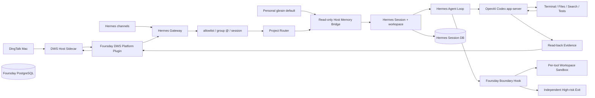
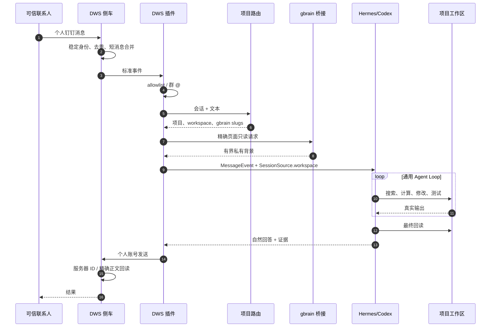

# Foursday V3 Hermes 技术设计

状态：Gate 2 已通过；当前生产仍运行旧 Node.js Runtime，Hermes 生产迁移尚未激活。
产品定义：[产品需求文档](./产品需求文档.md)
当前状态：[完成度矩阵](./完成度矩阵.md)
验收证据：[自主工作分身迁移验收报告](./自主工作分身迁移验收报告.md)

## 1. 核心架构决策

Foursday 不再维护完整自研 Agent Runtime，而采用：

```text
精确 Hermes 上游
+ 极小、可校验的 Session workspace 补丁
+ Foursday 外部插件
+ Foursday Profile 与 Skills
+ 独立产品界面和高风险出口
```

当前锁定：

| 项目 | 值 |
|---|---|
| 上游 | `NousResearch/hermes-agent` |
| Release | `v2026.8.18` |
| Python package | `0.20.4` |
| Commit | `e624e9fde561e1add9388384012b295fde669ade` |
| License | MIT，摘要固定在 `hermes/upstream.lock.json` |
| 补丁 | 1 个、3 个文件、摘要固定在 `hermes/patches.lock.json` |

无法通过插件、Hook、MCP、Memory Provider、Skill 或配置解决的问题，才允许进入补丁；补丁应优先贡献上游。

## 2. 系统上下文



宿主侧拥有 DWS、gbrain OAuth 和未来高风险出口。Agent 工具侧只看注册项目，不持有这些凭据。

## 3. 一次消息如何完成工作



项目歧义时不进入工具循环，只生成一次最小澄清。陌生人和未 @ 群消息在 Session 建立前丢弃。

## 4. 上游、补丁和发行层

### 4.1 上游锁

`src/hermes-upstream.mjs` 校验官方无凭据 HTTPS 仓库、完整 SHA、日期 Release、Python 范围和许可证摘要。`scripts/准备Hermes候选.mjs` 默认只输出计划，显式 `--apply` 只写 `.runtime/hermes-poc`。

### 4.2 Workspace 薄补丁

Hermes 平台插件可以生成 SessionSource，但上游版本不能持久化每个消息会话的项目 cwd。锁定补丁只改：

- `gateway/session.py`：保存 `workspace_path`；
- `gateway/platforms/base.py`：构建带 workspace 的 source；
- `gateway/run.py`：把 workspace 绑定为 Session cwd。

补丁脚本验证基线提交、补丁摘要、文件白名单和最终 diff；官方 Session/Platform/env/merge/interrupt 契约测试为 202 通过、1 条条件跳过。

### 4.3 Foursday 发行层

`scripts/安装Hermes发行层.mjs` 原子安装：

- `dws-personal-platform`；
- `foursday-project-router`；
- `foursday-high-risk-boundary`；
- `profiles/foursday/SOUL.md`；
- `skills/foursday-project-work`。

失败时恢复旧组件；启用插件时固定 `--no-allow-tool-override`，禁止覆盖 Hermes 内置工具。默认零写，安装也不启动 Gateway。

## 5. DWS 个人钉钉

### 5.1 宿主侧车

`src/hermes-dws-sidecar.mjs` 复用 `src/dws.mjs`，而不是在 Python 中重写 DWS 协议。JSON Lines 侧车只接收白名单环境，不继承数据库、数据密钥、管理令牌或部署凭据。

活动信号：DingTalkMac 文件事件为主，30 秒低频补漏。消息正文始终由 DWS 获取。

### 5.2 身份和会话

- 私聊：`conversationId + stable staffId`；
- 群聊：白名单 conversation + `mentionedSelf=true`；
- staffId 与 OpenDingTalk ID 通过通讯录精确绑定；
- OpenDingTalk ID 类型显式传递，不再依赖 `DT...` 前缀猜测；
- 平台配置与 Agent 工具环境分离。

### 5.3 连续消息

Python 平台插件在 3 秒安静窗口内合并同会话、同发送人的短消息，首条起总等待不超过 8 秒。较晚消息不强行合并，而复用同一 Hermes Session。

### 5.4 去重和重启恢复

权限 600 的侧车检查点保存：

- 最近 5,000 个消息 ID；
- 会话收件人及身份类型；
- 活动会话和来源时间；
- 已报告人工接管；
- 每个拉取目标的检查点。

重启后重叠抓取不会重复触发，恢复中的结果仍能找到正确收件人。

### 5.5 发送、回读和未知状态

发送前 Python 插件拒绝秘密材料和不可撤销承诺。侧车使用幂等 UUID 调用 DWS：

1. 回执含服务器消息 ID → 成功；
2. 回执无 ID → 最多 10 次有界 DWS 精确正文回读；
3. DWS 将换行压平时，比较前统一空白；
4. 唯一消息 ID 回读成功 → 成功；
5. 仍无法确定 → `outcomeUnknown=true`、`retryable=false`，禁止重发。

### 5.6 人工接管与撤回

侧车通过本人身份、会话、来源时间和自动发送证据识别手工回复，发出 `human_takeover` 控制事件；平台插件调用 Hermes `interrupt_session_activity` 并写审计。撤回事件只保留会话、参与者、消息 ID 和时间，不携带正文。

## 6. 项目自动路由

`hermes/plugins/project_router/registry.py` 读取权限受保护的最小注册表。

允许字段：

```json
{
  "id": "project_id",
  "name": "Project Name",
  "aliases": ["alias"],
  "root": "/absolute/canonical/path",
  "gitRemote": "https://github.com/org/repo.git",
  "gbrainSlugs": ["projects/example"],
  "runInstructions": "Read project instructions first.",
  "isolation": "workspace-write"
}
```

不允许 requester、capability、业务指标、JSON Pointer、令牌或审批配置。

路由规则：

- 新会话按最长明确别名唯一命中；
- ASCII 别名要求安全边界，文件路径 `outputs/foursday-...` 不能触发切换；
- 自然语言明确项目名可以切换；
- 无新项目名时复用权限 600 的会话绑定；
- 多个同强度候选返回歧义，不枚举无关私人项目。

## 7. 个人 gbrain

### 7.1 权威边界

个人 PRIVATE gbrain Git 是唯一长期业务知识权威。Foursday 不创建 overlay Git，不复制页面正文，不做双向同步。

### 7.2 宿主只读桥接

`src/hermes-personal-memory-context.mjs` 只从权限 600 的生产配置读取个人记忆相关字段，并只解析专用 OAuth secret 引用；其他生产秘密不进入进程。启动探针要求：

身份固定为 `default + read-only OAuth`；个人记忆凭据只留在宿主桥接，不进入 Hermes、Codex 或项目工具环境。

```text
transport = oauth
source_id = default
scopes contains read
scopes excludes write/admin
```

项目路由传入精确 slugs；正文经过长度、凭据、敏感人物和 confidential 过滤，再作为“不可信资料”注入。操作数量、成本和状态仍以当前 workspace 为准。

### 7.3 存储责任

| 存储 | 责任 |
|---|---|
| 个人 gbrain Git | 长期知识正文与来源 |
| gbrain PostgreSQL | 可重建检索/实体/图投影 |
| Hermes Session DB | 会话、工具调用、短期执行和恢复 |
| Foursday PostgreSQL | 旧 Runtime 的消息、审批、计划和审计兼容状态 |

Hermes `MEMORY.md` 只能保存 Agent 自身操作经验，禁止沉淀项目事实副本。

## 8. Agent 执行环境

### 8.1 模型与工具分离

Hermes/Codex 模型进程保留模型认证；每次终端工具调用都被 `pre_tool_call` Hook 改写到独立 macOS Sandbox。这样模型可以调用 Codex，但项目命令看不到模型凭据。

### 8.2 项目沙箱

沙箱默认：

- 只读系统工具、Homebrew 和当前注册项目；
- `workspace-write` 只写当前项目；
- 拒绝当前项目内 `.runtime` 和 `.env`；
- 拒绝未注册目录、其他项目、钥匙串和 `/usr/bin/security`；
- 终端无网络；
- 配置、注册表或 profile 生成异常时失败关闭。

直接文件工具同样做 canonical path 和项目隔离检查，不能绕过终端沙箱。

### 8.3 Web 出站

Web 搜索是独立工具，不继承项目终端网络。查询含私钥、密码、token、数据库 URL 或常见云凭据时被 Hook 拒绝。

## 9. 高风险硬边界

`hermes/plugins/foursday_boundary/` 在工具执行前阻断：

- Git push；
- PR merge、Release 和 package publish；
- kubectl/helm/terraform、生产部署与生产发布脚本；
- 生产 SQL 写入；
- `rm -rf`、shred、磁盘擦除；
- launchctl、sudo、osascript、killall 等系统控制；
- 付款、合同、人事命令；
- 钥匙串、`.env`、auth 和生产配置读取；
- 通过 Web 或 DWS 外发秘密；
- 代表负责人作不可撤销承诺。

Hook 自身异常必须返回 block。高风险动作未来由独立凭据出口完成，不能临时关闭沙箱后让普通 Agent 执行。

## 10. Session、证据和数据

### 10.1 Hermes Session

Session key 绑定平台、会话和用户。数据库保存用户/助手消息、工具调用、工作区和 interrupt 状态。当前 Foursday 补丁保证重启后仍恢复正确 workspace。

### 10.2 证据

每次工作至少记录：

- 项目和 canonical workspace；
- 来源消息 ID；
- 工具名、命令、cwd 和结果；
- 修改文件与哈希；
- 测试命令和退出结果；
- 发送回执/服务器 ID；
- 最终自然回复。

Gate 2 使用 Session DB、文件哈希、真实 DWS readback 和测试日志，而不是模型自述。

### 10.3 隐私

公开证据只包含数量、稳定哈希、状态和非敏感路径。token、连接串、个人聊天原文和真实用户 ID 不进入仓库文档。

## 11. 失败与降级

| 失败 | 行为 |
|---|---|
| 身份无法核对 | 丢弃，不建 Session |
| 项目歧义 | 只问一个项目澄清问题 |
| gbrain 不可用 | 保留项目工作能力，但明确缺少长期背景，不缓存旧正文 |
| Codex/工具失败 | 保留证据，继续可恢复修复；耗尽后自然说明 |
| 工具边界配置异常 | block，不失败开放 |
| 发送结果未知 | 不重试，进入独立 readback/人工核对 |
| 人工接管 | interrupt，丢弃旧结果，不补发 |
| Gateway 重启 | 检查点去重、恢复收件人和 Session workspace |
| 生产旧 Runtime 不健康 | 与 Hermes PoC 分开报告，不把候选绿灯冒充生产就绪 |

## 12. 安装、运行和迁移

### 12.1 本地候选

```bash
npm run hermes:prepare -- --apply
npm run hermes:patch -- --apply
npm run hermes:install
npm run hermes:install -- --apply
```

三层都只写 `.runtime/hermes-poc`。发行层安装失败会恢复旧组件；不会自动启动 Gateway。

### 12.2 生产迁移原则

当前生产仍运行 `listener / worker / executor / proactive / admin / health / alert` 等 Node.js 服务。迁移前必须单独设计：

- 消息游标和去重边界；
- 活动任务 drain；
- Hermes Gateway 常驻配置；
- DWS 单写者切换；
- 旧 Runtime 只读观察期；
- 回退到旧消息入口的条件；
- 现有 `/ready` 503 的独立修复。

不能同时让新旧 Runtime 对同一会话自动发送。

## 13. 测试与验收

| 层级 | 证据 |
|---|---|
| 上游锁/补丁 | Node lock tests、补丁摘要和文件白名单 |
| Hermes 上游 | Session/Platform/env/merge/interrupt 202 通过、1 条条件跳过 |
| Python 插件 | DWS、路由、gbrain、边界、Session workspace、shadow runner 30 项 |
| Node 宿主 | DWS 侧车、个人记忆桥接、候选安装和 tarball |
| Foursday 回归 | 全量通过；当前数量只在[完成度矩阵](./完成度矩阵.md)维护 |
| 安全 | npm audit 0、凭据扫描 0、无网络/越界/高风险反向测试 |
| 真实 P0 | 原会话接收与回复、连续追问、真实文档/分析/代码、本人接管 |

全部 12 项门槛见[迁移验收报告](./自主工作分身迁移验收报告.md)。

## 14. 模块地图

| 模块 | 文件 |
|---|---|
| 上游锁 | `hermes/upstream.lock.json`、`src/hermes-upstream.mjs` |
| 候选安装 | `src/hermes-candidate.mjs`、`scripts/准备Hermes候选.mjs` |
| 补丁层 | `hermes/patches/`、`src/hermes-patches.mjs`、`scripts/准备Hermes补丁层.mjs` |
| 发行层安装 | `scripts/安装Hermes发行层.mjs` |
| DWS 宿主侧车 | `src/hermes-dws-sidecar.mjs`、`src/dws.mjs` |
| DWS 平台插件 | `hermes/plugins/dws_personal/` |
| 项目路由 | `hermes/plugins/project_router/` |
| gbrain 桥接 | `src/hermes-personal-memory-context.mjs`、`hermes/plugins/dws_personal/memory.py` |
| 高风险边界 | `hermes/plugins/foursday_boundary/` |
| Profile / Skill | `hermes/profile/`、`hermes/skills/` |
| 影子验证 | `hermes/shadow_runner.py`、`hermes/tests/`、`test/hermes-*.test.mjs` |

## 15. 旧 Runtime 兼容层

旧 Node.js Runtime 的 capability、plan、approval、budget、recipe、PostgreSQL 状态机和办公适配器继续保护当前生产。它们属于 Enterprise / Governed Mode 和迁移回退，不再定义 V3 个人模式。

旧生产的具体服务、数据库、备份、发布与回退只在[生产运维手册](./生产运维手册.md)维护。旧能力与记忆操作只在[能力清单与正式记忆](./能力清单与正式记忆.md)维护。

## 16. 不可重新引入的旧方向

没有新 ADR 和验收证据，不得重新添加 `project_evidence_read`、`produced_questions`、固定 JSON Pointer、固定数量回复、逐联系人 requester 或新的自研 Agent Loop。权威删除区见[完成度矩阵](./完成度矩阵.md)。
