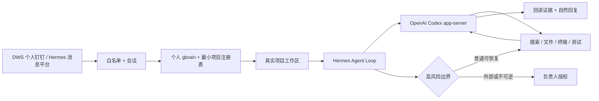

<div align="center">


# Foursday 中文说明

**由个人记忆驱动、能够在真实项目中工作的 AI 工作分身。**

可信消息 → 个人上下文 → 真实工作区 → Hermes + Codex → 已验证工作 → 自然回复。

[English](../../README.md) · [架构地图](../设计总览.md) · [Gate 2 证据](../历史/自主工作分身迁移验收报告.md) · [安全说明](./安全说明.md) · [参与贡献](./参与贡献.md)

[](https://github.com/ruiwang20010702/foursday/actions/workflows/check.yml)
[](https://github.com/ruiwang20010702/foursday/actions/workflows/security.yml)
[](../../LICENSE)

</div>

## Foursday 是什么

Foursday 使用个人 gbrain 和 Hermes 通用 Agent Loop 完成工作，不再为每一种问题新增 capability、JSON Pointer、请求人配置或固定回复模板。

对白名单可信联系人，普通可恢复工作默认自主执行：

- 理解会话并自动识别项目；
- 进入真实项目目录；
- 阅读文件、脚本、台账和 Git 状态；
- 计算、分析、整理文档或修改代码；
- 运行测试并根据失败继续修复；
- 回读真实结果，带证据自然回复。

Git 推送、PR 合并、生产部署、生产改数、不可恢复删除、付款、合同、人事决定、秘密外发和不可撤销承诺继续由独立硬边界阻断。

## 一条命令安装

需要 macOS 和 Git。经过摘要校验的 Hermes 官方安装器会自行管理 Python、Node.js 与 `uv`。

```bash
git clone https://github.com/ruiwang20010702/foursday.git && cd foursday && npm ci --ignore-scripts && npm run hermes:setup -- --apply
```

已经克隆仓库时，先运行 `npm run hermes:setup` 查看零写预览，再加 `-- --apply`。Foursday 会从锁定的上游完整提交下载 Hermes 官方安装器、核对 SHA-256、安装原生 Runtime，再安装隔离的 `foursday` Profile 发行层；插件、Profile、Skills 与宿主桥接都在该 Profile 中，Hermes 核心不再复制或打补丁。

通过 npm/GitHub 包安装时，`foursday install` 是同一原生零写预览，`foursday install --apply` 使用同一官方 Profile 路径；旧 overlay/Node 初始化器不再是默认安装命令。

安装过程**不会**复制凭据、启动 Gateway、发送消息或切换 active。随后用 `npm run hermes:configure` 配置 Profile，再用 `npm run hermes:gateway -- install-shadow --apply` 安装官方的关闭发送 Gateway；active 仍需独立完成单写者切换。

Profile Gateway 运行时禁止更新。已有 Profile 会先导出到权限 `600/700` 的临时私有归档；安装、依赖或插件 doctor 任一步失败，自动使用官方 import 恢复旧 Profile。active 必须绑定未过期的私有 shadow 验收回执、同一完整提交和派生确认值。`npm run hermes:gateway -- remove-profile` 只做零写卸载预览；提交页面显示的 `REMOVE-FOURSDAY-PROFILE` 确认后，才使用 Hermes 官方命令删除 Foursday Gateway、别名、Profile 和随附插件，保留原生 Hermes、生产配置与个人 gbrain。

## 架构



Foursday 是建立在精确兼容 Hermes 上游之上的原生 Profile 发行层：

- 固定 Hermes `v2026.8.18` / `0.20.4`；
- DWS、项目路由、个人 gbrain 和高风险边界四个外部插件；
- Foursday Profile 与通用项目工作 Skill；
- 使用官方逐轮 Hook 固定项目 workspace，不再修改 Hermes 核心；
- 不维护 Hermes Fork、复制虚拟环境、自研 Agent Loop 或第二套业务知识库。

[查看权威架构地图](../设计总览.md)。

## 记忆模型

```text
个人 PRIVATE gbrain Git → 长期业务知识唯一权威
个人 gbrain PostgreSQL  → 可重建的搜索、实体和图索引
Hermes Session DB       → 会话、工具调用和短期执行上下文
Foursday PostgreSQL     → 保留的回退与治理状态
```

gbrain OAuth 凭据只存在于宿主只读桥接进程。Agent 终端拿不到凭据、生产配置、DWS 可执行文件、部署密钥或网络。

## 生产状态

本机 V3 候选已通过全部 12 项 PoC 门槛：

- 从个人钉钉原会话真实接收 DWS 消息；
- 自主核对 2.2 项目：正式成品 `68,786`，释义级源记录 `81,088`；
- 同一 Session 连续回答放行量、未通过量、问题批次、成本和原因；
- 在真实项目完成文档、分析和代码修改并回读；
- 本人自聊真实发送与人工接管 interrupt；
- 经单独授权向原联系人发送自然更正，独立回读精确正文只有一条；
- 陌生人、未 @ 群聊、项目歧义、秘密、网络、推送和部署均失败关闭；
- Foursday 全量回归通过；实时数量只在[完成度矩阵](../完成度矩阵.md)维护；
- Hermes 上游契约：202 通过、1 条条件跳过。

当前生产处于主动安全停机审阅态：数据库全局暂停为 `true`，此前自管 Gateway 与原生 Profile Gateway 均已停止并由 launchd 持久禁用；发送、执行、主动工作、自动审批和个人记忆读写全部关闭。只保留本机管理台与只读健康面。原生 `~/.hermes` 迁移已经版本化供审阅，但尚未取得生产权限。实时边界见[完成度矩阵](../完成度矩阵.md)。

[查看完整 Gate 2 报告](../历史/自主工作分身迁移验收报告.md)。

旧的 `hermes:prepare`、`hermes:patch` 和 `hermes:install` 暂时只保留给现有迁移回退。新安装使用原生安装、Profile 配置、官方插件诊断和官方 Gateway 服务命令。详见[英文部署指南](../en/deployment.md)。

## 文档导航

| 想了解 | 权威来源 |
|---|---|
| 产品定义与验收 | [产品需求文档](../产品需求文档.md) |
| 架构和模块地图 | [设计总览](../设计总览.md) |
| 具体实现规则 | [技术设计文档](../技术设计文档.md) |
| 当前状态和已撤销概念 | [完成度矩阵](../完成度矩阵.md) |
| 迁移验证证据 | [Gate 2 报告](../历史/自主工作分身迁移验收报告.md) |
| 当前生产运维 | [旧 Runtime 运维手册](../生产运维手册.md) |
| 历史架构决策 | [Hermes 迁移决策](../历史/自主工作分身架构迁移方案.md) |

## 路线图

- [x] Hermes/Codex 通用 Loop、DWS、gbrain、项目路由、证据与硬边界
- [x] 真实 P0 会话、追问、项目工作、发送回读和人工接管
- [x] 固定官方安装器、零核心补丁的原生 Profile 发行层
- [x] Gate 2 候选已提交并推送到 `main`
- [ ] 从 Foursday 自管 Gateway 受控迁移到原生 Hermes Profile Gateway
- [ ] 飞书、企业微信、Slack、Teams、Gmail 和 Google Workspace 发行配置

## 许可证

[MIT](../../LICENSE)
