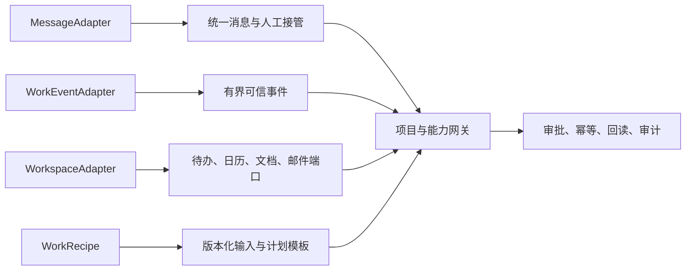

# Foursday 集成扩展指南

> 文档角色：消息平台、MCP、Skill 与配方的扩展指南；架构边界以[技术设计](../技术设计文档.md)为准。

> V3 方向：优先实现 Hermes 平台插件、MCP 或 Skill；不要为每个业务问题新增旧 Runtime capability/adapter。旧契约只用于当前生产兼容和 Enterprise Mode。

本文说明如何给 Foursday 增加消息渠道、工作事件、办公空间和工作配方。示例清单是安全契约，不是已经可用的生产连接器。

## 当前支持矩阵

| 集成 | 接入方式 | 是否依赖 DWS | 当前状态 |
|---|---|---:|---|
| 钉钉 | `DingTalkDwsAdapter` | 是 | 生产实现 |
| 飞书 | 开放平台事件、消息 API 与官方长连接 | 否 | 代码实现；生产凭据向导待完成 |
| Slack / Teams | `MessageAdapter` 示例清单 | 否 | 契约示例，不含远程调用实现 |
| Gmail / Google Workspace | `WorkspaceAdapter` 示例清单 | 否 | 契约示例，不含远程调用实现 |
| GitHub | Issue 事件规范化、Git 与 `gh` Draft PR | 否 | 已实现受控开发闭环 |

## 四类扩展



每个适配器必须声明稳定 ID、`1.0` 契约版本、所需权限和运行时秘密名称，并显式开启白名单、幂等、人工接管、目标回读和结果未知五项安全保证，缺一项即拒绝加载。清单不得包含令牌、连接串、Cookie、私钥或真实账号。社区配方只描述输入和计划模板，不能声明运行时权限，也不能绕过项目清单。

## 合并前证据

1. 私聊白名单、群聊明确提及和目标范围拒绝测试。
2. 至少一次事件的稳定去重身份和重复投递测试。
3. 人工接管在草稿、计划注册、发送或执行前生效。
4. 写动作使用稳定幂等键，并区分拒绝、失败和结果未知。
5. 完成状态来自目标系统精确回读，不能只相信创建响应。
6. 子进程和证据不包含业务密钥、基础设施密钥或消息正文。
7. 正向、边界、错误、并发、重试和字段不一致测试齐全。

仓库适配器示例位于 `examples/adapters/`，社区配方示例位于 `examples/recipes/`。未来的市场需要再补充签名、发布者身份、来源信誉、版本撤回和自动升级策略；当前不接受远程自动安装。

贡献者可以用下面的只读命令校验全部示例或单个改动文件：

```bash
npm run extensions:validate
npm run extensions:validate -- --recipe examples/recipes/my-recipe.json
npm run extensions:validate -- --adapter examples/adapters/my-adapter.json
```

该命令只解析有大小上限的 JSON，不读取运行时凭据文件、不导入贡献者代码、不安装扩展、不访问网络，也不授权或执行任何能力。`valid: true` 只表示“可以进入契约审查”，不代表适配器已经生产可用；真实连接器仍需完成上面的全套正向、拒绝、重试、结果未知和目标回读验证。
