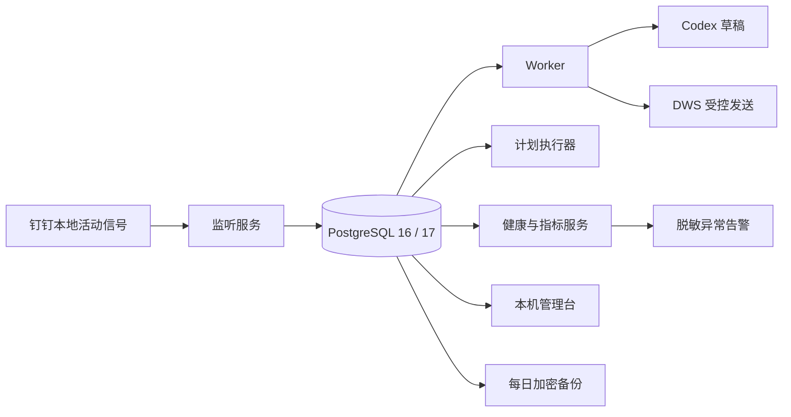
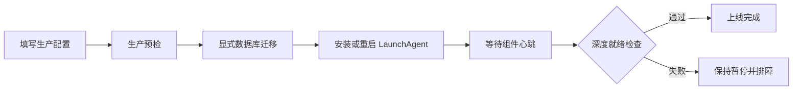

# AI 员工生产运维手册

## 1. 这套服务由什么组成



| 服务 | 作用 | 异常时的表现 |
|---|---|---|
| 监听服务 | DWS 增量取消息并创建任务 | 不再产生新任务，已有任务仍保留 |
| Worker | 判断、生成草稿和处理已批准发送 | 消息继续入库，任务等待恢复 |
| 计划执行器 | 领取已授权计划并运行方案、文档、代码、测试和发布步骤 | 新计划停止；租约过期后标记中断，不自动重放副作用 |
| 健康服务 | 提供存活、就绪和指标接口 | 不影响任务，但监控失去信号 |
| 本机管理台 | 查看任务、计划、脱敏监听范围、记忆和健康，执行受限审批与暂停 | 命令行控制仍可使用；页面不能新增监听对象 |
| 异常监测 | 本机记录异常；可选发送签名 Webhook | 不影响主任务，但值班提醒中断 |
| PostgreSQL | 保存游标、任务、审批、审计和心跳 | 所有副作用停止，防止无账执行 |
| 每日备份 | 每天 02:15 生成 AES-256-GCM 加密备份 | 原数据库不受影响，但恢复点变旧 |

## 2. 生产配置

唯一配置文件默认为 `.runtime/production.json`，权限必须为 `600`。服务只接受白名单字段，不能通过配置注入任意环境变量。

首次部署推荐运行 `npm run config:init`。它只在文件不存在时创建配置，自动生成四项独立密钥或令牌且不在终端打印其值；数据库、租户、监听对象、自身用户和操作人仍需人工填写。已有配置不会被覆盖。

在新主机正式填写业务配置前，先运行 `npm run reuse:verify`。该命令只使用临时目录：它从当前代码生成真实发布包、安装生产依赖、检查发布文件、初始化临时配置并创建临时项目清单，结束后自动清理；不会访问钉钉、Codex 或生产数据库。通过只证明软件包可复用安装，不代表当前主机已经获得业务授权或可以上线。

管理台令牌需要轮换时运行 `npm run config:rotate-admin -- --yes`。脚本先把旧配置保存到 `.runtime/config-backups/`，快照和新配置权限均为 `600`，写入采用同目录原子替换，命令输出不包含任何令牌。轮换后必须重启管理服务；确认新令牌可登录后再按保留策略处理旧快照。

必须单独保管：

| 密钥 | 用途 | 丢失后果 |
|---|---|---|
| PostgreSQL 密码 | 连接数据库 | 服务无法连接 |
| 数据密钥 | 解密正文、草稿和回执 | 历史业务数据无法读取 |
| 备份密钥 | 解密数据库备份 | 备份无法恢复 |
| 健康接口令牌 | 保护非本机监控接口 | 指标可能被未授权读取 |
| 管理台只读令牌 | 读取解密后的管理数据 | 本机数据可能被未授权查看 |
| 管理台写入令牌 | 暂停、审批、拒绝、重试和撤销 | 业务状态可能被未授权修改 |
| 告警签名密钥 | 让接收方验证脱敏告警来源 | 告警可能被伪造 |

常用运行边界：

| 配置 | 默认值 | 作用 |
|---|---:|---|
| `AI_EMPLOYEE_BUNDLE_GAP_MS` | 120000 | 相邻消息超过该间隔时拆成新任务 |
| `AI_EMPLOYEE_MAX_MESSAGES_PER_TASK` | 20 | 单任务最多合并的消息数 |
| `AI_EMPLOYEE_DRAFT_APPROVAL_TTL_MS` | 7200000 | 待审批草稿的有效期 |
| `AI_EMPLOYEE_PLAN_EXECUTOR_POLL_MS` | 5000 | 没有本地事件源时检查已授权计划的间隔 |
| `AI_EMPLOYEE_PLAN_EXECUTION_LEASE_MS` | 300000 | 执行器持有计划的租约时长 |
| `AI_EMPLOYEE_PLAN_EXECUTION_LEASE_RENEW_MS` | 60000 | 执行租约续期间隔，必须小于租约时长 |
| `AI_EMPLOYEE_SHADOW_MIN_SAMPLES` | 100 | 影子判断进入放量评估所需最少人工标注数 |
| `AI_EMPLOYEE_SHADOW_MIN_NO_REPLY_ACCURACY` | 0.95 | “AI 判断不回复”的人工确认准确率门槛 |
| `AI_EMPLOYEE_EXTERNAL_CHECK_STALE_MS` | 600000 | 真实外部读取成功检查点的最大允许间隔 |
| `AI_EMPLOYEE_ADMIN_PORT` | 9465 | 只监听本机的管理台端口 |
| `AI_EMPLOYEE_ALERT_INTERVAL_MS` | 60000 | 异常检查间隔 |
| `AI_EMPLOYEE_ALERT_COOLDOWN_MS` | 900000 | 同一异常重复提醒冷却时间 |

数据密钥和备份密钥不得相同，不要提交 Git，也不要写入聊天或日志。

### 2.1 外部密钥引用

密钥字段可以不保存明文，改用以下引用：

| 格式 | 场景 | 示例 |
|---|---|---|
| `env://变量名` | CI、容器、受控进程环境 | `env://AI_EMPLOYEE_SECRET_DATABASE_URL` |
| `keychain://服务名/账号名` | macOS 登录钥匙串 | `keychain://ai-employee-production/data-key` |

支持外部引用的字段只有数据库连接、数据/备份密钥、健康与管理令牌、告警地址与签名密钥。业务标识、监听范围和普通配置不能伪装成密钥引用。服务启动时先解析全部引用，全部成功后才写入进程环境；缺失、格式错误或非 macOS 使用钥匙串引用都会失败关闭，日志不包含引用名称或密钥值。

macOS 可通过“钥匙串访问”创建“通用密码”，服务名和账号名必须与引用完全一致。迁移时先备份配置，逐项写入钥匙串，再把配置值替换为引用，运行只读生产诊断和服务验证；确认成功前保留可恢复的旧配置。外部托管令牌必须在原密钥库轮换，`config:rotate-admin` 会拒绝把它改回配置文件明文。

本项目提供固定范围的迁移命令，默认只预览；只有显式传入 `--apply` 才会迁移数据库连接、数据密钥、备份密钥和两项管理令牌。写入过程通过受控终端的标准输入传递密钥，不把值放入命令参数或环境变量；迁移前只保留一份权限为 `600` 的配置回滚快照，并在替换配置前逐项回读比对：

```bash
AI_EMPLOYEE_CONFIG_FILE="$PWD/.runtime/production.json" \
  npm run config:migrate-keychain

AI_EMPLOYEE_CONFIG_FILE="$PWD/.runtime/production.json" \
  npm run config:migrate-keychain -- --apply
```

`work_plan_execution` 是独立的全局执行开关，默认不配置。只有项目清单、计划状态和该开关同时允许时，执行器才会领取计划。影子模式下禁止配置此开关。

影子验收还要求：真实人工标注样本数达到门槛、判断类别/会话类型/判断来源分层覆盖达标、“不回复准确率”达到门槛、高风险错误回复建议为 0。管理台“判断质量”交替提供风险优先和覆盖抽样，显示完整消息、剩余数量和各层进度；连续复核时，与 AI 一致可直接保存并进入下一条，不一致必须填写原因，提交期间不能再次选择。`npm run quality:report` 可只读生成全局质量报告。人工标签绑定当前判断哈希，判断变化后旧标签自动失效；每次修正保留不可变加密历史。样本不足或覆盖偏斜必须判定为未通过，禁止用 AI 自评补齐样本。

运行中需要人工接手时，先打开管理台“人工接管”：

1. “已确认中断”表示数据库已有 `operator_interrupt_confirmed` 证据，可以核对后人工继续。
2. “正在请求中断”表示信号已发出但尚未确认，不能在同一目标重复操作。
3. “正在安全收尾”表示当前外部副作用不可强停，需要等待回读或回滚证据。
4. “执行租约已过期”必须先核对外部系统实际状态，禁止直接重试。
5. 继续工作必须新建或修订计划并重新审批，接管页不会绕过能力和审批门禁。

## 3. 上线流程



```bash
export AI_EMPLOYEE_CONFIG_FILE="$PWD/.runtime/production.json"
npm ci
npm run production:doctor
npm run production:preflight
npm run db:migrate
npm run service:install
npm run production:verify
npm run shadow:verify
```

`production:doctor` 和 `production:preflight` 都是只读检查，不执行迁移；除了文件存在性，还会核对 DWS 当前授权、Codex 脱敏诊断以及发布包迁移文件与 `schema_migrations` 的版本和校验和。两者边界不同：`production:preflight` 位于备份和迁移之前，允许明确列出待迁移项，但任何校验和漂移都会失败；`production:doctor`、`shadow:verify` 和服务运行时要求全部迁移已应用，否则在业务查询前停止。影子验收以 `default_transaction_read_only=on` 的数据库会话打开存储，不会创建加密哨兵，任何误写也由 PostgreSQL 拒绝。预检或诊断失败时不要绕过；只有 `db:migrate` 会修改数据库结构，因此先备份，再通过受控发布流程单独运行。

迁移 015 起还受 `db/migrations/兼容性策略.json` 约束。新增迁移必须登记旧服务是否可以在新结构上继续运行以及证据；当前发布策略只接受 `service_only`，即失败时回退服务版本而不自动反向修改数据库。声明兼容的迁移不能删除、重命名或改变已有结构，不能删除业务数据，也不能增加无默认值的必填列。策略缺失或 SQL 违反约束时，生产预检和 `db:migrate` 都会在获取迁移锁及写数据库前失败。

首次部署或草稿 Schema 变化后，人工执行 `npm run production:codex-probe`。该命令会产生一次真实模型调用，但只使用固定合成消息，不读取钉钉或数据库，不输出回复正文；通过才能继续部署。

`shadow:verify` 是只读验收：要求私聊和群聊真实发送能力均关闭，并检查深度健康、死信、未知发送和执行中的工作计划。它不会消费审批、运行 Codex 或写入业务状态。

## 4. GitHub 人工发布

仓库包含“生产发布”工作流。需要准备一台安装了 DWS、Codex、PostgreSQL 客户端工具和 GitHub Runner 的 macOS 主机，并添加标签：

```text
self-hosted
macOS
ai-employee-production
```

在 GitHub 的 `production` Environment 中：

1. 配置至少一名必需审批人。
2. 参考 [GitHub 生产配置示例](../deploy/GitHub生产配置.example.json)添加 `AI_EMPLOYEE_CONFIG_JSON` Secret；示例值必须替换为当前主机的真实业务标识和稳定目录。
3. 添加 `AI_EMPLOYEE_DEPLOY_ROOT` Variable，填写 Runner 上专用且稳定的绝对目录；目录名必须以 `ai-employee-production` 结尾，不能是 `/`、用户主目录或其他宽泛目录。
4. 限制允许发布的分支或标签。

工作流不会把 LaunchAgent 指向 Runner 的临时工作区，也拒绝发布尚未进入 `main` 历史的提交。发布控制器固定使用当前工作流提交，但目标业务版本可以是 `main` 历史中的旧提交，因此旧版本即使还没有新版发布脚本，也能被建立为不可变基线。每次发布会以目标提交哈希创建不可变版本目录；只读预检、备份、迁移、服务重装和生产验证全部通过后，才原子更新 `current` 符号链接。安装或验证失败时，工作流会尝试重装上一版本。数据库不会被自动恢复；迁移必须保持向后兼容，涉及破坏性模式变更时必须另行制定专项回滚方案。

第一次接入版本化发布时，不允许一边建立首个版本、一边修改数据库。若预检发现待迁移项而稳定目录中没有上一版本，工作流会在备份和迁移之前停止。当前主机应按两步建立回退链：

1. 先以 `4bb791da3c49ba2fe0b15f11508f0183d2e10551` 运行一次“生产发布”。该提交对应专用的 14 迁移兼容基线，只修复发布前测试的固定时间条件，不产生 015、016 结构变更；成功后服务进入不可变版本目录。
2. 回读生产健康和 8 个原有服务后，再以当前 `main` 运行第二次“生产发布”。此时工作流已有可验证上一版本，才允许备份并应用 015、016；如新服务切换失败，恢复第一步的服务版本。

这两次都需要 `production` Environment 人工批准。当前只完成代码和隔离数据库验收，尚未在生产执行上述两步。

常驻服务安装器自身也执行精确回退。首次安装失败时会删除本次新增的 plist，并确认对应任务已经不再加载；升级失败时恢复旧 plist、重新加载并确认任务重新注册。任何恢复或状态复核失败都会明确报告“回退不完整”，需要人工核对，不能继续切换 `current`。

用于该 macOS 远端发布工作流的配置中，数据库连接、数据密钥、备份密钥和两项管理令牌必须使用钥匙串引用，禁止把这 5 项明文复制进版本目录，也不能依赖 Runner 作业结束后会消失的临时环境变量。统一使用与迁移命令一致的 `ai-employee-production` 钥匙串服务。

工作流只支持人工触发。每次可以指定提交；发布旧提交就是代码回滚。数据库迁移只向前执行，涉及结构回滚时必须先恢复到隔离数据库验证，不能盲目执行 `.undo.sql`。

## 5. 健康判断

| 地址 | 用途 | 成功条件 |
|---|---|---|
| `/live` | 进程存活 | HTTP 200 |
| `/ready` | 能否处理生产任务 | 数据库、DWS、Codex、心跳和异常队列全部正常 |
| `/metrics` | Prometheus 指标 | 能返回文本指标 |

`/metrics` 和管理台“运营指标”按需计算最近 24 小时 SLO，并读取滚动 30 天入口可用性；`/ready` 不执行该聚合，避免监控探针频繁解密任务。重点观察：

- 入口月度可用性是否不低于 99.5%。每分钟一个采样桶，同分钟任一次异常即判该分钟不可用；监控缺测也计为不可用。未积满完整 30 天时只能看观察值和窗口覆盖率，不能宣称达标。
- 消息发现 P95 是否小于 5 秒。
- 每小时消息源对账是否新鲜、窗口是否完整、修复后剩余缺失是否为 0；真实漏检率是否低于 0.1%。
- 低风险终态任务成功率是否不低于 95%。
- 草稿产出耗时（任务创建到草稿就绪，不含人工等待）P95 是否小于 2 分钟。
- 任务全流程耗时和审批等待仅作观察，并分别核对样本数；不能拿人工等待判定 AI 处理超时。
- 重复副作用和未知副作用是否为 0。
- 已完成副作用是否 100% 有回执。
- 统计窗口 `dataComplete` 是否为真。无样本或窗口不完整都不能算达标。

入口采样由告警监控进程在每次深度健康检查后写入，默认检查和采样间隔均为 60 秒，保留 45 天。`AI_EMPLOYEE_ALERT_INTERVAL_MS` 不得大于 `AI_EMPLOYEE_AVAILABILITY_SAMPLE_INTERVAL_MS`，且保留期必须长于统计窗口，避免产生无法识别的采样空洞。

消息源对账由 `com.ai-employee.reconciliation` 独立运行，默认读取结束于 2 分钟前的 24 小时 DWS 消息窗口。它复用生产联系人和群聊白名单，只向本地数据库回补漏项，不会发送钉钉消息。配置 `AI_EMPLOYEE_REQUIRE_MESSAGE_RECONCILIATION=true` 后，报告超过 2 小时、窗口不完整、读取失败晚于最近成功或修复后仍有缺失都会阻断 `/ready` 并进入脱敏告警。

记忆来源复核由 `com.ai-employee.memory-source` 每 5 分钟执行。新环境应把 `memory-source:last-success` 加入 `AI_EMPLOYEE_REQUIRED_OPERATIONAL_CHECKS`；复核任务读取项目清单并按精确 slug 调用 gbrain，只把数量、状态和时间写入检查点，不保存页面正文。默认访问租约 15 分钟，可用 `AI_EMPLOYEE_MEMORY_SOURCE_LEASE_MS` 调整为 10—60 分钟，且必须长于外部检查过期门槛；单次最多复核 500 条，可用 `AI_EMPLOYEE_MEMORY_SOURCE_LIMIT` 调整但不得超过 5,000。复核失败或出现不可读/版本变化来源时写入失败检查点，健康检查停止就绪；明确撤回的项目授权只停用对应记忆，不把预期撤权当成系统故障。

需要人工立即复查时运行：

```bash
AI_EMPLOYEE_CONFIG_FILE="$PWD/.runtime/production.json" npm run messages:reconcile
```

以下任一情况会让 `/ready` 返回 503：

- 数据库不可用。
- 系统处于人工暂停状态。
- DWS 或 Codex 不可执行。
- 监听或 Worker 心跳过期。
- 监听完整读取或人工回复复查长期未成功。
- 最新一次外部读取失败晚于最近一次成功。
- 已启用的消息源对账报告缺失、过期、不完整或仍有未修复漏项。
- 存在耗尽重试次数的死信任务。
- 存在结果未知的发送任务。

死信和未知发送需要人工处理，不能通过重启掩盖。

## 6. 日志和服务状态

日志位于 `.runtime/logs/`。普通日志只记录任务 ID、匿名化联系人、稳定错误分类和状态，不记录正文、真实联系人 ID、网关地址或原始 DWS 错误。

```bash
launchctl print "gui/$(id -u)/com.ai-employee.listener"
launchctl print "gui/$(id -u)/com.ai-employee.worker"
launchctl print "gui/$(id -u)/com.ai-employee.executor"
launchctl print "gui/$(id -u)/com.ai-employee.health"
launchctl print "gui/$(id -u)/com.ai-employee.admin"
launchctl print "gui/$(id -u)/com.ai-employee.alert"
launchctl print "gui/$(id -u)/com.ai-employee.memory-source"
launchctl print "gui/$(id -u)/com.ai-employee.backup"
```

管理台地址为 `http://127.0.0.1:9465`。只读令牌和写入令牌必须不同且至少 32 字节。批准草稿前必须核对实际回复、风险和原因；批准计划前必须展开核对全部步骤、输入、验收与回滚，L3/L4 还要输入计划哈希末 8 位。服务端会重新计算草稿哈希并核对当前计划哈希，页面内容已变化时返回冲突并要求刷新重审。管理台不能执行工作计划，也不能发送钉钉消息；这两类动作继续使用现有能力网关和专门入口。

死亡任务必须由负责人选择“重试”或“关闭”。“关闭”只允许作用于 `dead` 状态，记录操作人和原因，状态变为 `cancelled_operator`；它不会再次调用 Codex、生成草稿或发送消息。命令行等价操作为 `npm run control -- dismiss-dead <任务ID> '关闭原因'`。不要为了恢复绿色健康状态而盲目重试无法确认内容的任务。

管理台可以取消单个工作计划。尚未执行的计划立即取消；只读 Codex 和本地测试属于可中断步骤，执行器发现取消请求后向整个进程组发送终止信号，并把 `operator_interrupt_confirmed` 证据写入当前步骤。钉钉写入、Git 推送和生产发布等外部副作用步骤不会被强杀，必须完成回读、结果确认或回滚后再取消剩余步骤，避免留下无法判断是否成功的外部动作。页面返回“已请求停止”时仍应等待计划进入 `cancelled`，只有步骤证据出现上述确认值才代表当前命令确已终止。

正式记忆的普通停用使用管理台“撤销”，不会物理擦除，便于审计和纠正。需要交付副本时优先使用 `memory-export <绝对路径> <项目编号|all> metadata`；只有确需正文时才使用 `content EXPORT-CONTENT`。需要永久擦除时先运行 `memory-delete-preview <记忆ID>`，人工核对后再把返回确认值交给 `memory-delete`。永久删除不可恢复，执行前应确认没有合规保留要求；命令只处理一个明确记忆编号，不支持批量通配符。

需要按人、项目或时间处理完整业务数据时，选择器必须从标准输入提交且只能包含一个字段，避免人员和项目标识进入进程参数。先预览分类数量；只有 `blockedTotal` 为 0 时才会返回确认值。执行时再次读取相同选择器并使用刚生成的确认值：

```bash
printf '%s' '{"personId":"钉钉用户编号"}' |
  npm run control -- privacy-delete-preview

printf '%s' '{"personId":"钉钉用户编号"}' |
  npm run control -- privacy-delete 'ERASE-预览返回值'

printf '%s' '{"projectId":"项目编号"}' |
  npm run control -- privacy-delete-preview

printf '%s' '{"before":"2026-08-01T00:00:00.000Z"}' |
  npm run control -- privacy-delete-preview
```

这是不可恢复操作。确认值绑定当前记录编号、状态和更新时间；预览后产生或变化的相关数据会让执行失败，必须重新预览。活动任务、未知发送、活动计划、待归档消息或仍生效的联系人、群聊、项目及能力暂停都会阻止按时间整批删除；人员或项目删除会检查与选择范围匹配的暂停，应先按正常流程完成、取消、确认发送结果或恢复暂停。项目范围只删除数据库内项目计划、项目记忆及计划明确绑定的来源任务，不删除项目能力清单、代码目录、钉钉文档或其他外部数据。生产执行前还要取得针对具体范围的单独授权；部署迁移 016 本身不构成删除授权。

gbrain 来源记忆在确认时自动执行一次来源复核，也可运行 `npm run control -- memory-source-check <记忆ID>` 或 `npm run memory:sources` 手动复核。`unavailable` 表示页面暂时不可读或版本变化，`revoked` 表示项目、能力或路径授权已撤回；两者都不会参与检索。版本变化应创建引用新版本的候选并显式替代旧事实，不应直接延长旧租约。

待审批或已拒绝的计划可以在管理台点击“修订”，也可以运行 `npm run control -- plan-revise <旧计划ID> <项目能力清单路径> < 修订后的计划.json`。修订不会覆盖原记录：旧计划变为 `superseded`，新计划获得新编号、新哈希和独立步骤，并始终回到待审批。项目、请求人和来源任务不可变，旧审批票据不能消费新计划。已批准或正在执行的计划不允许修订，应先按取消流程处理。

来源于钉钉工作请求的计划进入完成、失败或取消状态后，执行器会在原会话创建一条待审批结果草稿。草稿编号由计划编号确定，服务恢复或重复核对不会产生多条；真实发送仍受消息发送开关、人工回复复查和逐条审批约束。

外部告警为可选能力。只允许 HTTPS，使用 `X-AI-Employee-Signature: sha256=...` 验证 HMAC-SHA256 签名。接收端应校验签名、限制重放并按 `schema` 字段解析。未配置 Webhook 时，异常只进入 `.runtime/logs/alert.log` 和数据库检查点。

如需停止所有 AI 动作，优先执行：

```bash
npm run control -- pause
```

只暂停某个已配置范围时使用：

```bash
npm run control -- scope-pause contact <联系人账号> <原因>
npm run control -- scope-pause group <群聊编号> <原因>
npm run control -- scope-pause project <项目编号> <原因>
npm run control -- scope-pause capability <能力名称> <原因>
npm run control -- scope-list
npm run control -- scope-resume <contact|group|project|capability> <对象>
```

暂停值和原因在数据库中加密保存。联系人或群聊暂停会延后草稿和已批准发送，不增加失败次数；项目或能力暂停会阻止新计划开始。正在执行的外部副作用不会被强杀，完成回读或回滚后在步骤边界等待恢复。管理台“监听范围”只展示数量、HMAC 指纹、私聊/群聊触发规则、发送能力和暂停状态，可以暂停或恢复现有对象；“局部暂停”也支持已配置联系人和群聊、已登记项目及已知能力。页面不返回真实钉钉编号，也不能新增、删除或替换监听对象；变更白名单仍需 `targets:update` 后重载服务。

卸载常驻服务但保留 plist：

```bash
npm run service:uninstall
```

## 7. 备份

手动备份：

```bash
npm run db:backup
```

只有 `pg_dump` 完整成功且加密元数据写完，最终 `.dump.enc` 文件才会原子出现；失败的临时文件会清理。

至少做到：

- 备份目录同步到另一块受控存储。
- 监控备份时间和磁盘空间。
- 每月至少恢复演练一次。
- 保留多代恢复点，不只保留最新一份。

## 8. 恢复演练

推荐先使用自动隔离演练。脚本创建随机名称的临时数据库，恢复最新加密备份，核对迁移、任务、记忆和计划表，然后强制删除且只删除该临时库：

```bash
AI_EMPLOYEE_CONFIG_FILE="$PWD/.runtime/production.json" npm run db:restore:drill
```

先创建隔离数据库，绝不能直接拿生产库做首次演练：

```bash
export DATABASE_URL="postgresql://.../ai_employee_restore_test"
export AI_EMPLOYEE_CONFIRM_RESTORE=yes
npm run db:restore -- /absolute/path/ai-employee-时间.dump.enc
```

恢复完成后：

1. 运行数据库迁移。
2. 用只读方式核对任务数量和最新检查点。
3. 启动健康服务验证结构。
4. 确认无误后销毁演练数据库。

恢复脚本使用 `--clean --if-exists`，会覆盖目标数据库中已有对象，因此必须显式设置确认变量。

## 9. 升级和回滚

升级前：

1. 暂停任务。
2. 生成并验证最新备份。
3. 记录当前提交。
4. 执行代码检查和只读生产预检；确认结果后再显式执行数据库迁移。

代码回滚：

1. 指定上一稳定提交重新运行“生产发布”。
2. 运行生产验证。
3. 确认数据库迁移与旧代码兼容后恢复任务。

如果新迁移不向后兼容，不得只回滚代码。应按已验证的恢复方案处理数据库。

## 10. 生产验收记录

| 验收项 | 自动证据 | 仍需现场证据 |
|---|---|---|
| PostgreSQL 迁移和并发租约 | GitHub PostgreSQL 16 集成测试；当前迁移后运行 14 迁移旧版本测试 | 生产数据库连接与两步版本化发布 |
| 依赖与代码安全 | npm audit、CodeQL | 主机和凭证权限 |
| 常驻与优雅退出 | 单元和语法检查 | LaunchAgent 重启演练 |
| 管理与告警 | 鉴权、读写分离、脱敏、签名和冷却测试 | 配置令牌后本机打开；如需外部告警再做接收端联调 |
| 消息读取 | DWS 模拟与解析测试 | 白名单联系人真实消息 |
| 草稿 | Worker 故障和结构测试 | 真实 Codex 授权 |
| 发送 | 幂等、审批和人工回复复查测试 | 一条经批准的测试消息 |
| 备份恢复 | 脚本门禁 | 隔离数据库恢复演练 |

没有完成“仍需现场证据”的项目时，只能称为部署包通过，不能称为该台主机已经正式上线。
