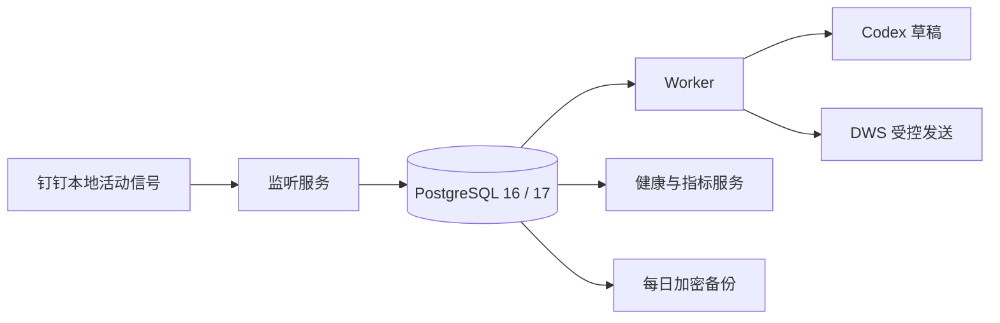
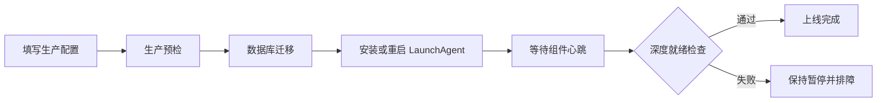

# AI 员工生产运维手册

## 1. 这套服务由什么组成



| 服务 | 作用 | 异常时的表现 |
|---|---|---|
| 监听服务 | DWS 增量取消息并创建任务 | 不再产生新任务，已有任务仍保留 |
| Worker | 判断、生成草稿和处理已批准发送 | 消息继续入库，任务等待恢复 |
| 健康服务 | 提供存活、就绪和指标接口 | 不影响任务，但监控失去信号 |
| PostgreSQL | 保存游标、任务、审批、审计和心跳 | 所有副作用停止，防止无账执行 |
| 每日备份 | 每天 02:15 生成 AES-256-GCM 加密备份 | 原数据库不受影响，但恢复点变旧 |

## 2. 生产配置

唯一配置文件默认为 `.runtime/production.json`，权限必须为 `600`。服务只接受白名单字段，不能通过配置注入任意环境变量。

必须单独保管：

| 密钥 | 用途 | 丢失后果 |
|---|---|---|
| PostgreSQL 密码 | 连接数据库 | 服务无法连接 |
| 数据密钥 | 解密正文、草稿和回执 | 历史业务数据无法读取 |
| 备份密钥 | 解密数据库备份 | 备份无法恢复 |
| 健康接口令牌 | 保护非本机监控接口 | 指标可能被未授权读取 |

数据密钥和备份密钥不得相同，不要提交 Git，也不要写入聊天或日志。

## 3. 上线流程



```bash
export AI_EMPLOYEE_CONFIG_FILE="$PWD/.runtime/production.json"
npm ci
npm run production:preflight
npm run service:install
npm run production:verify
```

生产预检失败时不要绕过。先修复提示的问题，再重新执行。

## 4. GitHub 人工发布

仓库包含“生产发布”工作流。需要准备一台安装了 DWS、Codex、PostgreSQL 客户端工具和 GitHub Runner 的 macOS 主机，并添加标签：

```text
self-hosted
macOS
ai-employee-production
```

在 GitHub 的 `production` Environment 中：

1. 配置至少一名必需审批人。
2. 添加 `AI_EMPLOYEE_CONFIG_JSON` Secret。
3. 限制允许发布的分支或标签。

工作流只支持人工触发。每次可以指定提交；发布旧提交就是代码回滚。数据库迁移只向前执行，涉及结构回滚时必须先恢复到隔离数据库验证，不能盲目执行 `.undo.sql`。

## 5. 健康判断

| 地址 | 用途 | 成功条件 |
|---|---|---|
| `/live` | 进程存活 | HTTP 200 |
| `/ready` | 能否处理生产任务 | 数据库、DWS、Codex、心跳和异常队列全部正常 |
| `/metrics` | Prometheus 指标 | 能返回文本指标 |

以下任一情况会让 `/ready` 返回 503：

- 数据库不可用。
- DWS 或 Codex 不可执行。
- 监听或 Worker 心跳过期。
- 存在耗尽重试次数的死信任务。
- 存在结果未知的发送任务。

死信和未知发送需要人工处理，不能通过重启掩盖。

## 6. 日志和服务状态

日志位于 `.runtime/logs/`。普通日志只记录任务 ID、匿名化联系人和状态，不记录正文。

```bash
launchctl print "gui/$(id -u)/com.ai-employee.listener"
launchctl print "gui/$(id -u)/com.ai-employee.worker"
launchctl print "gui/$(id -u)/com.ai-employee.health"
launchctl print "gui/$(id -u)/com.ai-employee.backup"
```

如需停止所有 AI 动作，优先执行：

```bash
npm run control -- pause
```

卸载常驻服务但保留 plist：

```bash
npm run service:uninstall
```

## 7. 备份

手动备份：

```bash
npm run db:backup
```

只有 `pg_dump` 完整成功且加密元数据写完，最终 `.dump.enc` 文件才会原子出现；失败的临时文件会清理。

至少做到：

- 备份目录同步到另一块受控存储。
- 监控备份时间和磁盘空间。
- 每月至少恢复演练一次。
- 保留多代恢复点，不只保留最新一份。

## 8. 恢复演练

先创建隔离数据库，绝不能直接拿生产库做首次演练：

```bash
export DATABASE_URL="postgresql://.../ai_employee_restore_test"
export AI_EMPLOYEE_CONFIRM_RESTORE=yes
npm run db:restore -- /absolute/path/ai-employee-时间.dump.enc
```

恢复完成后：

1. 运行数据库迁移。
2. 用只读方式核对任务数量和最新检查点。
3. 启动健康服务验证结构。
4. 确认无误后销毁演练数据库。

恢复脚本使用 `--clean --if-exists`，会覆盖目标数据库中已有对象，因此必须显式设置确认变量。

## 9. 升级和回滚

升级前：

1. 暂停任务。
2. 生成并验证最新备份。
3. 记录当前提交。
4. 执行检查和生产预检。

代码回滚：

1. 指定上一稳定提交重新运行“生产发布”。
2. 运行生产验证。
3. 确认数据库迁移与旧代码兼容后恢复任务。

如果新迁移不向后兼容，不得只回滚代码。应按已验证的恢复方案处理数据库。

## 10. 生产验收记录

| 验收项 | 自动证据 | 仍需现场证据 |
|---|---|---|
| PostgreSQL 迁移和并发租约 | GitHub PostgreSQL 16 集成测试 | 生产数据库连接 |
| 依赖与代码安全 | npm audit、CodeQL | 主机和凭证权限 |
| 常驻与优雅退出 | 单元和语法检查 | LaunchAgent 重启演练 |
| 消息读取 | DWS 模拟与解析测试 | 白名单联系人真实消息 |
| 草稿 | Worker 故障和结构测试 | 真实 Codex 授权 |
| 发送 | 幂等、审批和人工回复复查测试 | 一条经批准的测试消息 |
| 备份恢复 | 脚本门禁 | 隔离数据库恢复演练 |

没有完成“仍需现场证据”的项目时，只能称为部署包通过，不能称为该台主机已经正式上线。
