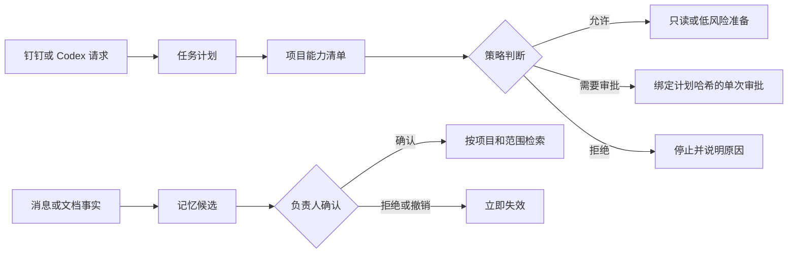

# 能力清单与正式记忆

## 1. 为什么需要这两层

AI 能调用工具，不代表它有权执行。每个项目必须先声明能力范围；每条长期记忆必须先确认来源和有效期。



## 2. 项目能力清单

每个项目使用一份 JSON 清单，示例见[项目能力清单示例](../deploy/项目能力清单.example.json)。

可用 `npm run projects:create -- --project-id <编号> --name <名称> --root <Git根目录> --requester <钉钉用户ID>` 先预览安全默认清单；只有显式增加 `--write` 才写入运行目录。生成器不会自动开放 gbrain、待办、日程、日志、共享文档、测试、推送或发布。

| 字段 | 作用 |
|---|---|
| `projectId` | 稳定项目编号，不使用个人姓名 |
| `rootDirectory` | 允许处理的唯一项目根目录 |
| `requesters` | 可以下达该项目任务的钉钉账号 |
| `capabilities` | 能力及自动、需审批或禁用状态 |
| `expiresAt` | 单项能力授权的失效时间 |
| `maxRuns` | 单次授权最多消费次数 |
| `timeoutMs` | 运行时间上限 |

开启办公写入时必须固定人员范围，不能让消息临时指定任意账号：

```json
{
  "dingtalk_todo_create": {
    "mode": "approval_required",
    "allowedExecutorUserIds": ["已核实的钉钉用户ID"],
    "allowedPriorities": ["20", "30"],
    "maxTitleChars": 120,
    "maxRuns": 1
  },
  "dingtalk_calendar_create": {
    "mode": "approval_required",
    "allowedAttendeeUserIds": ["已核实的钉钉用户ID"],
    "allowedRoomNames": ["永澄亭"],
    "maxDurationMinutes": 120,
    "maxTitleChars": 120,
    "allowRecurrence": true,
    "allowedRecurrenceTypes": ["daily", "weekly"],
    "maxRecurrenceCount": 10,
    "maxRuns": 1
  },
  "dingtalk_report_submit": {
    "mode": "approval_required",
    "templateId": "从 DWS 模板列表核实的模板编号",
    "templateName": "项目日报",
    "fields": [
      { "name": "今日完成", "sort": "0", "type": "1" },
      { "name": "明日计划", "sort": "1", "type": "1" }
    ],
    "maxContentBytes": 102400,
    "maxRuns": 1
  }
}
```

开启 gbrain 读取时也必须固定项目知识路径，不能开放整个个人知识库：

```json
{
  "knowledge_read": {
    "mode": "automatic",
    "allowedSlugPrefixes": ["projects/example/"],
    "maxPages": 5,
    "maxContentBytes": 65536,
    "timeoutMs": 30000
  }
}
```

计划中的 `knowledge_read.inputs.slugs` 只能填写白名单内的精确 slug。当前不提供无范围语义搜索、模糊匹配、已删除页面读取或 gbrain 写入；研究、文档和代码步骤还必须通过 `knowledgeStepIds` 显式引用更早的知识读取步骤。

未登记能力、越界目录、未授权请求人和过期授权一律拒绝。L4 能力即使配置为自动，也仍然强制单次审批。

```bash
mkdir -p .runtime/projects
cp deploy/项目能力清单.example.json .runtime/projects/示例项目.json
npm run projects:validate
```

## 3. 完整任务计划

任务计划示例见[任务计划示例](../deploy/任务计划.example.json)。每个步骤必须说明能力、目标和验收证据；有副作用的步骤还必须说明回滚方式。

固定模板日志可参考[钉钉日志任务示例](../deploy/钉钉日志任务.example.json)。示例字段名必须替换为项目清单中已从 DWS 模板详情核实的完整字段集合，不能只填写其中一部分。

钉钉消息只有被识别为明确工作请求时才会进入计划提案；普通问答和闲聊仍只生成回复草稿。提案器只查看请求人已被项目清单授权的项目：唯一项目可直接起草，多个项目必须由消息明确给出项目名或编号，否则停止并要求澄清。提案不会自动执行。

```bash
npm run plan:check -- .runtime/projects/示例项目.json \
  < deploy/任务计划.example.json
```

输出只有四种结论：`ALLOW`、`REQUIRE_APPROVAL`、`ASK_FOR_INFORMATION`、`DENY`。审批必须绑定 `planHash`；项目、步骤、参数或风险改变后，原审批自然失效。

把评估后的计划登记到 PostgreSQL，并进行单次审批：

```bash
npm run control -- plan-register .runtime/projects/示例项目.json \
  < deploy/任务计划.example.json
npm run control -- plan-show <计划ID>
npm run control -- plan-approve <计划ID> '同意本计划，不授权计划外动作'
```

批准票据默认 2 小时有效、最多消费一次。计划哈希不一致、票据过期或已经消费时，执行入口必须拒绝。

当前接入的项目执行适配器：

| 能力 | 真实动作 | 验证方式 |
|---|---|---|
| 知识页读取 | gbrain 按项目白名单内的精确 slug 只读获取 | 返回 slug 与请求完全一致、页面未删除、正文限长并记录哈希 |
| 研究 | Codex 在项目目录中只读分析 | 非空、限长、内容哈希 |
| 文档草稿 | 生成中文 Markdown 草稿 | 非空、限长、内容哈希 |
| 共享文档创建 | DWS 创建到项目固定文件夹或知识库 | `doc read` 回读内容哈希一致 |
| 待办创建 | DWS 为清单内固定执行人创建待办 | 取返回任务 ID，再执行 `todo task get` 回读 |
| 日程创建 | DWS 创建限时、限参与人的普通或有界循环日程；会议室先按白名单名称实时搜索 | 搜房必须唯一命中合法 `roomId`；创建后执行 `calendar event get` 回读 |
| 日志提交 | DWS 按清单固定模板提交完整字段 | 提交前核对模板编号、名称和字段结构，提交后执行 `report entry get` 回读 |
| 代码补丁 | 生成 unified diff，不写工作区 | `git apply --check` |
| 隔离分支 | 在独立 worktree 应用补丁并创建本地提交 | 提交差异哈希与补丁证据一致 |
| 本地测试 | 只运行清单登记的绝对可执行文件和固定参数 | 退出码、耗时、输出字节数和哈希 |
| Git 推送 | 推送受控前缀分支 | `ls-remote` 回读相同提交 |
| 生产发布 | 运行登记的发布命令和验收命令 | 验收退出码为 0；失败执行登记回滚并复验 |

```bash
npm run control -- plan-register .runtime/projects/示例项目.json \
  < deploy/只读执行任务.example.json
npm run control -- plan-approve <计划ID> '批准当前哈希对应的只读计划'
npm run control -- plan-execute <计划ID> .runtime/projects/示例项目.json
npm run control -- plan-evidence <计划ID>
```

执行前会重新读取项目清单。计划哈希同时绑定任务内容和完整项目授权快照；目录、命令、参数、远端、超时或授权变化后，旧审批不能继续使用。所有步骤先完成适配器预检，再消费审批票据。没有适配器、命令未登记、远端不一致或工作目录越界时，不会消耗票据。

本地测试使用最小环境变量集合，不继承数据库、钉钉或告警密钥。命令输出正文不进入日志或证据，只保存退出码、字节数和 SHA-256。需要诊断失败时，应在隔离 worktree 中由负责人复跑，而不是扩大后台日志范围。

隔离 worktree 在成功后保留，便于人工审查和后续推送；失败计划也保留现场。清理由负责人根据证据中的 worktree 和分支执行，远端分支删除必须使用新的审批计划。

## 4. 正式记忆

| 状态 | 能否用于工作 | 说明 |
|---|---|---|
| 候选 | 否 | 只记录建议，不作为事实 |
| 已确认 | 是 | 仍受项目、范围和有效期约束 |
| 已撤销 | 否 | 立即停止引用 |
| 已过期 | 否 | 保留审计记录，不参与检索 |

新增候选时，正文从标准输入读取，避免出现在命令参数和进程列表中：

```bash
echo '交付前必须核对实际批次覆盖。' | \
  npm run control -- memory-propose project 单词项目 document 文档编号 vocab_project

npm run control -- memory-confirm <记忆ID>
echo '批次覆盖' | npm run control -- memory-search project 单词项目
npm run control -- memory-revoke <记忆ID>
```

纠正、导出和永久删除使用独立的显式入口：

```bash
# 新记忆确认时显式替代旧事实
npm run control -- memory-confirm <新记忆ID> <旧记忆ID>

# 默认只导出不含主题、正文、来源编号和范围的元数据
npm run control -- memory-export /绝对路径/记忆元数据.json all metadata

# 完整正文导出必须输入固定确认词，目标文件必须不存在
npm run control -- memory-export /绝对路径/项目记忆.json <项目编号> content EXPORT-CONTENT

# 先预览绑定当前记忆编号的删除确认值，再单独执行
npm run control -- memory-delete-preview <记忆ID>
npm run control -- memory-delete <记忆ID> <上一步确认值>
```

导出文件以 `600` 权限创建且绝不覆盖已有文件；完整导出会包含明文业务内容，应由负责人自行保管和删除。永久删除会擦除记忆的主体、陈述、来源、范围、项目和创建人字段，只保留无法参与查询的无正文墓碑与最小审计事件，不提供恢复。管理台不提供一键永久删除，避免误操作。

正式记忆在 PostgreSQL 中使用字段级加密。长文档仍保留在原系统或 gbrain；本地只保存必要陈述、来源引用、项目范围、确认状态和有效期。管理台展示每条记忆的来源类型、编号、版本和置信度，便于确认事实依据。

需要维护唯一值的记忆必须在 `scope.factKey` 标出事实字段，例如“发布口径”或“首选称呼”。同项目、同类型、同主题、同事实字段只允许一个有效值：新候选完全相同则判为重复，陈述不一致则必须明确选择“替代旧记忆”，系统在同一事务中确认新事实并撤销旧事实。没有事实字段的多条相关备注可以并存，避免把“沟通偏好”和“机密备注”等不同事实误判为冲突。若历史上已经出现多个相互矛盾的已确认事实，系统停止自动处理，必须先由负责人逐条撤销。

回复草稿只会自动读取“已确认、未过期、未撤销、非机密”的原则记忆，以及与当前联系人唯一账号匹配的人物记忆。项目记忆只有任务明确绑定项目后才能读取，避免跨项目串用。

## 5. 当前执行边界

当前运行时已经能验证项目能力、评估完整计划、管理正式记忆，并执行项目级精确知识页读取、研究、文档草稿、共享文档创建、受控待办、受控日程、固定模板日志、代码补丁、隔离提交、本地测试、受控推送和生产发布。知识页读取只接受项目白名单前缀内的精确 slug，且只有被后续步骤显式引用时才进入 Codex 上下文。待办只允许清单中的执行人和优先级；日程只允许清单中的参与人、时长和会议室名称，会议室 ID 必须在执行时按同一时段搜索且唯一命中，循环只开放有次数上限的按日/按周规则；日志同时绑定模板编号、名称和完整字段结构，模板漂移会停止提交。OA 审批可以作为只读信息进入方案，但同意、拒绝和转交不提供执行适配器。高风险能力默认没有任何真实项目授权；只有负责人创建项目清单并批准具体计划哈希后才能运行。生产数据修改不提供通用适配器，必须按具体系统单独建模。
