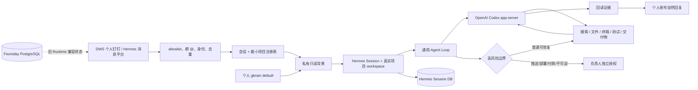

# Foursday 文档地图与设计总览

状态：V3.1 原生 Hermes Profile 候选的权威导航；当前生产处于主动安全停机审阅态，两套 Gateway 均停止且发送能力关闭。

## 一句话说明

Foursday 是由个人 gbrain 驱动、通过可信消息入口自主使用 Hermes 与 Codex 完成工作的 AI 工作分身。

它不是“为每个问题配置 capability 和指标的流程机器人”。个人模式默认让可信联系人提出普通可恢复工作，Agent 自主进入真实项目、搜索、计算、修改、测试、回读并自然汇报；只有高风险外部副作用进入独立出口。

## 文档治理角色

| 角色 | 权威来源 | 只负责什么 |
|---|---|---|
| 产品宪法 | [产品需求文档](./产品需求文档.md) | 产品身份、用户旅程、默认行为、非目标和验收标准 |
| 架构地图 | 本文 | 模块在哪里、数据归谁、下一步去哪里看 |
| 技术权威 | [技术设计文档](./技术设计文档.md) | Hermes/DWS/gbrain/项目路由/沙箱/证据的实现规则 |
| 当前状态 | [完成度矩阵](./完成度矩阵.md) | 已验证、未部署、阻塞项和删除区 |
| 生产运维 | [生产运维手册](./生产运维手册.md) | Hermes active 状态、备份、诊断与旧 Runtime 回退 |
| Gate 2 证据 | [自主工作分身迁移验收报告](./历史/自主工作分身迁移验收报告.md) | P0 真实验证、测试快照与发布边界 |
| 历史决策 | [迁移架构方案](./历史/自主工作分身架构迁移方案.md)、[更新日志](./历史/更新日志.md) | 为什么迁移、废弃了什么、哪些决策不可逆 |
| 安全与贡献 | [安全说明](./指南/安全说明.md)、[贡献指南](./指南/参与贡献.md) | 所有实现都必须遵守的仓库规则 |

同一事实只在一个权威文档维护；其他文档只链接，不复制实时状态。

## 目标架构



## 三层责任

### Foursday 产品层

- Foursday 品牌和中英文体验；
- DWS 个人钉钉、项目驾驶舱、时间返还和异常告警；
- 项目注册、会话证据、人工接管和高风险出口；
- 中国办公 Skills 与连接器。

### Hermes 运行层

- 通用 Agent Loop、Session、工具循环和多消息平台；
- Codex provider、终端/文件/浏览器/MCP；
- 长任务 interrupt、会话恢复和工具证据。

Foursday 固定兼容上游和官方安装器摘要，只维护 Profile distribution、外部插件、Skills、宿主桥接与产品层；项目 workspace 由官方 Hook 逐轮路由，不维护 Hermes Fork 或核心补丁。

### 数据与记忆层

```text
个人 PRIVATE gbrain Git  → 唯一长期业务知识权威
个人 gbrain PostgreSQL   → 可重建的搜索、实体和图索引
Hermes Session DB        → 会话、工具调用和短期执行上下文
Foursday PostgreSQL      → 保留的回退、治理和审计状态
```

Hermes `MEMORY.md` 只能保存 Agent 自身运行知识，不能形成第二套项目知识库。

## 找什么去哪里

| 需求 | 代码入口 | 先读 |
|---|---|---|
| Hermes 原生安装与兼容锁 | `src/hermes-upstream.mjs`、`src/foursday-hermes-native-install.mjs`、`scripts/安装Foursday原生Hermes.mjs` | [技术设计](./技术设计文档.md) |
| DWS 个人钉钉 | `src/hermes-dws-sidecar.mjs`、`hermes/plugins/dws_personal/` | [技术设计](./技术设计文档.md) |
| 项目路由 | `hermes/plugins/project_router/`、`hermes/projects.example.json` | [产品需求](./产品需求文档.md) |
| 个人 gbrain | `src/hermes-personal-memory-context.mjs`、`hermes/plugins/dws_personal/memory.py`、`hermes/plugins/gbrain_memory/`、`src/personal-gbrain-*.mjs` | [技术设计](./技术设计文档.md) |
| 工具隔离与高风险门禁 | `hermes/plugins/foursday_boundary/` | [安全说明](./指南/安全说明.md) |
| Profile 与通用 Skill | `hermes/profile/`、`hermes/skills/`、原生 `profile install/update` | [产品需求](./产品需求文档.md) |
| 影子验证 | `hermes/shadow_runner.py`、`hermes/tests/`、`test/hermes-*.test.mjs` | [迁移验收报告](./历史/自主工作分身迁移验收报告.md) |
| 原生 Gateway | `src/foursday-native-profile-config.mjs`、`src/foursday-native-gateway.mjs`、`scripts/管理Foursday原生Gateway.mjs` | [技术设计](./技术设计文档.md) |
| 旧 Gateway 回退 | `src/hermes-production-service.mjs`、`src/hermes-cutover.mjs`、`scripts/切换Hermes生产运行时.mjs` | [生产运维手册](./生产运维手册.md) |
| 旧生产 Runtime | `src/listener.mjs`、`src/worker.mjs`、`src/plan-executor.mjs` | [生产运维手册](./生产运维手册.md) |

## 当前与目标不要混淆

| 维度 | 当前事实 |
|---|---|
| 公开基线 | `main` 仍是此前发布的 Foursday 自管 Hermes 架构 |
| 本地候选 | 原生 Hermes `0.20.4` 安装计划、Profile、四插件、官方 doctor 与 Gateway 门禁已通过隔离测试 |
| 当前生产 | 数据库 `paused=true`；自管与原生 Gateway 均 stopped/disabled；无消息发送者 |
| 原生 Gateway | 尚未安装到生产、未启动、未取得发送权 |
| 自动发送 | 当前生产授权不自动转移给原生 Profile；必须重新完成 shadow 与单写者切换 |

精确实时状态只在[完成度矩阵](./完成度矩阵.md)维护。

## 阅读顺序

新读者：README → 本文 → 产品需求 → 技术设计。
开发者：本文模块地图 → 技术设计 → 相关测试。
运维者：完成度矩阵 → 生产运维手册 → 验收报告。
架构决策：迁移架构方案 → 更新日志 → 当前代码与测试回读。
