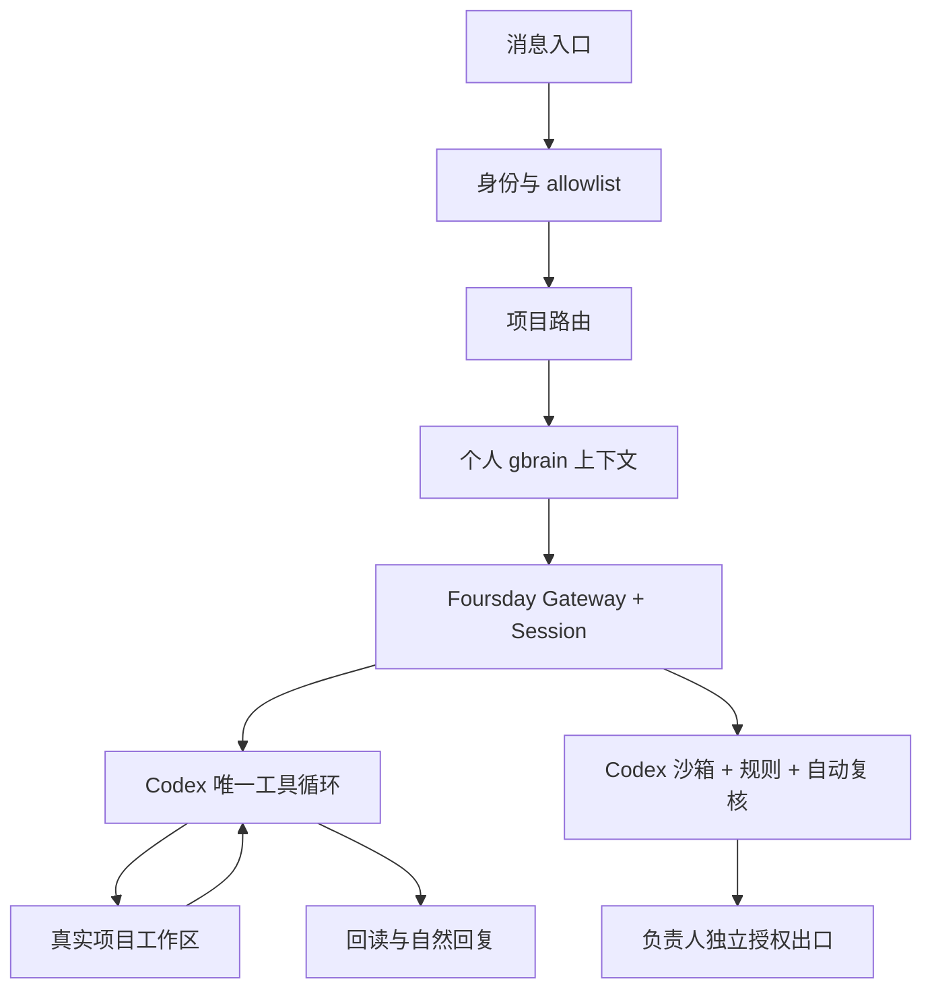

# Foursday 设计总览

## 产品定义

Foursday 是“个人记忆驱动的工作分身”：可信联系人提出工作，Foursday 自动找到项目，由 Codex 唯一工作循环完成可恢复工作，并用真实证据回复。

默认个人模式不使用项目 capability manifest、逐联系人项目授权或固定业务指标。企业治理可以未来作为独立插件提供，但不进入个人安装主路径。

## 组件地图



| 责任 | 当前入口 |
|---|---|
| Hermes 版本锁与安装 | `src/hermes-upstream.mjs`、`src/foursday-hermes-native-install.mjs` |
| Profile 配置与 Gateway | `src/foursday-native-profile-config.mjs`、`src/foursday-native-gateway.mjs` |
| 个人钉钉 | `distribution/plugins/dws_personal/`、`src/hermes-dws-sidecar.mjs` |
| 项目路由 | `distribution/plugins/project_router/`、`distribution/projects.example.json` |
| 个人记忆读取 | `distribution/plugins/dws_personal/memory.py`、`src/hermes-personal-memory-context.mjs` |
| 记忆晋升 | `src/foursday-codex-mcp.mjs`、`src/hermes-memory-candidate-sidecar.mjs`、`src/personal-gbrain-*.mjs` |
| 高风险边界 | Foursday专属 Codex `config.toml`、`rules/` 与自动复核 |
| 工作方式 | `distribution/profile/SOUL.md`、`distribution/skills/project-work/` |

## 数据归属

```text
个人 gbrain Git        长期知识正文
gbrain PostgreSQL      可重建检索投影
Foursday 会话存储      会话和工具轨迹，由内嵌控制平面提供
Foursday PostgreSQL    记忆晋升队列
项目 Git               代码、文档和交付物
```

旧 Agent Runtime、旧管理台、旧 Gateway、旧计划/审批状态机、能力预算、项目配方、影子增长指标和历史导入器不再属于当前架构。

## 文档职责

- [产品需求文档](./产品需求文档.md)：用户价值、默认行为与验收。
- [技术设计文档](./技术设计文档.md)：实现、信任边界和失败行为。
- [英文架构](./en/architecture.md)：公开技术概览。
- [安装与运行](./en/deployment.md)：唯一当前安装路径。
- [集成扩展](./指南/集成扩展指南.md)：新增平台、Skill 和 Hook 的方式。
