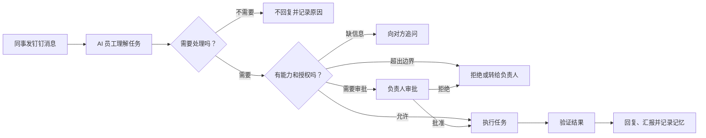

# AI 员工设计总览

AI 员工是一个运行在负责人工作环境中的 AI 员工。钉钉是工作入口，DWS 负责读写钉钉，Codex 负责方案、文档、代码和项目任务。

## 一句话说明

> 同事在钉钉提出问题或任务，AI 员工判断要不要处理、有没有权限；能做的就执行并验证，有风险的先让负责人审批，做完留下完整记录。

## 阅读顺序

| 文档 | 回答的问题 | 适合谁 |
|---|---|---|
| [产品需求文档](./产品需求文档.md) | AI 员工做什么、不能做什么、什么时候找人 | 产品、业务、管理者 |
| [技术设计文档](./技术设计文档.md) | 系统如何接消息、控权限、执行、记忆和恢复 | 研发、测试、运维 |

## 整体流程

## 能力全景

| 工作类型 | AI 员工可以做什么 | 默认边界 |
|---|---|---|
| 沟通 | 判断是否回复、查事实、起草和发送消息 | 承诺、敏感立场先审批 |
| 方案 | 需求分析、调研、方案、排期、风险 | 不把推测写成事实 |
| 项目 | 拆任务、待办、跟进、汇报、复盘 | 不擅自给人分配超权限工作 |
| 研发 | 读代码、改代码、测试、变更说明 | 合并、发布、线上改数先审批 |
| 知识 | 搜资料、整理项目事实、形成记忆 | 必须有来源、范围和有效期 |

## 统一术语

| 术语 | 统一含义 |
|---|---|
| AI 员工 | 整个 AI 员工产品，不等于某一个模型 |
| 任务 | 从一条请求开始，到执行、验证、汇报结束的一次工作 |
| 能力 | 系统登记过、可以调用的一类动作，例如“发钉钉消息” |
| 授权 | 谁允许 AI 在什么范围、什么时间内使用某项能力 |
| 能力网关 | 每次执行前检查能力、授权、风险和审批的控制层 |
| 审批 | 负责人对一次具体计划和风险的明确同意 |
| 执行 | DWS、Codex 或其他工具实际完成动作 |
| 验证 | 用真实结果证明动作成功，而不是相信模型自述 |
| 记忆 | 带来源、权限、有效期的可复用信息 |
| 审计 | 记录谁、何时、基于什么、做了什么以及结果 |
| DWS | AI 员工操作钉钉的唯一业务入口 |
| Codex Worker | 后台处理方案、文档、代码等复杂任务的执行器 |
| Codex Desktop | 负责人查看、讨论、审批和接管复杂任务的控制台 |

## 五条不可突破的原则

1. 会调用工具，不等于有权执行。
2. 没登记的能力默认禁止。
3. 模型不能给自己授权。
4. 高风险动作必须先审批、再执行、后验证。
5. 记忆没有来源、权限或有效期，就不能用于对外回复。

## 当前状态

| 模块 | 状态 |
|---|---|
| 通过本地活动信号发现钉钉新消息 | 已验证原型 |
| 用 DWS 读取消息并按消息 ID 去重 | 已验证原型 |
| 基础“不回复”规则 | 已实现并有测试 |
| 多联系人、安静窗口、数据库队列 | 未实现 |
| 能力网关和审批 | 未实现 |
| Codex 后台任务执行 | 未实现 |
| 正式记忆、管理界面、生产部署 | 未实现 |

当前代码是验证方向的实验，不应直接当作生产服务。
