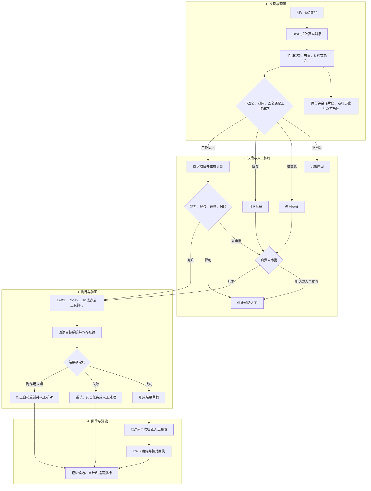
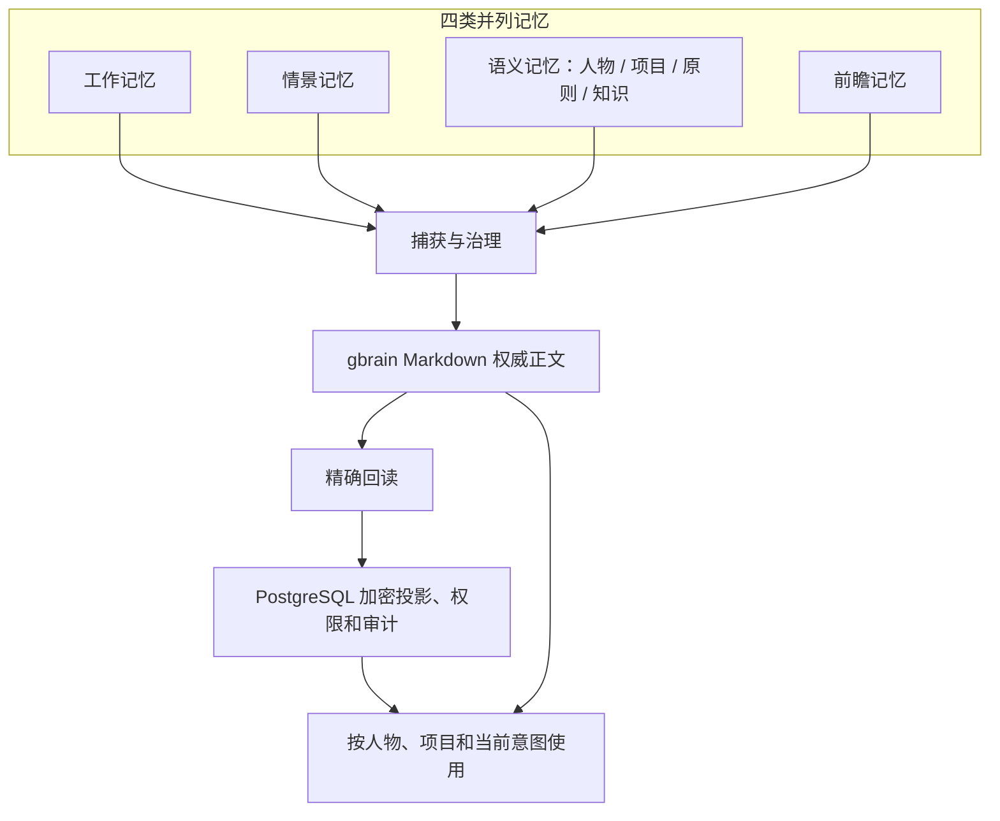
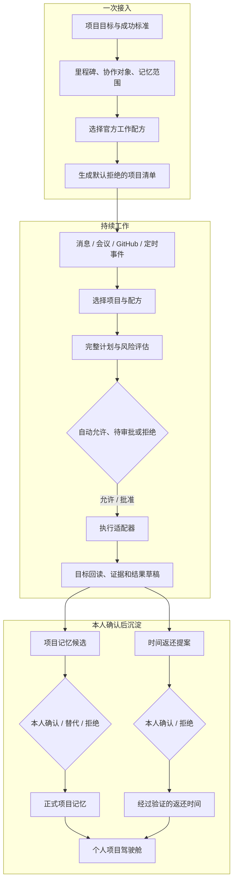
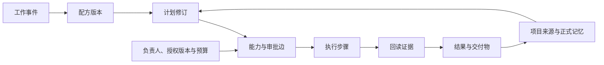

# Foursday 设计总览

Foursday 是运行在负责人工作环境中的开源工作分身。它通过钉钉、飞书等工作入口理解请求，通过 Codex、Claude Code 或模型提供方完成方案、文档、代码和项目任务，并用真实系统回读证明结果。

## 一句话说明

> 同事提出问题或任务，Foursday 判断要不要处理、有没有权限；能做的就执行并验证，有风险的先让负责人审批，做完留下完整记录，逐步为负责人每周拿回一个工作日。

## 阅读顺序

| 文档 | 回答的问题 | 适合谁 |
|---|---|---|
| [产品需求文档](./产品需求文档.md) | Foursday 做什么、不能做什么、什么时候找人 | 产品、业务、管理者 |
| [技术设计文档](./技术设计文档.md) | 系统如何接消息、控权限、执行、记忆和恢复 | 研发、测试、运维 |
| [生产运维手册](./生产运维手册.md) | 如何部署、监控、备份、恢复和回滚 | 运维、项目负责人 |

## 整体流程

这张图只表达端到端职责。消息状态、项目计划、正式记忆和生产发布分别在技术设计、能力清单和运维手册中展开，避免把所有异常分支塞进一张图。

## 能力全景

| 工作类型 | Foursday 可以做什么 | 默认边界 |
|---|---|---|
| 沟通 | 判断是否回复、查事实、起草和发送消息 | 承诺、敏感立场先审批 |
| 方案 | 需求分析、调研、方案、排期、风险 | 不把推测写成事实 |
| 项目 | 拆任务、待办、跟进、汇报、复盘 | 不擅自给人分配超权限工作 |
| 研发 | 读代码、改代码、测试、变更说明 | 合并、发布、线上改数先审批 |
| 知识 | 搜资料、整理项目事实、形成记忆 | 必须有来源、范围和有效期 |

## 统一术语

| 术语 | 统一含义 |
|---|---|
| Foursday | 整个工作分身产品，不等于某一个模型、渠道或模型提供方 |
| 任务 | 从一条请求开始，到执行、验证、汇报结束的一次工作 |
| 能力 | 系统登记过、可以调用的一类动作，例如“发钉钉消息” |
| 授权 | 谁允许 AI 在什么范围、什么时间内使用某项能力 |
| 能力网关 | 每次执行前检查能力、授权、风险和审批的控制层 |
| 审批 | 负责人对一次具体计划和风险的明确同意 |
| 执行 | DWS、Codex 或其他工具实际完成动作 |
| 验证 | 用真实结果证明动作成功，而不是相信模型自述 |
| 记忆 | 带来源、权限、有效期的可复用信息 |
| 审计 | 记录谁、何时、基于什么、做了什么以及结果 |
| DWS | Foursday 在钉钉上的业务入口；不用于飞书等其他渠道 |
| Codex Worker | 后台处理方案、文档、代码等复杂任务的执行器 |
| Codex Desktop | 负责人查看、讨论、审批和接管复杂任务的控制台 |

## 五条不可突破的原则

1. 会调用工具，不等于有权执行。
2. 没登记的能力默认禁止。
3. 模型不能给自己授权。
4. 高风险动作必须先审批、再执行、后验证。
5. 记忆没有来源、权限或有效期，就不能用于对外回复。

部署也遵守同一原则：生产诊断与数据库迁移是两个入口。诊断只读，迁移必须显式执行，避免把“检查”包装成隐含写操作。

## 统一记忆架构

记忆不是从 L0 排到 L7 的单线层级，而是三个正交维度：

1. **内容类型：**工作、情景、语义、前瞻四类并列；人物、项目、原则和知识是语义记忆的并列子域。
2. **生命周期：**捕获、提取、治理、Markdown 写入、gbrain 精确回读、PostgreSQL 投影、整理、检索和过期。
3. **存储职责：**Markdown 是长期正文权威；gbrain 是知识写入与访问层；Foursday PostgreSQL 是运行、权限、租约、投影和审计权威。

低风险、来源明确且无冲突的语义事实可在单独开放写入和自动确认后自主沉淀；冲突或低置信度内容进入隔离候选；凭据、PII、敏感人物材料和机密内容直接拒绝。gbrain 写入成功并不等于记忆生效，只有精确回读和 PostgreSQL 投影都完成后才可检索。

## 当前状态

### V2.3 个人工作分身闭环（生产已部署，业务未放量）

V2.6 已提供项目接入向导、5 个官方配方、个人项目驾驶舱、时间返还账本、主动触发器、会议到执行、GitHub Draft PR 闭环、受治理工作图和个人 gbrain 记忆基座。技术实现已随生产提交 `6665035f2432e2ed40d89168f1c8ecdfe1feeffa` 部署；自动化仍由全局能力、项目清单、风险、审批、幂等和目标回读共同约束。

### 受治理工作图：Graph Engineering（生产已部署，业务未放量）

Foursday 的项目、配方、计划、步骤、能力、审批、记忆、证据和结果已经形成隐式关系，但当前仍由各领域对象和事务状态机分别保证一致性。下一阶段将采用“Loop 是执行单元，Graph 是控制平面”的方向，把关系显式化为三张有边界的图：

| 图 | 核心关系 | 治理目标 |
|---|---|---|
| 工作图 | 事件→配方→计划→步骤→证据→结果 | 明确下一条允许路径、停止条件和运行状态 |
| 知识图 | 项目↔来源、文档、决策、交付物与正式记忆 | 任何可复用事实都能回到来源、权限和有效期 |
| 治理图 | 人↔项目、能力、授权版本、预算、审批与审计 | 解释谁允许了哪条边，聊天和模型都不能自行扩边 |

实现顺序固定为：

1. 定义稳定节点身份、类型化边、来源、敏感级别、有效期和授权版本，不改变现有领域事务边界。
2. 分开保存“设计上允许的图”和“实际发生的运行图”，支持解释漂移、重试、审批、工具选择与证据链。
3. 在个人项目驾驶舱提供“为什么允许执行、事实来自哪里、这次结果改变了什么”等有界查询。
4. 默认继续使用 SQLite/PostgreSQL；只有真实多跳查询和基准证明必要时，才单独评估图数据库。

因此，Graph Engineering 不替代现有 Loop Engineering。当前候选也没有交付通用图 API、GraphRAG 或图数据库。

Stage 1—4 已随生产提交 `34d04326d1d16ba92994107eb2f44bf89d74c759` 部署：`governed-work-graph.mjs` 和公开 JSON Schema 定义契约，第 021 号迁移在 SQLite/PostgreSQL 保存加密的追加式观察，运行时分别采集设计图和运行图，个人驾驶舱提供四类有界解释，并用基准与[架构决策 001](架构决策受治理工作图存储.md)决定暂不引入专用图数据库。生产仍以现有领域表为权威事实；当前没有项目授权，因此没有真实生产图记录。

#### 现状审计

受治理工作图只能投影现有领域事实，不能取代事实来源：

| 领域 | 当前权威事实 | 稳定身份或版本 | 图化状态 |
|---|---|---|---|
| 项目与授权 | 项目清单和能力策略 | `projectId`、计划绑定的 `authorizationHash` | 已投影项目、授权与能力节点；领域清单和预算账本仍权威 |
| 消息与回复任务 | 消息、任务、审批、副作用账本 | 平台消息编号、任务编号、审批版本、幂等键 | 已持久化，关系隐含在状态与外键中 |
| 事件与触发器 | `WorkEvent`、触发器、触发运行账本 | 事件编号、触发器编号、确定性运行键 | 已投影匹配事件、触发器和计划；触发运行账本仍权威 |
| 配方 | 经过校验的 `WorkRecipe` 文件 | 配方编号、契约 `version` 和规范内容哈希 | 已用内容哈希形成不可变配方修订并绑定计划 |
| 计划、步骤与审批 | 工作计划、步骤和计划审批表 | 计划编号、计划哈希、修订、步骤编号、审批版本 | 已投影设计与运行关系；领域状态机仍权威 |
| 能力与预算 | 项目清单和持久次数预算账本 | 能力名和授权哈希 | 已投影授权解释；剩余预算只从领域账本读取，不写入图 |
| 证据与结果 | 步骤证据、任务/计划终态、结果草稿 | 计划编号、步骤编号和证据载荷 | 完整回读形成证据与结果节点；缺证据时失败关闭 |
| 记忆与来源 | 正式记忆及来源访问校验 | 记忆编号、来源类型/编号/版本、事实键 | 已记录精确来源、规划实际使用和计划产生的候选 |
| 时间返还 | 时间返还账本 | 工作计划编号和本人确认状态 | 已投影提案与确认版本；只有确认后计入返还时间 |
| 审计 | PostgreSQL 审计事件、领域账本及图观察 | 租户内审计身份和发生时间 | 两库图契约对等；PostgreSQL 审计事件仍是生产审计事实 |

例如，驾驶舱中的“交付物”当前由已完成步骤的证据投影而来，不是一个已经具备独立生命周期的 `Deliverable` 实体。文档必须保留这种“已有、部分具备、尚未实现”的区别。

#### Graph Contract v1

Graph Contract v1 是独立于图框架的投影契约。节点身份使用 `(tenantId, nodeType, domainId)`，并携带不可变 `revision`：配方和证据使用规范内容哈希，已有计划/授权使用现有哈希，记忆来源使用精确来源版本。项目内节点必须带 `projectId`。节点还记录来源、敏感度、有效期和观察时间，不包含解密后的秘密，也不能从“图上可达”推断权限。每条边至少包含：

| 字段 | 含义 |
|---|---|
| `edgeId` | 由租户、关系类型、两端身份和版本、阶段及授权哈希确定性生成 |
| `edgeType` | 只能取下面白名单中的关系 |
| `from`、`to` | 两端稳定节点身份及本次观察到的版本 |
| `phase` | `intended` 表示允许的设计路径，`runtime` 表示真实发生 |
| `provenance` | 产生该边的领域记录或来源版本 |
| `authorizationHash` | 适用时绑定本次转换所依据的授权快照 |
| `sensitivity`、`expiresAt` | 继承两端和来源中最严格的可见性与保留约束 |
| `validFrom`、`invalidatedAt` | 不改写旧观察记录的关系生命周期 |
| `observedAt` | 投影观察领域事实的时间，不替代领域原始时间 |

第一版只允许这些关系：

| 关系 | 阶段 | 权威事实 |
|---|---|---|
| `project.has_authorization` | 设计 | 已校验项目清单及其规范授权哈希 |
| `project.selects_recipe` | 设计 | 项目档案选择的配方和版本 |
| `event.matches_trigger` | 运行 | 事件过滤结果与已预留触发运行 |
| `trigger.instantiates_plan` | 运行 | 触发运行绑定的计划编号与确定性运行键 |
| `task.requests_plan` | 运行 | 计划绑定的来源任务 |
| `plan.contains_step` | 设计 + 运行 | 已校验计划修订和持久化步骤 |
| `recipe.instantiates_plan` | 设计 + 运行 | 进入计划评估和落库计划的配方内容哈希 |
| `authorization.grants_capability` | 设计 | 当前授权哈希下的项目能力规则 |
| `authorization.permits_step` | 设计 | 能力策略、范围、预算和授权哈希 |
| `step.uses_capability` | 设计 + 运行 | 计划步骤声明并持久化的执行能力 |
| `approval.authorizes_plan` | 运行 | 绑定计划哈希和审批版本且未过期的审批 |
| `step.produces_evidence` | 运行 | 已完成步骤及其真实回读证据 |
| `plan.produces_outcome` | 运行 | 必需步骤和证据满足结果规则的终态计划 |
| `source.supports_memory` | 运行 | 记忆来源编号/版本、访问状态、敏感度和有效期 |
| `memory.informs_plan` | 运行 | 某一可用记忆版本确实进入本次规划上下文 |
| `plan.proposes_memory` | 运行 | 工作计划产生且仍需本人确认的项目记忆候选 |
| `plan.proposes_time_return` | 运行 | 已验证计划结果及其时间返还提案或确认记录 |
| `plan.supersedes_plan` | 运行 | 项目、请求人和来源任务不变的持久修订链 |

#### 不可突破的图约束

1. 图只负责读取、解释和对账。只有原有领域用例能审批、扣减预算、执行能力、确认记忆或改变任务/计划状态。
2. 缺失、过期、跨租户或跨项目关系一律失败关闭；“图上可达”永远不等于“获得授权”。
3. 运行图只追加观察记录。纠正通过新版本或撤销关系表达，不能改写历史证据。
4. 关系的敏感度、有效期和来源访问状态取参与对象中的最严格值，遍历不能扩大人员或项目数据的可见范围。
5. 设计图和运行图必须分开，才能识别漂移、重试、漏审批、工具变化和证据缺失。
6. 图投影必须幂等。领域事实提交后按稳定版本确定性重放；外部副作用开始前设计图必须持久化成功，终态采集失败由执行器自动补齐。模型输出和聊天文本不能直接创建关系。

#### 第一批有界查询

个人项目驾驶舱只先回答四个问题，而且每次查询必须限定一个租户、一个项目、最大深度和最大结果数：

1. **为什么允许这个步骤执行？** 步骤→计划修订→审批/策略→授权版本→项目能力与剩余预算。
2. **哪个来源支持这条事实？** 可用记忆版本→精确来源版本→访问状态、敏感度和有效期。
3. **实际执行是否偏离计划？** 对比设计步骤和停止边与真实尝试、工具、重试、证据和终态结果。
4. **这次工作改变了项目什么？** 从已验证结果追踪交付物投影、记忆候选、决策、风险和已确认时间返还。

#### 阶段和退出条件

| 阶段 | 交付物 | 退出条件 |
|---|---|---|
| 0：设计基线 | 现状审计、统一术语、关系白名单、约束和公开路线 | 已完成：中英文契约区分技术部署与业务放量状态 |
| 1：投影契约 | 纯节点/关系校验器、JSON Schema、配方内容绑定和确定性投影夹具 | 已完成：同一领域夹具生成相同两库记录形态 |
| 2：设计图/运行图采集 | 第 021 号迁移、加密追加投影、执行前门禁和终态确定性重放 | 已完成候选：重试、并发、跨项目、过期授权、缺证据和隐私擦除测试通过 |
| 3：驾驶舱解释 | 四类有界查询和证据链接 | 已完成候选：单租户/项目、深度和数量上限生效，答案标记非权威 |
| 4：存储决策 | 基准测试与架构决策记录 | 已完成候选：本机 P95 22.114 ms，暂留 SQLite/PostgreSQL；不是生产 SLO |

| 能力 | 状态 | 关键边界 |
|---|---|---|
| Graph Contract v1 与受治理工作图 | 已实现、通过两库测试并部署生产 | 第 021 号迁移、运行采集、重放、隐私擦除和四类驾驶舱解释已完成；生产项目授权为 0 |
| 项目接入、配方、驾驶舱、时间返还 | 已实现并有测试 | 外部能力默认关闭；时间只在本人确认后计入 |
| 定时与事件主动工作 | 已实现并有测试 | 触发器默认停用；每日次数、冷却、租约、幂等与项目能力门禁 |
| 会议执行与 GitHub 开发配方 | 已实现并有测试 | 记忆只生成候选；PR 只创建 Draft，不自动合并 |
| Slack、Teams、Gmail、Google Workspace | 契约和示例 | 尚不是生产连接器，不包含凭据或远程调用实现 |
| 社区市场 | 示例目录 | 签名、信誉审查、远程安装和自动升级尚未实现 |

| 模块 | 状态 |
|---|---|
| 本地活动信号发现消息，定时检查补漏 | 已实现 |
| DWS 分页读取、时间重叠和消息唯一键去重 | 已实现 |
| 多联系人、独立群检查点、分段合并和 PostgreSQL 事务任务队列 | 已实现并有 PostgreSQL 集成测试 |
| 基础“不回复”硬规则与 Codex 上下文复核 | 已实现并有测试 |
| 基于授权的能力自述 | 已实现；明确能力问题绕过 Codex，只按全局开关和请求人有效项目授权回答，群聊隐藏项目名称 |
| 影子人工标注、分层误判、风险与覆盖交替队列、版本绑定和放量门槛 | 已实现；回应标签与判断哈希绑定，草稿评价独立绑定实际草稿哈希；草稿变化只重评草稿，无草稿不虚构评价，历史含义不明或未绑定草稿的评价重新确认；修订保留不可变历史，任一门槛不足都明确不通过 |
| 独立草稿 Worker、失败重试、草稿过期和死信 | 已实现 |
| 消息发送能力开关、逐任务审批和副作用幂等 | 已实现，默认关闭发送 |
| 项目能力清单、完整任务计划和审批哈希 | 已实现；哈希绑定完整授权快照 |
| 钉钉工作请求形成计划提案 | 已实现；只匹配请求人授权项目 |
| 常驻计划执行器与执行租约 | 已实现；全局默认关闭，崩溃后标记中断且不自动重放副作用 |
| 任务级取消 | 已实现；只读 Codex 和本地测试可确认中断进程组，外部副作用步骤安全收尾后停止，并保留证据 |
| 监听范围与局部暂停 | 已实现；管理台只显示联系人/群聊 HMAC 指纹和触发规则，可按联系人、群聊、项目和能力暂停；页面不能扩大白名单，控制值加密保存，恢复不重放副作用 |
| 人工接管视图 | 已实现；展示当前步骤、副作用、中断确认、安全收尾、租约异常和下一项人工动作 |
| 外部密钥适配 | 已实现；支持环境变量和 macOS 钥匙串，解析失败时配置原子拒绝生效 |
| 运营 SLO | 已实现；独立 DWS 消息源对账真实衡量漏检并自动回补，分开统计草稿产出、人工审批与任务全流程，无样本或截断不声称达标 |
| 计划修订链 | 已实现；旧计划保留为已替代，新计划使用新哈希且强制重新审批，来源身份不可修改 |
| 死亡任务人工处置 | 已实现；负责人可选择重试或审计关闭，关闭不会触发任何外部动作 |
| 项目结果回传 | 已实现；终态结果回到原会话的待审批草稿，重复恢复不会产生多条 |
| 共享文档、隔离代码提交、精确测试、Git 推送和生产发布 | 已实现适配器；隔离工作树应用补丁前校准索引并预检，失败后事务化清理；真实项目默认未授权 |
| 受控待办与日程创建 | 已实现适配器；固定人员范围、会议室实时唯一匹配、循环次数上限、强制审批和创建后 DWS 回读，真实项目默认未授权 |
| 固定模板钉钉日志提交 | 已实现适配器；模板编号、名称和字段结构全部绑定审批，提交后 DWS 回读，真实项目默认未授权 |
| 可复用初始化与发布包 | 已实现；CI 从真实 tarball 安装到空目录，验证源码、独立新环境命令、发布文件门禁、`600` 配置、不可覆盖、独立密钥和默认禁用外部能力；向导默认使用接入方工作目录，只读本机状态，联网预检与迁移继续分离 |
| DWS/Codex 上线验收 | 已实现；只读诊断核对 DWS 授权及 Codex 登录和网络，严格 Schema 另有不含业务数据的真实草稿探针 |
| Codex 运行安全 | 已实现；子进程不继承业务密钥，失败只保留退出码、字节数和错误哈希 |
| OA 审批决策 | 明确禁止自动执行；只允许读取、整理和提醒，由负责人本人决策 |
| 正式记忆的确认、来源、范围、过期和撤销 | 已实现；管理台可核对来源与访问租约，gbrain 权限/版本变化自动停用，纠正走替代链，导出分元数据/正文两级，永久删除需绑定确认并擦除业务字段 |
| 按人、项目和时间删除数据 | 已实现代码闭环；单范围预览、快照绑定确认、活动数据整体阻塞，正文事务擦除后仅留最小墓碑；当前主机生产迁移 016 已应用，新环境仍须独立迁移验收 |
| 数据库结构兼容性 | 已实现；预检只读列出待迁移项，诊断、影子验收和运行时在版本缺失或校验和漂移时于业务查询前停止；影子验收不初始化数据库哨兵 |
| 业务放量总门禁 | 已部署；CLI 与管理台共用同一失败关闭判断，统一展示健康、人工质量和长期 SLO；当前仍因质量、长期 SLO 与死亡任务等阻塞而禁止放量 |
| 服务版本回退兼容性 | 已实现；迁移 015 起必须登记回退证据，声明兼容的前向迁移禁止破坏既有结构或新增无默认值必填列，失败只回退服务版本而不盲目反向迁移数据库 |
| gbrain 项目知识页读取 | 已实现；默认关闭，只允许项目白名单前缀内的精确 slug，限页数和正文，后续步骤显式引用 |
| 研究、文档草稿和代码补丁 | 已开放只读执行器，补丁不直接应用 |
| 本地测试、共享写入和生产部署 | 执行器已接入；仍需项目授权、逐计划审批和全局执行开关 |
| LaunchAgent、进程与外部读取健康、指标、加密备份和发布门禁 | 当前主机已验证，并完成隔离恢复演练 |
| 本地管理界面 | 已实现；只监听本机、读写令牌分离，不提供执行和发送入口 |
| Codex 插件与状态卡片 | 当前主机已安装 `0.3.0`；7 个只读工具和状态卡片可回读当前生产状态，不提供审批、发送、执行、部署或扩权入口 |
| 外部异常告警 | 已实现；脱敏签名 Webhook，默认未配置、仅本机记录 |

当前版本已经完成钉钉沟通链路，以及“工作请求 → 计划 → 审批 → 常驻执行 → 验证证据 → 原会话结果草稿”的代码闭环。执行租约过期时任务进入失败待处理，不会自动重放可能已经发生的外部副作用；结果回传同样需要人工批准。每个真实项目仍必须单独登记待办执行人、日程参与人、日志模板结构、文档目标、目录、精确命令、远端、验收和回滚，并完成现场演练；审批决策和生产数据修改不能复用普通办公、消息、文档或代码发布权限。
