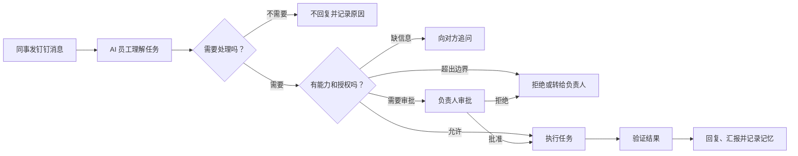

# AI 员工设计总览

AI 员工是一个运行在负责人工作环境中的 AI 员工。钉钉是工作入口，DWS 负责读写钉钉，Codex 负责方案、文档、代码和项目任务。

## 一句话说明

> 同事在钉钉提出问题或任务，AI 员工判断要不要处理、有没有权限；能做的就执行并验证，有风险的先让负责人审批，做完留下完整记录。

## 阅读顺序

| 文档 | 回答的问题 | 适合谁 |
|---|---|---|
| [产品需求文档](./产品需求文档.md) | AI 员工做什么、不能做什么、什么时候找人 | 产品、业务、管理者 |
| [技术设计文档](./技术设计文档.md) | 系统如何接消息、控权限、执行、记忆和恢复 | 研发、测试、运维 |
| [生产运维手册](./生产运维手册.md) | 如何部署、监控、备份、恢复和回滚 | 运维、项目负责人 |

## 整体流程

## 能力全景

| 工作类型 | AI 员工可以做什么 | 默认边界 |
|---|---|---|
| 沟通 | 判断是否回复、查事实、起草和发送消息 | 承诺、敏感立场先审批 |
| 方案 | 需求分析、调研、方案、排期、风险 | 不把推测写成事实 |
| 项目 | 拆任务、待办、跟进、汇报、复盘 | 不擅自给人分配超权限工作 |
| 研发 | 读代码、改代码、测试、变更说明 | 合并、发布、线上改数先审批 |
| 知识 | 搜资料、整理项目事实、形成记忆 | 必须有来源、范围和有效期 |

## 统一术语

| 术语 | 统一含义 |
|---|---|
| AI 员工 | 整个 AI 员工产品，不等于某一个模型 |
| 任务 | 从一条请求开始，到执行、验证、汇报结束的一次工作 |
| 能力 | 系统登记过、可以调用的一类动作，例如“发钉钉消息” |
| 授权 | 谁允许 AI 在什么范围、什么时间内使用某项能力 |
| 能力网关 | 每次执行前检查能力、授权、风险和审批的控制层 |
| 审批 | 负责人对一次具体计划和风险的明确同意 |
| 执行 | DWS、Codex 或其他工具实际完成动作 |
| 验证 | 用真实结果证明动作成功，而不是相信模型自述 |
| 记忆 | 带来源、权限、有效期的可复用信息 |
| 审计 | 记录谁、何时、基于什么、做了什么以及结果 |
| DWS | AI 员工操作钉钉的唯一业务入口 |
| Codex Worker | 后台处理方案、文档、代码等复杂任务的执行器 |
| Codex Desktop | 负责人查看、讨论、审批和接管复杂任务的控制台 |

## 五条不可突破的原则

1. 会调用工具，不等于有权执行。
2. 没登记的能力默认禁止。
3. 模型不能给自己授权。
4. 高风险动作必须先审批、再执行、后验证。
5. 记忆没有来源、权限或有效期，就不能用于对外回复。

部署也遵守同一原则：生产诊断与数据库迁移是两个入口。诊断只读，迁移必须显式执行，避免把“检查”包装成隐含写操作。

## 当前状态

| 模块 | 状态 |
|---|---|
| 本地活动信号发现消息，定时检查补漏 | 已实现 |
| DWS 分页读取、时间重叠和消息唯一键去重 | 已实现 |
| 多联系人、独立群检查点、分段合并和 PostgreSQL 事务任务队列 | 已实现并有 PostgreSQL 集成测试 |
| 基础“不回复”硬规则与 Codex 上下文复核 | 已实现并有测试 |
| 基于授权的能力自述 | 已实现；明确能力问题绕过 Codex，只按全局开关和请求人有效项目授权回答，群聊隐藏项目名称 |
| 影子人工标注、分层误判、风险与覆盖交替队列、版本绑定和放量门槛 | 已实现；单条聚焦连续复核，一致标签直接进入下一条，分歧必须说明原因，标签修订保留不可变历史，样本或覆盖不足时明确不通过 |
| 独立草稿 Worker、失败重试、草稿过期和死信 | 已实现 |
| 消息发送能力开关、逐任务审批和副作用幂等 | 已实现，默认关闭发送 |
| 项目能力清单、完整任务计划和审批哈希 | 已实现；哈希绑定完整授权快照 |
| 钉钉工作请求形成计划提案 | 已实现；只匹配请求人授权项目 |
| 常驻计划执行器与执行租约 | 已实现；全局默认关闭，崩溃后标记中断且不自动重放副作用 |
| 任务级取消 | 已实现；只读 Codex 和本地测试可确认中断进程组，外部副作用步骤安全收尾后停止，并保留证据 |
| 监听范围与局部暂停 | 已实现；管理台只显示联系人/群聊 HMAC 指纹和触发规则，可按联系人、群聊、项目和能力暂停；页面不能扩大白名单，控制值加密保存，恢复不重放副作用 |
| 人工接管视图 | 已实现；展示当前步骤、副作用、中断确认、安全收尾、租约异常和下一项人工动作 |
| 外部密钥适配 | 已实现；支持环境变量和 macOS 钥匙串，解析失败时配置原子拒绝生效 |
| 运营 SLO | 已实现；独立 DWS 消息源对账真实衡量漏检并自动回补，分开统计草稿产出、人工审批与任务全流程，无样本或截断不声称达标 |
| 计划修订链 | 已实现；旧计划保留为已替代，新计划使用新哈希且强制重新审批，来源身份不可修改 |
| 死亡任务人工处置 | 已实现；负责人可选择重试或审计关闭，关闭不会触发任何外部动作 |
| 项目结果回传 | 已实现；终态结果回到原会话的待审批草稿，重复恢复不会产生多条 |
| 共享文档、隔离代码提交、精确测试、Git 推送和生产发布 | 已实现适配器；隔离工作树应用补丁前校准索引并预检，失败后事务化清理；真实项目默认未授权 |
| 受控待办与日程创建 | 已实现适配器；固定人员范围、会议室实时唯一匹配、循环次数上限、强制审批和创建后 DWS 回读，真实项目默认未授权 |
| 固定模板钉钉日志提交 | 已实现适配器；模板编号、名称和字段结构全部绑定审批，提交后 DWS 回读，真实项目默认未授权 |
| 可复用初始化与发布包 | 已实现；CI 从真实 tarball 安装到空目录，验证源码、发布文件门禁、`600` 配置、不可覆盖、独立密钥和默认禁用外部能力；只读诊断与迁移分离 |
| DWS/Codex 上线验收 | 已实现；只读诊断核对 DWS 授权及 Codex 登录和网络，严格 Schema 另有不含业务数据的真实草稿探针 |
| Codex 运行安全 | 已实现；子进程不继承业务密钥，失败只保留退出码、字节数和错误哈希 |
| OA 审批决策 | 明确禁止自动执行；只允许读取、整理和提醒，由负责人本人决策 |
| 正式记忆的确认、来源、范围、过期和撤销 | 已实现；管理台可核对来源与访问租约，gbrain 权限/版本变化自动停用，纠正走替代链，导出分元数据/正文两级，永久删除需绑定确认并擦除业务字段 |
| 按人、项目和时间删除数据 | 已实现代码闭环；单范围预览、快照绑定确认、活动数据整体阻塞，正文事务擦除后仅留最小墓碑；生产迁移 016 尚未应用 |
| 数据库结构兼容性 | 已实现；预检只读列出待迁移项，诊断、影子验收和运行时在版本缺失或校验和漂移时于业务查询前停止；影子验收不初始化数据库哨兵 |
| 服务版本回退兼容性 | 已实现；迁移 015 起必须登记回退证据，声明兼容的前向迁移禁止破坏既有结构或新增无默认值必填列，失败只回退服务版本而不盲目反向迁移数据库 |
| gbrain 项目知识页读取 | 已实现；默认关闭，只允许项目白名单前缀内的精确 slug，限页数和正文，后续步骤显式引用 |
| 研究、文档草稿和代码补丁 | 已开放只读执行器，补丁不直接应用 |
| 本地测试、共享写入和生产部署 | 执行器已接入；仍需项目授权、逐计划审批和全局执行开关 |
| LaunchAgent、进程与外部读取健康、指标、加密备份和发布门禁 | 当前主机已验证，并完成隔离恢复演练 |
| 本地管理界面 | 已实现；只监听本机、读写令牌分离，不提供执行和发送入口 |
| Codex 插件与状态卡片 | 已实现代码、仓库市场和零副作用预检；当前主机已安装并启用 `0.2.0`，缓存一致且真实只读状态回读通过；新环境仍需单独安装复验 |
| 外部异常告警 | 已实现；脱敏签名 Webhook，默认未配置、仅本机记录 |

当前版本已经完成钉钉沟通链路，以及“工作请求 → 计划 → 审批 → 常驻执行 → 验证证据 → 原会话结果草稿”的代码闭环。执行租约过期时任务进入失败待处理，不会自动重放可能已经发生的外部副作用；结果回传同样需要人工批准。每个真实项目仍必须单独登记待办执行人、日程参与人、日志模板结构、文档目标、目录、精确命令、远端、验收和回滚，并完成现场演练；审批决策和生产数据修改不能复用普通办公、消息、文档或代码发布权限。
